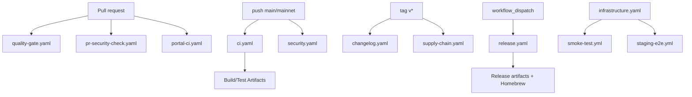

# CI/CD Pipeline — AGENTS Guide

## CI/CD Overview

- PRs are gated by `quality-gate.yaml` and `pr-security-check.yaml`; main builds run in `ci.yaml`.
- Releases are dispatched via `release.yaml` with tag-based changelog/supply-chain workflows.

### Trigger Summary

| Trigger Type         | Workflows                                                                                  | Pattern                                | Example                  |
| -------------------- | ------------------------------------------------------------------------------------------ | -------------------------------------- | ------------------------ |
| PR to main/develop   | `quality-gate.yaml`, `pr-security-check.yaml`, `portal-ci.yaml`                            | pull_request                           | Any PR to main           |
| Push to main/mainnet | `ci.yaml`, `security.yaml`                                                                 | push main/mainnet/develop/release/\*\* | Merge to main            |
| Tags v\*             | `changelog.yaml`, `supply-chain.yaml`, `ci.yaml`                                           | tags: v\*                              | v1.0.0 tag               |
| Workflow dispatch    | `release.yaml`, `multi-region-deploy.yaml`, others                                         | workflow_dispatch                      | Manual trigger           |
| Schedule             | `security.yaml`, `veid-conformance.yaml`, `ml-determinism.yaml`, `chaos-test.yaml`, others | cron                                   | Daily 02:00 UTC          |
| Path filters         | `api-spec.yaml`, `portal-ci.yaml`, `infrastructure.yaml`                                   | paths: api/**, portal/**, infra/\*\*   | Changes in specific dirs |

### Environment & Toolchain Matrix

| Component                     | Version | Workflows                                                          | Notes                           |
| ----------------------------- | ------- | ------------------------------------------------------------------ | ------------------------------- |
| Go                            | 1.25.5  | `ci.yaml`, `quality-gate.yaml`, `security.yaml`, most Go workflows | Set in `GO_VERSION` env var     |
| Node                          | 20      | `portal-ci.yaml`, `portal-deploy-pages.yaml`                       | Set in `NODE_VERSION` env var   |
| Node (npm OIDC)               | 24      | `codex-monitor-publish.yaml`                                       | Requires Node 24 for provenance |
| pnpm                          | 10.28.2 | `portal-ci.yaml`, `portal-deploy-pages.yaml`, `smoke-test.yml`     | Set in `PNPM_VERSION` env var   |
| Python                        | 3.11    | `ci.yaml`, `security.yaml`, `ml-model-verify.yaml`                 | Set in `PYTHON_VERSION` env var |
| Docker Buildx                 | latest  | `release.yaml`, `ci.yaml`                                          | Multi-arch builds               |
| Terraform (infra)             | 1.6.6   | `infrastructure.yaml`                                              | IaC deployments                 |
| Terraform (multi-region)      | 1.6.0   | `multi-region-deploy.yaml`                                         | Multi-region IaC deployments    |
| GoReleaser (via make release) | latest  | `release.yaml`                                                     | Release automation              |

## Module Overview

- Purpose: GitHub Actions CI/CD for VirtEngine testing, security scanning, and releases.
- Use when: Adding or modifying workflows, CI policies, or release automation.
- Key entry points: `.github/workflows/ci.yaml:1`, `.github/workflows/security.yaml:1`, `.github/workflows/release.yaml:1`
- Related docs: RELEASE.md:1, \_docs/operations/ci-troubleshooting.md:1, [GitHub Actions Documentation](https://docs.github.com/en/actions)

## Architecture

- Workflows gate PRs, build artifacts on main, and publish releases on tags/dispatch.
- Directory layout: `.github/workflows/` (workflow definitions), `.github/actions/` (composite actions), `scripts/` (helpers).



## Workflow Docs

Inventory and docs live in `.github/workflows/` with release details in `RELEASE.md:1`.

### Workflow Summary

| Workflow                     | Purpose                                                    | Triggers                                                             | Jobs                                                                                                                                                                                     | Outputs                                       | Dependencies                                                |
| ---------------------------- | ---------------------------------------------------------- | -------------------------------------------------------------------- | ---------------------------------------------------------------------------------------------------------------------------------------------------------------------------------------- | --------------------------------------------- | ----------------------------------------------------------- |
| `api-spec.yaml`              | Provider API spec validation                               | push/pr paths in api/openapi, generated API files                    | `validate`                                                                                                                                                                               | No artifacts (fails on diff)                  | Go + Node toolchain                                         |
| `audit-remediation.yaml`     | Issue triage + Slack notify                                | issues opened/edited/labeled                                         | `triage`, `notify`                                                                                                                                                                       | Slack notifications                           | Slack API                                                   |
| `changelog.yaml`             | Generate changelog                                         | tags v\*, dispatch                                                   | `generate-changelog`, `validate-commits`, `release-stats`                                                                                                                                | Changelog artifacts                           | git-chglog, GITHUB_TOKEN                                    |
| `chaos-test.yaml`            | Chaos tests                                                | schedule Sun 03:00 UTC, dispatch                                     | `chaos-test`                                                                                                                                                                             | None (best-effort run)                        | kubectl + Helm + Chaos Mesh                                 |
| `ci.yaml`                    | Mainline CI build/test pipeline (not primary quality gate) | push main/mainnet/develop/release/\*_, tags v_                       | lint, vet, lint-shell, agents-docs, test-go, test-python, test-portal, build, integration, hpc-provider-e2e, container-security, build-macos, sims, network-upgrade, release, ci-summary | Coverage/build artifacts, checksums, E2E logs | Go 1.25.5, Node 20, Python 3.11, pnpm 10.28.2, Docker/Trivy |
| `codex-monitor-publish.yaml` | Publish codex-monitor                                      | push main path filter, dispatch                                      | `check`, `publish`                                                                                                                                                                       | npm publish + summary                         | Node 24 + npm OIDC                                          |
| `compatibility.yaml`         | Protobuf/API compatibility                                 | push main/mainnet, tags, PR paths \*\*.proto                         | `proto-breaking`, `compatibility-tests`, `api-version-check`, `deprecation-compliance`, `version-matrix-validation`, `full-compatibility-suite`                                          | Compatibility reports                         | Go 1.25.5                                                   |
| `dependabot-auto-merge.yaml` | Auto-merge Dependabot PRs                                  | pull_request                                                         | `dependabot`                                                                                                                                                                             | Merge result                                  | GITHUB_TOKEN                                                |
| `dispatch.yaml`              | Homebrew dispatch                                          | tags vX.Y.Z                                                          | `dispatch-homebrew`                                                                                                                                                                      | Dispatch event                                | GORELEASER_ACCESS_TOKEN                                     |
| `dr-failover-test.yml`       | DR failover drill                                          | schedule Sun 06:00 UTC, dispatch                                     | `dr-failover`                                                                                                                                                                            | DR report artifact                            | Go 1.25.5 + Slack/Discord webhooks                          |
| `fuzz.yaml`                  | Fuzz testing                                               | push/pr main, nightly 02:00 UTC, dispatch                            | `fuzz-tests`, `oss-fuzz-build`, `fuzz-security-audit`                                                                                                                                    | Fuzz corpus                                   | Go toolchain                                                |
| `infrastructure.yaml`        | Infra plan/apply                                           | push/pr paths infra/\*\*, dispatch                                   | validate, security, plan, apply-\*, argocd-sync, test                                                                                                                                    | Terraform plan artifacts                      | Terraform + AWS + ArgoCD                                    |
| `labeler.yaml`               | PR labeling                                                | pull_request_target                                                  | `labeler`                                                                                                                                                                                | Labels applied                                | GITHUB_TOKEN                                                |
| `license-compliance.yaml`    | License + SBOM                                             | push/pr deps, weekly Sun 03:00 UTC, dispatch                         | go-licenses, npm-licenses, python-licenses, spdx-sbom                                                                                                                                    | License reports, SBOM                         | Go/Node/Python                                              |
| `load-test.yaml`             | Load testing                                               | nightly 02:00 UTC, dispatch                                          | `load-test`                                                                                                                                                                              | Load-test artifacts                           | Go 1.25.5                                                   |
| `ml-determinism.yaml`        | ML determinism                                             | push/pr main/mainnet/\*\* paths, schedule daily 02:00 UTC, dispatch  | determinism suite                                                                                                                                                                        | Evidence bundle                               | Go toolchain + deterministic env                            |
| `ml-model-verify.yaml`       | ML model validation                                        | push/pr main paths, dispatch                                         | training + inference checks                                                                                                                                                              | Model validation artifacts                    | Go 1.25.5, Python 3.11                                      |
| `multi-region-deploy.yaml`   | Multi-region deploy                                        | dispatch                                                             | plan/deploy per region                                                                                                                                                                   | Terraform plans                               | Terraform + AWS_DEPLOY_ROLE_ARN                             |
| `portal-ci.yaml`             | Portal CI                                                  | push/pr portal paths                                                 | lint, test-unit, build, test-e2e, accessibility                                                                                                                                          | Portal reports                                | Node 20, pnpm 10.28.2                                       |
| `portal-deploy-pages.yaml`   | Portal Pages deploy                                        | push main portal paths, dispatch                                     | build, deploy, preview-comment                                                                                                                                                           | Pages artifact                                | Node 20, pnpm 10.28.2                                       |
| `pr-security-check.yaml`     | PR security checks                                         | pull_request main/develop                                            | analysis + summary                                                                                                                                                                       | Security reports                              | Go 1.25.5 + dependency-review                               |
| `quality-gate.yaml`          | PR quality gate                                            | PR main/develop, push main/mainnet/develop/release/\*\*              | lint, vet, build, test-go, agents-docs                                                                                                                                                   | Build/test outputs                            | Go 1.25.5                                                   |
| `release.yaml`               | Publish release                                            | dispatch                                                             | publish, test-network-upgrade-on-release, notify-homebrew                                                                                                                                | Release artifacts                             | GoReleaser, Docker Buildx                                   |
| `sdk-publish.yaml`           | Publish SDKs                                               | release published                                                    | publish-python, publish-rust                                                                                                                                                             | SDK packages                                  | PyPI + crates.io                                            |
| `security.yaml`              | Security scanning                                          | push main/mainnet, daily 02:00 UTC, dispatch                         | CodeQL + vuln scans                                                                                                                                                                      | SBOM, SARIF                                   | CodeQL, govulncheck, pip-audit, npm audit, Trivy, gosec     |
| `smoke-test.yml`             | Post-deploy smoke tests                                    | workflow_dispatch, workflow_run from infra                           | `smoke-test`                                                                                                                                                                             | None (notifications only)                     | Go, Node, pnpm, Playwright                                  |
| `staging-e2e.yml`            | Staging E2E                                                | workflow_dispatch, workflow_run from infra                           | `staging-e2e`                                                                                                                                                                            | staging-e2e-logs artifact                     | Go 1.25.5                                                   |
| `stale.yaml`                 | Stale PR cleanup                                           | daily 00:00 UTC                                                      | `stale-pr`                                                                                                                                                                               | PR comments/labels                            | GITHUB_TOKEN                                                |
| `standardize-yaml.yaml`      | Enforce .yaml                                              | push/pr main paths \*_/_.yml                                         | `check-yml-files`                                                                                                                                                                        | Fail on tracked .yml list                     | git + bash                                                  |
| `supply-chain.yaml`          | SLSA + SBOM                                                | push main/mainnet, tags v\*, PR deps, weekly Mon 04:00 UTC, dispatch | provenance + SBOM suite                                                                                                                                                                  | SBOM/provenance bundles                       | Go 1.25.5, cosign/slsa tooling                              |
| `veid-conformance.yaml`      | VEID conformance                                           | push/pr main/mainnet/\*\* paths, schedule daily 02:00 UTC, dispatch  | conformance tests                                                                                                                                                                        | Evidence bundles                              | Go toolchain                                                |
| `veid-e2e.yaml`              | VEID E2E                                                   | push/pr main paths, dispatch                                         | veid-e2e, veid-unit, veid-determinism                                                                                                                                                    | Evidence logs                                 | Go toolchain                                                |

### Secrets & Env Vars (masked examples)

| Name                          | Scope                                             | Purpose                          | Example                                | Rotation/Notes                         |
| ----------------------------- | ------------------------------------------------- | -------------------------------- | -------------------------------------- | -------------------------------------- |
| `GITHUB_TOKEN`                | Many workflows                                    | GitHub API auth                  | `auto-provided`                        | Auto-rotated per job                   |
| `GORELEASER_ACCESS_TOKEN`     | `dispatch.yaml`, `release.yaml`                   | Homebrew dispatch / release auth | `ghp_***`                              | Rotate annually, use fine-grained PAT  |
| `SLACK_BOT_TOKEN`             | `audit-remediation.yaml`, `dr-failover-test.yml`  | Slack notifications              | `xoxb-***`                             | Rotate on personnel changes            |
| `SLACK_CHANNEL_ID`            | `audit-remediation.yaml`, `dr-failover-test.yml`  | Slack channel                    | `C***`                                 | N/A (public identifier)                |
| `DR_FAILOVER_SLACK_WEBHOOK`   | `dr-failover-test.yml`                            | DR alerting                      | `https://hooks.slack.com/***`          | Rotate quarterly                       |
| `DR_FAILOVER_DISCORD_WEBHOOK` | `dr-failover-test.yml`                            | DR alerting                      | `https://discord.com/api/webhooks/***` | Rotate quarterly                       |
| `ARGOCD_SERVER`               | `infrastructure.yaml`                             | ArgoCD endpoint                  | `https://argo.***`                     | N/A (endpoint URL)                     |
| `ARGOCD_PASSWORD`             | `infrastructure.yaml`                             | ArgoCD auth                      | `***`                                  | Rotate monthly, prefer OIDC            |
| `AWS_ACCESS_KEY_ID`           | `infrastructure.yaml`, `multi-region-deploy.yaml` | Terraform AWS access (legacy)    | `AKIA***`                              | Prefer `AWS_DEPLOY_ROLE_ARN` OIDC      |
| `AWS_SECRET_ACCESS_KEY`       | `infrastructure.yaml`, `multi-region-deploy.yaml` | Terraform AWS secret (legacy)    | `***`                                  | Prefer `AWS_DEPLOY_ROLE_ARN` OIDC      |
| `AWS_DEPLOY_ROLE_ARN`         | `multi-region-deploy.yaml`                        | Deploy role (OIDC)               | `arn:aws:iam::***:role/***`            | Preferred: OIDC, no rotation needed    |
| `PYPI_TOKEN`                  | `sdk-publish.yaml`                                | Python publish                   | `pypi-***`                             | Use trusted publisher OIDC (preferred) |
| `CRATES_TOKEN`                | `sdk-publish.yaml`                                | Rust publish                     | `***`                                  | Rotate on publish issues               |
| `VE_SMOKE_RPC_URL`            | `smoke-test.yml`                                  | RPC endpoint                     | `https://rpc.***`                      | N/A (endpoint URL)                     |
| `VE_SMOKE_MNEMONIC`           | `smoke-test.yml`                                  | Test wallet                      | `***`                                  | Rotate quarterly, fund minimally       |
| `VE_SMOKE_API_KEY`            | `smoke-test.yml`                                  | Test API key                     | `***`                                  | Rotate quarterly                       |
| `VE_SMOKE_GRPC_URL`           | `smoke-test.yml`                                  | gRPC endpoint                    | `https://grpc.***`                     | N/A (endpoint URL)                     |
| `VE_SMOKE_EXPLORER_URL`       | `smoke-test.yml`                                  | Explorer URL                     | `https://explorer.***`                 | N/A (endpoint URL)                     |
| `GO_VERSION`                  | `ci.yaml`, `security.yaml`, others                | Go toolchain                     | `1.25.5`                               | Update with Go releases                |
| `NODE_VERSION`                | `ci.yaml`, `portal-ci.yaml`                       | Node toolchain                   | `20`                                   | Update with LTS releases               |
| `PNPM_VERSION`                | `ci.yaml`, `portal-ci.yaml`                       | pnpm toolchain                   | `10.28.2`                              | Update quarterly                       |
| `PYTHON_VERSION`              | `ci.yaml`, `security.yaml`                        | Python toolchain                 | `3.11`                                 | Update with minor releases             |
| `GO_TEST_TIMEOUT_UNIT`        | `ci.yaml`                                         | Unit timeout                     | `30m`                                  | Adjust based on runner perf            |
| `GO_TEST_TIMEOUT_INTEGRATION` | `ci.yaml`                                         | Integration timeout              | `40m`                                  | Adjust based on runner perf            |
| `GO_TEST_TIMEOUT_E2E`         | `ci.yaml`                                         | E2E timeout                      | `45m`                                  | Adjust based on runner perf            |

**OIDC Usage:**

- AWS: Prefer `AWS_DEPLOY_ROLE_ARN` with GitHub OIDC provider trust over `AWS_ACCESS_KEY_ID/AWS_SECRET_ACCESS_KEY`.
- npm: `codex-monitor-publish.yaml` uses npm provenance (Node 24+ required, auto OIDC).
- PyPI: Configure trusted publisher for `virtengine` organization to avoid `PYPI_TOKEN`.
- GitHub Actions auto-provides OIDC tokens via `id-token: write` permission.

## Build & Test Pipeline

### Execution Ordering

1. **Lint & Static Analysis** (parallel): `lint`, `vet`, `lint-shell`, `agents-docs`
2. **Unit Tests** (parallel): `test-go`, `test-python`, `test-portal`
3. **Build** (parallel with lint/test-go): `build`, `build-macos`
4. **Integration & E2E** (depends on build): `integration`, `veid-e2e`, `staging-e2e`
5. **HPC Provider E2E** (post-integration): `hpc-provider-e2e`
6. **Security Scans** (parallel with integration): `container-security`, CodeQL, Trivy
7. **Simulations** (post-integration): `sims`, `network-upgrade`, `chaos-test`

### Parallelization Strategy

- Lint jobs run concurrently (no dependencies)
- Unit tests run concurrently per language (Go, Python, portal)
- Integration tests run sequentially due to shared resources (databases, ports)
- Security scans run in parallel with integration tests
- Matrix builds (multi-arch, multi-OS) parallelize within job via strategy.matrix

### Caching

- **Go**: `actions/cache@v4` with `~/go/pkg/mod` and `~/.cache/go-build` keys
- **Node**: `pnpm/action-setup@v2` with built-in store caching
- **Python**: `actions/setup-python@v5` with `pip` cache

### Coverage Gates

- **Go**: 80% coverage threshold (`ci.yaml`) via `go test -coverprofile`
- Coverage reports uploaded to Codecov with `codecov/codecov-action@v4`, with PR security advisory summaries in `pr-security-check.yaml`

### Test Timeouts

- Unit tests: 30m (`GO_TEST_TIMEOUT_UNIT=30m`)
- Integration tests: 40m (`GO_TEST_TIMEOUT_INTEGRATION=40m`)
- E2E tests: 45m (`GO_TEST_TIMEOUT_E2E=45m`)
- Chaos tests: 60m (best-effort, non-blocking)

## Deployment Workflows

### Release Workflow (`release.yaml`)

**Trigger:** `workflow_dispatch` (manual)
**Jobs:**

1. `publish`: GoReleaser builds multi-arch binaries (linux/amd64, linux/arm64, darwin/amd64, darwin/arm64)
2. `test-network-upgrade-on-release`: Validates upgrade path from previous release
3. `notify-homebrew`: Dispatches to homebrew-tap repo for formula update

**Artifacts:**

- GitHub Release with binaries + checksums
- See `.goreleaser.yaml` for images/packages published by GoReleaser

**Rollback:** See `RELEASE.md` § "Rollback Procedure" for binary reversion, state export, and rollback transaction submission.

### Portal Pages Deployment (`portal-deploy-pages.yaml`)

**Trigger:** push to main (portal/** paths), `workflow_dispatch`
**Jobs:\*\*

1. `build`: pnpm install + build portal static site
2. `deploy`: Upload to GitHub Pages via `actions/deploy-pages@v4`
3. `preview-comment`: Comment on PRs with preview URL

**Artifacts:** Pages deployment to `https://virtengine.github.io/virtengine`

### Infrastructure Deployment (`infrastructure.yaml`)

**Trigger:** push/PR to main (infra/** paths), `workflow_dispatch`
**Jobs:\*\*

1. `validate`: Terraform fmt check, validate
2. `security`: checkov + trivy scans
3. `plan`: Terraform plan for each environment (dev, staging, prod)
4. `apply-dev`, `apply-staging`, `apply-prod`: Sequential applies with manual approval gates
5. `argocd-sync`: Sync ArgoCD apps post-apply

**Artifacts:** Terraform plans saved to GitHub artifacts

**Post-deploy testing:** `smoke-test.yml` and `staging-e2e.yml` run via workflow_run or workflow_dispatch after infrastructure deployment completes.

### Multi-Region Deployment (`multi-region-deploy.yaml`)

**Trigger:** `workflow_dispatch` with region selection (us-east-1, eu-west-1, ap-southeast-1)
**Jobs:**

1. `plan`: Terraform plan per selected region
2. `deploy`: Terraform apply per region (parallel execution)

**Auth:** Uses `AWS_DEPLOY_ROLE_ARN` (OIDC) for cross-region deployments

**Rollback:** Terraform state rollback via `terraform state pull` + `terraform apply` previous plan (see `RELEASE.md`).

## Core Concepts

- **Quality gates:** PRs must pass `.github/workflows/quality-gate.yaml:1` and `.github/workflows/pr-security-check.yaml:1`.
- **Concurrency:** workflows cancel in-progress runs per ref (`.github/workflows/ci.yaml:1`).
- **Artifact discipline:** CI emits coverage, build outputs, and security reports.
- **Release discipline:** manual `.github/workflows/release.yaml:1` is the canonical publish path (see `RELEASE.md:1`).
- **Legacy .yml:** `standardize-yaml.yaml` fails on `.yml`; existing `dr-failover-test.yml`, `smoke-test.yml`, `staging-e2e.yml` should be renamed when touched, and non-workflow exceptions enforced by standardize-yaml include `codecov.yml`, `sdk/codecov.yml`, `config/kong/prometheus.yml`, `.github/dependabot.yml`, `_config.yml` (`.github/workflows/standardize-yaml.yaml:1`).

## Usage Examples

### Re-run a workflow

```bash
gh run list --workflow=ci.yaml --limit 5
gh run rerun <run-id> --failed
```

### Trigger release

```bash
gh workflow run release.yaml
```

## Common Modification Patterns

### Add New Workflow

1. Create `.github/workflows/new-workflow.yaml` (`.yaml` extension required)
2. Define name, triggers, jobs with existing toolchain env vars
3. Add row to workflow summary table in this file
4. Run `actionlint .github/workflows/new-workflow.yaml` locally
5. Commit with `ci: add new-workflow for X purpose`

### Modify Existing Jobs

1. Locate workflow in `.github/workflows/`
2. Edit job steps, preserving `uses:` action versions
3. Update caching keys if dependencies change
4. Test locally with `act` or manual dispatch
5. Update workflow summary table if outputs/deps change

### Add Test Job to quality-gate.yaml

1. Add job to `jobs:` section
2. Reuse `GO_VERSION`, `NODE_VERSION`, etc. from env vars
3. Add to `needs:` chain (lint → test → build)
4. Ensure job caches toolchain (actions/setup-go, actions/setup-node)
5. Set timeout: `timeout-minutes: 15`

### Update Deployment Target

1. For infra changes: Edit `infrastructure.yaml` apply-\* job `environment:` field
2. For multi-region: Add region to `multi-region-deploy.yaml` matrix
3. For releases: Update `release.yaml` GoReleaser targets in `goreleaser.yaml`
4. Test in dev environment first, then promote to staging/prod

### Add Matrix Configuration

1. Define `strategy.matrix` with dimensions (OS, arch, Go version)
2. Reference with `${{ matrix.os }}`, `${{ matrix.arch }}`
3. Use `include:` for specific combinations, `exclude:` for unsupported
4. Set `fail-fast: false` for independent matrix runs
5. Example:
   ```yaml
   strategy:
     matrix:
       os: [ubuntu-latest, macos-latest]
       go: ["1.25.5", "1.24.0"]
   ```

## Implementation Patterns

- Add new workflows under `.github/workflows/` and document here with purpose/trigger/jobs/outputs/deps.
- Reuse toolchain env from `.github/workflows/ci.yaml:1`.
- Anti-patterns:
  - Using `.yml` extensions (blocked by `standardize-yaml.yaml:1`).
  - Unscoped secrets or echoing secret values in logs.

## Configuration

- Toolchain defaults live in `.github/workflows/ci.yaml:1` (`GO_VERSION`, `NODE_VERSION`, `PNPM_VERSION`, `PYTHON_VERSION`).
- OIDC publish is required for `.github/workflows/codex-monitor-publish.yaml:1` (see `_docs/operations/ci-troubleshooting.md:1`).

## Local Testing

### Workflow Syntax Validation

```bash
# Install actionlint
brew install actionlint  # macOS
# or: go install github.com/rhysd/actionlint/cmd/actionlint@latest

# Validate all workflows
actionlint .github/workflows/*.yaml

# Validate specific workflow
actionlint .github/workflows/ci.yaml
```

### YAML Linting

```bash
# Install yamllint
pip install yamllint

# Lint workflows
yamllint .github/workflows/

# Custom config in .yamllint (repo root)
```

### Local Workflow Execution (act)

```bash
# Install act
brew install act  # macOS
# or: curl https://raw.githubusercontent.com/nektos/act/master/install.sh | bash

# List available jobs
act -l

# Run specific job locally
act push -j lint

# Run with secrets
act -s GITHUB_TOKEN=ghp_*** push -j test-go

# Dry run (show steps without execution)
act -n
```

### Docker Build Testing

```bash
# Test multi-arch build locally
docker buildx build --platform linux/amd64,linux/arm64 -t virtengine:test .

# Test with cache (matches CI)
docker buildx build --cache-from type=registry,ref=ghcr.io/virtengine/virtengine:buildcache .
```

### Manual Workflow Dispatch

```bash
# Trigger workflow with gh CLI
gh workflow run release.yaml

# Trigger with inputs
gh workflow run multi-region-deploy.yaml -f region=us-east-1

# Check run status
gh run list --workflow=release.yaml
gh run watch <run-id>
```

### Agent Docs Validation

```bash
node scripts/validate-agents-docs.mjs
```

## Testing

- Validate workflow syntax: `actionlint .github/workflows/*.yaml`.
- Agent docs validation: `node scripts/validate-agents-docs.mjs` (`scripts/validate-agents-docs.mjs:1`).

## Troubleshooting

### standardize-yaml.yaml Failures

**Symptom:** PR check fails with "Found .yml files that should be .yaml"
**Fix:**

1. Rename offending files: `git mv old.yml old.yaml`
2. Update references in code/docs
3. If file is in exception list (`codecov.yml`, `dependabot.yml`, etc.), ensure path matches `.github/workflows/standardize-yaml.yaml` filter
4. Commit: `chore: rename .yml to .yaml per standardize-yaml`

### CodeQL Advanced Setup Error

**Symptom:** `security.yaml` fails with "CodeQL: Advanced setup required"`**Fix:** See`\_docs/operations/ci-troubleshooting.md:44` for language-specific configuration

1. Check `codeql-config.yml` is present
2. Verify language detection in workflow
3. Add explicit `languages:` if auto-detect fails

### npm OIDC Publish Failures

**Symptom:** `codex-monitor-publish.yaml` fails on `npm publish` with auth error
**Fix:** See `_docs/operations/ci-troubleshooting.md:1`

1. Verify Node version is 24+ (required for provenance)
2. Check `id-token: write` permission is set
3. Ensure npm package name matches GitHub repo
4. Verify npm organization has provenance enabled

### Workflow Run Failures

**General rerun strategies:**

```bash
# Rerun failed jobs only
gh run rerun <run-id> --failed

# Rerun entire workflow
gh run rerun <run-id>

# Cancel stuck run
gh run cancel <run-id>

# View logs
gh run view <run-id> --log
gh run view <run-id> --log-failed  # failed jobs only
```

### Coverage Shortfalls

**Symptom:** `ci.yaml` fails due to Go coverage below threshold
**Fix:**

1. Check Codecov report for uncovered lines: `gh run view <run-id> --log | grep "Coverage"`
2. Add tests for new code paths
3. If intentional (refactor), update threshold in `ci.yaml`

### Timeout Issues

**Symptom:** Job times out (default 360 minutes)
**Fix:**

1. Check for hung tests: `go test -v` output in logs
2. Increase `timeout-minutes:` for job
3. For E2E tests, adjust `GO_TEST_TIMEOUT_E2E` env var
4. Use `timeout` command: `timeout 30m go test`

### Cache Invalidation

**Symptom:** Build fails with stale dependencies
**Fix:**

```yaml
# Bust cache by updating key
- uses: actions/cache@v4
  with:
    key: go-${{ runner.os }}-${{ hashFiles('go.sum') }}-v2 # increment v2 → v3
```

## Optional: Dependencies & Environment

- Required toolchain: Go 1.25.5, Node 20, pnpm 10.28.2, Python 3.11.
- Release tooling: GoReleaser + Docker Buildx (`.github/workflows/release.yaml:1`).

## Optional: Security Considerations

- Prefer OIDC over long-lived tokens for npm publishing.
- Never print `${{ secrets.* }}` values in logs.

## Optional: Glossary

- **OIDC**: OpenID Connect token-based auth (no PATs).
- **SBOM**: Software Bill of Materials.
- **SARIF**: Static Analysis Results Interchange Format.
