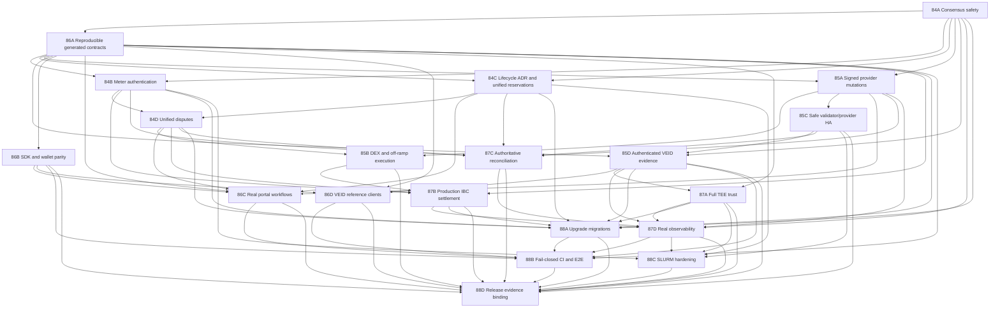

# VirtEngine Protocol Completion Continuation Plan

**Assessment date:** 2026-07-20
**Planning horizon:** protocol-completion beta to production-ready release candidate
**Status:** Evidence-corrected final execution draft
**Task count:** Exactly 20 ordered implementation tasks
**Primary specification baseline:** `_docs/architecture.md`, `_docs/veid-flow-spec.md`, `_docs/protocols/`, `_docs/settlement-usage-rewards.md`, and the module behavior encoded under `x/`

## 1. Purpose

This document turns the current repository state into an executable continuation program. It is intentionally implementation-oriented: every task has bounded scope, predecessor dependencies, likely code surfaces, a test strategy, measurable acceptance criteria, expected artifacts, and an effort range.

The plan does not treat the existence of modules, interfaces, deployment manifests, checklists, or mock-backed tests as proof that a production workflow is complete. Protocol completion requires the following to be true at the same time:

1. consensus-critical decisions are deterministic and validated by every validator;
2. value-bearing usage, escrow, payout, dispute, and cross-chain transitions are authenticated and replay-safe;
3. provider and client mutations are signed transactions rather than best-effort direct service calls;
4. product clients exercise real chain and provider process boundaries;
5. production deployment topology preserves keys and state without creating double-signing or duplicate-submission hazards;
6. upgrades preserve persisted state and wire compatibility;
7. release approval is tied to the exact tested source, image digests, genesis, and rollback evidence.

## 2. Assessment Method

The assessment combined source inspection, protocol-document comparison, task-history review, and targeted validation.

### 2.1 Validation executed on 2026-07-20

- Baseline source revision: `609eb8187d2e5d8d962de72fa0cdd5f4dacf4a1a` on branch `stable-virtengine-beta`.
- The checkout was intentionally dirty before assessment. The existing inference-policy and security-policy files listed in this section were not created or overwritten by this plan, so the baseline is the named commit plus that explicit active-work boundary rather than a claim about a clean tree.
- Local assessment environment: Windows NT `10.0.26200.0`, Go `1.25.6 windows/amd64`, Node `24.11.1`, pnpm `10.28.2`, and Python `3.11.9`.
- The exact aggregate command `go test ./app ./x/settlement/... ./x/resources/... ./x/hpc/... ./x/enclave/... ./pkg/provider_daemon/... -count=1` exited `1`. The terminal reported missing `go.sum` entries for `github.com/golang/glog`, `github.com/moby/spdystream`, and `github.com/mxk/go-flowrate`. This is a dependency-metadata/setup failure and must not be represented as a passing aggregate gate or as proof of source failure in packages that completed before it.
- Before that aggregate failure, settlement keeper/IBC/types, resources keeper, HPC, enclave, and provider `auth`, `hpc_templates`, `slurm_k8s`, and `veid_scopes` packages passed. Their package-level success is useful evidence, but it does not convert the aggregate command into a pass.
- The in-progress inference deployment policy validator passed, and all five tests in `.github/tests/test_inference_deployment_policy.py` passed during the earlier assessment. These files remain an active-work boundary rather than committed release evidence.
- `portal/node_modules` exists but is incomplete. `pnpm -C portal lint`, `pnpm -C portal type-check`, and `pnpm -C portal test -- --run` each failed with `MODULE_NOT_FOUND`, respectively for `eslint/bin/eslint.js`, `typescript/bin/tsc`, and `vitest/vitest.mjs`. These are dependency-installation failures, not passing checks and not evidence of portal source-test failures.
- `sdk/ts/node_modules` is absent, so no TypeScript SDK validation pass is claimed.
- `node scripts/validate-agents-docs.mjs` passed.
- The working tree already contained unrelated inference-policy and security-policy changes. Those files are an active-work boundary and must not be overwritten by plan execution without first coordinating ownership.

### 2.2 Confidence model

Status claims in this document use three evidence levels:

- **Verified:** source was inspected and a relevant local test command passed.
- **Implemented but integration-unproven:** meaningful code and unit tests exist, but the complete process-boundary workflow has not been demonstrated.
- **Incomplete or unsafe by inspection:** a no-op, placeholder, mock, fail-open branch, missing trust verification, disconnected state machine, or deployment hazard is visible in source.

No percentage-complete estimate is assigned. A large code volume can still leave a short but critical protocol path incomplete.

### 2.3 Determinism and reproducibility scope

- **Consensus determinism** means identical state-transition and proposal decisions on every supported validator target, including pinned Linux `amd64` and Linux `arm64` builds, from identical chain state and block inputs. Consensus code may use `ctx.BlockTime()` and `ctx.BlockHeight()` but not local wall time, random iteration, floating-point state arithmetic, host-specific files, external network calls, or live service responses.
- **ML determinism** means byte-identical normalized input digests, receipt payloads, scores, and reason codes under the approved CPU/runtime/model profile. Validators verify a previously produced receipt from proposal/vote data; they do not call a sidecar or external endpoint while executing or validating a block.
- **Generated-artifact reproducibility** means byte-identical protobuf, gateway, descriptor, OpenAPI, and SDK output inside one pinned Linux generation container. Cross-host plugin discovery is not accepted as evidence.
- **Release reproducibility** is target-specific: two clean builds for the same declared operating system/architecture/toolchain must produce the expected reproducible artifacts or a documented, isolated list of permitted nondeterministic metadata. Digests are compared per target, not across different targets.

## 3. Current Project Status

### 3.1 Strong foundations already present

| Area | Current evidence-based status |
| --- | --- |
| Cosmos application | The application wires a large custom-module set, ante handling, begin/end blockers, upgrades, IBC routing, and keeper dependencies. Source foundations are substantial, but the 2026-07-20 aggregate validation did not pass because dependency metadata was incomplete; no aggregate green status is claimed. |
| VEID, encryption, MFA, and roles | Substantial keepers, state models, validation, encrypted scope handling, MFA cleanup, and policy wiring exist. MFA expiry is wired through `x/mfa/module.go:153-160`; it is not an outstanding gap. |
| Marketplace and provider services | Order, bid, lease, provider-daemon, portal HTTP routing/authentication, adapter, and lifecycle implementations exist. The provider API shell is substantial, but its gRPC-backed `ChainQuery` embeds no-op behavior for most organizations, tickets, invoices, usage, metrics, and events (`pkg/provider_daemon/portal_chain_query.go:10-143`, `pkg/provider_daemon/portal_chain_query_grpc.go:10-23`). |
| Settlement and billing | Escrow, usage, payout, rewards, disputes, and HPC settlement code exist, with passing keeper tests. The remaining gaps concern authentication, canonical lifecycle ownership, replay safety, and cross-module convergence. |
| HPC and resources | Deterministic fixed-point scheduling, inventory allocation, accounting, rewards, SLURM integration, and tests exist. The remaining gap is that resource, marketplace, HPC, and staking reservations are separate sources of truth. |
| Signed settlement broadcaster | `pkg/provider_daemon/chain_submitter.go:425-503` contains transaction construction, gas estimation, signing, broadcast, and sequence handling, while `pkg/provider_daemon/chain_submitter_queue.go:15-107` provides file-backed queue records and atomic replacement. Earlier backlog text describing all broadcasting as a no-op is stale, but cross-process locking and production key persistence are not complete. |
| Security and release automation | Security workflows, supply-chain checks, launch runbooks, genesis artifacts, DR scripts, and observability assets are extensive. The unresolved issue is whether all gates fail closed and whether evidence refers to the exact current release. |

### 3.2 Protocol-critical incomplete paths

1. **Consensus-safety enforcement is incomplete.** `app/app.go:282-287` installs `baseapp.NoOpPrepareProposal()` and `baseapp.NoOpProcessProposal()`, while VEID proposal/vote-extension helpers are not connected to the application. Consensus-reachable VEID reads use local wall time (`x/veid/keeper/score.go:221`, `x/veid/types/scope.go:253-260`), and settlement can call externally backed price feeds from keeper execution (`app/types/app.go:701-716`, `x/settlement/keeper/price_aggregator.go:87-121`). Proposal admission alone is therefore insufficient; the complete deterministic state-transition surface must be audited and fixed.
2. **Usage signatures are stored but not cryptographically verified.** `x/settlement/keeper/msg_server.go:216-283` verifies sender addresses and copies provider/customer signature bytes; `x/settlement/keeper/settlement.go:277-369` validates shape and ownership but not those signatures.
3. **Resource ownership is fragmented.** `x/resources/keeper/allocation.go:78-205` reserves inventory independently, while `x/hpc/keeper/scheduling.go:99-224` schedules against HPC cluster capacity. The application creates both keepers but does not connect HPC or market transitions to the resources keeper (`app/types/app.go:552-697`).
4. **Financial disputes and related reputation effects have separate lifecycles.** Settlement has payout holds and dispute callbacks; fraud reports have submitted, reviewing, resolved, rejected, and escalated transitions (`x/fraud/types/fraud_report.go:31-103`); HPC has independent dispute/reward records; and reviews have their own persisted state (`x/review/types/review.go:31-176`). `app/types/app.go:632-697` does not route these outcomes through one authoritative financial case. Reviews should remain reputation evidence, not become a second financial dispute authority.
5. **Some provider mutations bypass the durable broadcaster and fail open.** `pkg/provider_daemon/chain_client.go:340-510` sends HPC/resource messages through generated `MsgClient` calls and returns success when the gRPC connection is absent in several methods.
6. **DEX and fiat off-ramp execution are not production paths.** `pkg/dex/adapters.go:84-166` returns one-to-one prices, quotes, and a synthetic transaction hash. A more complete `RealOsmosisAdapter` exists (`pkg/dex/osmosis_adapter.go:227-260`) but `CreateAdapter` still chooses the placeholder Osmosis adapter (`pkg/dex/adapters.go:414-424`). Settlement invokes swap execution from keeper code with constant bytes as a “signed transaction” (`x/settlement/keeper/dex.go:819`), and the only concrete fiat payout provider is explicitly a test mock (`pkg/payments/offramp/mock_provider.go:15-38`).
7. **Production topology can duplicate identities or lose state.** `deploy/kubernetes/overlays/prod/kustomization.yaml:19-31` scales validator and provider workloads; the node StatefulSet references a shared secret name (`deploy/kubernetes/base/virtengine-node-deployment.yaml:89-99`), while provider state uses `emptyDir` (`deploy/kubernetes/base/provider-daemon-deployment.yaml:127-133`).
8. **Production VEID evidence is not uniformly authenticated.** `x/veid/keeper/scoring.go:522-554` intentionally defaults to a stub unless real inference is configured. Separately, SSO submission passes no signer key to validation (`x/veid/keeper/web_scope_msg_server.go:46`) and signature verification is conditional on a non-nil key (`x/veid/keeper/sso_verification.go:39-61`). Email, SMS, and social handlers structurally validate attestations and account-address fields but persist verified results without complete issuer-proof and account-signature verification (`x/veid/keeper/web_scope_msg_server.go:93-198`, `x/veid/keeper/web_scope_msg_server.go:206-306`, `x/veid/keeper/web_scope_msg_server.go:314-431`). The current uncommitted inference-policy work is useful and its five tests passed, but it is not yet a committed, end-to-end production evidence guarantee.
9. **REST and generated contracts are incomplete.** Fourteen packages contain `gateway_stub.go` no-op registrations, including `sdk/go/node/hpc/v1/gateway_stub.go:8-12`.
10. **User-facing HPC remains mock-backed.** `portal/src/features/hpc/lib/hpc-client.ts:1-241` returns static templates, offerings, jobs, synthetic hashes, logs, usage, and prices.
11. **Other portal and provider API workflows remain simulated or no-op.** The general cloud order wizard synthesizes an order and hash (`portal/src/components/orders/OrderWizard.tsx:42-58`), provider deployment actions synthesize transaction IDs, and most provider portal organizations/tickets/billing/metrics queries return empty or unsupported results through `NoopChainQuery` (`pkg/provider_daemon/portal_chain_query.go:51-143`).
12. **Mobile and browser VEID capture are not complete production clients.** `mobile/veid-capture-app/src/services/upload/captureUploader.ts:8-14` reports success after checking only an upload URL. The browser wizard simulates chain submission (`portal/src/features/veid/hooks/useVeidWizard.ts:190-207`) and the liveness challenge auto-passes on timeout (`portal/src/components/veid/LivenessChallenge.tsx:77-82`).
13. **Provider signing-key persistence is not production-ready.** `KeyManager.Unlock` describes file/HSM behavior but only checks for a non-empty passphrase (`pkg/provider_daemon/key_manager.go:151-180`), while the daemon selects file mode when a key directory is configured and then calls `Unlock("")` (`cmd/provider-daemon/main.go:725-755`). This makes durable signing identity and HSM/remote signing incomplete.
14. **TEE trust verification is incomplete and attestation failure is fail-open for heartbeat health.** Nitro verification does not verify the COSE signature/root chain (`x/enclave/keeper/heartbeat.go:320-337`), and `ProcessHeartbeat` logs attestation failure but continues to record a successful heartbeat (`x/enclave/keeper/heartbeat.go:49-85`).
15. **IBC lifecycle side effects are not installed.** `x/settlement/ibc/keeper.go:82-92` defaults to `NoOpRelayerHooks`; `x/settlement/ibc/hooks.go:18-29` contains empty callbacks.
16. **Waldur reconciliation can classify unavailable independent evidence as synchronized.** `pkg/provider_daemon/waldur_reconciler.go:206-224` records `InSync: true` when Waldur usage cannot be fetched.
17. **Release posture is contradictory and stale relative to the assessment date.** `README.md:25-31` and `_docs/operations/mainnet-go-no-go-decision.md:25-42` say `GO` for April 2026 windows, while `RELEASE.md:7-20` says `HOLD`. As of the assessment date, both scheduled April windows are past, so neither statement proves current network status.

### 3.3 Interpretation

VirtEngine is not a greenfield project and should not be restarted. Most domain models and many module-level behaviors exist. The shortest path to completion is to harden and connect the existing implementation, remove fail-open and mock paths, prove the protocol across real process boundaries, and bind release evidence to immutable artifacts.

The current authoritative planning posture is **substantial beta / production and current public-network state unverified**. This does not assert that the April launch succeeded, failed, or rolled back; the repository lacks one current, non-contradictory record that proves any of those outcomes. Task 88D owns a superseding current status while preserving the April records as immutable historical evidence. Until then, the project should not be described as currently live or fully production-complete.

### 3.4 Completion profiles and external prerequisites

Engineering completion and external certification are separate, explicit states. A profile may be **engineering-complete** when its code, fixtures, negative tests, local/process-boundary harness, configuration validation, and operator runbook pass. It is **externally enabled/certified** only when the named network, vendor, hardware, contractual, legal, compliance, credential, liquidity, and staging prerequisites are available and evidenced. Missing external prerequisites must produce `blocked` or `uncertified` status for that profile, not a mock-backed pass and not a failure of otherwise complete engineering work.

| Profile family | Required support matrix | External prerequisites | Evidence and status rule |
| --- | --- | --- | --- |
| DEX | Network/chain ID, environment, DEX protocol and exact version, pool/contract or module IDs, token denominations/decimals, finality, route limits, oracle source, custody signer, testnet/mainnet enablement | Funded governed accounts, available supported pools with sufficient liquidity, allowlisted contracts/modules, RPC/archive access, custody/HSM approval, network governance approval | Task 85B may mark a network/version engineering-complete from deterministic fixtures and testnet execution. Mainnet remains externally blocked until every configured pool/contract, liquidity, signer, and governance prerequisite is evidenced. Unsupported rows fail closed. |
| Fiat payout | Provider, sandbox/production environment, jurisdictions, currencies, rails, beneficiary requirements, webhook/signature versions, limits, KYC/sanctions policy, settlement/finality semantics | Executed provider contract, sandbox and production credentials, compliance/legal/DPA approval, supported settlement bank/custody accounts, webhook endpoint registration, operational escalation agreement | Sandbox conformance can make the integration engineering-complete. Production remains externally blocked until contracting, credentials, compliance, and corridor approvals are recorded for each row. A mock provider never satisfies either state. |
| TEE | Vendor, platform/profile and version, hardware/firmware/TCB, attestation format, root/collateral version, workload/model binding, cloud/region, staging/production status | Real SGX, SEV-SNP, or Nitro hardware; vendor collateral and revocation access; approved cloud/account/region; workload images; operator access; vendor licensing where applicable | Fixtures/parser conformance can make a verifier engineering-complete. A claimed hardware profile remains uncertified until Task 87A produces real-hardware evidence for that exact row. Profiles without available hardware are explicitly unsupported/externally blocked, never inferred from emulation. |

The assessment-baseline rows below are explicit non-enablement records. `TBD` is a blocking value, not a wildcard, and no row authorizes production support:

| Family/profile observed in source | Network/pool/provider/hardware baseline | Engineering status on 2026-07-20 | External status and prerequisite |
| --- | --- | --- | --- |
| Osmosis | Chain ID, approved module/pool IDs, denominations, and liquidity thresholds are not fixed; the factory selects the placeholder adapter despite a separate real adapter (`pkg/dex/adapters.go:414-424`, `pkg/dex/osmosis_adapter.go:227-260`) | `engineering_incomplete`, disabled | Externally blocked pending named testnet/mainnet, funded governed signer, approved pools/liquidity/oracle/finality, and governance enablement |
| Uniswap V2 | Exact EVM network/chain ID, factory/router, pools, tokens, and oracle are `TBD`; quote/execution methods are placeholders (`pkg/dex/adapters.go:43-166`) | `engineering_incomplete`, disabled | Externally blocked pending exact network/contracts/pools, RPC/finality, liquidity, custody/HSM, and governance approval |
| Curve | Exact EVM network/chain ID, registry/pools, tokens, and oracle are `TBD`; quote/execution methods are placeholders (`pkg/dex/adapters.go:270-393`) | `engineering_incomplete`, disabled | Externally blocked pending exact network/registry/pools, RPC/finality, liquidity, custody/HSM, and governance approval |
| Fiat `MockProvider` | Test-only provider with no production contract, corridor, credential, or compliance authority (`pkg/payments/offramp/mock_provider.go:15-38`) | Test fixture only; never engineering-complete for production | Unsupported for production |
| Real fiat payout provider | Provider and sandbox/corridors are `TBD`; no concrete production provider was observed | `engineering_incomplete`, disabled | Externally blocked pending provider selection, contract, sandbox/production credentials, compliance/legal/DPA, bank/custody, webhook, and corridor approval |
| AWS Nitro | COSE/root-chain verification is incomplete (`x/enclave/keeper/heartbeat.go:320-337`) | `engineering_incomplete`, disabled | Uncertified pending real Nitro hardware/account/region, current collateral/root evidence, workload binding, and staging conformance |
| Intel SGX DCAP | Full vendor trust/collateral and real-hardware evidence are not established by the inspected heartbeat path | `engineering_incomplete`, disabled | Uncertified pending real SGX hardware, TCB/collateral/revocation evidence, workload binding, and staging conformance |
| AMD SEV-SNP | Full vendor trust/collateral and real-hardware evidence are not established by the inspected heartbeat path | `engineering_incomplete`, disabled | Uncertified pending real SEV-SNP hardware, firmware/TCB/collateral evidence, workload binding, and staging conformance |

Each matrix is a versioned release artifact. Task 85B owns the DEX and payout matrices; Task 87A owns the TEE matrix; Task 88D binds their statuses and external evidence to the release manifest without converting blocked or uncertified rows into production-complete claims.

## 4. Program-Level Definition of Done

Every task below must satisfy the following common exit rules in addition to its task-specific criteria:

1. Write a failing test or executable conformance fixture before changing consensus, accounting, security, or persistence behavior.
2. Preserve deterministic state transitions; do not use wall-clock time, map iteration order, floating-point arithmetic, network I/O, nondeterministic ML execution, or external service availability inside consensus state transitions.
3. Add explicit migration handling for any persisted schema, key prefix, parameter, protobuf wire, or genesis change.
4. Return errors for disconnected or unconfigured production dependencies. Development-only no-op behavior must be explicit, isolated, observable, and impossible to select in production configuration.
5. Add metrics and structured events for new lifecycle decisions and failure paths without logging secrets, biometric payloads, private keys, raw attestations, or customer data.
6. Add unit, invariant, negative, replay, and process-boundary tests appropriate to the change. Goroutine tests must use leak detection according to repository conventions.
7. Run formatting, lint, targeted race-enabled tests, generated-code drift checks, and the repository preflight relevant to changed files.
8. Update `_docs/`, public documentation, OpenAPI, SDK examples, runbooks, and `AGENTS.md` files when behavior or operational responsibility changes.
9. Produce a reviewable completion artifact: migration fixture, threat-model delta, benchmark report, conformance report, or rehearsal evidence as specified by the task.
10. Do not close a task based only on mocks. At least one acceptance test must cross the real boundary changed by the task.

### 4.1 Numeric program gates

The following checked-in targets make otherwise qualitative acceptance language binary. A task may make a target stricter, but it cannot relax one without an approved ADR, updated capacity model, and release-owner sign-off.

- Chain transaction P95 confirmation is under `10s`; chain query and provider API P95 latency are each under `2s`.
- Provider deployment success is at least `99%` and P95 provisioning is under `300s`.
- VEID success is at least `95%`, P95 verification is under `30s`, and accepted nondeterministic inference events equal zero.
- HPC submission/completion reliability is at least `99%` and P95 scheduling is under `15m`.
- Single-validator and TEE signing-path RTO are at most `15m`; provider and regional failover RTO are at most `30m`; CockroachDB replication lag remains below `300s`.
- Identity, marketplace, and HPC burst gates use the concurrency/error targets in `_docs/ga-checklist.md`: respectively 100 uploads, 500 orders, and 200 jobs with error rate below `1%` and the documented latency bounds.
- A critical injected failure must page/route within `5m`, and its alert must clear within two configured evaluation intervals after verified recovery.
- Release-candidate production-complete evidence requires a continuous `28d` observation window because the uptime/error-budget objectives in `_docs/slos-and-playbooks.md` use 28-day windows.

## 5. Ordering and Dependency Model

The tasks are deliberately numbered in execution order. Work may run concurrently only after all listed predecessors are merged and their compatibility contracts are stable.

### 5.1 Workstream summary

| Sequence | ID | Priority | Outcome | Estimated engineering effort |
| ---: | --- | --- | --- | ---: |
| 1 | 84A | P0 | Deterministic proposal admission and consensus-safe state transitions | 15-25 engineer-days |
| 2 | 86A | P0 | Pinned dependency/module/vendor hygiene and reproducible protobuf, gateway, descriptor, OpenAPI, and module metadata generation | 15-25 engineer-days |
| 3 | 84B | P0 | Authenticated, replay-safe usage settlement | 15-22 engineer-days |
| 4 | 84C | P0 | Evidence-selected single marketplace owner and one authoritative resource reservation lifecycle | 20-30 engineer-days |
| 5 | 84D | P0 | One authoritative dispute-to-money lifecycle | 20-30 engineer-days |
| 6 | 85A | P0 | All provider writes use the durable signed broadcaster | 15-25 engineer-days |
| 7 | 85B | P0 | Verifiable DEX and compliant fiat off-ramp execution with explicit support profiles | 25-40 engineer-days |
| 8 | 85C | P0 | Canonical deployment rendering, double-sign-safe validators, persistent provider keys, and durable provider HA | 20-30 engineer-days |
| 9 | 85D | P0 | Authenticated, replay-safe VEID evidence and real pinned inference | 25-38 engineer-days |
| 10 | 86B | P1 | Secure wallet sessions and generated client parity | 12-18 engineer-days |
| 11 | 86C | P1 | Real portal cloud, HPC, provider, and billing workflows | 25-40 engineer-days |
| 12 | 86D | P1 | Native and browser attested VEID capture with resumable upload | 30-50 engineer-days |
| 13 | 87A | P1 | Complete deterministic TEE trust-chain verification | 30-50 engineer-days |
| 14 | 87B | P1 | Production-safe cross-chain settlement | 20-35 engineer-days |
| 15 | 87C | P1 | Durable, corrective Waldur/meter reconciliation | 15-25 engineer-days |
| 16 | 87D | P1 | Repaired observability topology, production metric call sites, measured SLIs, traces, alerts, and executable telemetry conformance | 18-28 engineer-days |
| 17 | 88A | P1 | Schema-aware migrations and multi-version upgrade rehearsal | 20-30 engineer-days |
| 18 | 88B | P1 | Fail-closed required gates and real workflow proof | 20-30 engineer-days |
| 19 | 88C | P1 | One canonical, secure, durable, capacity-accurate, multi-tenant SLURM chart and operation path | 30-50 engineer-days |
| 20 | 88D | P1 | Immutable release, launch, and rollback evidence binding | 20-35 engineer-days |

**Total estimated effort:** 410-656 engineer-days before external audit/remediation, vendor onboarding, and production soak. With four stable specialist streams and no P0 rework, a realistic calendar range is approximately 7-12 months. A further 4-8 week release-candidate soak is recommended and is not included. External TEE hardware/collateral, DEX network/pool availability, payout-provider contracting/sandbox/compliance, security, legal, and infrastructure dependencies can extend elapsed time or leave individual profiles externally blocked even when engineering work is complete.

---

## Task 1 — 84A: Eliminate Consensus Nondeterminism and Enforce Deterministic ABCI++ Admission

**Priority:** P0
**Backlog reference:** `ae5f621e`
**Dependencies:** None
**Blocks:** 86A, 84B, 84C, 85A, 85D, 87D, 88A

### Outcome

Replace unconditional proposal acceptance with a deterministic, bounded proposal policy and remove local clocks, live network/service calls, random ordering, and other nondeterministic inputs from every consensus-reachable state transition.

### Why this is required

`app/app.go:282-287` installs no-op prepare and process handlers. VEID already exposes vote-extension and proposal-oriented verification helpers in `x/veid/keeper/vote_extension.go:145-198`, `x/veid/keeper/vote_extension.go:361-400`, and `x/veid/keeper/consensus_verifier.go:332-374`, but the application does not call them. Separately, `GetScore` uses `time.Now()` (`x/veid/keeper/score.go:221`), scope activity uses local time (`x/veid/types/scope.go:253-260`), and the settlement keeper can reach externally backed price feeds (`app/types/app.go:701-716`). Proposal validation cannot make the protocol safe while `FinalizeBlock`/message execution can still depend on validator-local inputs.

### Implementation work

1. Write an ADR defining the complete consensus-input boundary, proposal invariants, liveness limits, maximum work per block, deterministic ordering, and fail-closed versus deferred behavior.
2. Add a static inventory/check that flags local wall clocks, uncontrolled randomness, floating-point state decisions, filesystem reads, external HTTP/gRPC/DNS, and unpinned service callbacks in production keeper/message/begin/end/proposal paths.
3. Replace local expiry/activity checks with explicit `At(ctx.BlockTime())` variants and update every consensus caller; retain wall-clock helpers only in clearly off-chain packages.
4. Remove external price fetching and DEX/off-ramp execution from keeper execution. External actors must submit authenticated observations/results; keepers validate and read committed on-chain state only.
5. Introduce a proposal-handler component under `app/` that uses the SDK's deterministic default transaction selection as a base and adds bounded checks for malformed bytes, duplicate identifiers available in current state, invalid protocol system transactions, and configured per-block limits.
6. Use vote extensions as the validator-result carrier. `ExtendVote` produces a versioned signed verification-result bundle; `VerifyVoteExtension` validates each bundle; `PrepareProposal` deterministically aggregates the previous commit into one canonical system transaction at index zero; `ProcessProposal` recomputes the aggregate from the supplied extended commit and validates that transaction. No sidecar or live model call occurs in proposal processing.
7. Ensure `PrepareProposal`, `ProcessProposal`, and final execution share one pure canonical decoder/validator and stable error codes. Task 84B later adds usage-specific replay indexes without being a prerequisite for this task.
8. Emit off-chain metrics for accepted, rejected, deferred, duplicate, and over-budget items without feeding metric timing into decisions.
9. Activate consensus changes only through an explicit software-upgrade height and publish pre/post compatibility behavior.

### Likely code and documentation surfaces

- `app/app.go`
- new `app/proposal_handler.go` and tests
- `app/types/app.go` external price-feed wiring
- `x/veid/keeper/vote_extension.go`
- `x/veid/keeper/consensus_verifier.go`
- `x/veid/keeper/score.go`, `x/veid/types/scope.go`, and all `IsActive` callers
- `x/settlement/keeper/price_aggregator.go`, `oracle_external.go`, and `dex.go`
- `_docs/adr/`
- `tests/integration/consensus/`

### Test and verification plan

- Unit-test identical accept/reject outcomes across randomized transaction permutations and pinned Linux `amd64`/`arm64` binaries.
- Property-test deterministic proposal output from the same state and request.
- Test malformed bytes, duplicate IDs, oversized payloads, gas-boundary cases, and mixed valid/invalid proposals.
- Test vote-extension aggregation with absent, duplicate, invalid-signature, minority, quorum, wrong-height, and wrong-model bundles.
- Start at least four local validators and inject a malicious proposer containing an invalid or incorrectly aggregated system transaction.
- Freeze block time, then vary host clocks, locale, time zone, map insertion order, architecture, and external endpoint availability; state roots must remain identical.
- Verify honest validators agree, reject invalid proposals when required, and continue producing blocks.
- Run `go test -race ./app ./x/veid/keeper/... ./x/settlement/keeper/...` and the new consensus integration suite repeatedly.

### Acceptance criteria

- The application no longer installs unconditional no-op proposal handlers in production mode.
- No consensus-reachable production path uses local wall time or performs external network/DNS/service/DEX calls; the static inventory has zero unapproved findings.
- A deterministic specification maps every in-scope rejection to a stable code and reason.
- Replaying the same proposal request against the same state on multiple processes produces byte-identical decisions.
- Invalid or incorrectly aggregated VEID system transactions cannot be committed through a malicious proposer.
- A four-validator, 500-block maximum-configured-load test completes with zero divergent app hashes, zero consensus halts, and P99 `ProcessProposal` duration below the smaller of one second or 50% of the configured consensus round timeout.
- Upgrade activation and rollback constraints are documented and tested.

### Risks and controls

- **Risk:** Divergent prepare/process logic halts consensus. **Control:** one shared pure validation library plus multi-validator adversarial tests.
- **Risk:** ML work exceeds block deadlines. **Control:** no unbounded inference or network I/O in proposal handlers; enforce quotas and deferred queues.
- **Risk:** a stricter handler rejects historically accepted transactions. **Control:** activate by upgrade height and maintain compatibility fixtures.

### Completion artifact and estimate

- ADR, handler implementation, invariant/property tests, four-validator adversarial report, and benchmark results.
- **Estimate:** 15-25 engineer-days.

---

## Task 2 — 86A: Establish Reproducible Dependency Metadata, Protobuf Gateways, Descriptors, OpenAPI, and Module Generation

**Priority:** P0
**Backlog reference:** `2342f080`
**Dependencies:** 84A
**Blocks:** 84B, 84C, 85A, 85D, 86B, 86C, 86D, 87A, 87B, 88A, 88B

### Outcome

Make pinned module/dependency metadata and protobuf definitions the reproducible foundation for Go messages, gRPC services, REST gateways, descriptors, OpenAPI, module metadata, and downstream TypeScript contracts before any later task changes schemas or persisted state.

### Why this is required

Fourteen `sdk/go/node/**/gateway_stub.go` files register no routes, including `sdk/go/node/hpc/v1/gateway_stub.go:8-12`. Handwritten aliases and proto shims in module packages can drift from schemas, interface registration, genesis encoding, and client generation. The exact 2026-07-20 aggregate Go test also exited `1` because `go.sum` lacked entries for `github.com/golang/glog`, `github.com/moby/spdystream`, and `github.com/mxk/go-flowrate`. Schema-changing Tasks 84B, 84C, and 84D must not build on unpinned generators, stale vendoring, incomplete module metadata, or no-op transports.

### Implementation work

1. Inventory every workspace module, `go.mod`/`go.sum`/`go.work` relationship, replace directive, vendor expectation, generator binary, registered message/query service, proto file, HTTP annotation, generated Go package, gateway registration, interface registration, descriptor, OpenAPI operation, and TS client.
2. Repair module checksums through the repository's approved module workflow; verify that required transitive packages are represented without arbitrary manual checksum editing. Reconcile `vendor/` and `go.work` with the authoritative module graph.
3. Pin one compatible Buf/protoc/plugin toolchain and all generator inputs in a versioned Linux generation container. Eliminate host plugin discovery and network-dependent generation.
4. Normalize generation configuration and produce protobuf Go messages/services/gateways, descriptor sets, module/interface metadata, OpenAPI, and downstream contract inputs from one declared source graph.
5. Add missing service definitions and HTTP annotations without changing persisted wire numbers. Generate stable operation IDs and remove production no-op gateway files.
6. Regenerate module wrappers and migrate handwritten aliases, manual `ProtoMessage` implementations, interface registration shims, and stale module metadata only after binary compatibility fixtures exist.
7. Add descriptor, `Any`, binary, genesis, and representative persisted-record compatibility fixtures before Tasks 84B-84D introduce new fields or state.
8. Add deterministic generation, module tidy, vendor-sync, checksum, descriptor, and OpenAPI drift checks. Two consecutive generation runs in clean containers must be byte-identical and leave a clean worktree.
9. Document the only supported generator/update commands, expected outputs, offline/cache behavior, and dependency-review procedure.

### Likely code and documentation surfaces

- `go.mod`, `go.sum`, `go.work`, and `vendor/`
- `sdk/proto/node/`
- `sdk/buf*.yaml`
- `sdk/go/node/`
- module `types/codec.go`, aliases, message/query wrappers, and module registration
- `api/openapi/`
- generation scripts, container definitions, and Make targets
- `.github/workflows/api-spec.yaml`
- `tests/gateway/` and compatibility fixture directories

### Test and verification plan

- Run dependency download/tidy/vendor verification from a clean module/cache environment and repeat the exact aggregate Go test command recorded in Section 2.1.
- Run generation twice in separate clean pinned Linux containers and require byte-identical descriptors/OpenAPI/generated clients plus a clean second diff.
- Enumerate descriptors and assert every registered query has a reachable gRPC method and annotated REST route.
- Execute REST/gRPC parity tests against a live local node for all modules.
- Decode old genesis and persisted binary fixtures with new types and re-encode without unintended drift.
- Validate OpenAPI, generate the TypeScript client in a clean frozen-dependency environment, and compile every generated Go package and affected module.
- Run module graph, checksum, vendor, license, and replace-directive policy checks without relying on developer-global caches.

### Acceptance criteria

- The exact aggregate Go test no longer stops for missing checksum/vendor/module metadata; any later source failure is reported separately and fixed or tracked with package evidence.
- `go mod`/workspace/vendor checks are reproducible and clean from an empty cache using documented commands.
- No production `gateway_stub.go` remains in the in-scope SDK packages.
- Every registered query service is reachable over gRPC and its documented REST route.
- Generation is pinned, deterministic, documented, and CI-enforced from one Linux container.
- Existing wire fixtures decode after migration and field numbers are unchanged unless an approved migration says otherwise.
- OpenAPI operations and generated TS types trace back to descriptors rather than manual duplication.
- Interface/`Any` and module metadata registration tests cover every transaction message.
- Tasks 84B, 84C, and 84D do not begin schema implementation until this task's generator and compatibility fixtures are merged.

### Risks and controls

- **Risk:** regeneration changes package APIs. **Control:** compatibility aliases during one deprecation window and compile all consumers.
- **Risk:** persisted bytes change. **Control:** golden binary/genesis fixtures before migration.
- **Risk:** plugin versions disagree with Cosmos SDK/gogo expectations. **Control:** pin tested versions and run generation only in the declared container.
- **Risk:** tidy/vendor repairs pull unintended forks or versions. **Control:** review the resolved graph and replace directives, diff vendor manifests, and fail on unapproved source/version movement.

### Completion artifact and estimate

- Dependency/module/vendor inventory, service/route inventory, pinned generation manifest/container, wire compatibility report, aggregate validation record, and live REST/gRPC parity results.
- **Estimate:** 15-25 engineer-days.

---

## Task 3 — 84B: Cryptographically Authenticate Metering and Make Settlement Replay-Safe

**Priority:** P0
**Backlog reference:** `bf829386`
**Dependencies:** 84A, 86A
**Blocks:** 84D, 87B, 87C, 88A, 88C

### Outcome

Make every billable usage statement and customer acknowledgment independently verifiable, domain-separated, idempotent, ordered, and impossible to replay across orders, leases, providers, chains, or time windows.

### Why this is required

The settlement message server confirms that the transaction sender matches an escrow party, but signature byte arrays are only stored (`x/settlement/keeper/msg_server.go:216-283`). `RecordUsage` validates record structure and provider ownership but never verifies `ProviderSignature` (`x/settlement/keeper/settlement.go:277-354`), and `AcknowledgeUsage` records customer bytes without verification (`x/settlement/keeper/settlement.go:356-369`). HPC currently derives a signature field from a calculation hash or record ID (`x/hpc/keeper/settlement.go:318-375`), which is not a cryptographic provider signature.

### Implementation work

1. Define canonical versioned sign bytes covering chain ID, message domain, provider/customer address, order, lease, allocation, period, raw metrics, pricing version, units, unit price, model/formula version, nonce/sequence, and expiry.
2. Bind provider verification to an active registered provider signing key and defined key-rotation overlap rules.
3. Verify customer acknowledgment signatures against the customer account key and the exact usage digest.
4. Introduce a deterministic usage digest and replay index. Enforce uniqueness and monotonic sequence within the appropriate provider/allocation stream.
5. Define idempotent behavior: exact duplicate submissions return the original usage ID; conflicting payloads under the same idempotency key fail.
6. Validate period continuity, maximum clock/block skew, maximum usage delta, unit overflow, and pricing-version availability.
7. Update HPC and provider-daemon producers to sign the canonical payload with the key manager rather than filling the field with a hash.
8. Add migration/default behavior for legacy unsigned records without retroactively treating them as newly authenticated.

### Likely code and documentation surfaces

- `sdk/proto/node/settlement/v1/`
- `sdk/go/node/settlement/v1/`
- `x/settlement/types/`
- `x/settlement/keeper/msg_server.go`
- `x/settlement/keeper/settlement.go`
- `x/provider/keeper/` provider-key queries
- `x/hpc/keeper/settlement.go`
- `pkg/provider_daemon/chain_submitter.go`
- `_docs/settlement-usage-rewards.md`

### Test and verification plan

- Table-test valid current keys, rotated keys inside/outside overlap, wrong provider, wrong customer, altered metrics, altered price, altered chain ID, stale timestamp, and malformed signatures.
- Property-test canonical encoding and digest stability.
- Replay the same record before and after restart and across two orders and two chains.
- Race-test concurrent duplicate submissions and sequence updates.
- Prove that exact retry is idempotent while same key/different payload is rejected.
- Run settlement, provider-daemon, HPC, integration, and upgrade fixture suites with `-race` where supported.

### Acceptance criteria

- Non-empty arbitrary signature bytes no longer satisfy usage validation.
- Every accepted provider record and customer acknowledgment has a verified signer, versioned digest, and replay key.
- Duplicate retries never cause duplicate billing, rewards, escrow release, or events.
- Key rotation has tested overlap and revocation semantics.
- Legacy records remain queryable and clearly marked as legacy/unverified.
- Negative signature and replay tests run in required CI.

### Risks and controls

- **Risk:** Account key retrieval differs across sign modes. **Control:** specify supported algorithms and canonical public-key resolution; reject unsupported modes explicitly.
- **Risk:** schema change breaks persisted records. **Control:** versioned payload and migration fixtures.
- **Risk:** provider clocks drift. **Control:** use chain height/time bounds and monotonic per-stream sequence, not wall clock alone.

### Completion artifact and estimate

- Canonical metering-signature specification, migration fixture, replay test matrix, and end-to-end signed settlement evidence.
- **Estimate:** 15-22 engineer-days.

---

## Task 4 — 84C: Decide the Canonical Market Lifecycle and Unify Reservations Across Marketplace, HPC, Resources, and Staking

**Priority:** P0
**Backlog reference:** `adf2a2b0`
**Dependencies:** 84A, 86A
**Blocks:** 84D, 86C, 87C, 88A, 88C

### Outcome

Select exactly one mutable order/bid/lease lifecycle owner through an evidence-based ADR, then make `x/resources` the authoritative capacity and reservation ledger for that lifecycle and HPC jobs, with deterministic reserve, activate, consume, release, expire, and slash transitions.

### Why this is required

`x/resources/keeper/allocation.go:78-205` reserves provider inventory and tracks expiration. HPC separately selects clusters and mutates job state in `x/hpc/keeper/scheduling.go:99-224`. `HPCJob` has offering, cluster, provider, and escrow fields but no authoritative resources allocation reference (`x/hpc/types/job.go:57-119`). Application wiring creates the resources keeper and the HPC keeper independently (`app/types/app.go:552-608`) and connects HPC only to billing and settlement (`app/types/app.go:689-697`). The repository also carries the established `x/market` order/bid/lease keeper (`x/market/keeper/keeper.go:18-73`) and a separately registered `mktplace` lifecycle with VEID, MFA, and provider dependencies (`app/types/app.go:564-582`, `app/types/app.go:839`). Selecting a winner from directory names alone could break deployed state or clients. The current split permits lifecycle disagreement, capacity drift, and oversubscription across product paths.

### Implementation work

1. **Begin with an ADR before implementation.** Compare `x/market` and the `mktplace` lifecycle across protobuf wire and `Any` compatibility, store keys/prefixes and deployed/genesis state, module names/routes, transaction/query/event contracts, portal/SDK/provider clients, VEID/MFA/provider gating, escrow/deployment integration, migrations, operational ownership, and total migration/rollback cost. Do not preselect `x/market` or `mktplace`; record evidence, rejected options, compatibility windows, and the decision authority.
2. Select exactly one canonical mutable owner. The non-owner must be removed after migration or reduced to a read/translation facade over canonical state; it must not retain independent order, bid, lease, allocation, expiry, or financial transitions.
3. Define the authoritative reservation aggregate in `x/resources` and stable identifiers linking request, selected canonical market order/bid/lease, HPC job, provider inventory, escrow, and staking collateral.
4. Extend resources keeper interfaces for atomic reserve/activate/consume/release/expire operations and deterministic capacity accounting.
5. Require canonical marketplace lease creation and HPC submission/scheduling to obtain a reservation before transitioning to executable state.
6. Make failed order matching, scheduling, deployment, cancellation, timeout, dispute, and settlement release or retain capacity according to one transition table.
7. Preserve or migrate all required VEID, MFA, provider-eligibility, encryption, escrow, client, gateway, and event semantics into the selected owner, with generated-contract compatibility from Task 86A.
8. Bind provider eligible capacity to active inventory, provider status, benchmark/attestation requirements, and collateral without duplicating balances.
9. Add invariants: available plus reserved plus active equals declared capacity; no negative dimensions; one active consumer per reservation; terminal reservations cannot reactivate.
10. Add genesis and upgrade migrations for both existing market stores and independent resource/HPC records, including quarantine for ambiguous links and reversible pre-activation validation.
11. Add query APIs and events that expose the complete reservation lineage without leaking encrypted workload details.

### Likely code and documentation surfaces

- `x/resources/keeper/`, `x/resources/types/`, resources proto
- `x/market/keeper/`, `x/market/types/`
- `x/marketplace/` and `x/market/types/marketplace/keeper/` migration/facade removal
- `x/hpc/keeper/`, `x/hpc/types/job.go`
- `x/virtstaking/`, `x/delegation/`, `x/provider/`
- `app/types/app.go`
- `tests/integration/marketplace/` and `tests/integration/provider/`

### Test and verification plan

- Unit-test the complete state transition table and authorization matrix.
- Run contract fixtures for both existing market APIs/stores and prove the ADR's selected compatibility/migration route against representative deployed/genesis state.
- Invariant-test capacity conservation under randomized reserve/release/expiry operations.
- Race-test simultaneous order and HPC reservations against the same final unit of capacity.
- Integration-test order to bid to lease to deployment to usage to release.
- Test provider suspension, collateral drop, heartbeat expiry, failed deployment, and dispute retention.
- Upgrade fixtures must migrate linked, orphaned, duplicated, and inconsistent legacy states deterministically.

### Acceptance criteria

- Marketplace and HPC cannot create executable work without an active authoritative reservation.
- The approved ADR compares both lifecycle implementations on wire compatibility, deployed state, clients, VEID/MFA/provider gating, and migration cost before naming the owner.
- Exactly one keeper owns mutable order/bid/lease state; the non-owner is removed or is a read/translation facade with no independent lifecycle writes.
- Existing supported clients, routes, events, and state either remain wire-compatible or follow a tested, documented migration/deprecation window.
- A provider cannot sell the same capacity through multiple module-local ledgers.
- Every terminal workflow returns or explicitly quarantines capacity exactly once.
- Capacity and collateral invariants pass randomized and simulation tests.
- Queries trace a reservation to its order/lease/job and current escrow state.
- Existing state migrates deterministically with a documented reconciliation report.

### Risks and controls

- **Risk:** circular keeper dependencies. **Control:** narrow interfaces and one-directional orchestration from application wiring.
- **Risk:** prematurely selecting the architecturally familiar module discards richer gating or deployed state. **Control:** mandatory ADR evidence and migration prototypes before owner selection.
- **Risk:** failed transaction leaves partial reservation. **Control:** perform all state writes within one cached Cosmos context and return errors before commit.
- **Risk:** ambiguous legacy state. **Control:** quarantine rather than guessing; expose governance/operator remediation.

### Completion artifact and estimate

- Reservation state-machine specification, invariant suite, migration report, and oversubscription concurrency evidence.
- **Estimate:** 20-30 engineer-days.

---

## Task 5 — 84D: Converge Fraud, HPC, Billing, Escrow Disputes, and Review Effects

**Priority:** P0
**Backlog reference:** `e3b24971`
**Dependencies:** 84B, 84C
**Blocks:** 85B, 86C, 87B, 87C, 88A

### Outcome

Create one canonical financial dispute workflow that freezes the correct escrow/payout/reservation, records all claim/evidence lineage, applies one authorized financial resolution exactly once, and propagates the result to fraud, provider reputation/reviews, HPC rewards, and billing.

### Why this is required

Settlement implements escrow disputes and payout holds, including `OnDisputeOpened` and `OnDisputeResolved`, while HPC defines separate dispute and reward records, and fraud/review have their own keepers. `app/types/app.go:632-697` constructs these modules but does not install one authoritative cross-module lifecycle. Parallel dispute state can disagree about whether money, rewards, or capacity are held.

### Implementation work

1. Define a versioned canonical dispute aggregate with subject IDs, multiple typed claims, claimant/respondent, evidence hashes, financial exposure, status, deadlines, resolver authority, and resolution allocation.
2. Select one keeper as lifecycle owner; make fraud, review, HPC, and billing integrations adapters/hooks rather than independent financial authorities.
3. Merge simultaneous filings about the same order/lease/job into one financial case. Fraud and moderation findings can escalate the required resolver and add evidence/reputation effects, but cannot create a competing payout result. Conflicting findings remain held and escalate to the explicitly configured governance/arbitration authority.
4. Atomically hold escrow, payout, unclaimed rewards, and affected reservations when an admissible dispute opens.
5. Enforce filing windows, evidence-size/hash requirements, duplicate-claim rules, role/governance authorization, conflict-of-interest restrictions, and appeal semantics.
6. Apply provider win, customer win, partial refund, mutual resolution, fraud finding, and inconclusive timeout deterministically.
7. Make callbacks idempotent and recoverable after restart or partial external-service failure.
8. Emit a complete audit trail and expose privacy-safe queries.
9. Migrate existing disputes and define remediation for multiple active disputes on the same financial subject.

### Likely code and documentation surfaces

- `x/settlement/keeper/payout_executor.go`
- `x/settlement/keeper/msg_server.go`
- `x/fraud/keeper/`, `x/fraud/types/`
- `x/review/keeper/`, `x/review/types/`
- `x/hpc/keeper/`, `x/hpc/types/rewards.go`
- `x/escrow/`
- `app/types/app.go`
- `_docs/billing-policy.md` and dispute runbooks

### Test and verification plan

- Test every source module opening the same canonical dispute.
- Test authorization, duplicate filing, expired window, forged evidence reference, and resolver conflict.
- Inject failures between hold, resolution, refund, reward adjustment, and capacity release; retry and verify one final result.
- Invariant-test that held plus released plus refunded value equals original exposure.
- Integration-test customer/provider/partial outcomes from real messages through escrow balances.
- Migrate fixtures with no dispute, one dispute, duplicate disputes, completed payout, and partially claimed rewards.

### Acceptance criteria

- One query returns the authoritative status and financial effect for any disputed order, invoice, usage record, or HPC job.
- Multiple claims against one financial subject resolve through one held case and one terminal allocation; no hard-coded subsystem can race another subsystem to release funds.
- Opening a dispute immediately prevents affected payout/reward execution.
- Resolution changes balances, rewards, reputation, and reservations once and only once.
- Fraud and review outcomes cannot independently release or transfer money.
- Timeout and appeal behavior is deterministic and governance-configurable.
- Full financial conservation invariants and process-boundary tests pass.

### Risks and controls

- **Risk:** consolidation creates keeper cycles. **Control:** lifecycle owner plus narrow event interfaces.
- **Risk:** privacy-sensitive evidence becomes public. **Control:** store hashes/encrypted references and role-gated metadata only.
- **Risk:** retroactive migration changes completed finances. **Control:** completed records remain immutable; migration only links or quarantines.

### Completion artifact and estimate

- Canonical dispute specification, migration fixture set, financial invariant report, and end-to-end resolution evidence.
- **Estimate:** 20-30 engineer-days.

---

## Task 6 — 85A: Route Every Provider Chain Mutation Through the Durable Signed Broadcaster

**Priority:** P0
**Backlog reference:** `3a7676fb`
**Dependencies:** 84A, 86A
**Blocks:** 85B, 85C, 86C, 87C, 87D

### Outcome

Use one signed, persistent, observable transaction pipeline for bids, leases, usage, settlements, HPC status/accounting, resource heartbeats, node metadata, provider updates, and all other provider-originated chain writes.

### Why this is required

The durable settlement broadcaster in `pkg/provider_daemon/chain_submitter.go` is a strong base. However, `pkg/provider_daemon/chain_client.go:340-510` still invokes generated message clients directly for HPC/resource mutations and returns `nil` when disconnected in several methods. Such calls do not provide the same durable queue, signer, account-sequence, inclusion confirmation, or retry guarantees.

### Implementation work

1. Inventory every provider-daemon chain mutation and classify it as queued transaction, query, or unsupported path.
2. Generalize the existing queue envelope and transaction registry to all provider message types without weakening type safety.
3. Route every mutation through key management, canonical sign mode, gas simulation, sequence coordination, broadcast, inclusion confirmation, and retry classification.
4. Remove silent disconnected success. Return typed unavailable errors and expose readiness as false when mandatory chain connectivity is absent.
5. Persist queue state, transaction bytes/digests, attempt history, account sequence, and final outcome in the configured durable store.
6. Handle crash points before broadcast, after broadcast/before response, after inclusion/before local commit, sequence mismatch, replacement, timeout, and chain reorganization.
7. Define a pluggable queue-store and claim/fencing interface for Task 85C, but keep this task's correctness boundary to one active submitter process and restart recovery.
8. Provide reconciliation that queries chain state before retrying ambiguous outcomes.

### Likely code and documentation surfaces

- `pkg/provider_daemon/chain_submitter.go`
- `pkg/provider_daemon/chain_client.go`
- `pkg/provider_daemon/chain_client_*.go`
- provider queue/state store implementations
- `pkg/provider_daemon/key_manager.go`
- HPC subscriber, accounting, heartbeat, bid, and lifecycle components
- `cmd/provider-daemon/`

### Test and verification plan

- Contract-test every mutation type through a fake RPC that validates signed transaction bytes.
- Run a real local chain and verify committed events/state for each provider mutation class.
- Kill the daemon at each crash point and verify exactly-once logical outcome after restart.
- Inject RPC unavailable, mempool rejection, out-of-gas, sequence mismatch, timeout, and committed-but-response-lost cases.
- Assert no production mutation method returns success solely because a connection/client is absent.

### Acceptance criteria

- Direct generated `MsgClient` mutation calls are absent from provider production paths.
- Every provider mutation is signed by the configured key manager and confirmed or left in an explicit retry/dead-letter state.
- Disconnection makes readiness fail and callers receive a typed error.
- Repeated retries and single-process restarts produce one logical on-chain transition per idempotency key; Task 85C owns cross-process leases and multi-replica fencing.
- Queue depth, age, attempts, ambiguous outcomes, dead letters, and confirmation latency are observable.
- Existing settlement broadcaster behavior remains compatible and its tests continue to pass.

### Risks and controls

- **Risk:** generalized queue obscures message-specific validation. **Control:** typed codecs/registrations with per-message validators.
- **Risk:** account sequence contention. **Control:** one lease owner per account plus reconciliation on mismatch.
- **Risk:** retry duplicates a committed transaction. **Control:** query by logical idempotency key and state before rebuilding.

### Completion artifact and estimate

- Mutation inventory, signed-broadcast conformance matrix, and single-submitter crash/restart recovery report. Multi-replica sequence evidence belongs to Task 85C.
- **Estimate:** 15-25 engineer-days.

---

## Task 7 — 85B: Deliver Verifiable DEX Routing and a Compliant Fiat Off-Ramp

**Priority:** P0
**Backlog reference:** `0be12a90`
**Dependencies:** 84D, 85A
**Blocks:** 87B, 88D

### Outcome

Deliver production-capable, fail-closed DEX quoting/execution and at least one compliant sandbox-conformant fiat payout integration, with independently verifiable state, slippage protection, custody boundaries, asynchronous confirmation, compliance decisions, accounting linkage, and explicit engineering-complete versus externally enabled status for every network/pool/provider profile.

### Why this is required

`pkg/dex/adapters.go:84-166` returns a rate of one, equal input/output amounts, and transaction hash `0x...`. A `RealOsmosisAdapter` already exists in `pkg/dex/osmosis_adapter.go:227-260`, but the factory selects the placeholder. More critically, `x/settlement/keeper/dex.go:819` invokes the adapter from consensus keeper code with constant bytes as a signed transaction. The off-ramp bridge has robust interfaces/state handling, but only `MockProvider` is concrete. The correct architecture must move network/custody side effects off-chain and commit only authenticated, replay-safe results on-chain.

### Implementation work

1. Check in the Section 3.4 support matrices. For every DEX row, define network/chain ID, environment, DEX and exact version, pool/contract/module IDs, token denominations/decimals, finality, route/liquidity limits, oracle, signer/custody mode, and testnet/mainnet status. For every payout row, define provider/environment, jurisdiction, currency/rail, beneficiary/KYC/sanctions requirements, webhook version, limits, finality, credential/contract/compliance status, and named evidence owner.
2. Consolidate the duplicate Osmosis implementations: route production factory configuration to the verified real adapter and remove/isolate the placeholder. Implement equivalent real behavior only for explicitly supported Uniswap/Curve versions.
3. Implement read-only pool discovery and state queries with pinned chain ID, contract/module identifiers, height/finality, stale-data rejection, deterministic quote math, and remote-result verification.
4. Add route search with bounded hops, minimum liquidity, fee aggregation, price-impact limits, oracle deviation checks, expiry, and exact decimal handling.
5. Move quote acquisition, swap signing/broadcast, fiat payout initiation, status polling/webhooks, and reconciliation to an off-chain conversion orchestrator. Consensus keepers only authorize intent, reserve/hold value, validate authenticated result messages, and transition on-chain state.
6. Build unsigned execution payloads bound to the quote and sign through the approved non-custodial/custody key path; never accept arbitrary bytes detached from a quote.
7. Integrate one real payout-provider sandbox with beneficiary verification, KYC/sanctions decision reference, idempotency, quote expiry, webhook signature verification, cancellation rules, ambiguous-result recovery, and provider reconciliation. Sandbox credentials and test corridors are external prerequisites. Production enablement remains configuration/governance gated until an executed provider contract, production credentials, legal/compliance/DPA approval, supported banking/custody accounts, webhook registration, and corridor-specific approval exist.
8. Broadcast DEX writes through the durable pipeline, monitor confirmations/finality, and reconcile partial or ambiguous swap and payout outcomes.
9. Link quote, swap, settlement, custody movement, fees, compliance decision, provider payout, and destination receipt under immutable correlation IDs.
10. Remove or isolate all placeholder/mock adapters behind explicit test/development constructors that cannot pass production validation.
11. Implement profile-state validation: `unsupported`, `engineering_incomplete`, `engineering_complete_external_blocked`, `certified_enabled`, `paused`, or an equivalently explicit enum. Release and runtime configuration must fail closed if a route selects anything other than an enabled row; engineering-complete rows must retain their evidence without being mislabeled production-ready.

### Likely code and documentation surfaces

- `pkg/dex/`
- `pkg/payments/offramp/`
- `pkg/pricefeed/`
- `x/oracle/`, `x/bme/`, `x/settlement/`
- `pkg/provider_daemon/chain_submitter.go`
- off-ramp services and compliance hooks
- deployment secrets/configuration and runbooks

### Test and verification plan

- Use deterministic pool fixtures for constant-product and supported Osmosis pool math.
- Test decimal mismatches, zero liquidity, stale height, high impact, oracle deviation, route cycles, expired quote, and unsupported token.
- Fork or containerize supported test networks and compare local quote math with executable on-chain results.
- Execute every enabled DEX matrix row against its declared test network/pool/module and preserve height, pool state, transaction, finality, and reconciliation evidence; mark unavailable network/pool/liquidity/signing prerequisites as externally blocked rather than substituting fixtures for certification.
- Execute payout-provider sandbox quote, beneficiary validation, payout, webhook, cancellation, rejection, and reconciliation scenarios.
- Exercise provider credential revocation, unsupported corridor, missing contract/compliance approval, webhook key rotation, and production-profile selection while only sandbox approval exists; all must fail closed.
- Inject reorg, timeout, partial route failure, gas change, duplicate webhook, payout-provider timeout, and ambiguous destination failure.
- Verify no swap executes below minimum output or after expiry.
- Reconcile wallet/custody balances and settlement ledger before and after every test.

### Acceptance criteria

- Production adapters never return hard-coded one-to-one prices, amounts, gas, or synthetic hashes.
- Consensus keepers perform no external DEX/off-ramp calls and never pass synthetic signing bytes; authenticated actors report results through versioned messages.
- Every executable quote references verifiable pool state at a known height and includes slippage/minimum output.
- Execution uses allowlisted contracts/modules and a controlled signing path.
- Confirmation and reorg handling produce a final, auditable state without double payment.
- Oracle deviation, liquidity, route, sanctions/compliance, and amount limits fail closed.
- End-to-end testnet swaps and real-provider sandbox payouts reconcile exactly with settlement and custody records.
- The checked-in matrices distinguish engineering-complete, externally blocked/uncertified, enabled, paused, and unsupported profiles; each enabled row links exact network/pool or provider/corridor evidence.
- Production payout cannot be enabled without recorded contract, production credential, compliance/legal/DPA, custody/bank, webhook, and corridor approvals; production DEX cannot be enabled without approved network, pool/contract/module, liquidity, oracle, signer, and governance evidence.

### Risks and controls

- **Risk:** smart-contract or pool math variation. **Control:** support only explicitly versioned adapters with golden fixtures.
- **Risk:** MEV/slippage. **Control:** short expiry, minimum output, route caps, impact limits, and post-trade reconciliation.
- **Risk:** custody scope expands. **Control:** non-custodial signing, explicit key roles, amount limits, and audited withdrawal policy.
- **Risk:** engineering-complete adapters are mistaken for externally available routes. **Control:** profile-state gating, release-manifest binding, and separate sign-off owners for engineering, liquidity/network, custody, contracting, and compliance.

### Completion artifact and estimate

- Versioned DEX and payout support matrices, quote-math fixtures, testnet execution report, payout sandbox conformance, custody threat-model delta, external-prerequisite ledger, and reconciliation evidence.
- **Estimate:** 25-40 engineer-days, excluding network/pool availability, funded-account/custody onboarding, payout-provider contracting, credential issuance, and compliance approval lead time.

---

## Task 8 — 85C: Converge Production Deployment Rendering and Prevent Validator Double-Signing or Provider HA State Loss

**Priority:** P0
**Backlog reference:** `0a0198a5`
**Dependencies:** 85A
**Blocks:** 85D, 87C, 88C, 88D

### Outcome

Converge production deployment rendering on one canonical path rooted in `deploy/kubernetes`, then make validator and provider deployments identity-safe, persistent, recoverable, and horizontally scalable without shared consensus keys, duplicate transactions, ephemeral queue loss, or configuration drift from the secondary `infra/kubernetes` topology.

### Why this is required

The canonical production assets are under `deploy/kubernetes`: the production overlay scales `virtengine-node` to four replicas and `provider-daemon` to three (`deploy/kubernetes/overlays/prod/kustomization.yaml:19-31`), the validator StatefulSet references one shared secret object (`deploy/kubernetes/base/virtengine-node-deployment.yaml:89-99`), and provider data is mounted from `emptyDir` (`deploy/kubernetes/base/provider-daemon-deployment.yaml:127-133`). A second materially different topology exists under `infra/kubernetes`; for example, it renders the node as a `Deployment` (`infra/kubernetes/base/virtengine-node.yaml:1-18`) and provider state as a PVC (`infra/kubernetes/base/provider-daemon.yaml:82-91`, `infra/kubernetes/base/provider-daemon.yaml:133-144`). Generic validator replica scaling is unsafe, ephemeral provider state undermines the durable broadcaster, and two independently maintained production renderings make either fix non-authoritative.

### Implementation work

1. Declare `deploy/kubernetes` the canonical production source and produce a rendering/convergence ADR. Remove/archive the independently mutable `infra/kubernetes` application topology or make it consume/generate the canonical resources; retain only clearly scoped infrastructure/chaos/DR overlays that patch the same rendered objects. One source must own workload kinds, ports, volumes, secrets, probes, labels, and production overlays.
2. Add semantic render-diff tests proving all supported entry points resolve to the same workload identity, ports, persistence, signer, security, and scaling model. Reject new parallel production templates.
3. Separate sentry/full-node horizontal scaling from validator identity. Render validators as explicitly configured identities or ordinal-to-key mappings with unique persistent state.
4. Integrate a remote signer or HSM-backed double-sign-protected signer and validate chain ID, validator address, key fingerprint, signer epoch, and fencing token at startup.
5. Fail startup if multiple pods can access one signing identity without an approved active/passive lease and fencing mechanism; stale holders must be unable to sign after failover.
6. Replace provider `emptyDir` state with encrypted persistent storage or an external durable database for queues, sequences, reconciliation, leases, and idempotency records.
7. Implement real provider key backends: encrypted file keystore with atomic persistence and secret-supplied non-empty passphrase, plus tested HSM/remote-signer integration for production. Remove the file-mode `Unlock("")` startup contradiction; never print or persist plaintext private keys, passphrases, or unencrypted backups.
8. Add provider leader/queue leasing and fencing so only the current lease/fencing-token owner submits for a provider account while other replicas serve safe read/API work.
9. Define backup, encrypted backup-key custody, restore, key rotation, signer failover, volume migration, and regional failover behavior. Restore tests must recover identity, queue, sequence, lease/fencing, reconciliation, and encrypted-file-key state without duplicate signing/submission.
10. Pin immutable images, enforce pod security, disruption budgets, anti-affinity, topology spread, and startup/readiness checks that validate signer identity, key fingerprint, key/passphrase availability, fencing ownership, and durable-store health.
11. Add policy-as-code validation for the canonical base and every production overlay, plus a repository check that rejects nonexistent or unauthorized deployment roots.

### Likely code and documentation surfaces

- `deploy/kubernetes/base/virtengine-node-deployment.yaml`
- `deploy/kubernetes/base/provider-daemon-deployment.yaml`
- `deploy/kubernetes/overlays/prod/`
- `infra/kubernetes/` convergence/migration inputs
- provider state/queue stores
- signer and key-manager configuration
- `scripts/dr/` and operator runbooks

### Test and verification plan

- Render all production manifests and assert unique validator key/volume mapping.
- Render through every documented deployment entry point and assert semantic identity; no second topology may produce divergent workload kinds, ports, stores, signer settings, or probes.
- Attempt to start two validators with one key and verify the second is fenced before signing.
- Kill, reschedule, upgrade, and restore provider replicas while queued transactions exist.
- Run concurrent replicas and verify one queue lease owner and no duplicate on-chain writes.
- Restart file-keystore providers, rotate passphrases/keys, and exercise HSM/remote-signer outage and failover without regenerating identity.
- Restore encrypted file keys and durable queue/sequence/lease state into a clean cluster; verify non-empty passphrase injection, identity continuity, stale-owner fencing, and no duplicate transaction.
- Simulate lost zone, detached volume, stale lease, HSM outage, and remote-signer failover.
- Validate manifests with schema, policy, and secret-reference tests.

### Acceptance criteria

- Replica scaling cannot cause two active signers for the same validator key.
- `deploy/kubernetes` is the sole canonical production rendering source; `infra/kubernetes` no longer defines a divergent application topology and render-diff policy prevents recurrence.
- Every validator has unique persistent state, key fingerprint, and recovery procedure.
- Provider queue/idempotency state survives pod recreation, node loss, and rolling upgrade.
- Provider signing identity survives restart and restore, file keys and backups are encrypted with a non-empty secret-supplied passphrase, and production HSM/remote-signer modes pass conformance tests.
- Multi-replica provider operation uses durable leases and monotonically fenced ownership to submit each logical transaction once, including stale-writer and split-brain tests.
- Production manifests reject mutable images, missing persistent stores, shared validator identities, and unsafe signer configuration.
- A documented backup/restore and failover rehearsal meets declared RTO/RPO without double signing, key regeneration, queue/sequence loss, stale-lease submission, or lost billing data.

### Risks and controls

- **Risk:** remote signer outage halts one validator. **Control:** safe failover with fencing; prefer missed blocks over double signing.
- **Risk:** persistent store becomes shared failure domain. **Control:** replicated store, backups, tested restore, and ownership leases.
- **Risk:** overlay/charts drift. **Control:** render and policy-test every supported deployment path in CI.
- **Risk:** deleting the secondary topology removes useful DR or chaos assets. **Control:** retain infrastructure-only overlays but require them to patch/import canonical workloads rather than redefine them.

### Completion artifact and estimate

- Rendering-convergence ADR, canonical topology document, rendered-manifest equivalence evidence, remote-signer/HSM and double-sign prevention tests, encrypted-key conformance, and provider HA backup/restore/fencing report.
- **Estimate:** 20-30 engineer-days.

---

## Task 9 — 85D: Authenticate Every VEID Evidence Path and Require Attested, Pinned, Real Production Inference

**Priority:** P0
**Backlog reference:** `85b280f0`
**Dependencies:** 84A, 86A, 85C
**Blocks:** 86D, 87A, 87D, 88A, 88B, 88D

### Outcome

Ensure every production VEID status, score contribution, and credential decision is derived from cryptographically authenticated, account-bound, replay-safe, time-bounded evidence. This includes SSO, email, SMS, social, capture/biometric, validator, and ML inference evidence; real inference must remain approved, hash-pinned, deterministic, and fail closed with no selectable production stub or fallback success path.

### Why this is required

`x/veid/keeper/scoring.go:522-554` returns the stub scorer unless TensorFlow is enabled, although the configured real path correctly fails closed when its bundle is unavailable. The gap is broader than ML. `SubmitSSOVerificationProof` calls `ValidateSSOAttestationSubmission` with a nil signer key (`x/veid/keeper/web_scope_msg_server.go:46`), while signature verification is conditional and therefore skipped when that key is nil (`x/veid/keeper/sso_verification.go:39-61`). Email, SMS, and social submissions parse and structurally validate attestations and compare account-address fields, then persist verified state/score contributions (`x/veid/keeper/web_scope_msg_server.go:93-198`, `x/veid/keeper/web_scope_msg_server.go:206-306`, `x/veid/keeper/web_scope_msg_server.go:314-431`) without a complete issuer-proof verification path and complete account-signature verification. Existing uncommitted inference policy work rejects stub markers on production surfaces and its five tests passed during the earlier assessment, but it does not authenticate these non-ML evidence paths or by itself prove runtime identity, model provenance, or consensus receipt validation.

### Implementation work

1. Inventory every VEID evidence/attestation type, message handler, score contribution, status update, credential-issuance input, issuer, signing/account key, nonce/challenge, replay store, and time check. Classify each as cryptographically complete, structurally checked, conditionally checked, or untrusted; no production evidence type may remain implicitly exempt.
2. Define a versioned canonical evidence envelope and sign bytes from Task 86A schemas. Bind domain/version, chain ID, account address and account public key identity, scope/evidence type and ID, canonical payload digest, issuer ID, governed issuer-key epoch/fingerprint/algorithm, policy/schema/model version where applicable, nonce/challenge, issuance block time/height, expiry, and intended verifier/action. The account authorization signature and issuer proof must be distinct and independently verified where both roles exist.
3. Establish a governance-controlled issuer registry for SSO identity providers, email/SMS proof services, social providers, capture clients, validator/inference signers, and future evidence classes. Support pending/active/rotating/revoked/expired key epochs, activation heights, overlap, emergency revocation, algorithm policy, service metadata hashes, and audit events; consensus reads only committed keys/policy.
4. Make missing signer information an error. Resolve SSO issuer/key epoch from committed state and always verify canonical proof bytes; remove the nil-key call and conditional signature bypass. Validate OIDC/SAML issuer/audience/provider, subject/account binding, nonce/challenge, issued/expiry bounds, and key epoch before linkage or scoring.
5. For email and SMS, verify the proof-service issuer signature over the canonical challenge result and verify the submitted account signature over the exact account/chain/scope/evidence digest. Bind destination hash/salt policy, challenge ID/nonce, service/provider, delivery result, issuance/expiry, and evidence digest; arbitrary structurally valid JSON or unverified `AccountSignature` bytes must not create verified state.
6. For social evidence, verify the governed connector/issuer proof and account signature over provider, subject/profile hashes, encrypted payload digest, account/chain/scope, nonce, issued/expiry, and requested score inputs. Do not trust caller-supplied `IsVerified`, account age, friend range, or profile fields without signed provider evidence and bounded policy.
7. Apply the same envelope/account/issuer/replay rules to capture, biometric/document, domain, AD, validator, and credential evidence, preserving stronger existing client/user/salt signatures rather than replacing them. Derive score/status only after all evidence-specific and common proofs pass.
8. Add domain-separated replay indexes over issuer/key epoch/nonce/challenge/evidence ID and account/scope. Exact idempotent retries return the original result; cross-account, cross-chain, cross-scope, cross-environment, and changed-payload replays fail. Store only privacy-safe digests and bounded metadata.
9. Enforce block-time/height bounds for issuance, expiry, challenge lifetime, key activation/rotation, and evidence freshness. Reject future, stale, expired, pre-activation, and post-revocation evidence deterministically; consensus code must not use local wall time or live issuer endpoints.
10. Define environment classes and make production/staging production-like profiles require real inference, pinned model hash/version, deterministic settings, timeout, and authenticated endpoint.
11. Remove implicit environment-variable selection from consensus-critical behavior; derive approved evidence policy, issuer epochs, model/version, and runtime policy from committed state or immutable release configuration.
12. Run model execution before consensus in the validator-controlled worker/sidecar path. Validators submit signed receipt digests through the Task 84A vote-extension flow; proposal and final execution only verify receipts, approvals, quorum, and deterministic aggregate bytes. No consensus path calls the sidecar or waits on a network endpoint.
13. Authenticate the pre-consensus sidecar/runtime identity using mTLS and an approved workload or enclave identity, with certificate rotation and endpoint pinning. Bind input schema version, normalized feature digest, model digest, runtime digest, determinism configuration, result, reason codes, account/scope, nonce, chain, block bounds, signer epoch, and evidence lineage into a signed inference receipt.
14. Verify receipts, issuer policy, and model approval before accepting results; reject stale, unknown, mismatched, replayed, revoked, unsigned, or fallback receipts. Keep stub inference only in explicitly named test/development constructors and fixtures.
15. Treat the current uncommitted inference-policy files as a prerequisite ownership boundary. This task assumes ownership only after that work is committed or otherwise handed off; preserve and extend its five passing tests rather than replacing it.
16. Extend deployment-policy validation to all production manifests, charts, workflows, and release bundles. Add startup/readiness checks and metrics for issuer registry/key epochs, evidence proof/account-signature/replay failures, model pin, runtime identity, receipt verification, determinism mismatch, and prohibited fallback attempts without exposing identity payloads.
17. Build sandbox process-boundary E2E profiles for SSO, email, SMS, and social issuers/connectors plus real inference. Each profile must issue signed evidence through a separate sandbox process, submit with a real account signature, commit state, and prove score/status/credential lineage; sandbox availability is a test prerequisite and no local structural fixture substitutes for this gate.

### Likely code and documentation surfaces

- `x/veid/keeper/scoring.go`
- `x/veid/keeper/web_scope_msg_server.go`
- `x/veid/keeper/sso_verification.go`
- VEID evidence, attestation, issuer-key, message, replay, score, and credential types/keepers
- `pkg/inference/`
- inference sidecar command and deployment assets
- `x/veidregistry/` and issuance/model policy
- sandbox SSO/OIDC/SAML, email, SMS, and social connector harnesses
- current `.github/scripts/validate_inference_deployment_policy.py` work
- `docs/inference-sidecar-deployment.md`
- `_docs/inference-fallback-behavior.md`

### Test and verification plan

- Table-test every evidence type with valid current/rotating issuer and account keys, missing signer data, wrong issuer/key epoch/algorithm, revoked/pre-activation/expired key, bad account signature, wrong account/chain/scope/type, changed payload/digest, stale/future/expired block time, nonce replay, cross-environment replay, and exact idempotent retry.
- Specifically prove SSO cannot reach verified state when signer resolution returns nil and that conditional verification no longer exists in a production path.
- Specifically prove email/SMS/social structurally valid but unsigned, issuer-forged, account-signature-forged, caller-inflated, and replayed submissions cannot affect status, score, or credential issuance.
- Test production startup with missing model, wrong hash, wrong schema, stub flag, unavailable sidecar, invalid certificate, and unapproved runtime.
- Run identical golden inputs across multiple fresh validator/sidecar processes and compare receipt bytes and scores.
- Tamper with every receipt field and verify rejection.
- Run separate sandbox issuer/connectors for SSO, email, SMS, and social, submit through real signed transactions, and verify committed evidence lineage and resulting score/status/credential behavior. Restart and rotate sandbox issuer keys during the flow.
- Rotate model and service certificates using an explicit overlap/activation height.
- Run deployment-policy tests over rendered Kubernetes and Helm assets.
- Test that development fixtures remain usable without weakening production constructors.

### Acceptance criteria

- Every production evidence type has mandatory governed issuer-key resolution where applicable, canonical issuer proof, canonical account authorization, chain/account/nonce/scope binding, replay protection, and deterministic block-time bounds; unsupported evidence types fail closed.
- SSO validation cannot be called with nil signer/key information, and no production branch can skip signature verification conditionally.
- Email, SMS, and social structural validation alone cannot produce verified state or score; both governed issuer proof and exact account signature are verified before mutation.
- Production configuration cannot instantiate `NewStubMLScorer` or enable fallback.
- Every accepted production inference score identifies an approved model hash, input schema, deterministic configuration, authenticated runtime, signer-key epoch, account/scope binding, and evidence lineage.
- Proposal/final execution performs no sidecar/network call; it validates only committed state, vote-extension evidence, signatures, and canonical receipt bytes.
- Missing or unhealthy real inference halts/defer verification safely; it never manufactures a score.
- Cross-process golden tests are byte-stable for the supported platform profile.
- Policy validation covers all rendered production surfaces and is a required CI gate.
- Model activation, rollback, and emergency disable procedures are upgrade/governance controlled and rehearsed.
- Sandbox E2E evidence covers SSO, email, SMS, social, and inference through separate issuer/runtime processes and a committed signed transaction; fixtures that only satisfy `Validate()` do not count.

### Risks and controls

- **Risk:** strict fail-closed behavior reduces availability. **Control:** redundant authenticated sidecars and bounded deferred verification, never stub success.
- **Risk:** external identity providers do not sign the chain-specific envelope directly. **Control:** governed connector services verify upstream protocols, issue short-lived canonical receipts, bind upstream evidence digests, and remain separately auditable/revocable.
- **Risk:** key rotation or replay indexes reject legitimate delayed evidence. **Control:** governance-defined overlap plus bounded block-time windows and exact idempotent retry semantics.
- **Risk:** canonical evidence metadata leaks identity information. **Control:** on-chain privacy-safe hashes/encrypted references only, with field-by-field privacy review and log/metric redaction tests.
- **Risk:** platform libraries produce variation. **Control:** pinned CPU/runtime image, deterministic ops, golden conformance, and receipt comparison.
- **Risk:** current uncommitted work is overwritten. **Control:** make it an explicit prerequisite to reconcile ownership and preserve its passing tests.

### Completion artifact and estimate

- VEID evidence trust inventory, canonical evidence/sign-bytes specification, governed issuer-key epoch/replay implementation, sandbox SSO/email/SMS/social conformance, production inference profile, signed receipt specification, determinism report, rendered-policy report, and issuer/model rotation rehearsal.
- **Estimate:** 25-38 engineer-days.

---

## Task 10 — 86B: Secure Wallet Sessions and Enforce OpenAPI/TypeScript SDK Contract Parity

**Priority:** P1
**Backlog reference:** `130bd306`
**Dependencies:** 86A
**Blocks:** 86C, 86D, 88B, 88D

### Outcome

Provide browser and Node clients that use generated contracts, expose explicit read-only versus signing modes, protect wallet/MFA session material, and fail clearly when signing or transport capability is unavailable.

### Why this is required

The TypeScript SDK contains generated and manually composed surfaces, while the browser SDK depends on gateway routes that are currently stubbed for multiple modules. SDK guidance notes a no-op transaction transport when no signer exists (`sdk/ts/AGENTS.md`). Product code must not mistake an unavailable signer or missing route for a successful operation. Wallet sessions also require explicit chain/account/device binding and secure expiration.

### Implementation work

1. Regenerate TS clients from Task 86A outputs and remove duplicate manually maintained request/response models where practical.
2. Define explicit `query-only`, `signing-ready`, `MFA-authorized`, and `disconnected` client capabilities.
3. Replace silent/no-op transaction behavior with typed capability errors and UI-visible remediation.
4. Bind wallet sessions to chain ID, account, wallet type, public key, device/session identifier, issued/expiry time, and MFA authorization scope.
5. Keep secrets and reusable authorization out of persistent browser storage; store only minimal non-sensitive reconnect metadata.
6. Handle account/chain changes, wallet disconnect, tab concurrency, session expiry, rejected signature, transaction timeout, and replacement.
7. Add OpenAPI/proto/TS parity tests for operation names, paths, fields, enums, signer annotations, and gas tables.
8. Publish signed transaction examples for VEID, marketplace, HPC, and settlement acknowledgment.

### Likely code and documentation surfaces

- `sdk/ts/src/generated/`
- `sdk/ts/src/sdk/chain/`
- `sdk/ts/src/wallet/`
- `lib/portal/src/wallet/`
- `api/openapi/`
- SDK test suites and examples
- `sdk/ts/AGENTS.md`

### Test and verification plan

- Install dependencies from the frozen lockfile in a clean Node 22 environment.
- Contract-test generated clients against a live local node's gRPC and REST surfaces.
- Test every capability transition and verify mutations fail when no signer is present.
- Test XSS-oriented storage inspection: no private key, raw MFA secret, reusable signature, or access token persists unintentionally.
- Test account/chain switching, concurrent tabs, expiry, reconnect, and wallet rejection.
- Build package artifacts and execute examples against localnet.

### Acceptance criteria

- Browser and Node SDK request/response types match generated protocol contracts.
- A query-only client cannot report transaction success or synthesize a hash.
- Session state is chain/account/device bound, scoped, expiring, and safely cleared.
- Account or chain change invalidates incompatible authorization immediately.
- OpenAPI/proto/TS drift fails CI.
- Published examples submit real signed transactions and observe committed results.

### Risks and controls

- **Risk:** breaking SDK consumers. **Control:** deprecation layer and migration guide.
- **Risk:** over-persisted wallet state. **Control:** storage threat model and security tests.
- **Risk:** gateway/browser differences. **Control:** parity suite against both gRPC and REST.

### Completion artifact and estimate

- SDK compatibility report, wallet-session threat model, migration guide, and live signed-example evidence.
- **Estimate:** 12-18 engineer-days.

---

## Task 11 — 86C: Replace Portal Cloud, HPC, Provider, and Billing Simulations With Real Workflows

**Priority:** P1
**Backlog reference:** `033397d0`
**Dependencies:** 84C, 84D, 85A, 86A, 86B
**Blocks:** 88B, 88D

### Outcome

Make the portal's cloud and HPC experiences query real state, sign orders/jobs/deployment actions, use a complete provider API backend, stream operational data securely, and display authoritative billing, dispute, settlement, and output state.

### Why this is required

`portal/src/features/hpc/lib/hpc-client.ts:1-241` is explicitly mock-backed. The general order wizard fabricates order IDs and hashes (`portal/src/components/orders/OrderWizard.tsx:42-58`), and provider deployment actions also synthesize transaction IDs. The provider API router/authentication exists, but `GRPCPortalChainQuery` embeds `NoopChainQuery` and implements only role/consent checks; organizations, support, invoices, usage, metrics, and events are empty or unsupported (`pkg/provider_daemon/portal_chain_query.go:51-143`). These exposed product paths must be completed together so the portal cannot mix real and fictitious state.

### Implementation work

1. Inventory every portal production handler that returns `MOCK_*`, random IDs/hashes, fixed usage/prices, artificial success delays, unsupported no-op data, or demo auto-success; classify it as real integration, explicit development fixture, or remove it.
2. Replace static HPC template/offering/job data with generated chain queries and authenticated provider API calls.
3. Replace the general cloud order wizard with real offering selection, encrypted manifest/order construction, wallet/MFA signing, canonical market order/bid/lease tracking, and escrow/reservation state.
4. Replace provider deployment actions with signed chain/provider commands that use durable Task 85A submission, idempotency, confirmation, and rollback-aware lifecycle state.
5. Implement real `ChainQuery` backends for organization membership, support tickets, invoices, usage history, deployment events/metrics, and aggregate metrics using authoritative chain/provider/storage sources. Production startup must reject `NoopChainQuery` for enabled routes.
6. Map HPC submission to an authoritative resources reservation, canonical marketplace/escrow linkage, and signed transaction.
7. Use SDK capability state to require wallet and MFA where policy demands it.
8. Estimate costs from on-chain offering/billing rules and clearly distinguish estimate from final charge.
9. Poll or subscribe to committed state; use authenticated provider WebSocket/REST for logs, metrics, events, and outputs with reconnect/cursor behavior.
10. Implement cancellation, timeout, dispute, refund, support, empty/stale/degraded, and provider-unavailable UX from real typed errors.
11. Remove synthetic transaction hashes and random IDs from production code and prevent sensitive manifests, logs, or billing details from leaking into telemetry.

### Likely code and documentation surfaces

- `portal/src/features/hpc/`
- `portal/src/components/orders/`
- `portal/src/app/provider/orders/`
- `sdk/ts/`
- `lib/portal/src/provider-api/`
- `pkg/provider_daemon/portal_api.go`, `portal_chain_query.go`, and `portal_chain_query_grpc.go`
- HPC/provider OpenAPI and generated clients
- portal integration and browser E2E suites

### Test and verification plan

- Component-test typed states and error mapping without asserting mock business outcomes.
- Start localnet plus provider daemon and submit a real signed cloud order and a real signed HPC job from browser automation.
- Observe order/bid/lease/reservation/escrow/deployment and HPC scheduling/provider logs/accounting/settlement/output lifecycles.
- Create/update an organization and support ticket, then query real invoices, usage, metrics, and events through the provider API.
- Test wallet rejection, duplicate click, refresh/reconnect, provider restart, canceled job, failed job, expired reservation, and disputed charge.
- Assert displayed transaction hashes exist in chain RPC and IDs resolve through queries.
- Run lint, type-check, unit, accessibility, and browser E2E tests.

### Acceptance criteria

- Enabled production portal/provider routes contain no `MOCK_*`, synthetic hash, fixed usage, artificial success delay, or `NoopChainQuery` fallback behavior.
- General cloud order and provider deployment actions create real authenticated transitions with resolvable chain/provider IDs.
- Job submission creates a real committed transaction and resolves to authoritative reservation/job state.
- Logs and outputs come from an authenticated provider endpoint and survive reconnect.
- Cost display reconciles with final on-chain billing and clearly shows adjustments/refunds.
- Organizations, tickets, invoices, usage, events, and metrics return authoritative records or explicit unavailable errors, never fabricated empty success.
- Duplicate user actions are idempotent and cannot create duplicate orders, reservations, deployments, jobs, or tickets.
- Browser E2E proves both cloud and HPC process-boundary workflows.

### Risks and controls

- **Risk:** localnet/provider E2E is flaky. **Control:** deterministic fixtures, strict readiness, isolated ports, and retained logs.
- **Risk:** sensitive workload data leaks into browser telemetry. **Control:** redaction review and encrypted references only.
- **Risk:** chain and provider status disagree. **Control:** chain is authoritative; label provider data freshness and reconcile.

### Completion artifact and estimate

- Portal workflow mapping, browser E2E recording/log bundle, accessibility report, and mock-removal inventory.
- **Estimate:** 25-40 engineer-days.

---

## Task 12 — 86D: Deliver Native and Browser VEID Reference Clients End to End

**Priority:** P1
**Backlog reference:** `ebbc4416`
**Dependencies:** 85D, 86A, 86B
**Blocks:** 88B, 88D

### Outcome

Complete both supported reference-client paths from approved-client bootstrap through consent, liveness/document capture, app/device or web-origin assurance, canonical encryption/signatures, resumable upload, chain anchoring, and recoverable verification status.

### Why this is required

The native uploader returns success without transport (`mobile/veid-capture-app/src/services/upload/captureUploader.ts:8-14`). The browser wizard simulates chain submission (`portal/src/features/veid/hooks/useVeidWizard.ts:190-207`), browser liveness auto-passes when time expires (`portal/src/components/veid/LivenessChallenge.tsx:77-82`), and capture signing providers include demo behavior. A protocol claim is incomplete while either published reference client can report success without verifiable capture, signatures, upload, and committed chain state.

### Implementation work

1. Reconcile mobile and browser implementation models with `_docs/protocols/mobile-capture-protocol-v1.md`, the capture SDK, threat model, and generated API contracts; explicitly document capability/security differences between native attestation and web origin/wallet assurance.
2. Implement approved-client configuration, key pinning, app/device integrity attestation, key rotation, and revocation handling.
3. Enforce explicit biometric consent, purpose display, data minimization, capture quality, liveness, and document/selfie binding.
4. Build canonical scope payloads and required client, user-wallet, and salt-binding signatures.
5. Encrypt each payload to approved recipients using the canonical envelope implementation and zeroize plaintext/key material where platform APIs permit.
6. Implement authenticated chunked/resumable upload with content digest, idempotency key, retry budget, pause/resume, cancellation, and server receipt verification.
7. Replace browser auto-pass/demo signing and simulated submission with real capture-library liveness results, wallet/client signatures, encrypted upload, and committed transaction tracking. Browser production mode must fail if its required assurance provider is unavailable.
8. Anchor the uploaded scope through a real signed chain transaction and track pending/confirmed/rejected states in both clients.
9. Implement secure local cleanup, retention limits, crash/tab/process recovery, offline behavior where supported, and accessibility/localization baselines.

### Likely code and documentation surfaces

- `mobile/veid-capture-app/src/`
- `portal/src/components/veid/` and `portal/src/features/veid/`
- native Android/iOS modules and secure storage
- `lib/capture/`
- `sdk/ts/` generated clients
- VEID/upload APIs and provider/validator capture endpoints
- `_docs/protocols/mobile-capture-protocol-v1.md`
- privacy/consent documentation

### Test and verification plan

- Unit-test canonical bytes, signatures, envelope vectors, chunk digests, idempotency, and cleanup.
- Instrumented-test camera permission, consent withdrawal, secure storage, device rotation, process death, and offline resume.
- Test valid and invalid device/app attestations on supported platforms.
- Interrupt uploads at every chunk boundary and verify one final server object and one chain scope.
- Tamper with ciphertext, chunk order, receipt, recipient key, client signature, user signature, and salt binding.
- Run a full emulator/device flow against local/staging real inference and verify no plaintext biometric data appears in logs or telemetry.
- Run a browser automation flow with a real wallet against the same backend; timeout, missing liveness, zero/demo signatures, and simulated submission must fail.

### Acceptance criteria

- `uploadCapture` performs authenticated transport and verifies a server receipt; it cannot return success based only on URL presence.
- Browser production capture never auto-passes liveness, uses zero/demo signing, or marks submission complete without a committed transaction.
- Captures from unapproved/revoked clients or invalid device attestations are rejected.
- Required signatures and encryption are verified end to end using published test vectors.
- Interrupted uploads resume without duplicate objects or chain scopes.
- Consent withdrawal and terminal completion remove local sensitive material according to policy.
- Real device/emulator and browser conformance reports cover capture through committed verification request, with documented assurance differences.

### Risks and controls

- **Risk:** platform attestation is unavailable on emulators. **Control:** separate conformance profiles; production requires real attestation while deterministic test providers remain isolated.
- **Risk:** large biometric payload retries exhaust resources. **Control:** chunk limits, backoff, resumable manifests, and quotas.
- **Risk:** sensitive crash/log data. **Control:** privacy instrumentation tests and redaction by default.

### Completion artifact and estimate

- Mobile/browser conformance matrix, cryptographic vectors, interruption test report, privacy trace review, and end-to-end staging evidence.
- **Estimate:** 30-50 engineer-days.

---

## Task 13 — 87A: Verify SGX, SEV-SNP, and Nitro Trust Chains Deterministically

**Priority:** P1
**Backlog reference:** `4b98814a`
**Dependencies:** 85D, 86A
**Blocks:** 87D, 88A, 88C, 88D

### Outcome

Replace structural measurement checks with complete, deterministic attestation verification for supported TEE vendors, and make mandatory-attestation failure prevent healthy/eligible enclave state.

### Why this is required

`x/enclave/keeper/heartbeat.go:320-337` explicitly omits Nitro COSE/root-chain validation. SGX and SEV-SNP paths parse reports and check measurements but do not visibly establish complete vendor certificate/revocation trust in this path. `ProcessHeartbeat` logs attestation failure and continues to record the heartbeat as successful (`x/enclave/keeper/heartbeat.go:49-85`).

### Implementation work

1. Define an attestation-verifier interface with versioned SGX DCAP, SEV-SNP, and Nitro implementations.
2. Verify signature, certificate chain, approved roots, revocation status/evidence freshness, TCB/security version, debug flags, measurement, report data, nonce/challenge, and workload key binding.
3. Keep external collateral retrieval out of consensus. Require bounded, hash-pinned collateral bundles activated by governance/upgrade height.
4. Bind attestation report data to chain ID, validator/provider identity, workload signing key, model/runtime digest, nonce, and expiry.
5. Define mandatory versus optional attestation policy by role and environment. Mandatory failure must not update healthy/eligible state.
6. Add replay indexes, rotation overlap, grace periods, emergency revocation, and stale-collateral handling.
7. Publish vendor fixture provenance and update the TEE threat model/runbook.
8. Integrate verified enclave identity with production inference and SLURM node-agent trust.
9. Check in the Section 3.4 TEE support matrix with exact vendor/platform/profile version, attestation format, hardware/firmware/TCB, root/collateral bundle, cloud/account/region, workload/runtime digest, test fixture status, real-hardware staging status, certification owner, and external blockers.
10. Enforce separate states for verifier engineering completion and real-hardware certification. A profile with passing fixtures but unavailable hardware/collateral/cloud access remains `engineering_complete_external_blocked` or `uncertified`; production cannot advertise or enable it.

### Likely code and documentation surfaces

- `x/enclave/keeper/heartbeat.go`
- `x/enclave/types/`
- `pkg/enclave_runtime/`
- vendor collateral parsers/verifiers
- VEID inference receipt verification
- HPC node-agent identity
- `_docs/tee-integration-plan.md` and TEE incident runbook

### Test and verification plan

- Use vendor-published valid/invalid fixtures where licensing permits and internally generated deterministic fixtures otherwise.
- Test wrong root, expired/revoked cert, stale collateral, downgraded TCB, debug mode, wrong measurement, wrong report data, replay, and unknown format.
- Property/fuzz-test parsers with strict size and allocation bounds.
- Test collateral activation at exact block heights across multiple validators.
- Test mandatory attestation failure leaves health/eligibility unchanged or degraded according to policy.
- Verify real supported hardware in staging for each claimed vendor profile.
- For each support-matrix row, preserve attestation document digest, hardware/cloud identity, firmware/TCB, collateral/root bundle digest, workload digest, verifier version, block-time policy, negative controls, and reviewer sign-off. If real SGX, SEV-SNP, or Nitro hardware is unavailable, record the external blocker and do not substitute emulation for certification.

### Acceptance criteria

- Nitro COSE signature and root-chain verification is complete; allowlist membership alone is insufficient.
- SGX and SEV-SNP verify full supported trust evidence, not only parsed measurements.
- Consensus uses pinned deterministic collateral and performs no network fetch.
- Mandatory invalid attestation cannot produce a successful healthy heartbeat.
- Replay, downgrade, debug, stale collateral, and key-binding negative tests pass.
- Claimed supported TEE profiles have a reproducible staging conformance report; unsupported profiles fail explicitly.
- The versioned support matrix distinguishes parser/verifier engineering completion from real-hardware certification and production enablement; only rows with available hardware, current collateral, approved cloud/region/account, workload binding, and signed conformance evidence can be enabled.

### Risks and controls

- **Risk:** vendor collateral evolves. **Control:** versioned bundle format and governance-controlled activation.
- **Risk:** certificate libraries add nondeterminism. **Control:** normalize validation inputs/time to block context and use golden cross-process tests.
- **Risk:** oversized hostile documents. **Control:** strict bounds and fuzzing before parsing.
- **Risk:** vendor fixtures create a false claim of hardware support. **Control:** release status and runtime policy consume separate engineering/certification fields and fail closed for uncertified rows.

### Completion artifact and estimate

- Attestation profile specification, versioned TEE support/prerequisite matrix, collateral bundle manifest, vendor fixture suite, per-profile real-hardware conformance or explicit external-blocker record, and threat-model update.
- **Estimate:** 30-50 engineer-days, excluding hardware/cloud procurement, vendor collateral/licensing access, and external certification lead time.

---

## Task 14 — 87B: Make Cross-Chain Settlement Custody, Acknowledgments, and Timeouts Production-Safe

**Priority:** P1
**Backlog reference:** `6ffc9dfb`
**Dependencies:** 84B, 84D, 85B, 86A
**Blocks:** 87D, 88A, 88D

### Outcome

Deliver a cross-chain settlement state machine that escrows value before send, authenticates packets, handles acknowledgments and timeouts idempotently, compensates safely, rate-limits exposure, and produces auditable finality.

### Why this is required

Settlement IBC has packet handling and pending state, but its relayer hooks default to `NoOpRelayerHooks` (`x/settlement/ibc/keeper.go:82-92`) and all default callbacks are empty (`x/settlement/ibc/hooks.go:18-29`). Production settlement needs explicit custody and accounting outcomes for receive, acknowledgment, failure, timeout, retry, and channel closure.

### Implementation work

1. Specify packet versions and canonical linkage to settlement, escrow, denomination trace, amount, sender/recipient, route, sequence, timeout, and refund destination.
2. Lock or burn/escrow source value before sending and persist one pending transfer record per logical payout.
3. Validate channel/connection/counterparty allowlists, packet authenticity, denomination trace, amount bounds, and rate limits.
4. On success acknowledgment, finalize custody and payout exactly once; on error/timeout, execute one deterministic compensating transition.
5. Install non-no-op hooks for accounting, relayer metrics/rewards if required, audit events, and incident signals.
6. Handle duplicate packet/ack/timeout callbacks, ordered/unordered channel semantics, channel close, upgrade, relayer restart, and long-delayed acknowledgment.
7. Integrate DEX/off-ramp outcomes only after Task 85B finality and reconcile every cross-chain leg.
8. Add governance controls, emergency pause, per-channel/denom limits, and operator recovery queries.

### Likely code and documentation surfaces

- `x/settlement/ibc/`
- `x/settlement/keeper/` and types/proto
- `app/types/app.go` IBC wiring
- relayer configuration/deployment
- `tests/integration/ibc/`
- settlement and treasury runbooks

### Test and verification plan

- Run two local chains and a real relayer process.
- Test success, error acknowledgment, timeout, duplicate callbacks, relayer restart, packet delay, channel close, rate limit, pause, and denom mismatch.
- Inject failures before/after source escrow and before/after callback state commit.
- Invariant-test conservation across source escrow, destination receive, refund, fee, and pending exposure.
- Upgrade channels and packet versions with in-flight transfers.
- Reconcile chain balances and settlement records after every scenario.

### Acceptance criteria

- Every cross-chain payout has one terminal success or compensated state; none remain ambiguous without an operator-visible recovery state.
- Duplicate callbacks cannot release/refund value twice.
- Source, destination, fee, and pending balances satisfy conservation invariants.
- Counterparty, denomination, amount, and rate-limit policy fails closed.
- Default production relayer hooks perform required accounting/audit behavior rather than no-op.
- Two-chain process-boundary tests cover success, timeout, failure, restart, and upgrade.

### Risks and controls

- **Risk:** asynchronous finality creates long exposure. **Control:** explicit pending state, limits, timeout, and reconciler.
- **Risk:** compensating action races delayed acknowledgment. **Control:** packet-sequence terminal marker and idempotent transition compare.
- **Risk:** malicious counterparty/channel. **Control:** governance allowlists and per-route exposure limits.

### Completion artifact and estimate

- Packet/state-machine specification, conservation proof report, two-chain E2E logs, and relayer recovery runbook.
- **Estimate:** 20-35 engineer-days.

---

## Task 15 — 87C: Make Waldur and Independent-Meter Reconciliation Durable and Corrective

**Priority:** P1
**Backlog reference:** `7bc3b9be`
**Dependencies:** 84B, 84C, 84D, 85A, 85C
**Blocks:** 87D, 88D

### Outcome

Turn reconciliation into a durable, evidence-aware control that distinguishes verified match, verified mismatch, unavailable evidence, stale evidence, and unresolved state, then safely drives billing holds/corrections and provider risk signals.

### Why this is required

`pkg/provider_daemon/waldur_reconciler.go:206-224` returns `InSync: true` and a neutral score when Waldur usage retrieval fails. That collapses “not checked” into “verified equal,” weakening billing integrity and launch evidence.

### Implementation work

1. Replace the boolean result with an explicit reconciliation state machine and reason codes.
2. Persist jobs, source cursors, source digests, attempts, evidence freshness, discrepancies, actions, and terminal status in durable HA storage.
3. Normalize units and windows using exact fixed-point/integer conversions and canonical meter identities.
4. Verify provider records using Task 84B signatures and bind independent evidence to the same reservation/allocation and period.
5. Configure dimension-specific absolute/relative tolerances and minimum evidence quality.
6. Hold settlement/payout when evidence is unavailable beyond grace or mismatch exceeds threshold; open the canonical Task 84D dispute when required.
7. Reconcile missed intervals after restart, de-duplicate source events, and provide safe backfill/correction entries rather than mutating history.
8. Expose operator APIs, metrics, audit trails, and remediation runbooks.

### Likely code and documentation surfaces

- `pkg/provider_daemon/waldur_reconciler.go`
- usage meter/store/reconciliation packages
- Waldur client
- `x/settlement/` and `x/resources/` query/action interfaces
- provider state database/migrations
- portal/provider operations views
- `_docs/provider-daemon-waldur-integration.md`

### Test and verification plan

- Test match, mismatch, source unavailable, stale source, malformed source, partial dimensions, delayed data, and corrected data.
- Restart and fail over during each state; verify cursor and action idempotency.
- Property-test unit conversion and tolerance boundaries.
- Test billing hold, dispute creation, correction, and release through real chain transactions.
- Replay duplicate Waldur/provider data and ensure no duplicate adjustment.
- Run a staging reconciliation interval with captured evidence and finance review.

### Acceptance criteria

- Unavailable or stale independent evidence is never reported as synchronized.
- Reconciliation state and evidence survive restart/failover.
- Every mismatch above policy produces one hold/correction/dispute action.
- Corrections are append-only, signed/audited, and financially conserved.
- Operators can trace source records through normalized comparison to final action.
- Staging evidence demonstrates restart recovery and authoritative correction.

### Risks and controls

- **Risk:** external data lag causes excessive holds. **Control:** explicit grace/freshness policy and measured alerting.
- **Risk:** unit mismatch creates false disputes. **Control:** canonical integer units and golden conversion vectors.
- **Risk:** automatic correction overreaches. **Control:** bounded policy and manual approval above exposure thresholds.

### Completion artifact and estimate

- Reconciliation state-machine spec, conversion vectors, restart/failover report, finance-reviewed staging reconciliation, and runbook.
- **Estimate:** 15-25 engineer-days.

---

## Task 16 — 87D: Repair Observability Topology and Wire Production Metrics, SLIs, Traces, Alerts, and Executable Telemetry Conformance

**Priority:** P1
**Backlog reference:** `feb25a56`
**Dependencies:** 84A, 85A, 85D, 87A, 87B, 87C
**Blocks:** 88B, 88C, 88D

### Outcome

Ensure documented SLOs are calculated from real component metrics, traces cross chain/provider/inference boundaries, alerts are actionable, and rendered production configuration is continuously validated.

### Why this is required

The repository contains Prometheus/Grafana/Loki/Tempo assets and extensive SLO documents, but the checked-in stack is not currently executable as declared. `docker-compose.observability.yaml:43` mounts `deploy/monitoring/prometheus/prometheus.yml` and `docker-compose.observability.yaml:79` mounts `deploy/monitoring/alertmanager/alertmanager.yml`, while the checked-in files are `deploy/monitoring/prometheus/prometheus.yaml` and `deploy/monitoring/alertmanager/alertmanager.yaml`. Prometheus targets `provider-daemon:9090` (`deploy/monitoring/prometheus/prometheus.yaml:61-68`), while the canonical Kubernetes service and pod expose metrics on `9100` (`deploy/kubernetes/base/provider-daemon-service.yaml:10-27`, `deploy/kubernetes/base/provider-daemon-deployment.yaml:28-31`, `deploy/kubernetes/base/provider-daemon-deployment.yaml:89-94`). Metric constructors are extensive (`pkg/observability/prometheus.go:94-309`, `pkg/observability/prometheus.go:362-501`, `pkg/observability/prometheus.go:558-736`, `pkg/observability/prometheus.go:785-917`), but repository-wide source inspection found their named constructors only at their definitions, not production initialization/update call sites. Asset presence therefore does not prove emitted data, reachable scrape targets, valid rules, or actionable alerts. New durable queues, evidence receipts, reconciliation states, and IBC exposure also need first-class signals.

### Implementation work

1. Repair the observability stack's file mounts to the checked-in `.yaml` names (or rename atomically with all references), validate every referenced file exists, and make `docker compose -f docker-compose.observability.yaml config` plus startup a required smoke test.
2. Converge provider metrics on one canonical port through Task 85C's deployment source. Update Prometheus, Compose/service definitions, Kubernetes annotations/services/containers/network policies, probes, docs, and tests together; render validation must reject `9090`/`9100`/`8445` drift for the provider metrics role.
3. Build a service/SLI inventory for chain, consensus, provider queue, marketplace, resources, settlement, VEID evidence/inference, TEE, IBC, Waldur, portal API, and SLURM. Map each SLI to metric owner, constructor, production initialization, update call sites, labels, scrape target, recording rule, dashboard, alert, runbook, and test stimulus.
4. Wire `NewChainMetrics`, `NewVEIDMetrics`, `NewMarketplaceMetrics`, `NewProviderDaemonMetrics`, `NewAPIMetrics`, and `NewSLOMetrics` (or approved replacements) into actual application/daemon lifecycle ownership. Instrument success, latency, saturation, integrity, freshness, replay, and backlog transitions at production call sites; constructors without update paths do not satisfy this task.
5. Define stable low-cardinality metric contracts, single-registration behavior, lifecycle cleanup, and bounded labels. Add compile/static checks or an explicit inventory test that flags declared launch metrics without a production producer.
6. Propagate correlation IDs and OpenTelemetry context across HTTP/gRPC, queue, provider, inference, issuer sandbox, and external-service boundaries without placing nondeterministic trace data in consensus state.
7. Update scrape discovery, recording rules, dashboards, alerts, and runbook links to actual emitted names and units. Remove stale queries and prove every target is `UP` in each supported topology.
8. Add synthetic black-box probes for gRPC/REST, provider API, inference readiness, IBC relayer, and portal critical paths.
9. Implement alert inhibition/deduplication, ownership, severity, and burn-rate windows.
10. Add executable telemetry schema/conformance tests against separately running binaries and rendered deployment manifests. The harness must stimulate real transitions, scrape/query the resulting series, evaluate recording/alert rules, and fail on missing, unchanged, stale, duplicate, or wrongly labeled metrics.
11. Run failure drills and tune alerts from observed results.

### Likely code and documentation surfaces

- chain and provider metrics packages
- `pkg/inference/`, `pkg/provider_daemon/`, IBC and reconciliation components
- `deploy/monitoring/`, canonical `deploy/kubernetes/`, converged `infra/kubernetes/`, and `docker-compose.observability.yaml`
- dashboards, Prometheus rules, Alertmanager, Tempo/OpenTelemetry config
- `_docs/slos-and-playbooks.md` and runbooks

### Test and verification plan

- Validate Compose references, start the observability stack with localnet/provider/inference, require all targets healthy, and query every required metric/rule.
- Validate Prometheus rules and rendered service monitors/scrape targets.
- Execute chain blocks/transactions, marketplace and provider transitions, VEID evidence/inference success/failure, queue retries, reconciliation, IBC, and API requests; assert the exact counters/gauges/histograms change with correct units and bounded labels.
- Generate one successful and one failed critical workflow and trace it end to end.
- Inject queue stall, inference mismatch, stale reconciliation, IBC timeout, validator lag, and provider failover.
- Verify expected alerts fire, route, link to a valid runbook, and clear after recovery.
- Enforce label-cardinality limits and secret/PII redaction.
- Run the same conformance contract against Compose and rendered canonical Kubernetes manifests, including a negative fixture for missing `.yml`, provider-port mismatch, absent constructor wiring, stale metric name, and duplicate registration.

### Acceptance criteria

- Every declared launch SLI has a tested query backed by emitted production metrics.
- Compose mounts resolve to checked-in files, Prometheus/Alertmanager parse successfully, and every configured target is reachable at the canonical rendered port; the provider port is consistent across binary config, Prometheus, Compose, and Kubernetes.
- Every required metric has a production constructor owner and exercised update call site; constructor-only or permanently zero series fail conformance.
- Critical workflows have cross-process traces or correlation evidence without sensitive payloads.
- Critical failure drills route within `5m`, recovery clears within two evaluation intervals, and one injected root cause produces no more than the documented primary alert plus explicitly inhibited dependents.
- Dashboards and rules contain no stale metric names or missing scrape targets.
- Telemetry conformance and rendered-config validation run in CI.
- The conformance suite launches real binaries, causes known state transitions/failures, scrapes series, evaluates rules, and proves alerts fire and clear; static YAML lint alone does not satisfy the gate.
- SLO documents report measured baselines and error budgets rather than unchecked declarations.

### Risks and controls

- **Risk:** high-cardinality identifiers overload metrics. **Control:** keep IDs in traces/logs; metrics use bounded labels.
- **Risk:** trace propagation leaks secrets. **Control:** allowlisted attributes and automated redaction tests.
- **Risk:** synthetic probes become false availability signals. **Control:** separate component and end-to-end probes with clear ownership.
- **Risk:** wiring broad metric constructors causes duplicate registration or dead series. **Control:** explicit lifecycle ownership, injected registries in tests, one registration per process, and stimulus-based producer checks.

### Completion artifact and estimate

- SLI/producer/call-site inventory, repaired stack and canonical port contract, executable telemetry conformance harness, metric contract, dashboard/rule validation report, trace examples, and failure-drill evidence.
- **Estimate:** 18-28 engineer-days.

---

## Task 17 — 88A: Add Schema-Aware Consensus Migrations and Multi-Version Upgrade Rehearsal

**Priority:** P1
**Backlog reference:** `dc2d3be0`
**Dependencies:** 84A, 84B, 84C, 84D, 85D, 86A, 87A, 87B
**Blocks:** 88B, 88D

### Outcome

Provide explicit, deterministic migrations for all new consensus state and wire changes, and prove upgrade compatibility from every supported version through a multi-validator rehearsal with in-flight protocol workflows.

### Why this is required

The repository contains software upgrade handlers and release upgrade tests, but this plan changes proposal policy, usage digests, reservations, disputes, generated protos, attestation collateral, and IBC state. Those changes cannot rely on default genesis or ad hoc decoding. They need version maps, migration fixtures, and realistic in-flight upgrade proof.

### Implementation work

1. Inventory module consensus versions, store keys/prefixes, protobuf field numbers, params, indexes, and genesis formats affected by Tasks 84A, 84B, 84C, 84D, 85D, 86A, 87A, and 87B.
2. Assign target module versions and implement idempotent migrations in dependency order.
3. Rebuild derived indexes from authoritative records and quarantine ambiguous state rather than inventing values.
4. Preserve old protobuf fields/numbers and add compatibility adapters where clients need a deprecation window.
5. Create golden pre-upgrade stores/genesis fixtures for each supported source version.
6. Rehearse governance proposal, halt height, binary swap, migration, restart, post-upgrade invariants, and rollback-before-commit procedure.
7. Keep active orders, reservations, jobs, disputes, usage, IBC packets, provider queue items, and VEID requests in flight during rehearsal.
8. Record checksums, state roots, migration counts, duration, resource use, and post-upgrade reconciliation.

### Likely code and documentation surfaces

- `upgrades/`
- every changed module's `module.go`, migrations, genesis, keys, and proto
- `app/upgrades.go` or registration code
- `tests/upgrade/`
- migration fixtures under `testdata/`
- release/upgrade runbooks and compatibility docs

### Test and verification plan

- Unit-test each migration from golden old stores, including repeated invocation safety.
- Decode/re-encode representative old wire/genesis fixtures.
- Run at least four validators from each supported source version to the candidate.
- Verify pre/post balances, capacity, usage, disputes, pending packets, and VEID state.
- Attempt old and new client queries/transactions according to the declared compatibility window.
- Test a representative snapshot at twice projected launch state and require migration to finish within `10m`, leaving at least `5m` of the validator `15m` RTO for binary restart/readiness.

### Acceptance criteria

- Every changed persisted schema has an explicit module-version migration or a documented proof that no migration is needed.
- Supported old state fixtures upgrade deterministically to identical state roots.
- In-flight protocol workflows complete or enter documented recoverable states after upgrade.
- No value, capacity, usage, replay index, attestation approval, or IBC exposure is lost or duplicated.
- The twice-projected-state migration completes within `10m`, and validators return healthy within the `15m` validator RTO without manual store edits.
- Compatibility and rollback limits are published and CI-enforced.

### Risks and controls

- **Risk:** fixture does not represent real state diversity. **Control:** sanitized rehearsal snapshots plus synthetic edge fixtures.
- **Risk:** migration exceeds block/halt budget. **Control:** benchmark and batch/rebuild indexes efficiently.
- **Risk:** generated proto migration alters wire format. **Control:** descriptor and binary golden tests from Task 86A.

### Completion artifact and estimate

- Migration inventory, golden fixture corpus, multi-version rehearsal report, checksums/state roots, and updated upgrade runbook.
- **Estimate:** 20-30 engineer-days.

---

## Task 18 — 88B: Make Required CI Gates Fail Closed and Prove Real Process-Boundary Workflows

**Priority:** P1
**Backlog reference:** `8993d413`
**Dependencies:** 85D, 86A, 86B, 86C, 86D, 87D, 88A
**Blocks:** 88D

### Outcome

Make CI reject build failures, zero-test runs, unexpected skips, missing dependencies, stale generated artifacts, policy violations, and mock-only lifecycle proof; require real protocol workflow evidence for release candidates.

### Why this is required

The repository has many workflows and good policy infrastructure, but breadth is not the same as fail-closed behavior. In the assessed checkout, `portal/node_modules` existed but was incomplete and lint/type-check/test each stopped with the `MODULE_NOT_FOUND` failures recorded in Section 2.1; `sdk/ts/node_modules` was absent. This demonstrates the need for frozen clean-environment dependency setup and explicit executed-test assertions. Mock-backed portal/mobile paths and repository-scope keeper tests cannot prove real lifecycle behavior.

### Implementation work

1. Inventory required workflows, path filters, summaries, reusable actions, setup steps, continue-on-error clauses, conditional skips, and release dependencies.
2. Define one required-gate matrix for Go, proto/API, portal, SDK, mobile, ML, deployment, observability, upgrade, security, and process-boundary E2E changes.
3. Pin all third-party actions by immutable commit and validate workflow/action policy recursively.
4. Make dependency installation frozen and cached but never optional; fail clearly on missing lockfile/tool/runtime.
5. Add assertions for compiled packages, non-zero discovered/executed tests, expected integration profiles, and an allowlist of legitimate skips.
6. Build isolated localnet, provider, inference, IBC, and browser harnesses with strict readiness and retained diagnostics.
7. Require a real lifecycle test that observes committed transactions and responses from separate provider/inference processes.
8. Add failure-injection tests proving each required summary turns red when its underlying check fails.

### Likely code and documentation surfaces

- `.github/workflows/`
- `.github/actions/`
- `.github/scripts/validate_security_policies.py` after preserving current edits
- `scripts/ci/`
- `scripts/localnet.sh`
- `tests/e2e/`, `tests/integration/`, `portal/tests/e2e/`
- proto/API drift and deployment-policy scripts

### Test and verification plan

- Lint all workflows/actions and run policy unit tests.
- Inject build failure, zero-test selection, unexpected skip, failed assertion, missing generated output, and security-policy violation.
- Run clean Linux jobs with no pre-existing node modules or build cache.
- Execute the real VEID and marketplace/HPC/settlement process-boundary suites.
- Run relevant portal/SDK/mobile checks from frozen dependencies.
- Measure duration, retry rate, cache hit rate, and flaky-test frequency over repeated runs.

### Acceptance criteria

- Injected failures in every required category fail the required gate and final summary.
- Missing dependencies cannot silently skip portal, SDK, mobile, or generated-client checks.
- Required lifecycle tests observe real committed transactions and provider/inference process responses; direct keeper calls or mock deployments do not satisfy them.
- Generated-code, OpenAPI, upgrade, deployment-policy, observability, and security drift is enforced when relevant.
- Expected skips are explicit and unexpected skips/zero tests fail.
- Required gates are documented, branch-protected, and reproducible locally.

### Risks and controls

- **Risk:** real integration raises runtime/flakiness. **Control:** isolated deterministic harnesses, strict readiness, artifact retention, and measured quarantine policy that cannot waive P0 paths.
- **Risk:** path filters miss dependencies. **Control:** dependency-aware change classifier and periodic full matrix.
- **Risk:** cache hides missing generation. **Control:** clean generation/drift jobs and immutable cache keys.

### Completion artifact and estimate

- Required-gate specification, failure-injection report, real lifecycle logs, flake/runtime baseline, and branch-protection evidence.
- **Estimate:** 20-30 engineer-days.

---

## Task 19 — 88C: Converge and Harden the Canonical SLURM Chart for Tenancy, Capacity, Secrets, HA, and Signed Accounting

**Priority:** P1
**Backlog reference:** `ac883773`
**Dependencies:** 84B, 84C, 85C, 87A, 87D
**Blocks:** 88D

### Outcome

Converge the two materially different SLURM charts into one canonical source and make its rendered clusters capacity-accurate, least-privileged, safe for multi-tenant workloads, and reliable across upgrades, secret rotation, node churn, controller/database failover, and malicious or forged node/accounting behavior.

### Why this is required

Materially different charts exist under `deploy/slurm/slurm-cluster` and `_build/helm/slurm-cluster`: their values, workload kinds, security, persistence, integrations, and templates do not form one rendering path (`deploy/slurm/slurm-cluster/Chart.yaml`, `_build/helm/slurm-cluster/Chart.yaml`). The richer `deploy/slurm` chart generates new munge/database credentials during rendering when values are empty (`deploy/slurm/slurm-cluster/templates/secrets.yaml:1-20`, `deploy/slurm/slurm-cluster/templates/secrets.yaml:25-42`, `deploy/slurm/slurm-cluster/templates/secrets.yaml:48-65`), defaults to two compute replicas while the normal partition names 32 nodes (`deploy/slurm/slurm-cluster/values.yaml:196-201`, `deploy/slurm/slurm-cluster/values.yaml:273-282`), and runs the compute daemon privileged as root (`deploy/slurm/slurm-cluster/templates/compute-statefulset.yaml:150-158`). The `_build` chart has different defaults and a smaller template set, including four compute replicas and independently specified node names (`_build/helm/slurm-cluster/values.yaml:76-81`, `_build/helm/slurm-cluster/values.yaml:109-121`). Production readiness therefore requires chart convergence as well as stable secrets, rendered capacity accuracy, strict tenancy, authenticated node agents, persistent accounting, and failover proof aligned with authoritative reservations and verified TEE/node identity.

### Implementation work

1. Inventory and render both charts, then approve a convergence ADR naming one canonical chart/source, compatibility/import rules, values migration, release ownership, and deletion/archive plan for the other. The non-canonical tree must be removed or generated from the canonical source and must not accept independent feature changes.
2. Add one chart schema and explicit production modes for pre-provisioned existing secret or external-secret references. Development-only generated credentials must use lookup-preserved state and explicit opt-in; production rendering must never call `randAlphaNum` to silently rotate munge, database, controller, or node-agent credentials.
3. Preserve and rotate munge, slurmdbd, database, controller, and node-agent credentials with explicit epochs, overlap, revocation, backup, restore, and rollback. Rotation must be stable across repeated render, upgrade, rollback, and disaster restore.
4. Require per-node mTLS/workload identity bound to on-chain node metadata and optional verified TEE/hardware fingerprint.
5. Replace blanket root/privileged compute with a documented least-privilege execution design. Use service accounts/RBAC, seccomp, AppArmor/SELinux where available, read-only roots with explicit writable volumes, non-root users, user namespaces/cgroup delegation, default-deny network policies, and bounded egress. Any unavoidable privilege must be isolated to a minimal audited component/node pool, disabled by default, and protected from tenant-controlled images/commands.
6. Enforce namespace/tenant separation, quotas, image allowlists/signatures, encrypted data mounts, metadata/API/socket isolation, credential isolation, and controlled output export.
7. Generate partition membership, node ranges, CPU/memory/GPU totals, and on-chain offered capacity from rendered StatefulSets/node pools. Reject static defaults that exceed replicas; reconcile joins, drains, replacements, GPU topology, compressed host expressions, and authoritative Task 84C reservations.
8. Complete controller, slurmdbd, and database persistence/HA, backups, point-in-time restore, readiness, fencing, disruption behavior, and accounting recovery.
9. Bind final accounting to canonical Task 84B sign bytes, provider/node-agent governed key epochs, one Task 84C reservation, monotonic periods, replay protection, and reconciliation; unsigned or hash-placeholder records fail closed.
10. Add chart/source drift policy, rendered golden profiles, upgrade compatibility fixtures, and deprecation checks preventing references to the retired chart.

### Likely code and documentation surfaces

- `deploy/slurm/slurm-cluster/`
- `_build/helm/slurm-cluster/`
- `pkg/slurm_adapter/`
- `pkg/provider_daemon/slurm_k8s/`
- `cmd/hpc-node-agent/`
- provider integration harnesses
- HPC/SLURM operator and security runbooks

### Test and verification plan

- Lint and schema-validate charts; render production fixtures and run Kubernetes policy validation.
- Render both pre-convergence charts as migration fixtures, then prove every documented command/import path produces the canonical chart's semantic output and no runtime/release reference consumes the retired source.
- Deploy in kind or an equivalent ephemeral cluster.
- Upgrade/reinstall/restore and verify credentials remain stable unless explicit rotation is requested.
- Attempt cross-tenant network, filesystem, service-account, metadata, API, and output access.
- Attempt host/cgroup/device/socket escape, privileged escalation, cross-namespace secret reads, forged workload identity, tenant image-policy bypass, and access from compromised node-agent/compute containers.
- Test controller/database failover with queued/running jobs and final accounting.
- Drain/rejoin/replace nodes, test GPU allocation, and compare rendered versus on-chain capacity.
- Submit forged/expired node-agent identity and accounting records and verify rejection.
- Render replica/node-pool variations from zero/one through burst capacity and assert partition expressions and advertised CPU/memory/GPU capacity exactly equal live workloads and authoritative reservations.

### Acceptance criteria

- Exactly one canonical SLURM chart/source remains; the other tree is removed, archived, or mechanically generated, and CI rejects independent drift or runtime/release references to it.
- Repeated render/upgrade/reinstall/rollback/restore preserves required credentials and state; production never silently generates random credentials, and explicit rotation follows a tested epoch/overlap/rollback procedure.
- Production values reject empty node-agent authentication, unsafe mutable images, blanket root/privileged compute, writable-root defaults, and unbounded egress. Any approved narrow privilege exception is isolated, non-tenant-controlled, policy-tested, and documented.
- Rendered partition/node expressions exactly match real node pools and authoritative capacity.
- Tenant escape tests cannot reach host devices/cgroups/sockets, other jobs, service-account or secret APIs, metadata endpoints, control-plane APIs, or unauthorized networks.
- Controller/slurmdbd/database failover and restore preserve jobs, authoritative state, and signed accounting without split-brain writers.
- Final usage is signed by an approved current key over canonical Task 84B bytes, reaches authenticated settlement exactly once, and maps to one Task 84C reservation.

### Risks and controls

- **Risk:** SLURM daemons require privileged ports/writable paths. **Control:** document minimal exceptions and isolate explicit writable volumes/capabilities.
- **Risk:** consumers rely on values unique to the retired chart. **Control:** values translation, rendered compatibility fixtures, deprecation window, and repository-wide reference enforcement.
- **Risk:** network lockdown blocks required MPI/storage traffic. **Control:** generated job-scoped policies and workload conformance suites.
- **Risk:** secret rotation splits the cluster. **Control:** overlap epochs and staged canary rotation with rollback.

### Completion artifact and estimate

- Chart-convergence ADR and migration report, canonical rendered profiles, chart security/least-privilege profile, stable secret rotation/restore report, capacity-accuracy report, tenant/host escape results, HA/failover report, and signed accounting reconciliation evidence.
- **Estimate:** 30-50 engineer-days.

---

## Task 20 — 88D: Preserve Historical Decisions and Bind Superseding Mainnet Status, Provenance, Rollout, and Rollback Evidence

**Priority:** P1
**Backlog reference:** `0a5c9309`
**Dependencies:** 85B, 85C, 85D, 86B, 86C, 86D, 87A, 87B, 87C, 87D, 88A, 88B, 88C
**Blocks:** Production-complete declaration

### Outcome

Preserve historical launch decisions and create one superseding, machine-verifiable current release/status record that binds source commit, version, dependencies, generated APIs, models, TEE collateral/profile certification, DEX/payout profile enablement, images, charts, genesis/upgrade plan, CI results, approvals, rollout state, and rollback evidence.

### Why this is required

Release posture is internally inconsistent when read as current status: `README.md:25-31` and `_docs/operations/mainnet-go-no-go-decision.md:25-42` record `GO` for April 2026 windows, while `RELEASE.md:7-20` records `HOLD`. Those records are historical evidence and must never be edited to manufacture agreement or reinterpret the decision that existed at the time. The named April launch windows are in the past relative to this assessment. Existing evidence may describe a rehearsal, hold, approval, or planned window, but it does not establish current network status or bind the newly completed protocol work to deployed immutable artifacts. A dated, superseding current record is required.

### Implementation work

1. Define release states such as development, candidate, approved, deploying, live, held, rolled back, and superseded, with one authoritative current-state source and append-only transition history.
2. Preserve the April 2026 `GO` and `HOLD` documents byte-for-byte as historical decision records except for non-mutating archival metadata stored separately. Never rewrite their decision, date, evidence, or wording to make them agree.
3. Create a new dated superseding status that explicitly references the historical records, states what is currently verified versus unknown, identifies any actual deployment/rollback evidence, and becomes the source used by current public/operator status. If evidence remains absent, the current state must remain substantial beta/current production state unverified rather than inferring `live` or `held` from April text.
4. Generate a signed release manifest binding Git commit/tag, Go/Node/Python locks, module/vendor graph, proto descriptor digest, OpenAPI digest, model/runtime/collateral hashes, Section 3.4 DEX/payout/TEE support-matrix versions and per-row external status, SBOM, provenance, binaries, container digests, canonical charts/manifests, and genesis/upgrade checksum.
5. Require Task 88B gate identities/results and Task 88A rehearsal evidence for the exact manifest. Block production-complete status when any required external DEX/payout/TEE profile is `engineering_complete_external_blocked`, uncertified, paused, or unsupported; do not block unrelated profiles that the declared release does not support.
6. Deploy by immutable digest only; record environment, configuration digest, migration height, approvers, start/end times, and observed health.
7. Execute canary/rolling or coordinated chain rollout according to protocol constraints, with the numeric program gates in Section 4.1 as minimum abort thresholds.
8. Rehearse rollback for pre-migration and supported post-deployment failure points; document where state rollback is impossible and compensating forward action is required.
9. Publish an operator-verifiable release/verification document and update current public wording from the authoritative state automatically while retaining links to immutable historical records.

### Likely code and documentation surfaces

- `RELEASE.md`, `README.md`, `VERIFICATION.md`
- `_docs/operations/mainnet-*`
- release, supply-chain, deployment, and compatibility workflows
- GoReleaser/container/chart configuration
- SBOM/provenance/signing scripts
- deployment controllers and rollback/DR scripts
- release manifest schema and verification CLI/script

### Test and verification plan

- Build the same source twice in clean environments and compare reproducibility expectations/digests.
- Verify signatures, SBOM, provenance, descriptor/model/collateral hashes, and image/chart references from the release manifest.
- Attempt approval with a mismatched commit, image, model, generated API, failed gate, expired approval, or changed deployment config.
- Deploy a candidate by digest to staging, execute smoke/SLI checks, then run rollback and forward-recovery drills.
- Verify public status cannot say live while authoritative state is candidate/held/deploying.
- Verify a test that attempts to edit or replace April decision evidence fails the historical-integrity gate, while creating a signed superseding current record succeeds.
- Verify engineering-complete but externally blocked DEX, payout, and TEE rows cannot be represented as enabled/certified in the release manifest.
- Audit that every approval and evidence item references the exact release manifest.

### Acceptance criteria

- A new dated, superseding current status exists and current README/release/status messaging and the deployed environment derive from it; April `GO`/`HOLD` records remain immutable historical evidence and are not treated as current status.
- No mutable tag such as `latest` is accepted for an approved deployment.
- A signed manifest binds all source, generated contract, model, TEE, binary, image, chart, genesis/upgrade, test, and approval evidence.
- Any mismatched or missing artifact/gate/approval fails release verification.
- Required DEX networks/pools, payout provider contract/sandbox/production/compliance rows, and TEE real-hardware rows retain explicit external states; blocked/uncertified rows cannot satisfy a production-complete declaration.
- Rollout and rollback/forward-recovery are rehearsed against the exact candidate digests.
- Production-complete status is declared only after a continuous `28d` release-candidate observation window meets every applicable Section 4.1 SLO, reports zero P0 integrity/security events, and closes all reconciliation intervals without unresolved exposure.

### Risks and controls

- **Risk:** historical records are accidentally falsified. **Control:** archive and supersede; never silently rewrite old decisions.
- **Risk:** a superseding status obscures why April records differ. **Control:** append-only references, preserved source digests, and an explicit reconciliation narrative rather than edits to historical decisions.
- **Risk:** chain migration cannot roll back after commit. **Control:** distinguish binary rollback from state rollback and rehearse forward recovery.
- **Risk:** approvals become ceremonial. **Control:** cryptographically bind approver decision to one manifest digest and expiry.

### Completion artifact and estimate

- Preserved April record digests, signed superseding current status, signed release manifest with external-profile states, verification tool output, reconciled current status documentation, exact-digest staging rollout, rollback/forward-recovery report, and final observation record.
- **Estimate:** 20-35 engineer-days plus the non-overlapping `28d` observation window.

## 6. Execution Controls

### 6.0 Plan-to-backlog synchronization gate

Before implementation begins, synchronize the 20 existing Bosun/backlog items identified by the `Backlog reference` fields in this document with this final draft. This is an execution-control action, not part of the present documentation edit; no Bosun task is to be created, deleted, or updated while finalizing this file.

The synchronization owner must:

1. map all 20 document headings to exactly one existing backlog item and report missing, duplicate, or stale mappings;
2. update each backlog title to the expanded outcome reflected here, especially 84C market-owner ADR/reservations, 85C deployment convergence/HA, 85D all-evidence authentication/inference, 87D executable telemetry conformance, and 88C chart convergence/hardening;
3. copy the final scope, dependencies, blocks, acceptance criteria, test plan, risks, deliverables, effort, external prerequisites, and engineering-complete/external-status distinctions into the corresponding item;
4. reorder backlog execution so 84A is first, 86A is second, and every predecessor appears earlier than its dependent task;
5. preserve each existing backlog ID exactly once rather than creating replacement or duplicate work;
6. attach a machine-readable dependency audit and obtain program-owner acknowledgement before any item moves to implementation.

### 6.1 Task start checklist

Before starting each task:

1. Confirm the Section 6.0 synchronization gate is complete and this item matches its final document heading, scope, dependencies, and acceptance criteria.
2. Confirm all predecessor tasks are merged and their migrations/contracts are stable.
3. Rebase/merge the current upstream branch and inspect the working tree for other agents' files.
4. Read the root and nearest module `AGENTS.md` files.
5. Turn task acceptance criteria into tests and a small implementation checklist.
6. Capture a pre-change fixture for any state, wire, deployment, or financial behavior being modified.
7. Assign one owner for schema/migration decisions and one reviewer for consensus/security changes.
8. Confirm required external profiles/credentials/hardware are available or mark the affected profile externally blocked without weakening engineering tests.

### 6.2 Task close checklist

Before marking a task complete:

1. All task-specific and program-level acceptance criteria are demonstrated by executable evidence.
2. Targeted tests pass with race detection where supported; formatting, lint, vet, build, and generated drift are clean.
3. Relevant negative, replay, crash, migration, and process-boundary tests pass.
4. Documentation, API contracts, examples, runbooks, dashboards, alerts, and module guides match behavior.
5. No new production placeholder, no-op, mock, mutable image, silent success, or fail-open branch is introduced.
6. The completion artifact is checked in or linked through the approved evidence system.
7. The next task's assumptions are updated if implementation changed an interface or dependency.

## 7. Program Milestones

### Milestone A — Deterministic and reproducible foundation

Complete Tasks 1-2 (84A and 86A). Exit when proposal/state execution is deterministic, dependency/module/vendor metadata is reproducible, generated contracts are authoritative, and compatibility fixtures exist before schema-changing work.

### Milestone B — Financial and lifecycle integrity

Complete Tasks 3-5 (84B-84D). Exit when usage is authenticated/replay-safe, an evidence-backed ADR has selected exactly one mutable market owner, capacity is conserved through one reservation lifecycle, and disputes govern money exactly once.

### Milestone C — Production provider and VEID evidence paths

Complete Tasks 6-9 (85A-85D). Exit when every provider mutation is durably signed, enabled swaps/payouts are real and verifiable, deployments render canonically and preserve identity/state safely, and every production VEID evidence path—including inference—is cryptographically authenticated and fail closed.

### Milestone D — Real client workflows

Complete Tasks 10-12 (86B-86D). Exit when SDK/wallet contracts are authoritative and portal cloud/HPC plus native/browser VEID complete real signed, encrypted, process-boundary workflows.

### Milestone E — External trust and operations

Complete Tasks 13-16 (87A-87D). Exit when TEE, IBC, reconciliation, and observability have deterministic trust, corrective state machines, executable telemetry evidence, and explicit external certification/blocker status.

### Milestone F — Release candidate proof

Complete Tasks 17-20 (88A-88D). Exit when migrations, fail-closed CI, one canonical hardened SLURM chart, provenance, superseding current status, exact-digest rollout, and rollback/forward-recovery are proven for one immutable candidate.

## 8. Final Completion Criteria for the Protocol Program

VirtEngine may be described as protocol-complete for the scope of this repository only when:

- all 20 tasks are complete in the order/dependency model above;
- no P0 acceptance criterion is waived;
- all value/capacity conservation, replay, signature, deterministic consensus, and migration invariants pass;
- VEID and HPC user journeys run from real clients through real chain/provider/inference processes;
- no production gateway, DEX, upload, inference, provider mutation, reconciliation, or deployment path depends on placeholder/no-op/mock behavior;
- supported TEE and IBC profiles have process-boundary conformance evidence;
- every declared DEX network/pool, payout provider/corridor, and TEE profile is either enabled with its required external evidence or explicitly excluded/blocked; engineering-complete but externally blocked or uncertified profiles are never counted as production-complete;
- production deployment uses unique fenced validator identities and durable provider state;
- production Kubernetes and SLURM workloads render from one canonical source each, with no divergent secondary production topology;
- the release candidate is tied to an immutable signed manifest and exact tested digests;
- the April 2026 `GO`/`HOLD` records remain immutable historical evidence, while a dated superseding current network/release status is authoritative, non-contradictory, and backed by post-deployment evidence.

Until those conditions are met, the accurate description is: **a substantial beta implementation with strong module-level foundations and unresolved protocol-integration, production-safety, and release-evidence gaps.**