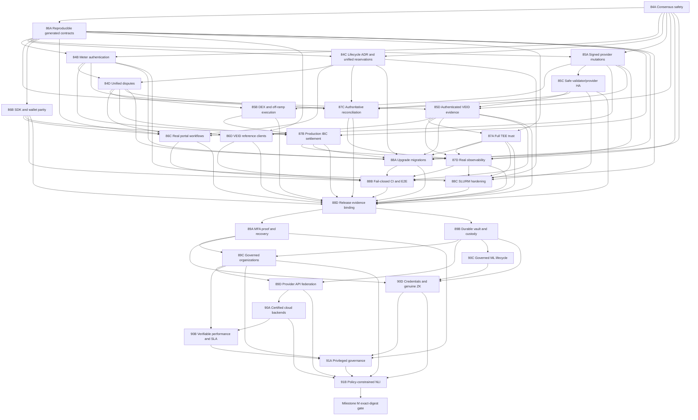

# VirtEngine Protocol and Planned-Functionality Completion Continuation Plan

**Assessment date:** 2026-07-20
**Planning horizon:** beta -> core release candidate -> planned-functionality-complete GA candidate
**Status:** Evidence-corrected 30-task execution draft; Tasks 1-20 establish the core-RC baseline and Tasks 21-30 close the remaining planned-functionality scope
**Task count:** Exactly 30 ordered implementation tasks
**Primary specification baseline:** `_docs/ralph/ralph_patent_text.txt`, `_docs/architecture.md`, `_docs/veid-flow-spec.md`, `_docs/protocols/`, `_docs/settlement-usage-rewards.md`, and the module behavior encoded under `x/`

## 1. Purpose

This document turns the current repository state into an executable continuation program. It is intentionally implementation-oriented: every task has bounded scope, predecessor dependencies, likely code surfaces, a test strategy, measurable acceptance criteria, expected artifacts, and an effort range. Tasks 1-20 harden and connect the protocol into an immutable core release-candidate baseline. Tasks 21-30 begin only after that baseline and close planned functionality that remains outside the first twenty tasks: account recovery, sensitive-data custody, governed organizations, provider federation, certified infrastructure backends, verifiable performance and reliability signals, the pre-inference ML lifecycle, credentials and selective disclosure, privileged governance, and policy-constrained natural-language interaction.

The plan does not treat the existence of modules, interfaces, deployment manifests, checklists, or mock-backed tests as proof that a production workflow is complete. Protocol completion requires the following to be true at the same time:

1. consensus-critical decisions are deterministic and validated by every validator;
2. value-bearing usage, escrow, payout, dispute, and cross-chain transitions are authenticated and replay-safe;
3. provider and client mutations are signed transactions rather than best-effort direct service calls;
4. product clients exercise real chain and provider process boundaries;
5. production deployment topology preserves keys and state without creating double-signing or duplicate-submission hazards;
6. upgrades preserve persisted state and wire compatibility;
7. release approval is tied to the exact tested source, image digests, genesis, and rollback evidence.
8. security recovery and sensitive-data lifecycles remain valid across key loss, process restart, restore, retention, legal hold, rotation, and erasure;
9. planned organization, federation, cloud-backend, credential, governance, and assisted-interaction workflows cross real external/process boundaries rather than stopping at models, interfaces, simulations, or mocks;
10. final GA-candidate approval occurs only after Milestone M completes its independently reviewed release gate and continuous 28-day observation of the exact final manifest digest; Task 88D is a core-RC baseline and Task 91B completion alone is not the final program declaration.

## 2. Assessment Method

The assessment combined source inspection, protocol-document comparison, task-history review, and targeted validation.

### 2.1 Validation executed on 2026-07-20

- The original assessment snapshot is source revision `609eb8187d2e5d8d962de72fa0cdd5f4dacf4a1a` on branch `stable-virtengine-beta`. Findings and path/line evidence in Sections 3.1-3.6 are claims about that snapshot unless a dated delta explicitly says otherwise.
- **Post-assessment delta, 2026-07-20:** this continuation plan is being extended at HEAD `63443b192eba2e234a3cc04d97f6ff30c0f62e09` while uncommitted work is active in Task 84A/consensus admission, application and upgrade wiring, settlement, VEID, inference-policy, and security-policy areas. That active work may materially change the determinism, upgrade, settlement-authentication, VEID evidence, inference-runtime, and release-security findings. It is owned outside this documentation edit and must not be overwritten, staged, or represented as merged evidence here.
- The checkout is not claimed clean. Until the active work is committed, merged, and revalidated from a named descendant revision, this plan preserves the original snapshot findings as planning evidence rather than asserting that each gap still exists unchanged at current HEAD.
- Local assessment environment: Windows NT `10.0.26200.0`, Go `1.25.6 windows/amd64`, Node `24.11.1`, pnpm `10.28.2`, and Python `3.11.9`.
- The exact aggregate command `go test ./app ./x/settlement/... ./x/resources/... ./x/hpc/... ./x/enclave/... ./pkg/provider_daemon/... -count=1` exited `1`. The terminal reported missing `go.sum` entries for `github.com/golang/glog`, `github.com/moby/spdystream`, and `github.com/mxk/go-flowrate`. This is a dependency-metadata/setup failure and must not be represented as a passing aggregate gate or as proof of source failure in packages that completed before it.
- Before that aggregate failure, settlement keeper/IBC/types, resources keeper, HPC, enclave, and provider `auth`, `hpc_templates`, `slurm_k8s`, and `veid_scopes` packages passed. Their package-level success is useful evidence, but it does not convert the aggregate command into a pass.
- The in-progress inference deployment policy validator passed, and all five tests in `.github/tests/test_inference_deployment_policy.py` passed during the earlier assessment. These files remain an active-work boundary rather than committed release evidence.
- `portal/node_modules` exists but is incomplete. `pnpm -C portal lint`, `pnpm -C portal type-check`, and `pnpm -C portal test -- --run` each failed with `MODULE_NOT_FOUND`, respectively for `eslint/bin/eslint.js`, `typescript/bin/tsc`, and `vitest/vitest.mjs`. These are dependency-installation failures, not passing checks and not evidence of portal source-test failures.
- `sdk/ts/node_modules` is absent, so no TypeScript SDK validation pass is claimed.
- `node scripts/validate-agents-docs.mjs` passed.
- The active Task 84A/application/upgrade/settlement/VEID and inference/security changes are an ownership boundary. Revalidation after merge must rerun the affected source inspection, targeted tests, dependency checks, and generated/release evidence before any corresponding snapshot finding is closed or narrowed.
- **Task 84A carrier continuation delta, 2026-07-20:** the active checkout now implements carrier v1: canonical protobuf vote bundles, fork-supported `baseapp.ValidateVoteExtensions`, deterministic voting-power aggregation, a registered no-ordinary-signer SDK-native system transaction at index zero, ProcessProposal signature/commit/aggregate revalidation, FinalizeBlock-only exactly-once consumption, and `v1.4.0` H+1 vote-extension activation. This closes the empty-only carrier design gap locally. Task 84A remains open until its four-validator 500-block load/adversarial and supported Linux architecture parity acceptance gates pass. Task 85D remains responsible for producing authenticated sidecar inference receipts before non-empty verification-result lists are operational; Task 84A callbacks do not perform inference or network I/O.

### 2.2 Confidence model

Status claims in this document use three evidence levels:

- **Verified:** source was inspected and a relevant local test command passed.
- **Implemented but integration-unproven:** meaningful code and unit tests exist, but the complete process-boundary workflow has not been demonstrated.
- **Incomplete or unsafe by inspection:** a no-op, placeholder, mock, fail-open branch, missing trust verification, disconnected state machine, or deployment hazard is visible in source.

No percentage-complete estimate is assigned. A large code volume can still leave a short but critical protocol path incomplete.

### 2.3 Determinism and reproducibility scope

- **Consensus determinism** means identical state-transition and proposal decisions on every supported validator target, including pinned Linux `amd64` and Linux `arm64` builds, from identical chain state and block inputs. Consensus code may use `ctx.BlockTime()` and `ctx.BlockHeight()` but not local wall time, random iteration, floating-point state arithmetic, host-specific files, external network calls, or live service responses.
- **ML determinism** means byte-identical normalized input digests, receipt payloads, scores, and reason codes under the approved CPU/runtime/model profile. Validators verify a previously produced receipt from proposal/vote data; they do not call a sidecar or external endpoint while executing or validating a block.
- **Generated-artifact reproducibility** means byte-identical protobuf, gateway, descriptor, OpenAPI, and SDK output inside one pinned Linux generation container. Cross-host plugin discovery is not accepted as evidence.
- **Release reproducibility** is target-specific: two clean builds for the same declared operating system/architecture/toolchain must produce the expected reproducible artifacts or a documented, isolated list of permitted nondeterministic metadata. Digests are compared per target, not across different targets.

## 3. Current Project Status

### 3.1 Strong foundations already present

| Area | Current evidence-based status |
| --- | --- |
| Cosmos application | The application wires a large custom-module set, ante handling, begin/end blockers, upgrades, IBC routing, and keeper dependencies. Source foundations are substantial, but the 2026-07-20 aggregate validation did not pass because dependency metadata was incomplete; no aggregate green status is claimed. |
| VEID, encryption, MFA, and roles | Substantial keepers, state models, validation, encrypted scope handling, MFA cleanup, and policy wiring exist. MFA expiry is wired through `x/mfa/module.go:153-160`; it is not an outstanding gap. |
| Marketplace and provider services | Order, bid, lease, provider-daemon, portal HTTP routing/authentication, adapter, and lifecycle implementations exist. The provider API shell is substantial, but its gRPC-backed `ChainQuery` embeds no-op behavior for most organizations, tickets, invoices, usage, metrics, and events (`pkg/provider_daemon/portal_chain_query.go:10-143`, `pkg/provider_daemon/portal_chain_query_grpc.go:10-23`). |
| Settlement and billing | Escrow, usage, payout, rewards, disputes, and HPC settlement code exist, with passing keeper tests. The remaining gaps concern authentication, canonical lifecycle ownership, replay safety, and cross-module convergence. |
| HPC and resources | Deterministic fixed-point scheduling, inventory allocation, accounting, rewards, SLURM integration, and tests exist. The remaining gap is that resource, marketplace, HPC, and staking reservations are separate sources of truth. |
| Signed settlement broadcaster | `pkg/provider_daemon/chain_submitter.go:425-503` contains transaction construction, gas estimation, signing, broadcast, and sequence handling, while `pkg/provider_daemon/chain_submitter_queue.go:15-107` provides file-backed queue records and atomic replacement. Earlier backlog text describing all broadcasting as a no-op is stale, but cross-process locking and production key persistence are not complete. |
| Security and release automation | Security workflows, supply-chain checks, launch runbooks, genesis artifacts, DR scripts, and observability assets are extensive. The unresolved issue is whether all gates fail closed and whether evidence refers to the exact current release. |

### 3.2 Protocol-critical incomplete paths

1. **Consensus-safety enforcement is incomplete.** `app/app.go:282-287` installs `baseapp.NoOpPrepareProposal()` and `baseapp.NoOpProcessProposal()`, while VEID proposal/vote-extension helpers are not connected to the application. Consensus-reachable VEID reads use local wall time (`x/veid/keeper/score.go:221`, `x/veid/types/scope.go:253-260`), and settlement can call externally backed price feeds from keeper execution (`app/types/app.go:701-716`, `x/settlement/keeper/price_aggregator.go:87-121`). Proposal admission alone is therefore insufficient; the complete deterministic state-transition surface must be audited and fixed.
2. **Usage signatures are stored but not cryptographically verified.** `x/settlement/keeper/msg_server.go:216-283` verifies sender addresses and copies provider/customer signature bytes; `x/settlement/keeper/settlement.go:277-369` validates shape and ownership but not those signatures.
3. **Resource ownership is fragmented.** `x/resources/keeper/allocation.go:78-205` reserves inventory independently, while `x/hpc/keeper/scheduling.go:99-224` schedules against HPC cluster capacity. The application creates both keepers but does not connect HPC or market transitions to the resources keeper (`app/types/app.go:552-697`).
4. **Financial disputes and related reputation effects have separate lifecycles.** Settlement has payout holds and dispute callbacks; fraud reports have submitted, reviewing, resolved, rejected, and escalated transitions (`x/fraud/types/fraud_report.go:31-103`); HPC has independent dispute/reward records; and reviews have their own persisted state (`x/review/types/review.go:31-176`). `app/types/app.go:632-697` does not route these outcomes through one authoritative financial case. Reviews should remain reputation evidence, not become a second financial dispute authority.
5. **Some provider mutations bypass the durable broadcaster and fail open.** `pkg/provider_daemon/chain_client.go:340-510` sends HPC/resource messages through generated `MsgClient` calls and returns success when the gRPC connection is absent in several methods.
6. **DEX and fiat off-ramp execution are not production paths.** `pkg/dex/adapters.go:84-166` returns one-to-one prices, quotes, and a synthetic transaction hash. A more complete `RealOsmosisAdapter` exists (`pkg/dex/osmosis_adapter.go:227-260`) but `CreateAdapter` still chooses the placeholder Osmosis adapter (`pkg/dex/adapters.go:414-424`). Settlement invokes swap execution from keeper code with constant bytes as a “signed transaction” (`x/settlement/keeper/dex.go:819`), and the only concrete fiat payout provider is explicitly a test mock (`pkg/payments/offramp/mock_provider.go:15-38`).
7. **Production topology can duplicate identities or lose state.** `deploy/kubernetes/overlays/prod/kustomization.yaml:19-31` scales validator and provider workloads; the node StatefulSet references a shared secret name (`deploy/kubernetes/base/virtengine-node-deployment.yaml:89-99`), while provider state uses `emptyDir` (`deploy/kubernetes/base/provider-daemon-deployment.yaml:127-133`).
8. **Production VEID evidence is not uniformly authenticated.** `x/veid/keeper/scoring.go:522-554` intentionally defaults to a stub unless real inference is configured. Separately, SSO submission passes no signer key to validation (`x/veid/keeper/web_scope_msg_server.go:46`) and signature verification is conditional on a non-nil key (`x/veid/keeper/sso_verification.go:39-61`). Email, SMS, and social handlers structurally validate attestations and account-address fields but persist verified results without complete issuer-proof and account-signature verification (`x/veid/keeper/web_scope_msg_server.go:93-198`, `x/veid/keeper/web_scope_msg_server.go:206-306`, `x/veid/keeper/web_scope_msg_server.go:314-431`). The current uncommitted inference-policy work is useful and its five tests passed, but it is not yet a committed, end-to-end production evidence guarantee.
9. **REST and generated contracts are incomplete.** Fourteen packages contain `gateway_stub.go` no-op registrations, including `sdk/go/node/hpc/v1/gateway_stub.go:8-12`.
10. **User-facing HPC remains mock-backed.** `portal/src/features/hpc/lib/hpc-client.ts:1-241` returns static templates, offerings, jobs, synthetic hashes, logs, usage, and prices.
11. **Other portal and provider API workflows remain simulated or no-op.** The general cloud order wizard synthesizes an order and hash (`portal/src/components/orders/OrderWizard.tsx:42-58`), provider deployment actions synthesize transaction IDs, and most provider portal organizations/tickets/billing/metrics queries return empty or unsupported results through `NoopChainQuery` (`pkg/provider_daemon/portal_chain_query.go:51-143`).
12. **Mobile and browser VEID capture are not complete production clients.** `mobile/veid-capture-app/src/services/upload/captureUploader.ts:8-14` reports success after checking only an upload URL. The browser wizard simulates chain submission (`portal/src/features/veid/hooks/useVeidWizard.ts:190-207`) and the liveness challenge auto-passes on timeout (`portal/src/components/veid/LivenessChallenge.tsx:77-82`).
13. **Provider signing-key persistence is not production-ready.** `KeyManager.Unlock` describes file/HSM behavior but only checks for a non-empty passphrase (`pkg/provider_daemon/key_manager.go:151-180`), while the daemon selects file mode when a key directory is configured and then calls `Unlock("")` (`cmd/provider-daemon/main.go:725-755`). This makes durable signing identity and HSM/remote signing incomplete.
14. **TEE trust verification is incomplete and attestation failure is fail-open for heartbeat health.** Nitro verification does not verify the COSE signature/root chain (`x/enclave/keeper/heartbeat.go:320-337`), and `ProcessHeartbeat` logs attestation failure but continues to record a successful heartbeat (`x/enclave/keeper/heartbeat.go:49-85`).
15. **IBC lifecycle side effects are not installed.** `x/settlement/ibc/keeper.go:82-92` defaults to `NoOpRelayerHooks`; `x/settlement/ibc/hooks.go:18-29` contains empty callbacks.
16. **Waldur reconciliation can classify unavailable independent evidence as synchronized.** `pkg/provider_daemon/waldur_reconciler.go:206-224` records `InSync: true` when Waldur usage cannot be fetched.
17. **Release posture is contradictory and stale relative to the assessment date.** `README.md:25-31` and `_docs/operations/mainnet-go-no-go-decision.md:25-42` say `GO` for April 2026 windows, while `RELEASE.md:7-20` says `HOLD`. As of the assessment date, both scheduled April windows are past, so neither statement proves current network status.

### 3.3 Interpretation

VirtEngine is not a greenfield project and should not be restarted. Most domain models and many module-level behaviors exist. The shortest path to completion is to harden and connect the existing implementation, remove fail-open and mock paths, prove the protocol across real process boundaries, and bind release evidence to immutable artifacts.

The current authoritative planning posture is **substantial beta / production and current public-network state unverified**. This does not assert that the April launch succeeded, failed, or rolled back; the repository lacks one current, non-contradictory record that proves any of those outcomes. Task 88D owns a superseding current status and immutable core-RC manifest while preserving the April records as historical evidence. It does not claim that Tasks 21-30, the planned-functionality-complete GA candidate, or the final 28-day exact-digest observation are complete. Until Milestone M completes and emits its signed terminal declaration, the project should not be described as currently live or planned-functionality-complete.

### 3.4 Completion profiles and external prerequisites

Engineering completion and external certification are separate, explicit states. A profile may be **engineering-complete** when its code, fixtures, negative tests, local/process-boundary harness, configuration validation, and operator runbook pass. It is **externally enabled/certified** only when the named network, vendor, hardware, contractual, legal, compliance, credential, liquidity, and staging prerequisites are available and evidenced. Missing external prerequisites must produce `blocked` or `uncertified` status for that profile, not a mock-backed pass and not a failure of otherwise complete engineering work.

| Profile family | Required support matrix | External prerequisites | Evidence and status rule |
| --- | --- | --- | --- |
| DEX | Network/chain ID, environment, DEX protocol and exact version, pool/contract or module IDs, token denominations/decimals, finality, route limits, oracle source, custody signer, testnet/mainnet enablement | Funded governed accounts, available supported pools with sufficient liquidity, allowlisted contracts/modules, RPC/archive access, custody/HSM approval, network governance approval | Task 85B may mark a network/version engineering-complete from deterministic fixtures and testnet execution. Mainnet remains externally blocked until every configured pool/contract, liquidity, signer, and governance prerequisite is evidenced. Unsupported rows fail closed. |
| Fiat payout | Provider, sandbox/production environment, jurisdictions, currencies, rails, beneficiary requirements, webhook/signature versions, limits, KYC/sanctions policy, settlement/finality semantics | Executed provider contract, sandbox and production credentials, compliance/legal/DPA approval, supported settlement bank/custody accounts, webhook endpoint registration, operational escalation agreement | Sandbox conformance can make the integration engineering-complete. Production remains externally blocked until contracting, credentials, compliance, and corridor approvals are recorded for each row. A mock provider never satisfies either state. |
| TEE | Vendor, platform/profile and version, hardware/firmware/TCB, attestation format, root/collateral version, workload/model binding, cloud/region, staging/production status | Real SGX, SEV-SNP, or Nitro hardware; vendor collateral and revocation access; approved cloud/account/region; workload images; operator access; vendor licensing where applicable | Fixtures/parser conformance can make a verifier engineering-complete. A claimed hardware profile remains uncertified until Task 87A produces real-hardware evidence for that exact row. Profiles without available hardware are explicitly unsupported/externally blocked, never inferred from emulation. |
| MFA factor/verifier | Factor type and version, enrollment proof, verifier identity/key epoch, attestation root/metadata, challenge/sign-byte version, pre-registered hold/recovery eligibility and policy version, fresh-address migration policy, revocation source, device/browser profile | Real authenticator/verifier service, trusted roots/metadata, HSM or approved verifier custody, recovery operations and fraud review | Task 89A owns this matrix. Format-only, untrusted-attestation, or mock-verifier evidence cannot certify a factor. Lost-key recovery requires a policy registered while the old authority was uncompromised, a bounded atomic on-chain authority/value switch or approved upgrade-height batch, and fail-closed asynchronous reconciliation; unavailable verifier or metadata rows fail closed. |
| Sensitive-data vault/KMS | Data class/scope, durable blob backend, region, KEK/DEK provider and algorithm, key residency, backup/restore, rotation, retention, archive/legal-hold, erasure profile | Approved KMS/HSM and object/database service, legal/privacy retention schedule, backup account, restore environment, deletion/hold authority | Task 89B owns this matrix. Process-memory keys or in-memory blobs are test-only; a profile is enabled only after restart, restore, rotation, hold, and cryptographic-erasure evidence. |
| Organization governance/ownership/billing | Organization-policy schema/version, authoritative keeper/group account, privacy model, member-key/commitment epoch, membership and invitation lifecycle, weighted/threshold policy, delegated budget, workload/data/support owner, billing owner, projection cursor, closure/recovery policy | Independent threshold participants, approved membership-privacy decision, durable projection/vault, billing and support operators, treasury/settlement integration, legal/privacy approval | Task 89C owns and checks in this versioned matrix. Organization support is never implicit: a profile is enabled only when authoritative membership/policy, privacy leakage tests, ownership, budget, projection recovery, support, and consolidated-billing reconciliation all pass. |
| Provider federation | On-chain service identity, discovery-document schema/version, API capability/version, native/Node/gateway SPKI or CA epoch, browser PKI plus signed application continuity or same-origin verification-proxy profile, request-signing key epoch, route-auth policy, nonce store, endpoint rotation and region | DNS/TLS control, on-chain provider registration, durable HA store, certified provider endpoints, routing/failover environment | Task 89D owns this matrix. Unsigned endpoints, permissive origins, insecure defaults, process-local replay state, or a browser claim that JavaScript directly inspected peer SPKI cannot certify a provider API profile. |
| Cloud backend | Backend/vendor and exact API/SDK version, region/project/subscription, compute/storage/network profile, image/flavor/SKU allowlists, lineage/idempotency tags, reconciliation, cleanup/cost ceilings | Real Kubernetes cluster or selected OpenStack/Waldur, AWS, Azure, and VMware sandbox/account; quotas, credentials, network, images, billing alerts | Task 90A owns this matrix. Unit mocks and dry-run adapters prove engineering pieces only; every enabled row needs create/observe/reconcile/delete evidence against its named external sandbox. |
| Benchmark/SLA | Suite/version, workload image and digest, hardware class, runner/verifier identity, sampling/freshness, reliability/SLA window, anomaly/review/fraud inputs, placement/reward/enforcement consumers | Representative hardware/network, independent verifier or challenge runner, observation window, governed thresholds and dispute authority | Task 90B owns this matrix. Fabricated uptime/provisioning inputs or mock submission cannot certify a suite or provider signal. |
| Dataset/model lifecycle | Dataset/version, source connector, consent purpose/version, lineage license/residency, split/label policy, subgroup taxonomy, privacy/adversarial suite, training image/seed, evaluation and drift thresholds, eligibility, promotion, canary, activation, pause, deprecation, revocation and rollback state | Legally usable consented datasets, labeling/review operations, protected training storage/compute, governance and privacy/fairness sign-off | Task 90C exclusively owns this matrix and extends Task 85D's runtime registry. Synthetic-only data and aggregate-only evaluation cannot certify a production model profile; Task 85D consumes one committed/bootstrap runtime state but owns no lifecycle eligibility or transition. |
| Credential/ZK | Credential schema/version, issuer profile/key epoch, wallet/presentation protocol, status/revocation method, circuit/constraint digest, ceremony and proving/verifying-key digests, verifier cost bounds, expiry/renewal policy | HSM/TEE/threshold issuer, governed ceremony participants, wallet and relying-party interoperability partners, audited circuits and status infrastructure | Task 90D owns this matrix. Keeper-held issuer private keys, inferred claims, simple MVP commitments, or opportunistic proving keys cannot certify issuance or selective disclosure. |
| Privileged role/emergency | Role and lifecycle states, assign/revoke/restore policy, threshold/authority, MFA profile, account-state enforcement coverage, pause/recovery scope, audit schema/retention | Governed multisig/group participants, break-glass custody, independent approvers, incident rehearsal and audit export/retention approval | Task 91A owns this matrix. A unilateral genesis/admin action or UI-only state change cannot certify a privileged operation or emergency profile. |
| NLI/tool | Model/backend/version, data-residency profile, generated-tool allowlist/schema, capability/role/MFA policy, budget/rate limit, simulation and confirmation semantics, red-team corpus, human-handoff route | Approved model hosting/vendor terms, privacy/security review, production tool APIs, wallet integration, support staffing and escalation | Task 91B owns this matrix. Model text is untrusted; direct model-generated API execution, preview-only success, or absent confirmation/state-drift checks cannot certify a tool profile. |

The assessment-baseline rows below are explicit non-enablement records. `TBD` is a blocking value, not a wildcard, and no row authorizes production support:

| Family/profile observed in source | Network/pool/provider/hardware baseline | Engineering status on 2026-07-20 | External status and prerequisite |
| --- | --- | --- | --- |
| Osmosis | Chain ID, approved module/pool IDs, denominations, and liquidity thresholds are not fixed; the factory selects the placeholder adapter despite a separate real adapter (`pkg/dex/adapters.go:414-424`, `pkg/dex/osmosis_adapter.go:227-260`) | `engineering_incomplete`, disabled | Externally blocked pending named testnet/mainnet, funded governed signer, approved pools/liquidity/oracle/finality, and governance enablement |
| Uniswap V2 | Exact EVM network/chain ID, factory/router, pools, tokens, and oracle are `TBD`; quote/execution methods are placeholders (`pkg/dex/adapters.go:43-166`) | `engineering_incomplete`, disabled | Externally blocked pending exact network/contracts/pools, RPC/finality, liquidity, custody/HSM, and governance approval |
| Curve | Exact EVM network/chain ID, registry/pools, tokens, and oracle are `TBD`; quote/execution methods are placeholders (`pkg/dex/adapters.go:270-393`) | `engineering_incomplete`, disabled | Externally blocked pending exact network/registry/pools, RPC/finality, liquidity, custody/HSM, and governance approval |
| Fiat `MockProvider` | Test-only provider with no production contract, corridor, credential, or compliance authority (`pkg/payments/offramp/mock_provider.go:15-38`) | Test fixture only; never engineering-complete for production | Unsupported for production |
| Real fiat payout provider | Provider and sandbox/corridors are `TBD`; no concrete production provider was observed | `engineering_incomplete`, disabled | Externally blocked pending provider selection, contract, sandbox/production credentials, compliance/legal/DPA, bank/custody, webhook, and corridor approval |
| AWS Nitro | COSE/root-chain verification is incomplete (`x/enclave/keeper/heartbeat.go:320-337`) | `engineering_incomplete`, disabled | Uncertified pending real Nitro hardware/account/region, current collateral/root evidence, workload binding, and staging conformance |
| Intel SGX DCAP | Full vendor trust/collateral and real-hardware evidence are not established by the inspected heartbeat path | `engineering_incomplete`, disabled | Uncertified pending real SGX hardware, TCB/collateral/revocation evidence, workload binding, and staging conformance |
| AMD SEV-SNP | Full vendor trust/collateral and real-hardware evidence are not established by the inspected heartbeat path | `engineering_incomplete`, disabled | Uncertified pending real SEV-SNP hardware, firmware/TCB/collateral evidence, workload binding, and staging conformance |
| MFA factors/verifiers | Non-FIDO factors are marked active without factor proof (`x/mfa/keeper/msg_server.go:75-96`); TOTP can accept any non-empty response or no commitment (`x/mfa/keeper/verification.go:110-145`); hardware signatures return success after format checks (`x/mfa/keeper/verification.go:465-510`); several FIDO attestation formats are accepted as untrusted (`x/mfa/keeper/fido2_verify.go:262-296`) | `engineering_incomplete`, recovery uncertified | Blocked pending governed verifier/root profiles, real authenticators, lost-key/fraud operations, and factor-by-factor negative/process-boundary evidence |
| Sensitive-data vault/KMS | Provider vault defaults to the only supported in-memory blob backend and initializes fresh keys (`pkg/provider_daemon/vault_service.go:25-53`, `pkg/provider_daemon/vault_service.go:80-86`); the key manager retains private keys and rotation state in process maps (`pkg/data_vault/keys/key_manager.go:103-165`) | Test-only persistence/custody; disabled for sensitive production data | Blocked pending named durable storage, KMS/HSM, legal retention/hold approval, backup/restore, rotation, and erasure evidence |
| Organization governance/ownership/billing | Cosmos `x/group` is queried by the portal but no authoritative group keeper is wired beside `x/authz` (`app/types/app.go:330-356`); portal organization creation/mutation is simulated and local (`lib/portal/hooks/useOrganization.tsx:168-250`, `lib/portal/hooks/useOrganization.tsx:293-425`), while provider organization queries are no-op (`pkg/provider_daemon/portal_chain_query.go:50-77`) | `engineering_incomplete`, organization mutation/query disabled; no privacy profile or authoritative billing owner certified | Blocked pending the Task 89C keeper/group ADR, chain-visibility privacy decision, threshold participants, durable projection, ownership and support wiring, and exact consolidated-billing reconciliation |
| Provider federation | Portal API defaults insecure, substitutes no-op chain queries and an in-memory nonce store, and allows every WebSocket origin (`pkg/provider_daemon/portal_api.go:90-172`); the portal normalizes provider-advertised endpoint attributes without a signed discovery/key-continuity check (`lib/portal/src/multi-provider/client.ts:440-466`) | `engineering_incomplete`, federation disabled | Blocked pending signed service identity/discovery, TLS continuity, durable replay state, route authentication, safe rotation, and multi-provider failover conformance |
| Cloud backends | Production startup registers Kubernetes plus optional Waldur provisioning only (`cmd/provider-daemon/main.go:1345-1388`); OpenStack/AWS/Azure/VMware adapters accept abstract clients (`pkg/provider_daemon/openstack_adapter.go:1041-1155`, `pkg/provider_daemon/aws_adapter.go:1382-1525`, `pkg/provider_daemon/azure_adapter.go:1706-1865`, `pkg/provider_daemon/vmware_adapter.go:945-1070`) and major tests use mocks such as `MockVSphereClient` (`pkg/provider_daemon/vmware_adapter_test.go:34-70`) | Kubernetes/Waldur integration-provisional; other named rows `engineering_incomplete` | Externally blocked until selected real sandbox/account profiles, SDK clients, quotas, cost controls, reconciliation, and destructive cleanup evidence exist |
| Benchmark/SLA | The benchmark binary constructs its daemon with nil chain client and signer (`cmd/benchmark-daemon/main.go:153-164`), while reliability fills 30-day uptime and 98% provisioning constants (`x/benchmark/keeper/keeper.go:332-362`) | `engineering_incomplete`, no certified signal consumers | Blocked pending signed submission, independent verification, real reliability/SLA inputs, governed consumption, and representative hardware/network runs |
| Dataset/model lifecycle | Cloud-source ingestion passes connector fields not defined by `ConnectorConfig` (`ml/training/data/ingestion.py:461-476`, `ml/training/dataset/connectors.py:49-76`), TFRecord ingestion returns no samples (`ml/training/dataset/ingestion.py:500-509`), and evaluation records aggregate metrics without subgroup/fairness fields (`ml/training/model/evaluation.py:28-105`) | `engineering_incomplete`, no production dataset/model row certified | Externally blocked pending consented representative datasets, licenses/residency, labeling review, fairness/privacy/adversarial evaluation, governed promotion, and drift operations |
| Credential/ZK | Credential issuance accepts an issuer private key inside the keeper call (`x/veid/keeper/credential_issuance.go:33-50`); selective disclosure labels a simple disclosed-claim hash as MVP (`x/veid/keeper/privacy_proofs.go:190-208`); age is synthesized from address/time (`x/veid/keeper/privacy_proofs.go:1238-1247`); proving-key loads silently ignore errors (`x/veid/keeper/zkproofs_circuits.go:98-109`) | `engineering_incomplete`, no certified issuer/circuit/wallet profile | Blocked pending off-chain issuer custody, genuine evidence-bound claims, governed circuits/ceremony, bounded verification, status/revocation, wallet/RP interoperability, and renewal/re-verification evidence |
| Privileged role/emergency | Roles have no assignment lifecycle beyond enum presence (`x/roles/types/roles.go:7-41`), accounts expose only active/suspended/terminated (`x/roles/types/account_state.go:7-25`), and one genesis account can nominate an administrator (`x/roles/keeper/msg_server.go:166-204`) | `engineering_incomplete`, emergency profiles uncertified | Blocked pending threshold governance, complete states, universal enforcement, MFA, scoped pause/recovery, and append-only privileged audit rehearsal |
| NLI/tool | Patent text requires impact discovery and confirmation before action (`_docs/ralph/ralph_patent_text.txt:1199-1227`); Anthropic/local Go backends are stubs (`pkg/nli/llm_backend.go:500-562`), deployment tool execution calls provider actions directly (`lib/portal/src/chat/chain-tools/deployments.ts:119-147`), and transaction executors return previews (`lib/portal/src/chat/chain-tools/marketplace.ts:161-177`) | Planned functionality; `engineering_incomplete`, disabled | Blocked pending an untrusted-planner control plane, policy/schema/budget constraints, canonical simulation and confirmation, wallet/MFA signing, drift invalidation, privacy/red-team conformance, and human handoff |

#### 3.4.1 GA-required capability floor

`planned_functionality_complete` is intentionally non-vacuous. It requires the minimum certified production rows below even if every implementation task is otherwise engineering-complete. `engineering_complete_external_blocked` means implementation, fixtures, negative tests, process-boundary harnesses, configuration validation, and runbooks pass but a required external profile lacks real certification evidence. A mandatory row in that state blocks `planned_functionality_complete`; it may not be omitted, renamed optional, or satisfied by a mock. Optional vendor alternatives may remain `excluded_by_scope` only through an approved, versioned product-scope ADR that preserves the mandatory capability and names the selected production alternative.

| Mandatory GA capability | Minimum declared production floor | Non-vacuous certification evidence | Block/exclusion rule |
| --- | --- | --- | --- |
| Strong account recovery | At least two independent strong recovery factors from different compromise domains, plus at least one versioned threshold hold/recovery policy registered while the account was controlled by an uncompromised key, with no unilateral operator or retroactive governance path | Real authenticator/verifier processes, governed key/root epochs, compromise-hold and lost-key rehearsals, bounded on-chain authority/value switch or upgrade-height batch with conservation/app-hash evidence, asynchronous reconciliation, and stale-authority invalidation | Both strong factors and the threshold profile are mandatory. A blocked authenticator/root, untested threshold/hold, or policy that permits retroactive governance takeover leaves the program `engineering_complete_external_blocked`. |
| Exchange/settlement corridor | At least one certified production DEX/token-conversion route and at least one certified production fiat payout/off-ramp corridor. Inbound fiat payment/on-ramp is not required unless separately declared as an enabled product capability | Real production credentials and executed contracts, compliant custody and sanctions/KYC controls, funded route/pool liquidity, signed low-value production execution, finality, payout receipt, accounting reconciliation, incident/rollback evidence, and named operational owners | Both the production DEX route and production fiat payout/off-ramp corridor are mandatory because Claim 4 is in declared scope. If either lacks production certification, the highest status is `engineering_complete_external_blocked`, not `planned_functionality_complete`. Sandbox/testnet evidence alone cannot meet the floor. |
| Durable sensitive-data custody | At least one durable blob/metadata profile backed by one production KMS/HSM or equivalent non-exportable KEK profile | Restart, HA, clean restore, rotation, legal hold, consent revocation, and cryptographic-erasure evidence | Memory blobs, process-local keys, or emulator-only custody never meet the floor. |
| Provider federation | At least two independently operated provider service identities, endpoints, DNS/PKI control domains, and failure domains | Signed on-chain discovery, route authentication, durable replay consume, endpoint/key rotation, cross-provider routing and failover without duplicate mutation | Two replicas under one operator/identity are not independent. Either provider blocked means the federation floor is blocked. |
| Cloud execution | At least one certified Kubernetes profile and at least one certified VM/IaaS profile. The product-scope ADR must name the VM/IaaS selection and enumerate OpenStack/Waldur, AWS, Azure, VMware, DigitalOcean, OpenNebula, OpenShift, and other advertised rows as enabled or explicitly excluded | Real sandbox create/observe/reconcile/restart/delete/cost/zero-residue evidence for each enabled row | Kubernetes and one VM/IaaS row are mandatory. Additional vendor rows are approved alternatives unless separately declared GA scope; an advertised but unclassified row blocks release. |
| Benchmark and SLA | At least one representative signed benchmark/reliability/SLA suite for every enabled compute class, including each enabled container, VM/IaaS, HPC, GPU/accelerator, storage, or network class | Independent runner/challenger evidence, representative hardware, real provisioning/workload outcomes, placement consumption, dispute and financial reconciliation | A compute class cannot be enabled while its representative suite is blocked or fabricated. |
| Governed ML | At least one real, consented, representative production dataset/model profile governed end to end | Source/license/consent lineage, deterministic split/training, subgroup/fairness/privacy/adversarial gates, promotion/canary/activation/pause/rollback evidence, exact runtime receipt binding | Synthetic-only data, bootstrap-only model state, or aggregate-only evaluation cannot meet the floor. |
| Credential and selective disclosure | At least one production issuer profile, two independent wallet implementations, two independent relying-party implementations, and one governed selective-disclosure circuit/profile | Non-exportable/threshold issuer custody, ceremony and exact circuit/key digests, genuine evidence witnesses, bounded verification, status/revocation/renewal/recovery, interoperability traces | Every cardinality is mandatory; an unavailable partner leaves this row `engineering_complete_external_blocked`. |
| Organization governance/ownership/billing | At least one governed organization profile with threshold membership/policy, privacy-preserving public representation, delegated budget, workload/data/support ownership, durable projection, and consolidated billing | Multi-party chain/provider/vault/portal E2E, indexer leakage tests, projection recovery, budget conservation, and settlement/invoice reconciliation | Organization support cannot be inferred from generic group or portal code and cannot be excluded while organization functionality remains declared GA scope. |
| Privileged governance/emergency | At least one threshold privileged-governance and scoped emergency profile with independent approvers and break-glass custody | Role/account lifecycle, universal policy enforcement, strong MFA, quorum-loss/compromise drill, scoped pause/expiry/recovery, append-only audit | A unilateral admin/genesis key or unreviewed emergency path cannot meet the floor. |
| Natural-language interaction | At least one production NLI model/backend/tool profile when NLI remains declared GA functionality | Approved model hosting/residency, generated tool policy, deterministic simulation, signed preview, exact confirmation, drift invalidation, wallet/MFA/threshold authorization, red-team and handoff evidence | NLI may be excluded only by an approved product-scope ADR that removes the functionality from GA claims and user surfaces. A blocked vendor/model/tool row cannot be called complete. |

Each matrix is a versioned release artifact. Task 85B owns the DEX and payout matrices; Task 87A owns the TEE matrix; Task 88D binds those core-RC statuses and external evidence to its immutable manifest without converting blocked or uncertified rows into production-complete claims. Tasks 89A-91B own the ten follow-on matrices identified above, including the explicit Task 89C organization governance/ownership/billing matrix. Milestone M binds all declared final profiles and capability-floor rows to the exact GA-candidate digest; no follow-on row may be inferred complete from the Task 88D baseline, and no mandatory blocked row may transition beyond `engineering_complete_external_blocked`.

### 3.5 Residual planned-functionality selection after subtracting Tasks 1-20

The ten follow-on tasks were selected by subtracting the core protocol-hardening outcomes of Tasks 1-20 from source and patent evidence. They do not reopen proposal determinism, generated contracts, authenticated metering, canonical reservations/disputes, signed provider broadcasting, DEX/off-ramp execution, deployment identity, production inference execution, client parity, portal/mock removal, capture, TEE, IBC, reconciliation, observability, migrations, CI, SLURM, or core-RC provenance. Where a follow-on touches the same package, it owns a different residual lifecycle or external certification boundary.

| Residual gap after Task 88D | Why Tasks 1-20 do not close it | Owning follow-on |
| --- | --- | --- |
| Factor activation proof and recoverability after loss/compromise | 85D authenticates VEID evidence and 86B secures wallet sessions; neither proves every MFA enrollment nor provides an opt-in threshold hold/recovery policy, a bounded atomic on-chain switch to a fresh Cosmos address, upgrade-height batching for oversized state, fail-closed off-chain reconciliation, and old-authority invalidation | 89A |
| Durable sensitive-data custody and legal lifecycle | 85C persists provider queues/signers and 86D minimizes capture data; neither supplies a durable vault/KMS, retention/hold/archive/restore, or cryptographic erasure | 89B |
| Governed organizations and organization-owned economic activity | 86C completes existing ticket/individual-billing/usage/metrics routes but intentionally returns typed `feature_unavailable` for organization mutation/query; it does not own group keeper wiring, privacy model, projection, portal mutation, threshold policy, delegated budgets, organization ownership, organization billing, or organization E2E | 89C exclusively |
| Trustworthy federation of provider APIs | 85C hardens deployment HA and 86C completes provider API data, but neither binds API identity/discovery/TLS/replay/rotation to on-chain service identity across providers | 89D |
| Real multi-backend provisioning certification | 88C certifies SLURM and 86C proves user workflows, but generic cloud adapter interfaces and mock tests do not certify Kubernetes/OpenStack/AWS/Azure/VMware profiles | 90A |
| Verifiable performance, reliability, SLA, placement, rewards, and enforcement | Existing benchmark/review/fraud/provider modules are not converged into independently verifiable production signals consumed by matching/scheduling | 90B |
| Consented data and exclusive governed model lifecycle | 85D owns deterministic runtime enforcement and receipt validation for one committed/bootstrap profile only. It does not own data/model eligibility, promotion, canary, activation, pause, deprecation, revocation, rollback, dataset consent, ingestion/splits/labels, fairness/privacy evaluation, training reproducibility, or drift | 90C exclusively, extending the same registry |
| Credential issuance/presentation/revocation and genuine selective disclosure | 85D authenticates evidence feeding decisions, but does not provide off-chain issuer custody, wallet/RP lifecycle, status/revocation, governed circuits, or evidence-bound age/residency/score proofs | 90D |
| Threshold privileged governance and scoped emergency control | Existing role checks and 88D approvals do not provide complete states, universal enforcement, multiparty break-glass, MFA, scoped pause/recovery, or privileged audit | 91A |
| Policy-constrained natural-language query/action control | The patent-described agent remains planned; generic portal workflows do not make an LLM a safe, authorized, confirmed transaction planner | 91B |

Operational enhancements are not silently omitted and do not justify additional task headings. Canary rollout and immutable deployment evidence belong to 88D for core RC and Milestone M for the final digest; live SLO/error-budget operations belong to 87D and Milestone M; validator onboarding/key ceremonies belong to 85C and 88D; incident automation belongs to 87D and 91A; multi-region failover is acceptance evidence for 85C, 89B, 89D, and enabled 90A rows; rate limiting and abuse budgets belong to 89D and 91B; oracle source operation and incident controls remain owned by 84A and 85B. Future operational optimization beyond those acceptance profiles is post-GA work, not evidence that one of the ten residual planned functions was forgotten.

### 3.6 Exhaustive planned-functionality trace to the patent baseline

The tables below trace every patent claim and every numbered capability in “Reproducing VirtEngine,” plus the named implementation technologies and alternatives. Patent evidence is a requirements source, not evidence that the current implementation works. “Mandatory capability” means the behavior must be delivered for the declared GA product scope; a named technology described by the patent as interchangeable remains an approved implementation alternative unless this plan's explicit GA floor selects a concrete profile. Final evidence means exact-digest, independently reviewable evidence bound by Milestone M.

#### 3.6.1 Claims 1-14

| Claim/item | Required capability | Existing evidence | Tasks 1-20 owner | Tasks 21-30 owner | Mandatory vs approved alternative/optional | Final evidence |
| --- | --- | --- | --- | --- | --- | --- |
| Claim 1 | Integrated decentralized identity/authentication/encryption, AI facial verification, cloud VM/container marketplace, cluster workload management, metered billing/invoices | Patent `_docs/ralph/ralph_patent_text.txt:1613-1622`; substantial but disconnected implementations under `x/veid`, `x/market`, `x/hpc`, `x/settlement`, and provider adapters | 84A-84D, 85A, 85D, 86C-86D, 88B-88D | 89A-89D, 90A-90D, 91A | Mandatory integrated capability; individual implementation technologies are replaceable | Exact-digest identity-to-order-to-provision-to-meter-to-invoice E2E, security/conservation invariants, and certified profile matrices |
| Claim 2 | Mobile camera capture of identity documents and face/biometrics | Native uploader reports success without transport (`mobile/veid-capture-app/src/services/upload/captureUploader.ts:8-14`) | 85D, 86D, 88B | 89A, 89B | Mandatory reference-client capability for declared mobile support | Real-device capture, attestation, encrypted resumable upload, committed request, privacy trace, and failure evidence |
| Claim 3 | Combine document/biometric evidence with authenticated email/SMS/SSO metadata through governed AI scoring | Web-scope proof gaps in `x/veid/keeper/web_scope_msg_server.go:46-431`; inference can default to stub (`x/veid/keeper/scoring.go:522-554`) | 84A, 85D, 86D | 90C | Mandatory capability; particular model framework optional | Authenticated evidence lineage, approved real model/dataset, deterministic receipt, subgroup/privacy gates, and cross-process score proof |
| Claim 4 | DEX/token conversion from cryptocurrency to a supported production fiat payout/off-ramp corridor | Placeholder DEX and mock payout evidence (`pkg/dex/adapters.go:84-166`, `pkg/payments/offramp/mock_provider.go:15-38`) | 84D, 85B, 87B, 88D | 91A for privileged corridor controls | Mandatory declared-scope floor: at least one certified production DEX/token-conversion route and one certified production fiat payout/off-ramp corridor; vendors and additional currencies/corridors are profile choices. Inbound fiat payment/on-ramp is optional unless separately declared | Production credentials/contracts, custody/compliance/liquidity approvals, signed route and payout execution, finality/reconciliation, and fail-closed blocked-corridor evidence |
| Claim 5 | Ledger/non-custodial/passwordless authentication plus MFA | MFA proof bypasses and untrusted attestation paths (`x/mfa/keeper/verification.go:110-145`, `x/mfa/keeper/fido2_verify.go:262-359`) | 85D, 86B, 86D | 89A, 91A | Mandatory authentication capability; Google/Facebook/Microsoft/AD are alternative identity-provider rows | Two independent strong recovery factors, threshold recovery, real authenticator/verifier conformance, wallet and privileged-policy enforcement |
| Claim 6 | Third-party public-key encryption and authorized-only access without public plaintext | Envelope and rotation foundations exist under `x/encryption`; production vault is memory-backed (`pkg/provider_daemon/vault_service.go:25-53`) | 85C-85D, 86D, 88D | 89A-89C, 90D, 91A | Mandatory privacy/security capability; KMS/HSM vendor optional | Ciphertext-only public records, durable custody, consent/ownership enforcement, rotation/recovery/erasure, leakage tests, and exact key/profile digests |
| Claim 7 | Proof-of-stake blockchain transaction and identification-verification state | Cosmos app/staking and VEID modules are substantial; deterministic admission/runtime gaps remain (`app/app.go:282-287`) | 84A, 85D, 88A, 88D | None beyond consumers | Mandatory capability; Cosmos SDK is the selected repository framework but patent permits alternatives | Determinism matrix, multi-validator app-hash proof, upgrade rehearsal, signed release state, and VEID receipt validation |
| Claim 8 | Decentralized marketplace where providers offer resources and users deploy workloads | Market/provider foundations exist but ownership/reservation and real portal/backend paths are fragmented | 84C, 85A, 86C, 88B | 89C, 89D, 90A, 90B | Mandatory marketplace capability; Waldur/direct integration are alternatives | Real multi-provider order/bid/lease/provision E2E, organization ownership, external lineage, cleanup, billing and SLA evidence |
| Claim 9 | Preconfigured and custom HPC workload library deployed on demand | HPC template and SLURM foundations exist; user HPC path is mock-backed (`portal/src/features/hpc/lib/hpc-client.ts:1-241`) | 84C, 86C, 88C | 90A, 90B | Mandatory workload-library/custom-workload capability; SLURM/MOAB/PBS/other schedulers are alternatives | Signed template provenance, custom-manifest policy, real scheduling/accounting, isolation, representative benchmark, and cleanup evidence |
| Claim 10 | Working integration of at least two among decentralized identity, cloud computing, and distributed/HPC computing | All three module families exist but process-boundary integration remains incomplete | 84A-88D collectively | 89A-91A collectively | Mandatory integrated product capability; meeting all three is the declared scope | Cross-domain identity-gated cloud and HPC journeys with shared ownership, settlement, policy, audit, and exact-digest evidence |
| Claim 11 | Provider integration, encrypted request state, resource discovery/allocation, service management, usage ledger, and provider/user UI | Market/resources/provider/portal code exists; reservation ownership and portal/backend certification remain open | 84B-84C, 85A, 86B-86C, 87C, 88B | 89C-89D, 90A-90B, 91B if NLI retained | Mandatory decentralized-cloud method | Real request-to-cleanup workflow, encrypted data proof, allocation conservation, signed usage, management UI, billing reconciliation, and federation evidence |
| Claim 12 | Identity request, document/biometric verification, encrypted identity state, ML score, authorized access, and capture module | VEID, capture and inference foundations exist with evidence-authentication/client/runtime gaps | 84A, 85D, 86D, 87A, 88B | 89A-89B, 90C-90D | Mandatory decentralized-identification method | Native/browser capture evidence, approved model/data, deterministic receipts, encrypted vault/access control, credential/proof lineage, and recovery evidence |
| Claim 13 | Decentralized multi-node supercomputer, workload manager, marketplace offering, and node rewards | HPC/resources/settlement and SLURM foundations exist; reservations, chart hardening and real quality signals remain open | 84B-84D, 86C, 88C | 90A-90B | Mandatory distributed-compute method; workload-manager technology alternative | Multi-node scheduled workload, conserved capacity, signed accounting, rewards, isolation/failover, benchmark/SLA and marketplace evidence |
| Claim 14 | Proximity/topology-aware clustering into mini-supercomputers for submitted HPC tasks | HPC scheduling exists but no final certified proximity/network suite is claimed | 84C, 88C | 90A, 90B | Mandatory when topology-aware mini-cluster functionality remains advertised; specific scheduler/network technology optional | Governed topology inputs, representative latency/bandwidth suite, deterministic placement explanation, failure/rebalance and workload-completion proof |

#### 3.6.2 “Reproducing VirtEngine” numbered capabilities

| Claim/item | Required capability | Existing evidence | Tasks 1-20 owner | Tasks 21-30 owner | Mandatory vs approved alternative/optional | Final evidence |
| --- | --- | --- | --- | --- | --- | --- |
| AUTH-1 | Secure ledger/non-custodial login linked to passwordless SSO (`_docs/ralph/ralph_patent_text.txt:930-934`) | Wallet/SSO code exists; issuer-key verification and session parity are incomplete | 85D, 86B | 89A | Mandatory capability; named SSO providers are alternative profiles | Signed wallet/session and governed OIDC/SAML conformance with expiry, replay and recovery |
| AUTH-2 | Mnemonic-backed wallet/account portability (`_docs/ralph/ralph_patent_text.txt:935-937`) | Cosmos wallets exist; recovery semantics are incomplete | 86B | 89A | Mandatory non-custodial portability; mnemonic UX is one approved method | Cross-wallet restore, account-control proof, safe recovery migration, and no secret persistence |
| AUTH-3 | Governed admin/provider/support nomination and account disable (`_docs/ralph/ralph_patent_text.txt:938-941`) | Static roles and unilateral genesis nomination (`x/roles/keeper/msg_server.go:166-204`) | 88D baseline only | 91A | Mandatory governed capability; unilateral genesis control prohibited | Threshold role/account lifecycle, universal enforcement, MFA, audit, compromise and quorum-loss drills |
| AUTH-4 | Third-party recipient public-key encryption (`_docs/ralph/ralph_patent_text.txt:942-944`) | Encryption envelopes and rotation foundations exist | 85D, 86D | 89A, 89B | Mandatory capability; algorithm profile governed | Canonical vectors, authorized decrypt, rotation/recovery, stale-key rejection, and ciphertext-only storage |
| AUTH-5 | Authorized access to orders, identity, support, resources, settings and organizations (`_docs/ralph/ralph_patent_text.txt:946-950`) | Access checks are distributed and organization resolver can remain no-op | 86C, 88B | 89B, 89C, 91A | Mandatory least-privilege capability | Complete data/action inventory, live ownership policy, cross-tenant negative tests, and tamper-evident audit |
| AUTH-6 | Encryption in transit and at rest (`_docs/ralph/ralph_patent_text.txt:951-953`) | Production vault/TLS profiles are not certified | 85C, 88C | 89B, 89D | Mandatory capability | Durable KMS encryption, HTTPS/WSS or mTLS profiles, backup/restore/rotation, TLS continuity and leakage tests |
| ML-1 | Collect diverse representative identification datasets (`_docs/ralph/ralph_patent_text.txt:956-963`) | Synthetic test corpora exist; no production dataset row certified | 85D consumes only | 90C | Mandatory capability for production ML | Consented source/license/residency lineage and representative subgroup inventory |
| ML-2 | Clean, standardize, deduplicate and validate data (`_docs/ralph/ralph_patent_text.txt:964-969`) | Connector and TFRecord gaps remain | None | 89B, 90C | Mandatory | Canonical ingestion manifests, quarantine, checksums, duplicate/corruption tests |
| ML-3 | Deterministic train/validation/test splits (`_docs/ralph/ralph_patent_text.txt:970-977`) | No final leakage-safe production split evidence | None | 90C | Mandatory | Reproducible split digests and subject/near-duplicate leakage proof |
| ML-4 | Evidence-bound feature engineering (`_docs/ralph/ralph_patent_text.txt:978-983`) | Inference features exist but full dataset lineage is not certified | 85D runtime schema enforcement | 90C | Mandatory | Versioned feature manifest, privacy review and source-to-feature lineage |
| ML-5 | Reproducible model training (`_docs/ralph/ralph_patent_text.txt:984-989`) | Training tooling exists; governance output is stale | None | 90C | Mandatory | Two clean training runs, pinned image/dependencies, SBOM/provenance and exact artifact digest |
| ML-6 | Representative model evaluation (`_docs/ralph/ralph_patent_text.txt:990-995`) | Aggregate metrics exist without complete subgroup/fairness fields (`ml/training/model/evaluation.py:28-105`) | 85D runtime receipt tests only | 90C | Mandatory | Aggregate/worst-group/fairness/privacy/adversarial reports with governed thresholds |
| ML-7 | Reviewed fine-tuning/iteration (`_docs/ralph/ralph_patent_text.txt:996-1001`) | No complete promotion/canary lineage is claimed | None | 90C | Mandatory where used; automatic unreviewed tuning prohibited | Versioned experiment lineage, independent approvals, no test leakage, and promotion decision |
| ML-8 | Governed production deployment (`_docs/ralph/ralph_patent_text.txt:1004-1008`) | Runtime can select a stub; current model lifecycle is incomplete | 85D owns exact committed/bootstrap runtime enforcement | 90C owns eligibility through rollback | Mandatory | Active governed model profile, runtime fail-closed receipts, canary/pause/rollback and Milestone M digests |
| VEID-1 | ML recognition over document, biometric and facial scopes (`_docs/ralph/ralph_patent_text.txt:1011-1014`) | VEID scorers/scopes exist with authentication/runtime gaps | 85D | 90C | Mandatory; TensorFlow is replaceable | Authenticated scope lineage and one governed production model profile |
| VEID-2 | Native identity capture app (`_docs/ralph/ralph_patent_text.txt:1015-1018`) | Uploader is incomplete | 86D | 89A, 89B | Mandatory for declared native support | Real-device attestation, capture, encrypted resumable upload and committed status |
| VEID-3 | SSO and email/SMS web scopes (`_docs/ralph/ralph_patent_text.txt:1019-1021`) | Structural checks can bypass complete issuer proof | 85D, 86D | 89A | Mandatory enabled scopes | Separate issuer processes, canonical receipts, account signatures, replay and expiry tests |
| VEID-4 | Government and social integration scopes (`_docs/ralph/ralph_patent_text.txt:1022-1024`) | Social handlers exist; no exhaustive certified government connector set | 85D | 90C for data eligibility | Capability mandatory only for rows declared enabled; vendors optional | Governed connector matrix, signed evidence, consent/residency and explicit excluded rows |
| VEID-5 | SMS/email verification (`_docs/ralph/ralph_patent_text.txt:1025-1027`) | Non-empty/unverified proof risks exist | 85D | 89A | Mandatory enabled factors/scopes | Real delivery verifier process, HSM key epoch, challenge/account binding and replay tests |
| VEID-6 | Provider domain verification (`_docs/ralph/ralph_patent_text.txt:1028-1030`) | Domain-verification docs/code exist; final profile not claimed | 85D, 88B | 89D | Mandatory provider-onboarding capability | DNS/domain proof, on-chain service binding, key rotation and takeover-negative evidence |
| VEID-7 | Cosmos-integrated VEID module and ML bridge (`_docs/ralph/ralph_patent_text.txt:1031-1035`) | `x/veid` and `pkg/inference` exist | 84A, 85D | 90C | Mandatory capability; TensorFlow-Go is not mandatory | Deterministic committed receipt verification and exact active model/runtime profile |
| VEID-8 | Identity-aware authentication integration (`_docs/ralph/ralph_patent_text.txt:1036-1039`) | VEID/MFA/roles exist but universal policy is incomplete | 85D, 86B | 89A, 91A | Mandatory | Generated policy inventory, account/factor states and cross-process authorization tests |
| VEID-9 | Encrypted identity-scope upload (`_docs/ralph/ralph_patent_text.txt:1040-1043`) | Encryption/scope foundations exist; client workflows incomplete | 85D, 86D | 89B | Mandatory; centralized genesis private-key decryption is replaced by governed threshold/KMS custody | Canonical encryption/signatures, approved-recipient custody, no public plaintext and erasure/rotation evidence |
| VEID-10 | Identity score on a governed 0-100 scale (`_docs/ralph/ralph_patent_text.txt:1044-1046`) | Scoring exists | 84A, 85D | 90C | Mandatory score semantics; model implementation optional | Versioned fixed semantics, approved model/data, receipt and threshold compatibility evidence |
| VEID-11 | Automated multi-scope identity recognition (`_docs/ralph/ralph_patent_text.txt:1047-1050`) | Scope aggregation exists but full proof/model lineage is incomplete | 85D | 90C | Mandatory | Genuine authenticated evidence, deterministic aggregation, abstention/failure and governance proof |
| PROVIDER-1 | Distributed multi-provider compute management (`_docs/ralph/ralph_patent_text.txt:1051-1055`) | Provider daemon and adapters exist | 85A, 85C, 86C | 89D, 90A | Mandatory | Two-provider federation plus certified compute profiles and failover evidence |
| PROVIDER-2 | Bid engine over chain orders and configured prices (`_docs/ralph/ralph_patent_text.txt:1056-1059`) | Bid engine exists; lifecycle ownership is being unified | 84C, 85A | 90B | Mandatory marketplace-provider capability | Real order/bid/lease trace, signed mutation, deterministic policy and quality-signal consumption |
| PROVIDER-3 | Cluster/backend interaction, including Kubernetes (`_docs/ralph/ralph_patent_text.txt:1060-1062`) | Concrete Kubernetes path and abstract VM adapters exist | 85C, 86C | 90A | Mandatory backend capability; GA floor selects Kubernetes plus one VM/IaaS profile | Per-profile real sandbox conformance and zero-residue cleanup |
| PROVIDER-4 | Buildable operator CLI (`_docs/ralph/ralph_patent_text.txt:1063-1065`) | Cobra commands exist | 85A, 86A | Profile tasks extend generated commands | Mandatory operability capability; Cobra itself optional | Clean build, generated command contracts, signed actions and negative configuration tests |
| PROVIDER-5 | Pubsub handling for won leases/manifests (`_docs/ralph/ralph_patent_text.txt:1066-1069`) | Event/listener paths exist | 84C, 85A, 85C | 89D, 90A | Mandatory | Restart/replay/cursor tests from won lease through one idempotent deployment |
| PROVIDER-6 | Authenticated provider REST/API communication (`_docs/ralph/ralph_patent_text.txt:1070-1073`) | Portal API has insecure defaults and route gaps | 86A, 86C | 89D | Mandatory | Signed discovery, browser/native TLS profiles, route inventory, durable replay and multi-provider E2E |
| PROVIDER-7 | Manifest parsing and deployment (`_docs/ralph/ralph_patent_text.txt:1074-1077`) | Manifest/adapters exist | 84C, 85A, 86C | 90A | Mandatory | Generated schema validation, encrypted manifest lineage, certified provision/reconcile/delete |
| PROVIDER-8 | Provider signing-key custody including ledger/non-custodial modes (`_docs/ralph/ralph_patent_text.txt:1078-1081`) | File unlock with empty passphrase contradicts custody (`cmd/provider-daemon/main.go:725-755`) | 85C | 89B, 89D | Mandatory non-exportable/durable custody capability; device/vendor optional | Restart/restore/rotation, HSM/remote signer, fencing and compromise drill |
| PROVIDER-9 | Provider metric and usage reporting (`_docs/ralph/ralph_patent_text.txt:1082-1084`) | Usage paths exist but signature/reconciliation gaps remain | 84B, 87C, 87D | 90B | Mandatory | Canonically signed metering, replay safety, independent benchmark/SLA and billing reconciliation |
| PROVIDER-10 | External API and automation integration (`_docs/ralph/ralph_patent_text.txt:1085-1087`) | Waldur and adapter integrations exist; profile certification is incomplete | 85A, 86A, 87C | 89D, 90A | Mandatory integration capability; exact external systems are alternative rows | Signed capability discovery, generated APIs, authenticated callbacks, retries and per-profile conformance |
| MARKET-1 | Blockchain communication among providers, validators and users (`_docs/ralph/ralph_patent_text.txt:1088-1094`) | Cosmos/market/provider foundations exist | 84A, 84C, 85A | 89D | Mandatory | Multi-validator/multi-provider E2E with signed state and replay evidence |
| MARKET-2 | Decentralized marketplace integrated with Waldur or equivalent (`_docs/ralph/ralph_patent_text.txt:1095-1099`) | Market module and Waldur packages exist | 84C, 86C, 87C | 90A | Mandatory marketplace capability; Waldur is an approved alternative, not patent-exclusive | Owner ADR, real offering/order/deployment/billing workflow and selected integration profile |
| MARKET-3 | Public-ledger/API automation for offerings/accounts (`_docs/ralph/ralph_patent_text.txt:1100-1105`) | Generated gateway/API gaps exist | 86A, 86C | 89D | Mandatory API capability; Mastermind implementation optional | Generated contracts, authenticated queries/actions, cursor/restart and policy tests |
| MARKET-4 | Recipient-specific encryption for provider/customer/resource/organization/support data (`_docs/ralph/ralph_patent_text.txt:1106-1112`) | Encryption exists; custody and organization policy incomplete | 85D, 86D | 89A-89C | Mandatory security capability; genesis-key centralization is explicitly not accepted | Durable recipient custody, ownership/consent policy, recovery rotation, leakage and decrypt-authority tests |
| MARKET-5 | User-facing marketplace UI (`_docs/ralph/ralph_patent_text.txt:1113-1116`) | Portal has synthetic order/HPC paths | 86B, 86C | 89C, 90A | Mandatory UI capability; Waldur Homeport/React are alternatives | Browser-signed order/deployment/support/billing E2E with authoritative state |
| MARKET-6 | Private/public cloud, HPC and service-desk offerings (`_docs/ralph/ralph_patent_text.txt:1117-1120`) | Adapters/HPC/support shells exist; broad real integration is incomplete | 86C, 88C | 89C-89D, 90A-90B | Mandatory capability categories for declared rows; named vendors optional | Certified backend/HPC rows, real support ownership, discovery and explicit product-scope exclusions |
| MARKET-7 | Billing, payment, and payout integration through Waldur, PayPal, or a partner (`_docs/ralph/ralph_patent_text.txt:1121-1123`) | Settlement/billing exists; mock fiat provider is non-production | 84B, 84D, 85B, 86C | 89C | Mandatory usage-to-billing and payout integration; vendor choice is alternative. Inbound fiat payment/on-ramp is an optional, separately declared capability and is not inferred from payout support | Signed usage-to-invoice reconciliation, certified production payout profile, organization billing proof, and separate evidence for any declared inbound fiat payment/on-ramp |
| MARKET-8 | Token payment, governed DEX/token conversion, and fiat payout/off-ramp (`_docs/ralph/ralph_patent_text.txt:1124-1127`) | Bank/escrow/DEX foundations exist; adapters are incomplete | 84B, 84D, 85B, 87B | 91A privileged controls | Mandatory token settlement plus at least one certified production conversion route and one production fiat payout/off-ramp corridor; additional currencies/corridors are profile rows. Inbound fiat on-ramp remains optional unless separately declared | Conservation, custody, liquidity, finality, compliance, production credentials/contracts, and exact exchange/payout reconciliation evidence |
| HPC-1 | Decentralized WAN-connected compute nodes (`_docs/ralph/ralph_patent_text.txt:1128-1133`) | HPC/provider/node foundations exist | 84C, 85C, 88C | 89D, 90B | Mandatory | Multi-site identity, connectivity, scheduling, failover and signed accounting evidence |
| HPC-2 | Integrated workload manager (`_docs/ralph/ralph_patent_text.txt:1134-1137`) | SLURM integration exists | 88C | 90B | Mandatory capability; SLURM and listed schedulers are alternatives | Canonical selected scheduler profile, isolation/HA/accounting and workload conformance |
| HPC-3 | Workload-manager deployment across Kubernetes nodes (`_docs/ralph/ralph_patent_text.txt:1138-1144`) | Two divergent SLURM charts exist | 88C | 90A | Mandatory for selected Kubernetes-HPC profile | One canonical chart, stable secrets, exact capacity, failover and real cluster E2E |
| HPC-4 | Blockchain module automating workload-node deployment/integration (`_docs/ralph/ralph_patent_text.txt:1145-1149`) | HPC/resources modules and agents exist | 84C, 85A, 88C | 90A | Mandatory | Signed order/reservation-to-node deployment, idempotency, reconciliation and upgrade evidence |
| HPC-5 | Rewards for contributed compute (`_docs/ralph/ralph_patent_text.txt:1150-1154`) | HPC/settlement/reward paths exist | 84B, 84D | 90B | Mandatory | Signed contribution evidence, deterministic reward formula, dispute and conservation proof |
| HPC-6 | Cluster nearby systems into mini-supercomputers (`_docs/ralph/ralph_patent_text.txt:1155-1160`) | No final certified topology profile is claimed | 84C, 88C | 90A, 90B | Mandatory if advertised; topology technology optional | Governed topology, network benchmark, deterministic cluster placement and failure evidence |
| HPC-7 | Schedule compute-intensive tasks on high-speed clusters (`_docs/ralph/ralph_patent_text.txt:1161-1165`) | Fixed-point HPC scheduler exists; production signals incomplete | 84C, 86C, 88C | 90A, 90B | Mandatory | Real workload, topology/capacity constraints, representative SLA suite and signed completion/accounting |
| INTEGRATION-1 | Identity-gated marketplace with reviews/fraud feedback | VEID, market, review and fraud modules exist but financial/reputation ownership is fragmented (`_docs/ralph/ralph_patent_text.txt:1167-1174`) | 84D, 85D, 86C | 90B, 91A | Mandatory | Authenticated identities, canonical disputes, bounded reputation effects and anti-abuse evidence |
| INTEGRATION-2 | Marketplace-backed HPC provisioning and cluster membership | HPC depends on market/resources but reservations are fragmented (`_docs/ralph/ralph_patent_text.txt:1175-1182`) | 84C, 85A, 88C | 90A | Mandatory | One order/lease/reservation through cluster deployment, workload, cleanup and settlement |
| INTEGRATION-3 | Transparent benchmark metrics informing provider choice | Benchmark daemon can use nil client/signer and reliability constants (`cmd/benchmark-daemon/main.go:153-164`, `x/benchmark/keeper/keeper.go:332-362`) | 87D | 90B | Mandatory for enabled compute classes | Signed independent suite, real outcomes, placement/UI consumption, challenge and SLA evidence |
| NLI | Natural-language questions/actions, impact discovery, confirmation and human support (`_docs/ralph/ralph_patent_text.txt:1199-1227`) | NLI stubs/direct actions/preview-only success remain | None; 86C only supplies safe underlying workflows | 91B | Mandatory only while declared GA functionality; otherwise excluded by product-scope ADR | Certified production model/tool row, generated policy, signed preview, atomic nonce, confirmation/signing/drift tests, red-team and handoff |

#### 3.6.3 Named technologies and integrations

The patent explicitly says its chosen tools are interchangeable (`_docs/ralph/ralph_patent_text.txt:313-334`). Therefore the capability is mandatory, while these technology rows are approved alternatives unless the GA capability floor or a product-scope ADR selects one. “Excluded” always means excluded from the declared product profile, not silently absent while still advertised.

| Claim/item | Required capability | Existing evidence | Tasks 1-20 owner | Tasks 21-30 owner | Mandatory vs approved alternative/optional | Final evidence |
| --- | --- | --- | --- | --- | --- | --- |
| Python / Go | Implement blockchain, services and ML pipelines | Repository uses Go and Python | 86A, 88B, 88D | 90C | Approved current implementation languages; C#, NodeJS, C++, and Java remain alternative language choices | Pinned locks/toolchains, reproducible builds, SBOM and exact commit artifacts |
| C# / NodeJS / C++ / Java | Alternative high-level implementation languages (`_docs/ralph/ralph_patent_text.txt:317-320`) | Not selected as core server implementation | None | None | Approved alternatives, excluded from current core profile unless introduced by ADR | Explicit exclusion or separately pinned/reviewed build profile |
| Cobra | Provider command-line wrapper named by the reproduction steps (`_docs/ralph/ralph_patent_text.txt:1063-1065`) | Go commands use Cobra | 85A, 86A | Profile tasks extend commands | Approved current CLI library; a buildable, secure operator CLI is mandatory but Cobra is replaceable | Pinned module, clean build, generated command parity, signed mutation and negative configuration evidence |
| Cosmos SDK | Proof-of-stake blockchain framework | Repository is Cosmos SDK-based | 84A, 86A, 88A, 88D | 89C, 91A | Approved selected framework; capability mandatory, patent permits Substrate/EOS/custom chain | Exact module graph, deterministic multi-validator and upgrade evidence |
| Substrate / EOS / custom blockchain | Alternative proof-of-stake frameworks (`_docs/ralph/ralph_patent_text.txt:320-324`) | Not selected | None | None | Approved alternatives, excluded from current product scope | Product-scope ADR if adopted; otherwise signed exclusion |
| Waldur / Waldur Mastermind / Waldur Billing / Homeport | Marketplace, external-cloud automation, billing and UI integration | `pkg/waldur` and portal integrations exist; reconciliation gaps remain | 86C, 87C | 90A | Approved integration alternatives; marketplace/billing/UI capabilities mandatory, Waldur not exclusive | Selected profile API/version, authenticated callbacks, reconciliation and E2E; or approved exclusion |
| Django / Django REST Framework / Celery | Waldur API and task-processing stack (`_docs/ralph/ralph_patent_text.txt:1187-1195`) | External/integration architecture, not required for native Go paths | 86C, 87C | 90A | Optional approved Waldur-stack components | Exact external deployment digest and conformance if enabled; otherwise exclusion |
| PostgreSQL / Redis / RabbitMQ | Waldur persistence and task/result stores (`_docs/ralph/ralph_patent_text.txt:1193-1198`) | Multiple repository persistence options exist | 85C, 87C | 89B, 90A | Optional profile technologies; durable persistence/queue semantics mandatory | HA/restore/replay evidence for selected stores or explicit exclusion |
| React | Homeport/portal UI technology (`_docs/ralph/ralph_patent_text.txt:1191`) | Portal/lib clients use React/TypeScript | 86B-86D | 89C, 91B | Approved current UI technology; UI capability mandatory | Frozen dependencies, browser E2E, accessibility and signed release assets |
| Kubernetes / Rancher | Container orchestration and private-cloud integration (`_docs/ralph/ralph_patent_text.txt:826`, `_docs/ralph/ralph_patent_text.txt:1029`) | Concrete Kubernetes adapter exists | 85C, 86C, 88C | 90A, 90B | Kubernetes is selected as one mandatory GA floor profile; Rancher is an approved optional distribution/integration | Named distribution/version real cluster certification; Rancher enabled or product-scope excluded |
| Docker | Alternative container/deployment mechanism (`_docs/ralph/ralph_patent_text.txt:330-331`) | Images/Compose assets exist | 85C, 88D | 90A | Approved alternative/supporting packaging; not a substitute for the mandatory Kubernetes GA row | Pinned image/provenance and explicit non-production or certified profile status |
| Chef | Alternative infrastructure automation (`_docs/ralph/ralph_patent_text.txt:330-331`) | No selected production profile claimed | None | 90A if selected | Approved alternative, currently excluded unless ADR enables it | Product-scope decision and real conformance if enabled |
| Ansible | Infrastructure automation and named Waldur integration (`_docs/ralph/ralph_patent_text.txt:331`, `_docs/ralph/ralph_patent_text.txt:833`) | Provider Ansible adapter exists | 85A, 86C | 89D, 90A | Approved alternative/optional integration; automation capability mandatory, Ansible not exclusive | Signed capability row, vault-backed secrets, real playbook lifecycle and explicit enable/exclude ADR |
| SLURM | HPC workload manager | Two charts and SLURM integrations exist | 84C, 88C | 90A, 90B | Approved selected workload-manager profile; patent permits alternatives | Canonical chart, HA/isolation/accounting, real workload and benchmark evidence |
| MOAB HPC Suite | Alternative/named HPC integration (`_docs/ralph/ralph_patent_text.txt:332`, `_docs/ralph/ralph_patent_text.txt:828`) | No certified profile claimed | None | 90A, 90B if selected | Approved alternative, currently excluded by product-scope ADR unless enabled | Exact adapter/scheduler/profile certification or signed exclusion |
| Open OnDemand | Named HPC portal integration (`_docs/ralph/ralph_patent_text.txt:828`) | No certified profile claimed | None | 90A if selected | Approved optional alternative, not required when equivalent HPC portal capability is delivered | Real auth/job/output integration evidence or signed exclusion |
| Portable Batch System / Open Grid Scheduler | Alternative workload managers (`_docs/ralph/ralph_patent_text.txt:332-333`) | No certified profile claimed | None | 90A, 90B if selected | Approved alternatives, excluded unless selected | Product-scope ADR and full scheduler/profile conformance if enabled |
| OpenStack / Waldur OpenStack | VM/IaaS private-cloud profile | Abstract OpenStack/Waldur paths exist | 86C, 87C | 90A, 90B | Approved VM/IaaS alternative; may satisfy the mandatory VM/IaaS floor only if selected and certified | Exact API/project/region real sandbox lineage, reconciliation, cleanup and cost evidence |
| VMware | VM/IaaS private-cloud alternative (`_docs/ralph/ralph_patent_text.txt:826`) | Adapter tests use `MockVSphereClient` (`pkg/provider_daemon/vmware_adapter_test.go:34-70`) | 86C | 90A, 90B | Approved alternative; enabled or explicitly excluded by product-scope ADR | Real vCenter profile conformance or signed exclusion |
| OpenNebula | Named private-cloud alternative/in-development integration (`_docs/ralph/ralph_patent_text.txt:826`) | No certified profile claimed | None | 90A if selected | Approved alternative, currently excluded unless selected | Adapter/API/version certification or signed rationale/exclusion |
| OpenShift | Named cluster-management alternative (`_docs/ralph/ralph_patent_text.txt:1169-1170`) | No distinct certified profile claimed | None | 90A if selected | Approved Kubernetes distribution alternative, not independently mandatory | Named distribution conformance or explicit exclusion |
| CloudStack | Named VM/IaaS alternative (`_docs/ralph/ralph_patent_text.txt:333-334`, `_docs/ralph/ralph_patent_text.txt:1169-1170`) | No certified profile claimed | None | 90A if selected | Approved alternative, excluded unless selected | Real profile certification or signed exclusion |
| KVM / OpenVZ / Xen / Hyper-V | Hypervisor alternatives (`_docs/ralph/ralph_patent_text.txt:333-334`) | No direct production profiles claimed | None | 90A if selected | Approved underlying alternatives, not separate mandatory product rows unless advertised | Selected backend lineage/security certification or explicit non-product classification |
| AWS | Named public-cloud profile (`_docs/ralph/ralph_patent_text.txt:827`) | Abstract AWS adapter exists | 86C | 90A, 90B | Approved VM/IaaS alternative; enabled or explicitly excluded | Exact account/region/SDK real sandbox certification or signed exclusion |
| Microsoft Azure | Named public-cloud profile and SSO alternative (`_docs/ralph/ralph_patent_text.txt:827`, `_docs/ralph/ralph_patent_text.txt:933`) | Abstract Azure adapter and SSO foundations exist | 85D, 86C | 89A, 90A, 90B | Approved cloud and identity-provider alternatives; each profile enabled or excluded separately | Real cloud certification and/or governed OIDC/SAML conformance, or signed exclusions |
| DigitalOcean | Named public-cloud integration (`_docs/ralph/ralph_patent_text.txt:827`) | No certified profile claimed | None | 90A if selected | Approved VM/IaaS alternative, not mandatory; explicitly enable or exclude in product-scope ADR | Real API/account/region certification or signed exclusion rationale |
| Google / Facebook / Microsoft SSO | Passwordless identity-provider examples (`_docs/ralph/ralph_patent_text.txt:931-934`) | SSO evidence path exists but key verification is incomplete | 85D, 86D | 89A | Approved provider alternatives; SSO capability mandatory for declared rows | OIDC/SAML issuer/audience/key epoch/replay conformance per enabled provider or exclusion |
| Keycloak | Named identity/federation integration (`_docs/ralph/ralph_patent_text.txt:829`) | No certified Keycloak profile claimed | 85D, 86D | 89A if selected | Approved self-hosted identity-provider alternative, not mandatory | Real realm/client/key-rotation conformance or signed exclusion |
| EduGAIN | Named research/education federation (`_docs/ralph/ralph_patent_text.txt:829`) | No certified federation profile claimed | None | 89A if selected | Approved specialized alternative, optional unless declared target market requires it | Federation metadata/signature/privacy conformance or signed exclusion |
| LDAP | Named directory integration (`_docs/ralph/ralph_patent_text.txt:829`) | No certified LDAP profile claimed | None | 89A, 91A if selected | Approved directory alternative, not mandatory | TLS/bind/group-mapping/stale-access tests or signed exclusion |
| SAML | Named federation protocol (`_docs/ralph/ralph_patent_text.txt:829`) | SSO validation foundations exist | 85D, 86D | 89A | Approved protocol alternative alongside OIDC; enabled rows must be governed | Metadata/signature/audience/replay/key-rotation conformance or exclusion |
| Waldur database identity | Named identity source (`_docs/ralph/ralph_patent_text.txt:829`) | No independent authority should override chain identity | 86C | 89C, 91A | Approved projection/integration only; never an independent chain authority | Authority ADR, projection consistency and stale-access rejection or exclusion |
| Jira Service Desk | Named support integration (`_docs/ralph/ralph_patent_text.txt:830`) | Support API shells exist; no certified Jira row claimed | 86C | 89C, 89D if selected | Approved service-desk alternative, not mandatory | Organization ownership, encrypted ticket data, API/replay/closure E2E or exclusion |
| Zammad | Named support integration (`_docs/ralph/ralph_patent_text.txt:830`) | No certified profile claimed | 86C | 89C, 89D if selected | Approved service-desk alternative, not mandatory | Same support ownership/privacy/API evidence or signed exclusion |
| PayPal | Named billing/payment integration (`_docs/ralph/ralph_patent_text.txt:806`, `_docs/ralph/ralph_patent_text.txt:832`) | Only test mock payout provider observed | 85B, 86C | 89C if selected billing adapter | Approved vendor alternative, not mandatory. A certified production fiat payout/off-ramp remains mandatory through some selected provider; inbound fiat payment/on-ramp is optional unless separately declared | Contract, production credentials, webhook/signature, custody/compliance and reconciliation evidence if selected, or signed vendor exclusion that names the certified alternative |
| TensorFlow | Named ML framework | Inference/training code exists | 85D | 90C | Approved selected framework; model capability mandatory, framework not exclusive | Exact runtime/model digest, deterministic receipt and governed lifecycle evidence |
| TensorFlow-Go | Patent-described bridge from the Go VEID module to TensorFlow (`_docs/ralph/ralph_patent_text.txt:1031-1035`) | Repository uses Go inference abstractions/sidecars rather than making this binding intrinsically mandatory | 84A, 85D | 90C | Approved implementation alternative; the deterministic authenticated inference boundary is mandatory, the language binding is not | Exact runtime interface/profile and receipt conformance, or explicit exclusion in favor of the selected sidecar/runtime |
| MTCNN | Named facial-detection/neural-network capability (`_docs/ralph/ralph_patent_text.txt:334-337`) | Facial/inference pipelines exist; no framework-specific GA claim is inferred | 85D | 90C | Approved model architecture alternative; facial verification capability is mandatory, MTCNN itself is not | Governed model-card/data/evaluation/runtime evidence if selected, otherwise signed model-scope exclusion |
| PyTorch / Keras / Caffe / MXNet / Darknet | Named ML alternatives (`_docs/ralph/ralph_patent_text.txt:334-337`) | No selected production profiles claimed | None | 90C if selected | Approved alternatives, excluded unless governed model profile selects one | Pinned runtime/training/profile conformance or signed exclusion |

This trace matrix is itself versioned release evidence. A requirement can move from one implementation owner to another only through an ADR that updates both task metadata and this matrix without deleting the final evidence obligation. Milestone M must record a terminal state for every row: `certified_enabled`, `approved_alternative_excluded`, `optional_excluded`, or `engineering_complete_external_blocked`; the last state blocks `planned_functionality_complete` for every mandatory capability-floor row.

## 4. Program-Level Definition of Done

Every task below must satisfy the following common exit rules in addition to its task-specific criteria:

1. Write a failing test or executable conformance fixture before changing consensus, accounting, security, or persistence behavior.
2. Preserve deterministic state transitions; do not use wall-clock time, map iteration order, floating-point arithmetic, network I/O, nondeterministic ML execution, or external service availability inside consensus state transitions.
3. Add explicit migration handling for any persisted schema, key prefix, parameter, protobuf wire, or genesis change.
4. Return errors for disconnected or unconfigured production dependencies. Development-only no-op behavior must be explicit, isolated, observable, and impossible to select in production configuration.
5. Add metrics and structured events for new lifecycle decisions and failure paths without logging secrets, biometric payloads, private keys, raw attestations, or customer data.
6. Add unit, invariant, negative, replay, and process-boundary tests appropriate to the change. Goroutine tests must use leak detection according to repository conventions.
7. Run formatting, lint, targeted race-enabled tests, generated-code drift checks, and the repository preflight relevant to changed files.
8. Update `_docs/`, public documentation, OpenAPI, SDK examples, runbooks, and `AGENTS.md` files when behavior or operational responsibility changes.
9. Produce a reviewable completion artifact: migration fixture, threat-model delta, benchmark report, conformance report, or rehearsal evidence as specified by the task.
10. Do not close a task based only on mocks. At least one acceptance test must cross the real boundary changed by the task.

### 4.1 Numeric program gates

The following checked-in targets make otherwise qualitative acceptance language binary. A task may make a target stricter, but it cannot relax one without an approved ADR, updated capacity model, and release-owner sign-off.

- Chain transaction P95 confirmation is under `10s`; chain query and provider API P95 latency are each under `2s`.
- Provider deployment success is at least `99%` and P95 provisioning is under `300s`.
- VEID success is at least `95%`, P95 verification is under `30s`, and accepted nondeterministic inference events equal zero.
- HPC submission/completion reliability is at least `99%` and P95 scheduling is under `15m`.
- Single-validator and TEE signing-path RTO are at most `15m`; provider and regional failover RTO are at most `30m`; CockroachDB replication lag remains below `300s`.
- Identity, marketplace, and HPC burst gates use the concurrency/error targets in `_docs/ga-checklist.md`: respectively 100 uploads, 500 orders, and 200 jobs with error rate below `1%` and the documented latency bounds.
- A critical injected failure must page/route within `5m`, and its alert must clear within two configured evaluation intervals after verified recovery.
- Planned-functionality-complete GA-candidate evidence requires Milestone M to seal and deploy the exact final manifest, rerun its fresh prerequisite gates, and then complete a continuous non-overlapping `28d` observation because the uptime/error-budget objectives in `_docs/slos-and-playbooks.md` use 28-day windows. Task 88D records the immutable core-RC baseline and Task 91B supplies the last implementation input; neither can start, overlap, or satisfy Milestone M's final window.

## 5. Ordering and Dependency Model

The tasks are deliberately numbered in execution order. Work may run concurrently only after all listed predecessors are merged and their compatibility contracts are stable.

### 5.1 Workstream summary

| Sequence | ID | Priority | Outcome | Estimated engineering effort |
| ---: | --- | --- | --- | ---: |
| 1 | 84A | P0 | Deterministic proposal admission and consensus-safe state transitions | 15-25 engineer-days |
| 2 | 86A | P0 | Pinned dependency/module/vendor hygiene and reproducible protobuf, gateway, descriptor, OpenAPI, and module metadata generation | 15-25 engineer-days |
| 3 | 84B | P0 | Authenticated, replay-safe usage settlement | 15-22 engineer-days |
| 4 | 84C | P0 | Evidence-selected single marketplace owner and one authoritative resource reservation lifecycle | 20-30 engineer-days |
| 5 | 84D | P0 | One authoritative dispute-to-money lifecycle | 20-30 engineer-days |
| 6 | 85A | P0 | All provider writes use the durable signed broadcaster | 15-25 engineer-days |
| 7 | 85B | P0 | Verifiable DEX and compliant fiat off-ramp execution with explicit support profiles | 25-40 engineer-days |
| 8 | 85C | P0 | Canonical deployment rendering, double-sign-safe validators, persistent provider keys, and durable provider HA | 20-30 engineer-days |
| 9 | 85D | P0 | Authenticated, replay-safe VEID evidence and fail-closed runtime enforcement of one committed/bootstrap approved model profile | 25-38 engineer-days |
| 10 | 86B | P1 | Secure wallet sessions and generated client parity | 12-18 engineer-days |
| 11 | 86C | P1 | Real portal cloud, HPC, provider, ticket, usage, metrics, and non-organization billing workflows, with organization routes fail-closed until 89C | 25-40 engineer-days |
| 12 | 86D | P1 | Native and browser attested VEID capture with resumable upload | 30-50 engineer-days |
| 13 | 87A | P1 | Complete deterministic TEE trust-chain verification | 30-50 engineer-days |
| 14 | 87B | P1 | Production-safe cross-chain settlement | 20-35 engineer-days |
| 15 | 87C | P1 | Durable, corrective Waldur/meter reconciliation | 15-25 engineer-days |
| 16 | 87D | P1 | Repaired observability topology, production metric call sites, measured SLIs, traces, alerts, and executable telemetry conformance | 18-28 engineer-days |
| 17 | 88A | P1 | Schema-aware migrations and multi-version upgrade rehearsal | 20-30 engineer-days |
| 18 | 88B | P1 | Fail-closed required gates and real workflow proof | 20-30 engineer-days |
| 19 | 88C | P1 | One canonical, secure, durable, capacity-accurate, multi-tenant SLURM chart and operation path | 30-50 engineer-days |
| 20 | 88D | P1 | Immutable core-RC manifest, current-status baseline, exact-digest staging rollout, and rollback evidence | 20-35 engineer-days |
| 21 | 89A | P0 | Fail-closed MFA proof, opt-in threshold compromise hold/recovery, bounded atomic on-chain authority/value switch, upgrade batching, and fail-closed asynchronous reconciliation | Formula: shared recovery/account-migration core `30-45` + `5-8` per enabled strong factor profile + `8-14` per threshold recovery/hold profile + `10-18` cross-module/batched migration and recovery-reconciliation certification; **58-93 minimum** |
| 22 | 89B | P0 | Durable sensitive-data vault, KMS/HSM custody, consent, retention, restore, rotation, and cryptographic erasure | 35-55 engineer-days |
| 23 | 89C | P1 | Governed organizations, threshold membership/policy, delegated budgets, ownership, and consolidated billing | 30-48 engineer-days |
| 24 | 89D | P1 | On-chain-identity-bound provider API federation, durable replay safety, endpoint continuity, and routing | 28-45 engineer-days |
| 25 | 90A | P1 | Real cloud profile implementation/certification: shared `20-30` + `12-20` per enabled profile; minimum GA set `N=2` | 44-70 engineer-days minimum |
| 26 | 90B | P1 | Verifiable benchmark, reliability, SLA, placement, rewards, reputation, and enforcement signals | 30-50 engineer-days |
| 27 | 90C | P1 | Consented deterministic dataset/training governance, fairness/privacy evaluation, promotion, drift, pause, and rollback | 40-65 engineer-days |
| 28 | 90D | P1 | Credential core plus per-issuer, wallet, relying-party, circuit, interoperability and certification work; minimum GA cardinalities applied | 68-108 engineer-days minimum |
| 29 | 91A | P1 | Threshold privileged roles, complete account states, universal enforcement, scoped emergency controls, MFA, and audit | 30-50 engineer-days |
| 30 | 91B | P2 | Policy-constrained natural-language query/action planning, preview, confirmation, signing, and handoff | 35-60 engineer-days |

**Tasks 1-20 base effort:** 410-656 engineer-days. **Tasks 21-30 minimum-declared-GA effort:** 398-644 engineer-days, using Task 89A's two-strong-factor/one-threshold-profile minimum, two enabled Task 90A profiles, and Task 90D's one issuer/two wallets/two relying parties/one circuit floor. **Milestone M release engineering/operations:** 25-40 engineer-days. The resulting base is **833-1,340 engineer-days**. Apply an explicit **15-25% security, privacy, interoperability, and external-certification remediation contingency** of **125-335 engineer-days** (lower bound rounded outward from 124.95), for a planning total of **958-1,675 engineer-days**. This contingency is engineering/remediation labor; external procurement, contracts, audit scheduling, hardware shipment, partner onboarding, data acquisition, and regulator/vendor lead time are elapsed-time dependencies and are not disguised as engineer-days.

With four stable specialist streams, disciplined dependency handoffs, the minimum declared GA profile set, and external prerequisites available when needed, the dependency-shaped critical path is a **16-30 month planning range**, not a commitment. Milestone M's continuous `28d` observation is additional, non-overlapping elapsed time after its 25-40 engineer-day sealing/deployment/gate work and is included in that planning range only as the final uninterrupted window. Additional strong-factor or threshold hold/recovery profiles add the Task 89A formula components; additional cloud/vendor profiles add Task 90A effort at `12-20` engineer-days each; additional issuer, wallet, relying-party, or circuit profiles add the Task 90D formula components stated in that task. External TEE hardware/collateral, DEX network/pool availability, payout-provider production contracting/credentials/compliance, MFA verifier/authenticator roots, KMS/HSM and durable-storage approval, organization governance participants, provider TLS/DNS control, real cloud accounts/quotas, representative benchmark hardware, consented datasets and labeling, issuer/circuit ceremony partners, wallet/relying-party interoperability, model-hosting approval, security/privacy/legal review, and infrastructure dependencies can extend elapsed time or leave mandatory rows `engineering_complete_external_blocked`.

---

## Task 1 — 84A: Eliminate Consensus Nondeterminism and Enforce Deterministic ABCI++ Admission

**Priority:** P0
**Backlog reference:** `ae5f621e`
**Dependencies:** None
**Blocks:** 86A, 84B, 84C, 85A, 85D, 87D, 88A

### Outcome

Replace unconditional proposal acceptance with a deterministic, bounded proposal policy and remove local clocks, live network/service calls, random ordering, and other nondeterministic inputs from every consensus-reachable state transition.

### Why this is required

`app/app.go:282-287` installs no-op prepare and process handlers. VEID already exposes vote-extension and proposal-oriented verification helpers in `x/veid/keeper/vote_extension.go:145-198`, `x/veid/keeper/vote_extension.go:361-400`, and `x/veid/keeper/consensus_verifier.go:332-374`, but the application does not call them. Separately, `GetScore` uses `time.Now()` (`x/veid/keeper/score.go:221`), scope activity uses local time (`x/veid/types/scope.go:253-260`), and the settlement keeper can reach externally backed price feeds (`app/types/app.go:701-716`). Proposal validation cannot make the protocol safe while `FinalizeBlock`/message execution can still depend on validator-local inputs.

### Implementation work

1. Write an ADR defining the complete consensus-input boundary, proposal invariants, liveness limits, maximum work per block, deterministic ordering, and fail-closed versus deferred behavior.
2. Add a static inventory/check that flags local wall clocks, uncontrolled randomness, floating-point state decisions, filesystem reads, external HTTP/gRPC/DNS, and unpinned service callbacks in production keeper/message/begin/end/proposal paths.
3. Replace local expiry/activity checks with explicit `At(ctx.BlockTime())` variants and update every consensus caller; retain wall-clock helpers only in clearly off-chain packages.
4. Remove external price fetching and DEX/off-ramp execution from keeper execution. External actors must submit authenticated observations/results; keepers validate and read committed on-chain state only.
5. Introduce a proposal-handler component under `app/` that uses the SDK's deterministic default transaction selection as a base and adds bounded checks for malformed bytes, duplicate identifiers available in current state, invalid protocol system transactions, and configured per-block limits.
6. Use vote extensions as the validator-result carrier. `ExtendVote` produces a versioned signed verification-result bundle; `VerifyVoteExtension` validates each bundle; `PrepareProposal` deterministically aggregates the previous commit into one canonical system transaction at index zero; `ProcessProposal` recomputes the aggregate from the supplied extended commit and validates that transaction. No sidecar or live model call occurs in proposal processing.
7. Ensure `PrepareProposal`, `ProcessProposal`, and final execution share one pure canonical decoder/validator and stable error codes. Task 84B later adds usage-specific replay indexes without being a prerequisite for this task.
8. Emit off-chain metrics for accepted, rejected, deferred, duplicate, and over-budget items without feeding metric timing into decisions.
9. Activate consensus changes only through an explicit software-upgrade height and publish pre/post compatibility behavior.

### Likely code and documentation surfaces

- `app/app.go`
- new `app/proposal_handler.go` and tests
- `app/types/app.go` external price-feed wiring
- `x/veid/keeper/vote_extension.go`
- `x/veid/keeper/consensus_verifier.go`
- `x/veid/keeper/score.go`, `x/veid/types/scope.go`, and all `IsActive` callers
- `x/settlement/keeper/price_aggregator.go`, `oracle_external.go`, and `dex.go`
- `_docs/adr/`
- `tests/integration/consensus/`

### Test and verification plan

- Unit-test identical accept/reject outcomes across randomized transaction permutations and pinned Linux `amd64`/`arm64` binaries.
- Property-test deterministic proposal output from the same state and request.
- Test malformed bytes, duplicate IDs, oversized payloads, gas-boundary cases, and mixed valid/invalid proposals.
- Test vote-extension aggregation with absent, duplicate, invalid-signature, minority, quorum, wrong-height, and wrong-model bundles.
- Start at least four local validators and inject a malicious proposer containing an invalid or incorrectly aggregated system transaction.
- Freeze block time, then vary host clocks, locale, time zone, map insertion order, architecture, and external endpoint availability; state roots must remain identical.
- Verify honest validators agree, reject invalid proposals when required, and continue producing blocks.
- Run `go test -race ./app ./x/veid/keeper/... ./x/settlement/keeper/...` and the new consensus integration suite repeatedly.

### Acceptance criteria

- The application no longer installs unconditional no-op proposal handlers in production mode.
- No consensus-reachable production path uses local wall time or performs external network/DNS/service/DEX calls; the static inventory has zero unapproved findings.
- A deterministic specification maps every in-scope rejection to a stable code and reason.
- Replaying the same proposal request against the same state on multiple processes produces byte-identical decisions.
- Invalid or incorrectly aggregated VEID system transactions cannot be committed through a malicious proposer.
- A four-validator, 500-block maximum-configured-load test completes with zero divergent app hashes, zero consensus halts, and P99 `ProcessProposal` duration below the smaller of one second or 50% of the configured consensus round timeout.
- Upgrade activation and rollback constraints are documented and tested.

### Risks and controls

- **Risk:** Divergent prepare/process logic halts consensus. **Control:** one shared pure validation library plus multi-validator adversarial tests.
- **Risk:** ML work exceeds block deadlines. **Control:** no unbounded inference or network I/O in proposal handlers; enforce quotas and deferred queues.
- **Risk:** a stricter handler rejects historically accepted transactions. **Control:** activate by upgrade height and maintain compatibility fixtures.

### Completion artifact and estimate

- ADR, handler implementation, invariant/property tests, four-validator adversarial report, and benchmark results.
- **Estimate:** 15-25 engineer-days.

---

## Task 2 — 86A: Establish Reproducible Dependency Metadata, Protobuf Gateways, Descriptors, OpenAPI, and Module Generation

**Priority:** P0
**Backlog reference:** `2342f080`
**Dependencies:** 84A
**Blocks:** 84B, 84C, 85A, 85D, 86B, 86C, 86D, 87A, 87B, 88A, 88B

### Outcome

Make pinned module/dependency metadata and protobuf definitions the reproducible foundation for Go messages, gRPC services, REST gateways, descriptors, OpenAPI, module metadata, and downstream TypeScript contracts before any later task changes schemas or persisted state.

### Why this is required

Fourteen `sdk/go/node/**/gateway_stub.go` files register no routes, including `sdk/go/node/hpc/v1/gateway_stub.go:8-12`. Handwritten aliases and proto shims in module packages can drift from schemas, interface registration, genesis encoding, and client generation. The exact 2026-07-20 aggregate Go test also exited `1` because `go.sum` lacked entries for `github.com/golang/glog`, `github.com/moby/spdystream`, and `github.com/mxk/go-flowrate`. Schema-changing Tasks 84B, 84C, and 84D must not build on unpinned generators, stale vendoring, incomplete module metadata, or no-op transports.

### Implementation work

1. Inventory every workspace module, `go.mod`/`go.sum`/`go.work` relationship, replace directive, vendor expectation, generator binary, registered message/query service, proto file, HTTP annotation, generated Go package, gateway registration, interface registration, descriptor, OpenAPI operation, and TS client.
2. Repair module checksums through the repository's approved module workflow; verify that required transitive packages are represented without arbitrary manual checksum editing. Reconcile `vendor/` and `go.work` with the authoritative module graph.
3. Pin one compatible Buf/protoc/plugin toolchain and all generator inputs in a versioned Linux generation container. Eliminate host plugin discovery and network-dependent generation.
4. Normalize generation configuration and produce protobuf Go messages/services/gateways, descriptor sets, module/interface metadata, OpenAPI, and downstream contract inputs from one declared source graph.
5. Add missing service definitions and HTTP annotations without changing persisted wire numbers. Generate stable operation IDs and remove production no-op gateway files.
6. Regenerate module wrappers and migrate handwritten aliases, manual `ProtoMessage` implementations, interface registration shims, and stale module metadata only after binary compatibility fixtures exist.
7. Add descriptor, `Any`, binary, genesis, and representative persisted-record compatibility fixtures before Tasks 84B-84D introduce new fields or state.
8. Add deterministic generation, module tidy, vendor-sync, checksum, descriptor, and OpenAPI drift checks. Two consecutive generation runs in clean containers must be byte-identical and leave a clean worktree.
9. Document the only supported generator/update commands, expected outputs, offline/cache behavior, and dependency-review procedure.

### Likely code and documentation surfaces

- `go.mod`, `go.sum`, `go.work`, and `vendor/`
- `sdk/proto/node/`
- `sdk/buf*.yaml`
- `sdk/go/node/`
- module `types/codec.go`, aliases, message/query wrappers, and module registration
- `api/openapi/`
- generation scripts, container definitions, and Make targets
- `.github/workflows/api-spec.yaml`
- `tests/gateway/` and compatibility fixture directories

### Test and verification plan

- Run dependency download/tidy/vendor verification from a clean module/cache environment and repeat the exact aggregate Go test command recorded in Section 2.1.
- Run generation twice in separate clean pinned Linux containers and require byte-identical descriptors/OpenAPI/generated clients plus a clean second diff.
- Enumerate descriptors and assert every registered query has a reachable gRPC method and annotated REST route.
- Execute REST/gRPC parity tests against a live local node for all modules.
- Decode old genesis and persisted binary fixtures with new types and re-encode without unintended drift.
- Validate OpenAPI, generate the TypeScript client in a clean frozen-dependency environment, and compile every generated Go package and affected module.
- Run module graph, checksum, vendor, license, and replace-directive policy checks without relying on developer-global caches.

### Acceptance criteria

- The exact aggregate Go test no longer stops for missing checksum/vendor/module metadata; any later source failure is reported separately and fixed or tracked with package evidence.
- `go mod`/workspace/vendor checks are reproducible and clean from an empty cache using documented commands.
- No production `gateway_stub.go` remains in the in-scope SDK packages.
- Every registered query service is reachable over gRPC and its documented REST route.
- Generation is pinned, deterministic, documented, and CI-enforced from one Linux container.
- Existing wire fixtures decode after migration and field numbers are unchanged unless an approved migration says otherwise.
- OpenAPI operations and generated TS types trace back to descriptors rather than manual duplication.
- Interface/`Any` and module metadata registration tests cover every transaction message.
- Tasks 84B, 84C, and 84D do not begin schema implementation until this task's generator and compatibility fixtures are merged.

### Risks and controls

- **Risk:** regeneration changes package APIs. **Control:** compatibility aliases during one deprecation window and compile all consumers.
- **Risk:** persisted bytes change. **Control:** golden binary/genesis fixtures before migration.
- **Risk:** plugin versions disagree with Cosmos SDK/gogo expectations. **Control:** pin tested versions and run generation only in the declared container.
- **Risk:** tidy/vendor repairs pull unintended forks or versions. **Control:** review the resolved graph and replace directives, diff vendor manifests, and fail on unapproved source/version movement.

### Completion artifact and estimate

- Dependency/module/vendor inventory, service/route inventory, pinned generation manifest/container, wire compatibility report, aggregate validation record, and live REST/gRPC parity results.
- **Estimate:** 15-25 engineer-days.

---

## Task 3 — 84B: Cryptographically Authenticate Metering and Make Settlement Replay-Safe

**Priority:** P0
**Backlog reference:** `bf829386`
**Dependencies:** 84A, 86A
**Blocks:** 84D, 87B, 87C, 88A, 88C

### Outcome

Make every billable usage statement and customer acknowledgment independently verifiable, domain-separated, idempotent, ordered, and impossible to replay across orders, leases, providers, chains, or time windows.

### Why this is required

The settlement message server confirms that the transaction sender matches an escrow party, but signature byte arrays are only stored (`x/settlement/keeper/msg_server.go:216-283`). `RecordUsage` validates record structure and provider ownership but never verifies `ProviderSignature` (`x/settlement/keeper/settlement.go:277-354`), and `AcknowledgeUsage` records customer bytes without verification (`x/settlement/keeper/settlement.go:356-369`). HPC currently derives a signature field from a calculation hash or record ID (`x/hpc/keeper/settlement.go:318-375`), which is not a cryptographic provider signature.

### Implementation work

1. Define canonical versioned sign bytes covering chain ID, message domain, provider/customer address, order, lease, allocation, period, raw metrics, pricing version, units, unit price, model/formula version, nonce/sequence, and expiry.
2. Bind provider verification to an active registered provider signing key and defined key-rotation overlap rules.
3. Verify customer acknowledgment signatures against the customer account key and the exact usage digest.
4. Introduce a deterministic usage digest and replay index. Enforce uniqueness and monotonic sequence within the appropriate provider/allocation stream.
5. Define idempotent behavior: exact duplicate submissions return the original usage ID; conflicting payloads under the same idempotency key fail.
6. Validate period continuity, maximum clock/block skew, maximum usage delta, unit overflow, and pricing-version availability.
7. Update HPC and provider-daemon producers to sign the canonical payload with the key manager rather than filling the field with a hash.
8. Add migration/default behavior for legacy unsigned records without retroactively treating them as newly authenticated.

### Likely code and documentation surfaces

- `sdk/proto/node/settlement/v1/`
- `sdk/go/node/settlement/v1/`
- `x/settlement/types/`
- `x/settlement/keeper/msg_server.go`
- `x/settlement/keeper/settlement.go`
- `x/provider/keeper/` provider-key queries
- `x/hpc/keeper/settlement.go`
- `pkg/provider_daemon/chain_submitter.go`
- `_docs/settlement-usage-rewards.md`

### Test and verification plan

- Table-test valid current keys, rotated keys inside/outside overlap, wrong provider, wrong customer, altered metrics, altered price, altered chain ID, stale timestamp, and malformed signatures.
- Property-test canonical encoding and digest stability.
- Replay the same record before and after restart and across two orders and two chains.
- Race-test concurrent duplicate submissions and sequence updates.
- Prove that exact retry is idempotent while same key/different payload is rejected.
- Run settlement, provider-daemon, HPC, integration, and upgrade fixture suites with `-race` where supported.

### Acceptance criteria

- Non-empty arbitrary signature bytes no longer satisfy usage validation.
- Every accepted provider record and customer acknowledgment has a verified signer, versioned digest, and replay key.
- Duplicate retries never cause duplicate billing, rewards, escrow release, or events.
- Key rotation has tested overlap and revocation semantics.
- Legacy records remain queryable and clearly marked as legacy/unverified.
- Negative signature and replay tests run in required CI.

### Risks and controls

- **Risk:** Account key retrieval differs across sign modes. **Control:** specify supported algorithms and canonical public-key resolution; reject unsupported modes explicitly.
- **Risk:** schema change breaks persisted records. **Control:** versioned payload and migration fixtures.
- **Risk:** provider clocks drift. **Control:** use chain height/time bounds and monotonic per-stream sequence, not wall clock alone.

### Completion artifact and estimate

- Canonical metering-signature specification, migration fixture, replay test matrix, and end-to-end signed settlement evidence.
- **Estimate:** 15-22 engineer-days.

---

## Task 4 — 84C: Decide the Canonical Market Lifecycle and Unify Reservations Across Marketplace, HPC, Resources, and Staking

**Priority:** P0
**Backlog reference:** `adf2a2b0`
**Dependencies:** 84A, 86A
**Blocks:** 84D, 86C, 87C, 88A, 88C

### Outcome

Select exactly one mutable order/bid/lease lifecycle owner through an evidence-based ADR, then make `x/resources` the authoritative capacity and reservation ledger for that lifecycle and HPC jobs, with deterministic reserve, activate, consume, release, expire, and slash transitions.

### Why this is required

`x/resources/keeper/allocation.go:78-205` reserves provider inventory and tracks expiration. HPC separately selects clusters and mutates job state in `x/hpc/keeper/scheduling.go:99-224`. `HPCJob` has offering, cluster, provider, and escrow fields but no authoritative resources allocation reference (`x/hpc/types/job.go:57-119`). Application wiring creates the resources keeper and the HPC keeper independently (`app/types/app.go:552-608`) and connects HPC only to billing and settlement (`app/types/app.go:689-697`). The repository also carries the established `x/market` order/bid/lease keeper (`x/market/keeper/keeper.go:18-73`) and a separately registered `mktplace` lifecycle with VEID, MFA, and provider dependencies (`app/types/app.go:564-582`, `app/types/app.go:839`). Selecting a winner from directory names alone could break deployed state or clients. The current split permits lifecycle disagreement, capacity drift, and oversubscription across product paths.

### Implementation work

1. **Begin with an ADR before implementation.** Compare `x/market` and the `mktplace` lifecycle across protobuf wire and `Any` compatibility, store keys/prefixes and deployed/genesis state, module names/routes, transaction/query/event contracts, portal/SDK/provider clients, VEID/MFA/provider gating, escrow/deployment integration, migrations, operational ownership, and total migration/rollback cost. Do not preselect `x/market` or `mktplace`; record evidence, rejected options, compatibility windows, and the decision authority.
2. Select exactly one canonical mutable owner. The non-owner must be removed after migration or reduced to a read/translation facade over canonical state; it must not retain independent order, bid, lease, allocation, expiry, or financial transitions.
3. Define the authoritative reservation aggregate in `x/resources` and stable identifiers linking request, selected canonical market order/bid/lease, HPC job, provider inventory, escrow, and staking collateral.
4. Extend resources keeper interfaces for atomic reserve/activate/consume/release/expire operations and deterministic capacity accounting.
5. Require canonical marketplace lease creation and HPC submission/scheduling to obtain a reservation before transitioning to executable state.
6. Make failed order matching, scheduling, deployment, cancellation, timeout, dispute, and settlement release or retain capacity according to one transition table.
7. Preserve or migrate all required VEID, MFA, provider-eligibility, encryption, escrow, client, gateway, and event semantics into the selected owner, with generated-contract compatibility from Task 86A.
8. Bind provider eligible capacity to active inventory, provider status, benchmark/attestation requirements, and collateral without duplicating balances.
9. Add invariants: available plus reserved plus active equals declared capacity; no negative dimensions; one active consumer per reservation; terminal reservations cannot reactivate.
10. Add genesis and upgrade migrations for both existing market stores and independent resource/HPC records, including quarantine for ambiguous links and reversible pre-activation validation.
11. Add query APIs and events that expose the complete reservation lineage without leaking encrypted workload details.

### Likely code and documentation surfaces

- `x/resources/keeper/`, `x/resources/types/`, resources proto
- `x/market/keeper/`, `x/market/types/`
- `x/marketplace/` and `x/market/types/marketplace/keeper/` migration/facade removal
- `x/hpc/keeper/`, `x/hpc/types/job.go`
- `x/virtstaking/`, `x/delegation/`, `x/provider/`
- `app/types/app.go`
- `tests/integration/marketplace/` and `tests/integration/provider/`

### Test and verification plan

- Unit-test the complete state transition table and authorization matrix.
- Run contract fixtures for both existing market APIs/stores and prove the ADR's selected compatibility/migration route against representative deployed/genesis state.
- Invariant-test capacity conservation under randomized reserve/release/expiry operations.
- Race-test simultaneous order and HPC reservations against the same final unit of capacity.
- Integration-test order to bid to lease to deployment to usage to release.
- Test provider suspension, collateral drop, heartbeat expiry, failed deployment, and dispute retention.
- Upgrade fixtures must migrate linked, orphaned, duplicated, and inconsistent legacy states deterministically.

### Acceptance criteria

- Marketplace and HPC cannot create executable work without an active authoritative reservation.
- The approved ADR compares both lifecycle implementations on wire compatibility, deployed state, clients, VEID/MFA/provider gating, and migration cost before naming the owner.
- Exactly one keeper owns mutable order/bid/lease state; the non-owner is removed or is a read/translation facade with no independent lifecycle writes.
- Existing supported clients, routes, events, and state either remain wire-compatible or follow a tested, documented migration/deprecation window.
- A provider cannot sell the same capacity through multiple module-local ledgers.
- Every terminal workflow returns or explicitly quarantines capacity exactly once.
- Capacity and collateral invariants pass randomized and simulation tests.
- Queries trace a reservation to its order/lease/job and current escrow state.
- Existing state migrates deterministically with a documented reconciliation report.

### Risks and controls

- **Risk:** circular keeper dependencies. **Control:** narrow interfaces and one-directional orchestration from application wiring.
- **Risk:** prematurely selecting the architecturally familiar module discards richer gating or deployed state. **Control:** mandatory ADR evidence and migration prototypes before owner selection.
- **Risk:** failed transaction leaves partial reservation. **Control:** perform all state writes within one cached Cosmos context and return errors before commit.
- **Risk:** ambiguous legacy state. **Control:** quarantine rather than guessing; expose governance/operator remediation.

### Completion artifact and estimate

- Reservation state-machine specification, invariant suite, migration report, and oversubscription concurrency evidence.
- **Estimate:** 20-30 engineer-days.

---

## Task 5 — 84D: Converge Fraud, HPC, Billing, Escrow Disputes, and Review Effects

**Priority:** P0
**Backlog reference:** `e3b24971`
**Dependencies:** 84B, 84C
**Blocks:** 85B, 86C, 87B, 87C, 88A

### Outcome

Create one canonical financial dispute workflow that freezes the correct escrow/payout/reservation, records all claim/evidence lineage, applies one authorized financial resolution exactly once, and propagates the result to fraud, provider reputation/reviews, HPC rewards, and billing.

### Why this is required

Settlement implements escrow disputes and payout holds, including `OnDisputeOpened` and `OnDisputeResolved`, while HPC defines separate dispute and reward records, and fraud/review have their own keepers. `app/types/app.go:632-697` constructs these modules but does not install one authoritative cross-module lifecycle. Parallel dispute state can disagree about whether money, rewards, or capacity are held.

### Implementation work

1. Define a versioned canonical dispute aggregate with subject IDs, multiple typed claims, claimant/respondent, evidence hashes, financial exposure, status, deadlines, resolver authority, and resolution allocation.
2. Select one keeper as lifecycle owner; make fraud, review, HPC, and billing integrations adapters/hooks rather than independent financial authorities.
3. Merge simultaneous filings about the same order/lease/job into one financial case. Fraud and moderation findings can escalate the required resolver and add evidence/reputation effects, but cannot create a competing payout result. Conflicting findings remain held and escalate to the explicitly configured governance/arbitration authority.
4. Atomically hold escrow, payout, unclaimed rewards, and affected reservations when an admissible dispute opens.
5. Enforce filing windows, evidence-size/hash requirements, duplicate-claim rules, role/governance authorization, conflict-of-interest restrictions, and appeal semantics.
6. Apply provider win, customer win, partial refund, mutual resolution, fraud finding, and inconclusive timeout deterministically.
7. Make callbacks idempotent and recoverable after restart or partial external-service failure.
8. Emit a complete audit trail and expose privacy-safe queries.
9. Migrate existing disputes and define remediation for multiple active disputes on the same financial subject.

### Likely code and documentation surfaces

- `x/settlement/keeper/payout_executor.go`
- `x/settlement/keeper/msg_server.go`
- `x/fraud/keeper/`, `x/fraud/types/`
- `x/review/keeper/`, `x/review/types/`
- `x/hpc/keeper/`, `x/hpc/types/rewards.go`
- `x/escrow/`
- `app/types/app.go`
- `_docs/billing-policy.md` and dispute runbooks

### Test and verification plan

- Test every source module opening the same canonical dispute.
- Test authorization, duplicate filing, expired window, forged evidence reference, and resolver conflict.
- Inject failures between hold, resolution, refund, reward adjustment, and capacity release; retry and verify one final result.
- Invariant-test that held plus released plus refunded value equals original exposure.
- Integration-test customer/provider/partial outcomes from real messages through escrow balances.
- Migrate fixtures with no dispute, one dispute, duplicate disputes, completed payout, and partially claimed rewards.

### Acceptance criteria

- One query returns the authoritative status and financial effect for any disputed order, invoice, usage record, or HPC job.
- Multiple claims against one financial subject resolve through one held case and one terminal allocation; no hard-coded subsystem can race another subsystem to release funds.
- Opening a dispute immediately prevents affected payout/reward execution.
- Resolution changes balances, rewards, reputation, and reservations once and only once.
- Fraud and review outcomes cannot independently release or transfer money.
- Timeout and appeal behavior is deterministic and governance-configurable.
- Full financial conservation invariants and process-boundary tests pass.

### Risks and controls

- **Risk:** consolidation creates keeper cycles. **Control:** lifecycle owner plus narrow event interfaces.
- **Risk:** privacy-sensitive evidence becomes public. **Control:** store hashes/encrypted references and role-gated metadata only.
- **Risk:** retroactive migration changes completed finances. **Control:** completed records remain immutable; migration only links or quarantines.

### Completion artifact and estimate

- Canonical dispute specification, migration fixture set, financial invariant report, and end-to-end resolution evidence.
- **Estimate:** 20-30 engineer-days.

---

## Task 6 — 85A: Route Every Provider Chain Mutation Through the Durable Signed Broadcaster

**Priority:** P0
**Backlog reference:** `3a7676fb`
**Dependencies:** 84A, 86A
**Blocks:** 85B, 85C, 86C, 87C, 87D

### Outcome

Use one signed, persistent, observable transaction pipeline for bids, leases, usage, settlements, HPC status/accounting, resource heartbeats, node metadata, provider updates, and all other provider-originated chain writes.

### Why this is required

The durable settlement broadcaster in `pkg/provider_daemon/chain_submitter.go` is a strong base. However, `pkg/provider_daemon/chain_client.go:340-510` still invokes generated message clients directly for HPC/resource mutations and returns `nil` when disconnected in several methods. Such calls do not provide the same durable queue, signer, account-sequence, inclusion confirmation, or retry guarantees.

### Implementation work

1. Inventory every provider-daemon chain mutation and classify it as queued transaction, query, or unsupported path.
2. Generalize the existing queue envelope and transaction registry to all provider message types without weakening type safety.
3. Route every mutation through key management, canonical sign mode, gas simulation, sequence coordination, broadcast, inclusion confirmation, and retry classification.
4. Remove silent disconnected success. Return typed unavailable errors and expose readiness as false when mandatory chain connectivity is absent.
5. Persist queue state, transaction bytes/digests, attempt history, account sequence, and final outcome in the configured durable store.
6. Handle crash points before broadcast, after broadcast/before response, after inclusion/before local commit, sequence mismatch, replacement, timeout, and chain reorganization.
7. Define a pluggable queue-store and claim/fencing interface for Task 85C, but keep this task's correctness boundary to one active submitter process and restart recovery.
8. Provide reconciliation that queries chain state before retrying ambiguous outcomes.

### Likely code and documentation surfaces

- `pkg/provider_daemon/chain_submitter.go`
- `pkg/provider_daemon/chain_client.go`
- `pkg/provider_daemon/chain_client_*.go`
- provider queue/state store implementations
- `pkg/provider_daemon/key_manager.go`
- HPC subscriber, accounting, heartbeat, bid, and lifecycle components
- `cmd/provider-daemon/`

### Test and verification plan

- Contract-test every mutation type through a fake RPC that validates signed transaction bytes.
- Run a real local chain and verify committed events/state for each provider mutation class.
- Kill the daemon at each crash point and verify exactly-once logical outcome after restart.
- Inject RPC unavailable, mempool rejection, out-of-gas, sequence mismatch, timeout, and committed-but-response-lost cases.
- Assert no production mutation method returns success solely because a connection/client is absent.

### Acceptance criteria

- Direct generated `MsgClient` mutation calls are absent from provider production paths.
- Every provider mutation is signed by the configured key manager and confirmed or left in an explicit retry/dead-letter state.
- Disconnection makes readiness fail and callers receive a typed error.
- Repeated retries and single-process restarts produce one logical on-chain transition per idempotency key; Task 85C owns cross-process leases and multi-replica fencing.
- Queue depth, age, attempts, ambiguous outcomes, dead letters, and confirmation latency are observable.
- Existing settlement broadcaster behavior remains compatible and its tests continue to pass.

### Risks and controls

- **Risk:** generalized queue obscures message-specific validation. **Control:** typed codecs/registrations with per-message validators.
- **Risk:** account sequence contention. **Control:** one lease owner per account plus reconciliation on mismatch.
- **Risk:** retry duplicates a committed transaction. **Control:** query by logical idempotency key and state before rebuilding.

### Completion artifact and estimate

- Mutation inventory, signed-broadcast conformance matrix, and single-submitter crash/restart recovery report. Multi-replica sequence evidence belongs to Task 85C.
- **Estimate:** 15-25 engineer-days.

---

## Task 7 — 85B: Deliver Verifiable DEX Routing and a Compliant Fiat Off-Ramp

**Priority:** P0
**Backlog reference:** `0be12a90`
**Dependencies:** 84D, 85A
**Blocks:** 87B, 88D

### Outcome

Deliver production-capable, fail-closed DEX quoting/execution and fiat payout integration, then certify the Claim 4 floor with at least one real production DEX/token-conversion route and one real production fiat payout/off-ramp corridor. Preserve independently verifiable state, slippage protection, custody boundaries, asynchronous confirmation, compliance decisions, accounting linkage, and explicit engineering-complete versus externally enabled status for every network/pool/provider profile. Inbound fiat payment/on-ramp is outside this mandatory floor unless a separate product profile declares it.

### Why this is required

`pkg/dex/adapters.go:84-166` returns a rate of one, equal input/output amounts, and transaction hash `0x...`. A `RealOsmosisAdapter` already exists in `pkg/dex/osmosis_adapter.go:227-260`, but the factory selects the placeholder. More critically, `x/settlement/keeper/dex.go:819` invokes the adapter from consensus keeper code with constant bytes as a signed transaction. The off-ramp bridge has robust interfaces/state handling, but only `MockProvider` is concrete. The correct architecture must move network/custody side effects off-chain and commit only authenticated, replay-safe results on-chain.

### Implementation work

1. Check in the Section 3.4 support matrices. For every DEX row, define network/chain ID, environment, DEX and exact version, pool/contract/module IDs, token denominations/decimals, finality, route/liquidity limits, oracle, signer/custody mode, and testnet/mainnet status. For every payout row, define provider/environment, jurisdiction, currency/rail, beneficiary/KYC/sanctions requirements, webhook version, limits, finality, credential/contract/compliance status, and named evidence owner.
2. Consolidate the duplicate Osmosis implementations: route production factory configuration to the verified real adapter and remove/isolate the placeholder. Implement equivalent real behavior only for explicitly supported Uniswap/Curve versions.
3. Implement read-only pool discovery and state queries with pinned chain ID, contract/module identifiers, height/finality, stale-data rejection, deterministic quote math, and remote-result verification.
4. Add route search with bounded hops, minimum liquidity, fee aggregation, price-impact limits, oracle deviation checks, expiry, and exact decimal handling.
5. Move quote acquisition, swap signing/broadcast, fiat payout initiation, status polling/webhooks, and reconciliation to an off-chain conversion orchestrator. Consensus keepers only authorize intent, reserve/hold value, validate authenticated result messages, and transition on-chain state.
6. Build unsigned execution payloads bound to the quote and sign through the approved non-custodial/custody key path; never accept arbitrary bytes detached from a quote.
7. Integrate one real payout provider through sandbox conformance and a controlled production corridor with beneficiary verification, KYC/sanctions decision reference, idempotency, quote expiry, webhook signature verification, cancellation rules, ambiguous-result recovery, and provider reconciliation. Production certification requires an executed provider contract, production credentials, legal/compliance/DPA approval, supported banking/custody accounts, webhook registration, corridor-specific approval, and signed low-value production evidence; sandbox credentials and test corridors prove engineering only.
8. Broadcast DEX writes through the durable pipeline, monitor confirmations/finality, and reconcile partial or ambiguous swap and payout outcomes.
9. Link quote, swap, settlement, custody movement, fees, compliance decision, provider payout, and destination receipt under immutable correlation IDs.
10. Remove or isolate all placeholder/mock adapters behind explicit test/development constructors that cannot pass production validation.
11. Implement profile-state validation: `unsupported`, `engineering_incomplete`, `engineering_complete_external_blocked`, `certified_enabled`, `paused`, or an equivalently explicit enum. Release and runtime configuration must fail closed if a route selects anything other than an enabled row; engineering-complete rows must retain their evidence without being mislabeled production-ready.
12. Require the release floor to select at least one `certified_enabled` production DEX/token-conversion row and one `certified_enabled` production fiat payout/off-ramp row. Do not allow a sandbox/testnet row, vendor exclusion, or optional inbound-fiat/on-ramp profile to substitute for either mandatory production row.

### Likely code and documentation surfaces

- `pkg/dex/`
- `pkg/payments/offramp/`
- `pkg/pricefeed/`
- `x/oracle/`, `x/bme/`, `x/settlement/`
- `pkg/provider_daemon/chain_submitter.go`
- off-ramp services and compliance hooks
- deployment secrets/configuration and runbooks

### Test and verification plan

- Use deterministic pool fixtures for constant-product and supported Osmosis pool math.
- Test decimal mismatches, zero liquidity, stale height, high impact, oracle deviation, route cycles, expired quote, and unsupported token.
- Fork or containerize supported test networks and compare local quote math with executable on-chain results.
- Execute every enabled DEX matrix row against its declared test network/pool/module and preserve height, pool state, transaction, finality, and reconciliation evidence; mark unavailable network/pool/liquidity/signing prerequisites as externally blocked rather than substituting fixtures for certification.
- Execute payout-provider sandbox quote, beneficiary validation, payout, webhook, cancellation, rejection, and reconciliation scenarios.
- Under approved production limits, execute and independently reconcile at least one low-value conversion through the declared production DEX route and at least one payout through the declared production fiat corridor, preserving credentials/contracts/compliance/custody/liquidity/finality evidence without exposing secrets.
- Exercise provider credential revocation, unsupported corridor, missing contract/compliance approval, webhook key rotation, and production-profile selection while only sandbox approval exists; all must fail closed.
- Inject reorg, timeout, partial route failure, gas change, duplicate webhook, payout-provider timeout, and ambiguous destination failure.
- Verify no swap executes below minimum output or after expiry.
- Reconcile wallet/custody balances and settlement ledger before and after every test.

### Acceptance criteria

- Production adapters never return hard-coded one-to-one prices, amounts, gas, or synthetic hashes.
- Consensus keepers perform no external DEX/off-ramp calls and never pass synthetic signing bytes; authenticated actors report results through versioned messages.
- Every executable quote references verifiable pool state at a known height and includes slippage/minimum output.
- Execution uses allowlisted contracts/modules and a controlled signing path.
- Confirmation and reorg handling produce a final, auditable state without double payment.
- Oracle deviation, liquidity, route, sanctions/compliance, and amount limits fail closed.
- End-to-end testnet swaps and provider sandbox payouts reconcile exactly for engineering conformance, and the mandatory low-value production DEX conversion and fiat payout/off-ramp executions reconcile exactly with settlement, custody, destination, and finality records for certification.
- The checked-in matrices distinguish engineering-complete, externally blocked/uncertified, enabled, paused, and unsupported profiles; each enabled row links exact network/pool or provider/corridor evidence.
- Production payout cannot be enabled without recorded contract, production credential, compliance/legal/DPA, custody/bank, webhook, and corridor approvals; production DEX cannot be enabled without approved network, pool/contract/module, liquidity, oracle, signer, and governance evidence.
- At least one production DEX/token-conversion route and one production fiat payout/off-ramp corridor are `certified_enabled`; if either is unavailable, Task 85B may retain `engineering_complete_external_blocked` evidence but the program cannot become `planned_functionality_complete`. Inbound fiat payment/on-ramp is required only when separately declared.

### Risks and controls

- **Risk:** smart-contract or pool math variation. **Control:** support only explicitly versioned adapters with golden fixtures.
- **Risk:** MEV/slippage. **Control:** short expiry, minimum output, route caps, impact limits, and post-trade reconciliation.
- **Risk:** custody scope expands. **Control:** non-custodial signing, explicit key roles, amount limits, and audited withdrawal policy.
- **Risk:** engineering-complete adapters are mistaken for externally available routes. **Control:** profile-state gating, release-manifest binding, and separate sign-off owners for engineering, liquidity/network, custody, contracting, and compliance.

### Completion artifact and estimate

- Versioned DEX and payout support matrices, quote-math fixtures, testnet execution report, payout sandbox conformance, certified production route/corridor execution and reconciliation bundle, custody threat-model delta, and external-prerequisite ledger.
- **Estimate:** 25-40 engineer-days, excluding network/pool availability, funded-account/custody onboarding, payout-provider contracting, credential issuance, and compliance approval lead time.

---

## Task 8 — 85C: Converge Production Deployment Rendering and Prevent Validator Double-Signing or Provider HA State Loss

**Priority:** P0
**Backlog reference:** `0a0198a5`
**Dependencies:** 85A
**Blocks:** 85D, 87C, 88C, 88D

### Outcome

Converge production deployment rendering on one canonical path rooted in `deploy/kubernetes`, then make validator and provider deployments identity-safe, persistent, recoverable, and horizontally scalable without shared consensus keys, duplicate transactions, ephemeral queue loss, or configuration drift from the secondary `infra/kubernetes` topology.

### Why this is required

The canonical production assets are under `deploy/kubernetes`: the production overlay scales `virtengine-node` to four replicas and `provider-daemon` to three (`deploy/kubernetes/overlays/prod/kustomization.yaml:19-31`), the validator StatefulSet references one shared secret object (`deploy/kubernetes/base/virtengine-node-deployment.yaml:89-99`), and provider data is mounted from `emptyDir` (`deploy/kubernetes/base/provider-daemon-deployment.yaml:127-133`). A second materially different topology exists under `infra/kubernetes`; for example, it renders the node as a `Deployment` (`infra/kubernetes/base/virtengine-node.yaml:1-18`) and provider state as a PVC (`infra/kubernetes/base/provider-daemon.yaml:82-91`, `infra/kubernetes/base/provider-daemon.yaml:133-144`). Generic validator replica scaling is unsafe, ephemeral provider state undermines the durable broadcaster, and two independently maintained production renderings make either fix non-authoritative.

### Implementation work

1. Declare `deploy/kubernetes` the canonical production source and produce a rendering/convergence ADR. Remove/archive the independently mutable `infra/kubernetes` application topology or make it consume/generate the canonical resources; retain only clearly scoped infrastructure/chaos/DR overlays that patch the same rendered objects. One source must own workload kinds, ports, volumes, secrets, probes, labels, and production overlays.
2. Add semantic render-diff tests proving all supported entry points resolve to the same workload identity, ports, persistence, signer, security, and scaling model. Reject new parallel production templates.
3. Separate sentry/full-node horizontal scaling from validator identity. Render validators as explicitly configured identities or ordinal-to-key mappings with unique persistent state.
4. Integrate a remote signer or HSM-backed double-sign-protected signer and validate chain ID, validator address, key fingerprint, signer epoch, and fencing token at startup.
5. Fail startup if multiple pods can access one signing identity without an approved active/passive lease and fencing mechanism; stale holders must be unable to sign after failover.
6. Replace provider `emptyDir` state with encrypted persistent storage or an external durable database for queues, sequences, reconciliation, leases, and idempotency records.
7. Implement real provider key backends: encrypted file keystore with atomic persistence and secret-supplied non-empty passphrase, plus tested HSM/remote-signer integration for production. Remove the file-mode `Unlock("")` startup contradiction; never print or persist plaintext private keys, passphrases, or unencrypted backups.
8. Add provider leader/queue leasing and fencing so only the current lease/fencing-token owner submits for a provider account while other replicas serve safe read/API work.
9. Define backup, encrypted backup-key custody, restore, key rotation, signer failover, volume migration, and regional failover behavior. Restore tests must recover identity, queue, sequence, lease/fencing, reconciliation, and encrypted-file-key state without duplicate signing/submission.
10. Pin immutable images, enforce pod security, disruption budgets, anti-affinity, topology spread, and startup/readiness checks that validate signer identity, key fingerprint, key/passphrase availability, fencing ownership, and durable-store health.
11. Add policy-as-code validation for the canonical base and every production overlay, plus a repository check that rejects nonexistent or unauthorized deployment roots.

### Likely code and documentation surfaces

- `deploy/kubernetes/base/virtengine-node-deployment.yaml`
- `deploy/kubernetes/base/provider-daemon-deployment.yaml`
- `deploy/kubernetes/overlays/prod/`
- `infra/kubernetes/` convergence/migration inputs
- provider state/queue stores
- signer and key-manager configuration
- `scripts/dr/` and operator runbooks

### Test and verification plan

- Render all production manifests and assert unique validator key/volume mapping.
- Render through every documented deployment entry point and assert semantic identity; no second topology may produce divergent workload kinds, ports, stores, signer settings, or probes.
- Attempt to start two validators with one key and verify the second is fenced before signing.
- Kill, reschedule, upgrade, and restore provider replicas while queued transactions exist.
- Run concurrent replicas and verify one queue lease owner and no duplicate on-chain writes.
- Restart file-keystore providers, rotate passphrases/keys, and exercise HSM/remote-signer outage and failover without regenerating identity.
- Restore encrypted file keys and durable queue/sequence/lease state into a clean cluster; verify non-empty passphrase injection, identity continuity, stale-owner fencing, and no duplicate transaction.
- Simulate lost zone, detached volume, stale lease, HSM outage, and remote-signer failover.
- Validate manifests with schema, policy, and secret-reference tests.

### Acceptance criteria

- Replica scaling cannot cause two active signers for the same validator key.
- `deploy/kubernetes` is the sole canonical production rendering source; `infra/kubernetes` no longer defines a divergent application topology and render-diff policy prevents recurrence.
- Every validator has unique persistent state, key fingerprint, and recovery procedure.
- Provider queue/idempotency state survives pod recreation, node loss, and rolling upgrade.
- Provider signing identity survives restart and restore, file keys and backups are encrypted with a non-empty secret-supplied passphrase, and production HSM/remote-signer modes pass conformance tests.
- Multi-replica provider operation uses durable leases and monotonically fenced ownership to submit each logical transaction once, including stale-writer and split-brain tests.
- Production manifests reject mutable images, missing persistent stores, shared validator identities, and unsafe signer configuration.
- A documented backup/restore and failover rehearsal meets declared RTO/RPO without double signing, key regeneration, queue/sequence loss, stale-lease submission, or lost billing data.

### Risks and controls

- **Risk:** remote signer outage halts one validator. **Control:** safe failover with fencing; prefer missed blocks over double signing.
- **Risk:** persistent store becomes shared failure domain. **Control:** replicated store, backups, tested restore, and ownership leases.
- **Risk:** overlay/charts drift. **Control:** render and policy-test every supported deployment path in CI.
- **Risk:** deleting the secondary topology removes useful DR or chaos assets. **Control:** retain infrastructure-only overlays but require them to patch/import canonical workloads rather than redefine them.

### Completion artifact and estimate

- Rendering-convergence ADR, canonical topology document, rendered-manifest equivalence evidence, remote-signer/HSM and double-sign prevention tests, encrypted-key conformance, and provider HA backup/restore/fencing report.
- **Estimate:** 20-30 engineer-days.

---

## Task 9 — 85D: Authenticate Every VEID Evidence Path and Require Attested, Pinned, Real Production Inference

**Priority:** P0
**Backlog reference:** `85b280f0`
**Dependencies:** 84A, 86A, 85C
**Blocks:** 86D, 87A, 87D, 88A, 88B, 88D

### Outcome

Ensure every production VEID status, score contribution, and credential decision is derived from cryptographically authenticated, account-bound, replay-safe, time-bounded evidence. This includes SSO, email, SMS, social, capture/biometric, validator, and ML inference evidence. For model ownership, this task is deliberately narrow: it enforces one committed/bootstrap approved model/runtime/schema profile, validates receipts against that committed state, and fails closed when the profile is disabled or unavailable, with no selectable production stub or fallback success path. It does not decide model eligibility or own promotion, canary, activation, pause, deprecation, revocation, or rollback lifecycle; Task 90C exclusively extends the same registry and owns those transitions.

### Why this is required

`x/veid/keeper/scoring.go:522-554` returns the stub scorer unless TensorFlow is enabled, although the configured real path correctly fails closed when its bundle is unavailable. The gap is broader than ML. `SubmitSSOVerificationProof` calls `ValidateSSOAttestationSubmission` with a nil signer key (`x/veid/keeper/web_scope_msg_server.go:46`), while signature verification is conditional and therefore skipped when that key is nil (`x/veid/keeper/sso_verification.go:39-61`). Email, SMS, and social submissions parse and structurally validate attestations and compare account-address fields, then persist verified state/score contributions (`x/veid/keeper/web_scope_msg_server.go:93-198`, `x/veid/keeper/web_scope_msg_server.go:206-306`, `x/veid/keeper/web_scope_msg_server.go:314-431`) without a complete issuer-proof verification path and complete account-signature verification. Existing uncommitted inference policy work rejects stub markers on production surfaces and its five tests passed during the earlier assessment, but it does not authenticate these non-ML evidence paths or by itself prove runtime identity, model provenance, or consensus receipt validation.

### Implementation work

1. Inventory every VEID evidence/attestation type, message handler, score contribution, status update, credential-issuance input, issuer, signing/account key, nonce/challenge, replay store, and time check. Classify each as cryptographically complete, structurally checked, conditionally checked, or untrusted; no production evidence type may remain implicitly exempt.
2. Define a versioned canonical evidence envelope and sign bytes from Task 86A schemas. Bind domain/version, chain ID, account address and account public key identity, scope/evidence type and ID, canonical payload digest, issuer ID, governed issuer-key epoch/fingerprint/algorithm, policy/schema/model version where applicable, nonce/challenge, issuance block time/height, expiry, and intended verifier/action. The account authorization signature and issuer proof must be distinct and independently verified where both roles exist.
3. Establish a governance-controlled issuer registry for SSO identity providers, email/SMS proof services, social providers, capture clients, validator/inference signers, and future evidence classes. Support pending/active/rotating/revoked/expired key epochs, activation heights, overlap, emergency revocation, algorithm policy, service metadata hashes, and audit events; consensus reads only committed keys/policy.
4. Make missing signer information an error. Resolve SSO issuer/key epoch from committed state and always verify canonical proof bytes; remove the nil-key call and conditional signature bypass. Validate OIDC/SAML issuer/audience/provider, subject/account binding, nonce/challenge, issued/expiry bounds, and key epoch before linkage or scoring.
5. For email and SMS, verify the proof-service issuer signature over the canonical challenge result and verify the submitted account signature over the exact account/chain/scope/evidence digest. Bind destination hash/salt policy, challenge ID/nonce, service/provider, delivery result, issuance/expiry, and evidence digest; arbitrary structurally valid JSON or unverified `AccountSignature` bytes must not create verified state.
6. For social evidence, verify the governed connector/issuer proof and account signature over provider, subject/profile hashes, encrypted payload digest, account/chain/scope, nonce, issued/expiry, and requested score inputs. Do not trust caller-supplied `IsVerified`, account age, friend range, or profile fields without signed provider evidence and bounded policy.
7. Apply the same envelope/account/issuer/replay rules to capture, biometric/document, domain, AD, validator, and credential evidence, preserving stronger existing client/user/salt signatures rather than replacing them. Derive score/status only after all evidence-specific and common proofs pass.
8. Add domain-separated replay indexes over issuer/key epoch/nonce/challenge/evidence ID and account/scope. Exact idempotent retries return the original result; cross-account, cross-chain, cross-scope, cross-environment, and changed-payload replays fail. Store only privacy-safe digests and bounded metadata.
9. Enforce block-time/height bounds for issuance, expiry, challenge lifetime, key activation/rotation, and evidence freshness. Reject future, stale, expired, pre-activation, and post-revocation evidence deterministically; consensus code must not use local wall time or live issuer endpoints.
10. Define environment classes and make production/staging production-like profiles require one real committed/bootstrap model/runtime/schema profile, pinned hashes/versions, deterministic settings, timeout, and authenticated endpoint. Bootstrap exists only to establish the first committed profile through an audited genesis/migration path; it is not a parallel mutable registry.
11. Remove implicit environment-variable selection from consensus-critical behavior; derive evidence policy, issuer epochs, and the exact enabled/disabled runtime profile from committed state or immutable bootstrap release configuration. Publish a versioned model-registry/runtime-policy interface for Task 90C to extend without 85D implementing eligibility, promotion, canary, activation, pause, deprecation, revocation, or rollback workflows.
12. Run model execution before consensus in the validator-controlled worker/sidecar path. Validators submit signed receipt digests through the Task 84A vote-extension flow; proposal and final execution only verify receipts, approvals, quorum, and deterministic aggregate bytes. No consensus path calls the sidecar or waits on a network endpoint.
13. Authenticate the pre-consensus sidecar/runtime identity using mTLS and an approved workload or enclave identity, with certificate rotation and endpoint pinning. Bind input schema version, normalized feature digest, model digest, runtime digest, determinism configuration, result, reason codes, account/scope, nonce, chain, block bounds, signer epoch, and evidence lineage into a signed inference receipt.
14. Verify receipts, issuer policy, and the currently committed enabled runtime profile before accepting results; reject disabled, stale, unknown, mismatched, replayed, unsigned, or fallback receipts. Keep stub inference only in explicitly named test/development constructors and fixtures. Lifecycle states written later by Task 90C are consumed through the published interface and fail closed when not runtime-eligible.
15. Treat the current uncommitted inference-policy files as a prerequisite ownership boundary. This task assumes ownership only after that work is committed or otherwise handed off; preserve and extend its five passing tests rather than replacing it.
16. Extend deployment-policy validation to all production manifests, charts, workflows, and release bundles. Add startup/readiness checks and metrics for issuer registry/key epochs, evidence proof/account-signature/replay failures, model pin, runtime identity, receipt verification, determinism mismatch, and prohibited fallback attempts without exposing identity payloads.
17. Build sandbox process-boundary E2E profiles for SSO, email, SMS, and social issuers/connectors plus real inference. Each profile must issue signed evidence through a separate sandbox process, submit with a real account signature, commit state, and prove score/status/credential lineage; sandbox availability is a test prerequisite and no local structural fixture substitutes for this gate.

### Likely code and documentation surfaces

- `x/veid/keeper/scoring.go`
- `x/veid/keeper/web_scope_msg_server.go`
- `x/veid/keeper/sso_verification.go`
- VEID evidence, attestation, issuer-key, message, replay, score, and credential types/keepers
- `pkg/inference/`
- inference sidecar command and deployment assets
- `x/veidregistry/` and issuance/model policy
- sandbox SSO/OIDC/SAML, email, SMS, and social connector harnesses
- current `.github/scripts/validate_inference_deployment_policy.py` work
- `docs/inference-sidecar-deployment.md`
- `_docs/inference-fallback-behavior.md`

### Test and verification plan

- Table-test every evidence type with valid current/rotating issuer and account keys, missing signer data, wrong issuer/key epoch/algorithm, revoked/pre-activation/expired key, bad account signature, wrong account/chain/scope/type, changed payload/digest, stale/future/expired block time, nonce replay, cross-environment replay, and exact idempotent retry.
- Specifically prove SSO cannot reach verified state when signer resolution returns nil and that conditional verification no longer exists in a production path.
- Specifically prove email/SMS/social structurally valid but unsigned, issuer-forged, account-signature-forged, caller-inflated, and replayed submissions cannot affect status, score, or credential issuance.
- Test production startup with missing model, wrong hash, wrong schema, stub flag, unavailable sidecar, invalid certificate, and unapproved runtime.
- Run identical golden inputs across multiple fresh validator/sidecar processes and compare receipt bytes and scores.
- Tamper with every receipt field and verify rejection.
- Run separate sandbox issuer/connectors for SSO, email, SMS, and social, submit through real signed transactions, and verify committed evidence lineage and resulting score/status/credential behavior. Restart and rotate sandbox issuer keys during the flow.
- Change committed/bootstrap runtime-profile fixtures across enabled, disabled, unknown, mismatched and superseded states, and rotate service certificates using an explicit overlap/activation height. These are runtime-consumption tests, not model promotion/canary/rollback implementation.
- Run deployment-policy tests over rendered Kubernetes and Helm assets.
- Test that development fixtures remain usable without weakening production constructors.

### Acceptance criteria

- Every production evidence type has mandatory governed issuer-key resolution where applicable, canonical issuer proof, canonical account authorization, chain/account/nonce/scope binding, replay protection, and deterministic block-time bounds; unsupported evidence types fail closed.
- SSO validation cannot be called with nil signer/key information, and no production branch can skip signature verification conditionally.
- Email, SMS, and social structural validation alone cannot produce verified state or score; both governed issuer proof and exact account signature are verified before mutation.
- Production configuration cannot instantiate `NewStubMLScorer` or enable fallback.
- Every accepted production inference score identifies the one committed/bootstrap runtime-eligible model hash, input schema, deterministic configuration, authenticated runtime, signer-key epoch, account/scope binding, and evidence lineage.
- Proposal/final execution performs no sidecar/network call; it validates only committed state, vote-extension evidence, signatures, and canonical receipt bytes.
- Missing or unhealthy real inference halts/defer verification safely; it never manufactures a score.
- Cross-process golden tests are byte-stable for the supported platform profile.
- Policy validation covers all rendered production surfaces and is a required CI gate.
- Runtime disable is committed/governed, immediately fail closed, and rehearsed; 85D neither determines model eligibility nor implements promotion, canary, activation, pause, deprecation, revocation, or rollback. The versioned registry interface and compatibility fixtures permit Task 90C to add those states later without changing receipt semantics.
- Sandbox E2E evidence covers SSO, email, SMS, social, and inference through separate issuer/runtime processes and a committed signed transaction; fixtures that only satisfy `Validate()` do not count.

### Risks and controls

- **Risk:** strict fail-closed behavior reduces availability. **Control:** redundant authenticated sidecars and bounded deferred verification, never stub success.
- **Risk:** external identity providers do not sign the chain-specific envelope directly. **Control:** governed connector services verify upstream protocols, issue short-lived canonical receipts, bind upstream evidence digests, and remain separately auditable/revocable.
- **Risk:** key rotation or replay indexes reject legitimate delayed evidence. **Control:** governance-defined overlap plus bounded block-time windows and exact idempotent retry semantics.
- **Risk:** canonical evidence metadata leaks identity information. **Control:** on-chain privacy-safe hashes/encrypted references only, with field-by-field privacy review and log/metric redaction tests.
- **Risk:** platform libraries produce variation. **Control:** pinned CPU/runtime image, deterministic ops, golden conformance, and receipt comparison.
- **Risk:** current uncommitted work is overwritten. **Control:** make it an explicit prerequisite to reconcile ownership and preserve its passing tests.

### Completion artifact and estimate

- VEID evidence trust inventory, canonical evidence/sign-bytes specification, governed issuer-key epoch/replay implementation, sandbox SSO/email/SMS/social conformance, one committed/bootstrap runtime profile, signed receipt and registry-consumer specifications, deterministic runtime-disable/compatibility report, rendered-policy report, and issuer/service-key rotation rehearsal.
- **Estimate:** 25-38 engineer-days.

---

## Task 10 — 86B: Secure Wallet Sessions and Enforce OpenAPI/TypeScript SDK Contract Parity

**Priority:** P1
**Backlog reference:** `130bd306`
**Dependencies:** 86A
**Blocks:** 86C, 86D, 88B, 88D

### Outcome

Provide browser and Node clients that use generated contracts, expose explicit read-only versus signing modes, protect wallet/MFA session material, and fail clearly when signing or transport capability is unavailable.

### Why this is required

The TypeScript SDK contains generated and manually composed surfaces, while the browser SDK depends on gateway routes that are currently stubbed for multiple modules. SDK guidance notes a no-op transaction transport when no signer exists (`sdk/ts/AGENTS.md`). Product code must not mistake an unavailable signer or missing route for a successful operation. Wallet sessions also require explicit chain/account/device binding and secure expiration.

### Implementation work

1. Regenerate TS clients from Task 86A outputs and remove duplicate manually maintained request/response models where practical.
2. Define explicit `query-only`, `signing-ready`, `MFA-authorized`, and `disconnected` client capabilities.
3. Replace silent/no-op transaction behavior with typed capability errors and UI-visible remediation.
4. Bind wallet sessions to chain ID, account, wallet type, public key, device/session identifier, issued/expiry time, and MFA authorization scope.
5. Keep secrets and reusable authorization out of persistent browser storage; store only minimal non-sensitive reconnect metadata.
6. Handle account/chain changes, wallet disconnect, tab concurrency, session expiry, rejected signature, transaction timeout, and replacement.
7. Add OpenAPI/proto/TS parity tests for operation names, paths, fields, enums, signer annotations, and gas tables.
8. Publish signed transaction examples for VEID, marketplace, HPC, and settlement acknowledgment.

### Likely code and documentation surfaces

- `sdk/ts/src/generated/`
- `sdk/ts/src/sdk/chain/`
- `sdk/ts/src/wallet/`
- `lib/portal/src/wallet/`
- `api/openapi/`
- SDK test suites and examples
- `sdk/ts/AGENTS.md`

### Test and verification plan

- Install dependencies from the frozen lockfile in a clean Node 22 environment.
- Contract-test generated clients against a live local node's gRPC and REST surfaces.
- Test every capability transition and verify mutations fail when no signer is present.
- Test XSS-oriented storage inspection: no private key, raw MFA secret, reusable signature, or access token persists unintentionally.
- Test account/chain switching, concurrent tabs, expiry, reconnect, and wallet rejection.
- Build package artifacts and execute examples against localnet.

### Acceptance criteria

- Browser and Node SDK request/response types match generated protocol contracts.
- A query-only client cannot report transaction success or synthesize a hash.
- Session state is chain/account/device bound, scoped, expiring, and safely cleared.
- Account or chain change invalidates incompatible authorization immediately.
- OpenAPI/proto/TS drift fails CI.
- Published examples submit real signed transactions and observe committed results.

### Risks and controls

- **Risk:** breaking SDK consumers. **Control:** deprecation layer and migration guide.
- **Risk:** over-persisted wallet state. **Control:** storage threat model and security tests.
- **Risk:** gateway/browser differences. **Control:** parity suite against both gRPC and REST.

### Completion artifact and estimate

- SDK compatibility report, wallet-session threat model, migration guide, and live signed-example evidence.
- **Estimate:** 12-18 engineer-days.

---

## Task 11 — 86C: Replace Portal Cloud, HPC, Provider, and Billing Simulations With Real Workflows

**Priority:** P1
**Backlog reference:** `033397d0`
**Dependencies:** 84C, 84D, 85A, 86A, 86B
**Blocks:** 88B, 88D

### Outcome

Make the portal's cloud and HPC experiences query real state, sign orders/jobs/deployment actions, use complete provider API backends for existing ticket, individual billing, usage, event, and metrics routes, stream operational data securely, and display authoritative dispute, settlement, and output state. Organization creation/mutation, organization queries/projection, organization billing ownership, and organization E2E are excluded and owned exclusively by Task 89C; until then those routes must be disabled or return typed `feature_unavailable`.

### Why this is required

`portal/src/features/hpc/lib/hpc-client.ts:1-241` is explicitly mock-backed. The general order wizard fabricates order IDs and hashes (`portal/src/components/orders/OrderWizard.tsx:42-58`), and provider deployment actions also synthesize transaction IDs. The provider API router/authentication exists, but `GRPCPortalChainQuery` embeds `NoopChainQuery` and implements only role/consent checks; organizations, support, invoices, usage, metrics, and events are empty or unsupported (`pkg/provider_daemon/portal_chain_query.go:51-143`). Existing support/ticket, non-organization invoice, usage, event, and metrics product paths must become authoritative here. Organization surfaces cannot be made authoritative before Task 89C selects and wires their sole owner, so exposing empty/local organization success would create the overlap this plan prohibits.

### Implementation work

1. Inventory every portal production handler that returns `MOCK_*`, random IDs/hashes, fixed usage/prices, artificial success delays, unsupported no-op data, or demo auto-success; classify it as real integration, explicit development fixture, or remove it.
2. Replace static HPC template/offering/job data with generated chain queries and authenticated provider API calls.
3. Replace the general cloud order wizard with real offering selection, encrypted manifest/order construction, wallet/MFA signing, canonical market order/bid/lease tracking, and escrow/reservation state.
4. Replace provider deployment actions with signed chain/provider commands that use durable Task 85A submission, idempotency, confirmation, and rollback-aware lifecycle state.
5. Implement real `ChainQuery` backends for existing support tickets, individual/non-organization invoices, usage history, deployment events/metrics, and aggregate metrics using authoritative chain/provider/storage sources. Production startup must reject `NoopChainQuery` for every enabled route. Disable organization mutation and query routes, or return typed `feature_unavailable` with the owning task/capability identifier, until Task 89C supplies the authoritative keeper/group and projection; do not create a local organization owner as an interim workaround.
6. Map HPC submission to an authoritative resources reservation, canonical marketplace/escrow linkage, and signed transaction.
7. Use SDK capability state to require wallet and MFA where policy demands it.
8. Estimate costs from on-chain offering/billing rules and clearly distinguish estimate from final charge.
9. Poll or subscribe to committed state; use authenticated provider WebSocket/REST for logs, metrics, events, and outputs with reconnect/cursor behavior.
10. Implement cancellation, timeout, dispute, refund, support, empty/stale/degraded, provider-unavailable, and organization-`feature_unavailable` UX from real typed errors.
11. Remove synthetic transaction hashes and random IDs from production code and prevent sensitive manifests, logs, or billing details from leaking into telemetry.

### Likely code and documentation surfaces

- `portal/src/features/hpc/`
- `portal/src/components/orders/`
- `portal/src/app/provider/orders/`
- `sdk/ts/`
- `lib/portal/src/provider-api/`, excluding authoritative organization clients until Task 89C
- `pkg/provider_daemon/portal_api.go`, `portal_chain_query.go`, and `portal_chain_query_grpc.go`
- HPC/provider OpenAPI and generated clients
- portal integration and browser E2E suites

### Test and verification plan

- Component-test typed states and error mapping without asserting mock business outcomes.
- Start localnet plus provider daemon and submit a real signed cloud order and a real signed HPC job from browser automation.
- Observe order/bid/lease/reservation/escrow/deployment and HPC scheduling/provider logs/accounting/settlement/output lifecycles.
- Create/update a support ticket, then query real individual invoices, usage, metrics, and events through the provider API. Separately prove every organization mutation/query route is disabled or returns typed `feature_unavailable` without creating local state.
- Test wallet rejection, duplicate click, refresh/reconnect, provider restart, canceled job, failed job, expired reservation, and disputed charge.
- Assert displayed transaction hashes exist in chain RPC and IDs resolve through queries.
- Run lint, type-check, unit, accessibility, and browser E2E tests.

### Acceptance criteria

- Enabled production portal/provider routes contain no `MOCK_*`, synthetic hash, fixed usage, artificial success delay, or `NoopChainQuery` fallback behavior.
- General cloud order and provider deployment actions create real authenticated transitions with resolvable chain/provider IDs.
- Job submission creates a real committed transaction and resolves to authoritative reservation/job state.
- Logs and outputs come from an authenticated provider endpoint and survive reconnect.
- Cost display reconciles with final on-chain billing and clearly shows adjustments/refunds.
- Tickets, individual invoices, usage, events, and metrics return authoritative records or explicit unavailable errors, never fabricated empty success. Organization mutations, organization queries, organization billing ownership, and organization E2E remain exclusively deferred to Task 89C and cannot report empty/local/simulated success before it.
- Duplicate user actions are idempotent and cannot create duplicate orders, reservations, deployments, jobs, or tickets.
- Browser E2E proves both cloud and HPC process-boundary workflows.

### Risks and controls

- **Risk:** localnet/provider E2E is flaky. **Control:** deterministic fixtures, strict readiness, isolated ports, and retained logs.
- **Risk:** sensitive workload data leaks into browser telemetry. **Control:** redaction review and encrypted references only.
- **Risk:** chain and provider status disagree. **Control:** chain is authoritative; label provider data freshness and reconcile.

### Completion artifact and estimate

- Portal workflow mapping, browser E2E recording/log bundle, accessibility report, and mock-removal inventory.
- **Estimate:** 25-40 engineer-days.

---

## Task 12 — 86D: Deliver Native and Browser VEID Reference Clients End to End

**Priority:** P1
**Backlog reference:** `ebbc4416`
**Dependencies:** 85D, 86A, 86B
**Blocks:** 88B, 88D

### Outcome

Complete both supported reference-client paths from approved-client bootstrap through consent, liveness/document capture, app/device or web-origin assurance, canonical encryption/signatures, resumable upload, chain anchoring, and recoverable verification status.

### Why this is required

The native uploader returns success without transport (`mobile/veid-capture-app/src/services/upload/captureUploader.ts:8-14`). The browser wizard simulates chain submission (`portal/src/features/veid/hooks/useVeidWizard.ts:190-207`), browser liveness auto-passes when time expires (`portal/src/components/veid/LivenessChallenge.tsx:77-82`), and capture signing providers include demo behavior. A protocol claim is incomplete while either published reference client can report success without verifiable capture, signatures, upload, and committed chain state.

### Implementation work

1. Reconcile mobile and browser implementation models with `_docs/protocols/mobile-capture-protocol-v1.md`, the capture SDK, threat model, and generated API contracts; explicitly document capability/security differences between native attestation and web origin/wallet assurance.
2. Implement approved-client configuration, key pinning, app/device integrity attestation, key rotation, and revocation handling.
3. Enforce explicit biometric consent, purpose display, data minimization, capture quality, liveness, and document/selfie binding.
4. Build canonical scope payloads and required client, user-wallet, and salt-binding signatures.
5. Encrypt each payload to approved recipients using the canonical envelope implementation and zeroize plaintext/key material where platform APIs permit.
6. Implement authenticated chunked/resumable upload with content digest, idempotency key, retry budget, pause/resume, cancellation, and server receipt verification.
7. Replace browser auto-pass/demo signing and simulated submission with real capture-library liveness results, wallet/client signatures, encrypted upload, and committed transaction tracking. Browser production mode must fail if its required assurance provider is unavailable.
8. Anchor the uploaded scope through a real signed chain transaction and track pending/confirmed/rejected states in both clients.
9. Implement secure local cleanup, retention limits, crash/tab/process recovery, offline behavior where supported, and accessibility/localization baselines.

### Likely code and documentation surfaces

- `mobile/veid-capture-app/src/`
- `portal/src/components/veid/` and `portal/src/features/veid/`
- native Android/iOS modules and secure storage
- `lib/capture/`
- `sdk/ts/` generated clients
- VEID/upload APIs and provider/validator capture endpoints
- `_docs/protocols/mobile-capture-protocol-v1.md`
- privacy/consent documentation

### Test and verification plan

- Unit-test canonical bytes, signatures, envelope vectors, chunk digests, idempotency, and cleanup.
- Instrumented-test camera permission, consent withdrawal, secure storage, device rotation, process death, and offline resume.
- Test valid and invalid device/app attestations on supported platforms.
- Interrupt uploads at every chunk boundary and verify one final server object and one chain scope.
- Tamper with ciphertext, chunk order, receipt, recipient key, client signature, user signature, and salt binding.
- Run a full emulator/device flow against local/staging real inference and verify no plaintext biometric data appears in logs or telemetry.
- Run a browser automation flow with a real wallet against the same backend; timeout, missing liveness, zero/demo signatures, and simulated submission must fail.

### Acceptance criteria

- `uploadCapture` performs authenticated transport and verifies a server receipt; it cannot return success based only on URL presence.
- Browser production capture never auto-passes liveness, uses zero/demo signing, or marks submission complete without a committed transaction.
- Captures from unapproved/revoked clients or invalid device attestations are rejected.
- Required signatures and encryption are verified end to end using published test vectors.
- Interrupted uploads resume without duplicate objects or chain scopes.
- Consent withdrawal and terminal completion remove local sensitive material according to policy.
- Real device/emulator and browser conformance reports cover capture through committed verification request, with documented assurance differences.

### Risks and controls

- **Risk:** platform attestation is unavailable on emulators. **Control:** separate conformance profiles; production requires real attestation while deterministic test providers remain isolated.
- **Risk:** large biometric payload retries exhaust resources. **Control:** chunk limits, backoff, resumable manifests, and quotas.
- **Risk:** sensitive crash/log data. **Control:** privacy instrumentation tests and redaction by default.

### Completion artifact and estimate

- Mobile/browser conformance matrix, cryptographic vectors, interruption test report, privacy trace review, and end-to-end staging evidence.
- **Estimate:** 30-50 engineer-days.

---

## Task 13 — 87A: Verify SGX, SEV-SNP, and Nitro Trust Chains Deterministically

**Priority:** P1
**Backlog reference:** `4b98814a`
**Dependencies:** 85D, 86A
**Blocks:** 87D, 88A, 88C, 88D

### Outcome

Replace structural measurement checks with complete, deterministic attestation verification for supported TEE vendors, and make mandatory-attestation failure prevent healthy/eligible enclave state.

### Why this is required

`x/enclave/keeper/heartbeat.go:320-337` explicitly omits Nitro COSE/root-chain validation. SGX and SEV-SNP paths parse reports and check measurements but do not visibly establish complete vendor certificate/revocation trust in this path. `ProcessHeartbeat` logs attestation failure and continues to record the heartbeat as successful (`x/enclave/keeper/heartbeat.go:49-85`).

### Implementation work

1. Define an attestation-verifier interface with versioned SGX DCAP, SEV-SNP, and Nitro implementations.
2. Verify signature, certificate chain, approved roots, revocation status/evidence freshness, TCB/security version, debug flags, measurement, report data, nonce/challenge, and workload key binding.
3. Keep external collateral retrieval out of consensus. Require bounded, hash-pinned collateral bundles activated by governance/upgrade height.
4. Bind attestation report data to chain ID, validator/provider identity, workload signing key, model/runtime digest, nonce, and expiry.
5. Define mandatory versus optional attestation policy by role and environment. Mandatory failure must not update healthy/eligible state.
6. Add replay indexes, rotation overlap, grace periods, emergency revocation, and stale-collateral handling.
7. Publish vendor fixture provenance and update the TEE threat model/runbook.
8. Integrate verified enclave identity with production inference and SLURM node-agent trust.
9. Check in the Section 3.4 TEE support matrix with exact vendor/platform/profile version, attestation format, hardware/firmware/TCB, root/collateral bundle, cloud/account/region, workload/runtime digest, test fixture status, real-hardware staging status, certification owner, and external blockers.
10. Enforce separate states for verifier engineering completion and real-hardware certification. A profile with passing fixtures but unavailable hardware/collateral/cloud access remains `engineering_complete_external_blocked` or `uncertified`; production cannot advertise or enable it.

### Likely code and documentation surfaces

- `x/enclave/keeper/heartbeat.go`
- `x/enclave/types/`
- `pkg/enclave_runtime/`
- vendor collateral parsers/verifiers
- VEID inference receipt verification
- HPC node-agent identity
- `_docs/tee-integration-plan.md` and TEE incident runbook

### Test and verification plan

- Use vendor-published valid/invalid fixtures where licensing permits and internally generated deterministic fixtures otherwise.
- Test wrong root, expired/revoked cert, stale collateral, downgraded TCB, debug mode, wrong measurement, wrong report data, replay, and unknown format.
- Property/fuzz-test parsers with strict size and allocation bounds.
- Test collateral activation at exact block heights across multiple validators.
- Test mandatory attestation failure leaves health/eligibility unchanged or degraded according to policy.
- Verify real supported hardware in staging for each claimed vendor profile.
- For each support-matrix row, preserve attestation document digest, hardware/cloud identity, firmware/TCB, collateral/root bundle digest, workload digest, verifier version, block-time policy, negative controls, and reviewer sign-off. If real SGX, SEV-SNP, or Nitro hardware is unavailable, record the external blocker and do not substitute emulation for certification.

### Acceptance criteria

- Nitro COSE signature and root-chain verification is complete; allowlist membership alone is insufficient.
- SGX and SEV-SNP verify full supported trust evidence, not only parsed measurements.
- Consensus uses pinned deterministic collateral and performs no network fetch.
- Mandatory invalid attestation cannot produce a successful healthy heartbeat.
- Replay, downgrade, debug, stale collateral, and key-binding negative tests pass.
- Claimed supported TEE profiles have a reproducible staging conformance report; unsupported profiles fail explicitly.
- The versioned support matrix distinguishes parser/verifier engineering completion from real-hardware certification and production enablement; only rows with available hardware, current collateral, approved cloud/region/account, workload binding, and signed conformance evidence can be enabled.

### Risks and controls

- **Risk:** vendor collateral evolves. **Control:** versioned bundle format and governance-controlled activation.
- **Risk:** certificate libraries add nondeterminism. **Control:** normalize validation inputs/time to block context and use golden cross-process tests.
- **Risk:** oversized hostile documents. **Control:** strict bounds and fuzzing before parsing.
- **Risk:** vendor fixtures create a false claim of hardware support. **Control:** release status and runtime policy consume separate engineering/certification fields and fail closed for uncertified rows.

### Completion artifact and estimate

- Attestation profile specification, versioned TEE support/prerequisite matrix, collateral bundle manifest, vendor fixture suite, per-profile real-hardware conformance or explicit external-blocker record, and threat-model update.
- **Estimate:** 30-50 engineer-days, excluding hardware/cloud procurement, vendor collateral/licensing access, and external certification lead time.

---

## Task 14 — 87B: Make Cross-Chain Settlement Custody, Acknowledgments, and Timeouts Production-Safe

**Priority:** P1
**Backlog reference:** `6ffc9dfb`
**Dependencies:** 84B, 84D, 85B, 86A
**Blocks:** 87D, 88A, 88D

### Outcome

Deliver a cross-chain settlement state machine that escrows value before send, authenticates packets, handles acknowledgments and timeouts idempotently, compensates safely, rate-limits exposure, and produces auditable finality.

### Why this is required

Settlement IBC has packet handling and pending state, but its relayer hooks default to `NoOpRelayerHooks` (`x/settlement/ibc/keeper.go:82-92`) and all default callbacks are empty (`x/settlement/ibc/hooks.go:18-29`). Production settlement needs explicit custody and accounting outcomes for receive, acknowledgment, failure, timeout, retry, and channel closure.

### Implementation work

1. Specify packet versions and canonical linkage to settlement, escrow, denomination trace, amount, sender/recipient, route, sequence, timeout, and refund destination.
2. Lock or burn/escrow source value before sending and persist one pending transfer record per logical payout.
3. Validate channel/connection/counterparty allowlists, packet authenticity, denomination trace, amount bounds, and rate limits.
4. On success acknowledgment, finalize custody and payout exactly once; on error/timeout, execute one deterministic compensating transition.
5. Install non-no-op hooks for accounting, relayer metrics/rewards if required, audit events, and incident signals.
6. Handle duplicate packet/ack/timeout callbacks, ordered/unordered channel semantics, channel close, upgrade, relayer restart, and long-delayed acknowledgment.
7. Integrate DEX/off-ramp outcomes only after Task 85B finality and reconcile every cross-chain leg.
8. Add governance controls, emergency pause, per-channel/denom limits, and operator recovery queries.

### Likely code and documentation surfaces

- `x/settlement/ibc/`
- `x/settlement/keeper/` and types/proto
- `app/types/app.go` IBC wiring
- relayer configuration/deployment
- `tests/integration/ibc/`
- settlement and treasury runbooks

### Test and verification plan

- Run two local chains and a real relayer process.
- Test success, error acknowledgment, timeout, duplicate callbacks, relayer restart, packet delay, channel close, rate limit, pause, and denom mismatch.
- Inject failures before/after source escrow and before/after callback state commit.
- Invariant-test conservation across source escrow, destination receive, refund, fee, and pending exposure.
- Upgrade channels and packet versions with in-flight transfers.
- Reconcile chain balances and settlement records after every scenario.

### Acceptance criteria

- Every cross-chain payout has one terminal success or compensated state; none remain ambiguous without an operator-visible recovery state.
- Duplicate callbacks cannot release/refund value twice.
- Source, destination, fee, and pending balances satisfy conservation invariants.
- Counterparty, denomination, amount, and rate-limit policy fails closed.
- Default production relayer hooks perform required accounting/audit behavior rather than no-op.
- Two-chain process-boundary tests cover success, timeout, failure, restart, and upgrade.

### Risks and controls

- **Risk:** asynchronous finality creates long exposure. **Control:** explicit pending state, limits, timeout, and reconciler.
- **Risk:** compensating action races delayed acknowledgment. **Control:** packet-sequence terminal marker and idempotent transition compare.
- **Risk:** malicious counterparty/channel. **Control:** governance allowlists and per-route exposure limits.

### Completion artifact and estimate

- Packet/state-machine specification, conservation proof report, two-chain E2E logs, and relayer recovery runbook.
- **Estimate:** 20-35 engineer-days.

---

## Task 15 — 87C: Make Waldur and Independent-Meter Reconciliation Durable and Corrective

**Priority:** P1
**Backlog reference:** `7bc3b9be`
**Dependencies:** 84B, 84C, 84D, 85A, 85C
**Blocks:** 87D, 88D

### Outcome

Turn reconciliation into a durable, evidence-aware control that distinguishes verified match, verified mismatch, unavailable evidence, stale evidence, and unresolved state, then safely drives billing holds/corrections and provider risk signals.

### Why this is required

`pkg/provider_daemon/waldur_reconciler.go:206-224` returns `InSync: true` and a neutral score when Waldur usage retrieval fails. That collapses “not checked” into “verified equal,” weakening billing integrity and launch evidence.

### Implementation work

1. Replace the boolean result with an explicit reconciliation state machine and reason codes.
2. Persist jobs, source cursors, source digests, attempts, evidence freshness, discrepancies, actions, and terminal status in durable HA storage.
3. Normalize units and windows using exact fixed-point/integer conversions and canonical meter identities.
4. Verify provider records using Task 84B signatures and bind independent evidence to the same reservation/allocation and period.
5. Configure dimension-specific absolute/relative tolerances and minimum evidence quality.
6. Hold settlement/payout when evidence is unavailable beyond grace or mismatch exceeds threshold; open the canonical Task 84D dispute when required.
7. Reconcile missed intervals after restart, de-duplicate source events, and provide safe backfill/correction entries rather than mutating history.
8. Expose operator APIs, metrics, audit trails, and remediation runbooks.

### Likely code and documentation surfaces

- `pkg/provider_daemon/waldur_reconciler.go`
- usage meter/store/reconciliation packages
- Waldur client
- `x/settlement/` and `x/resources/` query/action interfaces
- provider state database/migrations
- portal/provider operations views
- `_docs/provider-daemon-waldur-integration.md`

### Test and verification plan

- Test match, mismatch, source unavailable, stale source, malformed source, partial dimensions, delayed data, and corrected data.
- Restart and fail over during each state; verify cursor and action idempotency.
- Property-test unit conversion and tolerance boundaries.
- Test billing hold, dispute creation, correction, and release through real chain transactions.
- Replay duplicate Waldur/provider data and ensure no duplicate adjustment.
- Run a staging reconciliation interval with captured evidence and finance review.

### Acceptance criteria

- Unavailable or stale independent evidence is never reported as synchronized.
- Reconciliation state and evidence survive restart/failover.
- Every mismatch above policy produces one hold/correction/dispute action.
- Corrections are append-only, signed/audited, and financially conserved.
- Operators can trace source records through normalized comparison to final action.
- Staging evidence demonstrates restart recovery and authoritative correction.

### Risks and controls

- **Risk:** external data lag causes excessive holds. **Control:** explicit grace/freshness policy and measured alerting.
- **Risk:** unit mismatch creates false disputes. **Control:** canonical integer units and golden conversion vectors.
- **Risk:** automatic correction overreaches. **Control:** bounded policy and manual approval above exposure thresholds.

### Completion artifact and estimate

- Reconciliation state-machine spec, conversion vectors, restart/failover report, finance-reviewed staging reconciliation, and runbook.
- **Estimate:** 15-25 engineer-days.

---

## Task 16 — 87D: Repair Observability Topology and Wire Production Metrics, SLIs, Traces, Alerts, and Executable Telemetry Conformance

**Priority:** P1
**Backlog reference:** `feb25a56`
**Dependencies:** 84A, 85A, 85D, 87A, 87B, 87C
**Blocks:** 88B, 88C, 88D

### Outcome

Ensure documented SLOs are calculated from real component metrics, traces cross chain/provider/inference boundaries, alerts are actionable, and rendered production configuration is continuously validated.

### Why this is required

The repository contains Prometheus/Grafana/Loki/Tempo assets and extensive SLO documents, but the checked-in stack is not currently executable as declared. `docker-compose.observability.yaml:43` mounts `deploy/monitoring/prometheus/prometheus.yml` and `docker-compose.observability.yaml:79` mounts `deploy/monitoring/alertmanager/alertmanager.yml`, while the checked-in files are `deploy/monitoring/prometheus/prometheus.yaml` and `deploy/monitoring/alertmanager/alertmanager.yaml`. Prometheus targets `provider-daemon:9090` (`deploy/monitoring/prometheus/prometheus.yaml:61-68`), while the canonical Kubernetes service and pod expose metrics on `9100` (`deploy/kubernetes/base/provider-daemon-service.yaml:10-27`, `deploy/kubernetes/base/provider-daemon-deployment.yaml:28-31`, `deploy/kubernetes/base/provider-daemon-deployment.yaml:89-94`). Metric constructors are extensive (`pkg/observability/prometheus.go:94-309`, `pkg/observability/prometheus.go:362-501`, `pkg/observability/prometheus.go:558-736`, `pkg/observability/prometheus.go:785-917`), but repository-wide source inspection found their named constructors only at their definitions, not production initialization/update call sites. Asset presence therefore does not prove emitted data, reachable scrape targets, valid rules, or actionable alerts. New durable queues, evidence receipts, reconciliation states, and IBC exposure also need first-class signals.

### Implementation work

1. Repair the observability stack's file mounts to the checked-in `.yaml` names (or rename atomically with all references), validate every referenced file exists, and make `docker compose -f docker-compose.observability.yaml config` plus startup a required smoke test.
2. Converge provider metrics on one canonical port through Task 85C's deployment source. Update Prometheus, Compose/service definitions, Kubernetes annotations/services/containers/network policies, probes, docs, and tests together; render validation must reject `9090`/`9100`/`8445` drift for the provider metrics role.
3. Build a service/SLI inventory for chain, consensus, provider queue, marketplace, resources, settlement, VEID evidence/inference, TEE, IBC, Waldur, portal API, and SLURM. Map each SLI to metric owner, constructor, production initialization, update call sites, labels, scrape target, recording rule, dashboard, alert, runbook, and test stimulus.
4. Wire `NewChainMetrics`, `NewVEIDMetrics`, `NewMarketplaceMetrics`, `NewProviderDaemonMetrics`, `NewAPIMetrics`, and `NewSLOMetrics` (or approved replacements) into actual application/daemon lifecycle ownership. Instrument success, latency, saturation, integrity, freshness, replay, and backlog transitions at production call sites; constructors without update paths do not satisfy this task.
5. Define stable low-cardinality metric contracts, single-registration behavior, lifecycle cleanup, and bounded labels. Add compile/static checks or an explicit inventory test that flags declared launch metrics without a production producer.
6. Propagate correlation IDs and OpenTelemetry context across HTTP/gRPC, queue, provider, inference, issuer sandbox, and external-service boundaries without placing nondeterministic trace data in consensus state.
7. Update scrape discovery, recording rules, dashboards, alerts, and runbook links to actual emitted names and units. Remove stale queries and prove every target is `UP` in each supported topology.
8. Add synthetic black-box probes for gRPC/REST, provider API, inference readiness, IBC relayer, and portal critical paths.
9. Implement alert inhibition/deduplication, ownership, severity, and burn-rate windows.
10. Add executable telemetry schema/conformance tests against separately running binaries and rendered deployment manifests. The harness must stimulate real transitions, scrape/query the resulting series, evaluate recording/alert rules, and fail on missing, unchanged, stale, duplicate, or wrongly labeled metrics.
11. Run failure drills and tune alerts from observed results.

### Likely code and documentation surfaces

- chain and provider metrics packages
- `pkg/inference/`, `pkg/provider_daemon/`, IBC and reconciliation components
- `deploy/monitoring/`, canonical `deploy/kubernetes/`, converged `infra/kubernetes/`, and `docker-compose.observability.yaml`
- dashboards, Prometheus rules, Alertmanager, Tempo/OpenTelemetry config
- `_docs/slos-and-playbooks.md` and runbooks

### Test and verification plan

- Validate Compose references, start the observability stack with localnet/provider/inference, require all targets healthy, and query every required metric/rule.
- Validate Prometheus rules and rendered service monitors/scrape targets.
- Execute chain blocks/transactions, marketplace and provider transitions, VEID evidence/inference success/failure, queue retries, reconciliation, IBC, and API requests; assert the exact counters/gauges/histograms change with correct units and bounded labels.
- Generate one successful and one failed critical workflow and trace it end to end.
- Inject queue stall, inference mismatch, stale reconciliation, IBC timeout, validator lag, and provider failover.
- Verify expected alerts fire, route, link to a valid runbook, and clear after recovery.
- Enforce label-cardinality limits and secret/PII redaction.
- Run the same conformance contract against Compose and rendered canonical Kubernetes manifests, including a negative fixture for missing `.yml`, provider-port mismatch, absent constructor wiring, stale metric name, and duplicate registration.

### Acceptance criteria

- Every declared launch SLI has a tested query backed by emitted production metrics.
- Compose mounts resolve to checked-in files, Prometheus/Alertmanager parse successfully, and every configured target is reachable at the canonical rendered port; the provider port is consistent across binary config, Prometheus, Compose, and Kubernetes.
- Every required metric has a production constructor owner and exercised update call site; constructor-only or permanently zero series fail conformance.
- Critical workflows have cross-process traces or correlation evidence without sensitive payloads.
- Critical failure drills route within `5m`, recovery clears within two evaluation intervals, and one injected root cause produces no more than the documented primary alert plus explicitly inhibited dependents.
- Dashboards and rules contain no stale metric names or missing scrape targets.
- Telemetry conformance and rendered-config validation run in CI.
- The conformance suite launches real binaries, causes known state transitions/failures, scrapes series, evaluates rules, and proves alerts fire and clear; static YAML lint alone does not satisfy the gate.
- SLO documents report measured baselines and error budgets rather than unchecked declarations.

### Risks and controls

- **Risk:** high-cardinality identifiers overload metrics. **Control:** keep IDs in traces/logs; metrics use bounded labels.
- **Risk:** trace propagation leaks secrets. **Control:** allowlisted attributes and automated redaction tests.
- **Risk:** synthetic probes become false availability signals. **Control:** separate component and end-to-end probes with clear ownership.
- **Risk:** wiring broad metric constructors causes duplicate registration or dead series. **Control:** explicit lifecycle ownership, injected registries in tests, one registration per process, and stimulus-based producer checks.

### Completion artifact and estimate

- SLI/producer/call-site inventory, repaired stack and canonical port contract, executable telemetry conformance harness, metric contract, dashboard/rule validation report, trace examples, and failure-drill evidence.
- **Estimate:** 18-28 engineer-days.

---

## Task 17 — 88A: Add Schema-Aware Consensus Migrations and Multi-Version Upgrade Rehearsal

**Priority:** P1
**Backlog reference:** `dc2d3be0`
**Dependencies:** 84A, 84B, 84C, 84D, 85D, 86A, 87A, 87B
**Blocks:** 88B, 88D

### Outcome

Provide explicit, deterministic migrations for all new consensus state and wire changes, and prove upgrade compatibility from every supported version through a multi-validator rehearsal with in-flight protocol workflows.

### Why this is required

The repository contains software upgrade handlers and release upgrade tests, but this plan changes proposal policy, usage digests, reservations, disputes, generated protos, attestation collateral, and IBC state. Those changes cannot rely on default genesis or ad hoc decoding. They need version maps, migration fixtures, and realistic in-flight upgrade proof.

### Implementation work

1. Inventory module consensus versions, store keys/prefixes, protobuf field numbers, params, indexes, and genesis formats affected by Tasks 84A, 84B, 84C, 84D, 85D, 86A, 87A, and 87B.
2. Assign target module versions and implement idempotent migrations in dependency order.
3. Rebuild derived indexes from authoritative records and quarantine ambiguous state rather than inventing values.
4. Preserve old protobuf fields/numbers and add compatibility adapters where clients need a deprecation window.
5. Create golden pre-upgrade stores/genesis fixtures for each supported source version.
6. Rehearse governance proposal, halt height, binary swap, migration, restart, post-upgrade invariants, and rollback-before-commit procedure.
7. Keep active orders, reservations, jobs, disputes, usage, IBC packets, provider queue items, and VEID requests in flight during rehearsal.
8. Record checksums, state roots, migration counts, duration, resource use, and post-upgrade reconciliation.

### Likely code and documentation surfaces

- `upgrades/`
- every changed module's `module.go`, migrations, genesis, keys, and proto
- `app/upgrades.go` or registration code
- `tests/upgrade/`
- migration fixtures under `testdata/`
- release/upgrade runbooks and compatibility docs

### Test and verification plan

- Unit-test each migration from golden old stores, including repeated invocation safety.
- Decode/re-encode representative old wire/genesis fixtures.
- Run at least four validators from each supported source version to the candidate.
- Verify pre/post balances, capacity, usage, disputes, pending packets, and VEID state.
- Attempt old and new client queries/transactions according to the declared compatibility window.
- Test a representative snapshot at twice projected launch state and require migration to finish within `10m`, leaving at least `5m` of the validator `15m` RTO for binary restart/readiness.

### Acceptance criteria

- Every changed persisted schema has an explicit module-version migration or a documented proof that no migration is needed.
- Supported old state fixtures upgrade deterministically to identical state roots.
- In-flight protocol workflows complete or enter documented recoverable states after upgrade.
- No value, capacity, usage, replay index, attestation approval, or IBC exposure is lost or duplicated.
- The twice-projected-state migration completes within `10m`, and validators return healthy within the `15m` validator RTO without manual store edits.
- Compatibility and rollback limits are published and CI-enforced.

### Risks and controls

- **Risk:** fixture does not represent real state diversity. **Control:** sanitized rehearsal snapshots plus synthetic edge fixtures.
- **Risk:** migration exceeds block/halt budget. **Control:** benchmark and batch/rebuild indexes efficiently.
- **Risk:** generated proto migration alters wire format. **Control:** descriptor and binary golden tests from Task 86A.

### Completion artifact and estimate

- Migration inventory, golden fixture corpus, multi-version rehearsal report, checksums/state roots, and updated upgrade runbook.
- **Estimate:** 20-30 engineer-days.

---

## Task 18 — 88B: Make Required CI Gates Fail Closed and Prove Real Process-Boundary Workflows

**Priority:** P1
**Backlog reference:** `8993d413`
**Dependencies:** 85D, 86A, 86B, 86C, 86D, 87D, 88A
**Blocks:** 88D

### Outcome

Make CI reject build failures, zero-test runs, unexpected skips, missing dependencies, stale generated artifacts, policy violations, and mock-only lifecycle proof; require real protocol workflow evidence for release candidates.

### Why this is required

The repository has many workflows and good policy infrastructure, but breadth is not the same as fail-closed behavior. In the assessed checkout, `portal/node_modules` existed but was incomplete and lint/type-check/test each stopped with the `MODULE_NOT_FOUND` failures recorded in Section 2.1; `sdk/ts/node_modules` was absent. This demonstrates the need for frozen clean-environment dependency setup and explicit executed-test assertions. Mock-backed portal/mobile paths and repository-scope keeper tests cannot prove real lifecycle behavior.

### Implementation work

1. Inventory required workflows, path filters, summaries, reusable actions, setup steps, continue-on-error clauses, conditional skips, and release dependencies.
2. Define one required-gate matrix for Go, proto/API, portal, SDK, mobile, ML, deployment, observability, upgrade, security, and process-boundary E2E changes.
3. Pin all third-party actions by immutable commit and validate workflow/action policy recursively.
4. Make dependency installation frozen and cached but never optional; fail clearly on missing lockfile/tool/runtime.
5. Add assertions for compiled packages, non-zero discovered/executed tests, expected integration profiles, and an allowlist of legitimate skips.
6. Build isolated localnet, provider, inference, IBC, and browser harnesses with strict readiness and retained diagnostics.
7. Require a real lifecycle test that observes committed transactions and responses from separate provider/inference processes.
8. Add failure-injection tests proving each required summary turns red when its underlying check fails.

### Likely code and documentation surfaces

- `.github/workflows/`
- `.github/actions/`
- `.github/scripts/validate_security_policies.py` after preserving current edits
- `scripts/ci/`
- `scripts/localnet.sh`
- `tests/e2e/`, `tests/integration/`, `portal/tests/e2e/`
- proto/API drift and deployment-policy scripts

### Test and verification plan

- Lint all workflows/actions and run policy unit tests.
- Inject build failure, zero-test selection, unexpected skip, failed assertion, missing generated output, and security-policy violation.
- Run clean Linux jobs with no pre-existing node modules or build cache.
- Execute the real VEID and marketplace/HPC/settlement process-boundary suites.
- Run relevant portal/SDK/mobile checks from frozen dependencies.
- Measure duration, retry rate, cache hit rate, and flaky-test frequency over repeated runs.

### Acceptance criteria

- Injected failures in every required category fail the required gate and final summary.
- Missing dependencies cannot silently skip portal, SDK, mobile, or generated-client checks.
- Required lifecycle tests observe real committed transactions and provider/inference process responses; direct keeper calls or mock deployments do not satisfy them.
- Generated-code, OpenAPI, upgrade, deployment-policy, observability, and security drift is enforced when relevant.
- Expected skips are explicit and unexpected skips/zero tests fail.
- Required gates are documented, branch-protected, and reproducible locally.

### Risks and controls

- **Risk:** real integration raises runtime/flakiness. **Control:** isolated deterministic harnesses, strict readiness, artifact retention, and measured quarantine policy that cannot waive P0 paths.
- **Risk:** path filters miss dependencies. **Control:** dependency-aware change classifier and periodic full matrix.
- **Risk:** cache hides missing generation. **Control:** clean generation/drift jobs and immutable cache keys.

### Completion artifact and estimate

- Required-gate specification, failure-injection report, real lifecycle logs, flake/runtime baseline, and branch-protection evidence.
- **Estimate:** 20-30 engineer-days.

---

## Task 19 — 88C: Converge and Harden the Canonical SLURM Chart for Tenancy, Capacity, Secrets, HA, and Signed Accounting

**Priority:** P1
**Backlog reference:** `ac883773`
**Dependencies:** 84B, 84C, 85C, 87A, 87D
**Blocks:** 88D

### Outcome

Converge the two materially different SLURM charts into one canonical source and make its rendered clusters capacity-accurate, least-privileged, safe for multi-tenant workloads, and reliable across upgrades, secret rotation, node churn, controller/database failover, and malicious or forged node/accounting behavior.

### Why this is required

Materially different charts exist under `deploy/slurm/slurm-cluster` and `_build/helm/slurm-cluster`: their values, workload kinds, security, persistence, integrations, and templates do not form one rendering path (`deploy/slurm/slurm-cluster/Chart.yaml`, `_build/helm/slurm-cluster/Chart.yaml`). The richer `deploy/slurm` chart generates new munge/database credentials during rendering when values are empty (`deploy/slurm/slurm-cluster/templates/secrets.yaml:1-20`, `deploy/slurm/slurm-cluster/templates/secrets.yaml:25-42`, `deploy/slurm/slurm-cluster/templates/secrets.yaml:48-65`), defaults to two compute replicas while the normal partition names 32 nodes (`deploy/slurm/slurm-cluster/values.yaml:196-201`, `deploy/slurm/slurm-cluster/values.yaml:273-282`), and runs the compute daemon privileged as root (`deploy/slurm/slurm-cluster/templates/compute-statefulset.yaml:150-158`). The `_build` chart has different defaults and a smaller template set, including four compute replicas and independently specified node names (`_build/helm/slurm-cluster/values.yaml:76-81`, `_build/helm/slurm-cluster/values.yaml:109-121`). Production readiness therefore requires chart convergence as well as stable secrets, rendered capacity accuracy, strict tenancy, authenticated node agents, persistent accounting, and failover proof aligned with authoritative reservations and verified TEE/node identity.

### Implementation work

1. Inventory and render both charts, then approve a convergence ADR naming one canonical chart/source, compatibility/import rules, values migration, release ownership, and deletion/archive plan for the other. The non-canonical tree must be removed or generated from the canonical source and must not accept independent feature changes.
2. Add one chart schema and explicit production modes for pre-provisioned existing secret or external-secret references. Development-only generated credentials must use lookup-preserved state and explicit opt-in; production rendering must never call `randAlphaNum` to silently rotate munge, database, controller, or node-agent credentials.
3. Preserve and rotate munge, slurmdbd, database, controller, and node-agent credentials with explicit epochs, overlap, revocation, backup, restore, and rollback. Rotation must be stable across repeated render, upgrade, rollback, and disaster restore.
4. Require per-node mTLS/workload identity bound to on-chain node metadata and optional verified TEE/hardware fingerprint.
5. Replace blanket root/privileged compute with a documented least-privilege execution design. Use service accounts/RBAC, seccomp, AppArmor/SELinux where available, read-only roots with explicit writable volumes, non-root users, user namespaces/cgroup delegation, default-deny network policies, and bounded egress. Any unavoidable privilege must be isolated to a minimal audited component/node pool, disabled by default, and protected from tenant-controlled images/commands.
6. Enforce namespace/tenant separation, quotas, image allowlists/signatures, encrypted data mounts, metadata/API/socket isolation, credential isolation, and controlled output export.
7. Generate partition membership, node ranges, CPU/memory/GPU totals, and on-chain offered capacity from rendered StatefulSets/node pools. Reject static defaults that exceed replicas; reconcile joins, drains, replacements, GPU topology, compressed host expressions, and authoritative Task 84C reservations.
8. Complete controller, slurmdbd, and database persistence/HA, backups, point-in-time restore, readiness, fencing, disruption behavior, and accounting recovery.
9. Bind final accounting to canonical Task 84B sign bytes, provider/node-agent governed key epochs, one Task 84C reservation, monotonic periods, replay protection, and reconciliation; unsigned or hash-placeholder records fail closed.
10. Add chart/source drift policy, rendered golden profiles, upgrade compatibility fixtures, and deprecation checks preventing references to the retired chart.

### Likely code and documentation surfaces

- `deploy/slurm/slurm-cluster/`
- `_build/helm/slurm-cluster/`
- `pkg/slurm_adapter/`
- `pkg/provider_daemon/slurm_k8s/`
- `cmd/hpc-node-agent/`
- provider integration harnesses
- HPC/SLURM operator and security runbooks

### Test and verification plan

- Lint and schema-validate charts; render production fixtures and run Kubernetes policy validation.
- Render both pre-convergence charts as migration fixtures, then prove every documented command/import path produces the canonical chart's semantic output and no runtime/release reference consumes the retired source.
- Deploy in kind or an equivalent ephemeral cluster.
- Upgrade/reinstall/restore and verify credentials remain stable unless explicit rotation is requested.
- Attempt cross-tenant network, filesystem, service-account, metadata, API, and output access.
- Attempt host/cgroup/device/socket escape, privileged escalation, cross-namespace secret reads, forged workload identity, tenant image-policy bypass, and access from compromised node-agent/compute containers.
- Test controller/database failover with queued/running jobs and final accounting.
- Drain/rejoin/replace nodes, test GPU allocation, and compare rendered versus on-chain capacity.
- Submit forged/expired node-agent identity and accounting records and verify rejection.
- Render replica/node-pool variations from zero/one through burst capacity and assert partition expressions and advertised CPU/memory/GPU capacity exactly equal live workloads and authoritative reservations.

### Acceptance criteria

- Exactly one canonical SLURM chart/source remains; the other tree is removed, archived, or mechanically generated, and CI rejects independent drift or runtime/release references to it.
- Repeated render/upgrade/reinstall/rollback/restore preserves required credentials and state; production never silently generates random credentials, and explicit rotation follows a tested epoch/overlap/rollback procedure.
- Production values reject empty node-agent authentication, unsafe mutable images, blanket root/privileged compute, writable-root defaults, and unbounded egress. Any approved narrow privilege exception is isolated, non-tenant-controlled, policy-tested, and documented.
- Rendered partition/node expressions exactly match real node pools and authoritative capacity.
- Tenant escape tests cannot reach host devices/cgroups/sockets, other jobs, service-account or secret APIs, metadata endpoints, control-plane APIs, or unauthorized networks.
- Controller/slurmdbd/database failover and restore preserve jobs, authoritative state, and signed accounting without split-brain writers.
- Final usage is signed by an approved current key over canonical Task 84B bytes, reaches authenticated settlement exactly once, and maps to one Task 84C reservation.

### Risks and controls

- **Risk:** SLURM daemons require privileged ports/writable paths. **Control:** document minimal exceptions and isolate explicit writable volumes/capabilities.
- **Risk:** consumers rely on values unique to the retired chart. **Control:** values translation, rendered compatibility fixtures, deprecation window, and repository-wide reference enforcement.
- **Risk:** network lockdown blocks required MPI/storage traffic. **Control:** generated job-scoped policies and workload conformance suites.
- **Risk:** secret rotation splits the cluster. **Control:** overlap epochs and staged canary rotation with rollback.

### Completion artifact and estimate

- Chart-convergence ADR and migration report, canonical rendered profiles, chart security/least-privilege profile, stable secret rotation/restore report, capacity-accuracy report, tenant/host escape results, HA/failover report, and signed accounting reconciliation evidence.
- **Estimate:** 30-50 engineer-days.

---

## Task 20 — 88D: Preserve Historical Decisions and Bind the Immutable Core-RC Status, Provenance, Rollout, and Rollback Baseline

**Priority:** P1
**Backlog reference:** `0a5c9309`
**Dependencies:** 85B, 85C, 85D, 86B, 86C, 86D, 87A, 87B, 87C, 87D, 88A, 88B, 88C
**Blocks:** 89A, 89B

### Outcome

Preserve historical launch decisions and create one superseding, machine-verifiable current-status record plus immutable core release-candidate manifest that binds the source commit, version, dependencies, generated APIs, models, TEE collateral/profile certification, DEX/payout profile enablement, images, charts, genesis/upgrade plan, CI results, approvals, exact-digest staging rollout, and rollback evidence completed by Tasks 1-20. This artifact is the trusted baseline inherited by Tasks 21-30; it is not the final planned-functionality declaration and does not claim their profiles or observation evidence exist.

### Why this is required

Release posture is internally inconsistent when read as current status: `README.md:25-31` and `_docs/operations/mainnet-go-no-go-decision.md:25-42` record `GO` for April 2026 windows, while `RELEASE.md:7-20` records `HOLD`. Those records are historical evidence and must never be edited to manufacture agreement or reinterpret the decision that existed at the time. The named April launch windows are in the past relative to this assessment. Existing evidence may describe a rehearsal, hold, approval, or planned window, but it does not establish current network status or bind the core protocol work to deployed immutable artifacts. A dated, superseding current record and core-RC handoff manifest are required before the residual planned-functionality program can safely build on one known baseline.

### Implementation work

1. Define release states such as development, candidate, approved, deploying, live, held, rolled back, and superseded, with one authoritative current-state source and append-only transition history.
2. Preserve the April 2026 `GO` and `HOLD` documents byte-for-byte as historical decision records except for non-mutating archival metadata stored separately. Never rewrite their decision, date, evidence, or wording to make them agree.
3. Create a new dated superseding status that explicitly references the historical records, states what is currently verified versus unknown, identifies any actual deployment/rollback evidence, and becomes the source used by current public/operator status. If evidence remains absent, the current state must remain substantial beta/current production state unverified rather than inferring `live` or `held` from April text.
4. Generate a signed **core-RC** manifest binding Git commit/tag, Go/Node/Python locks, module/vendor graph, proto descriptor digest, OpenAPI digest, model/runtime/collateral hashes, Section 3.4 DEX/payout/TEE support-matrix versions and per-row external status, SBOM, provenance, binaries, container digests, canonical charts/manifests, and genesis/upgrade checksum.
5. Require Task 88B gate identities/results and Task 88A rehearsal evidence for the exact core-RC manifest. A declared core profile remains blocked when its required DEX/payout/TEE row is `engineering_complete_external_blocked`, uncertified, paused, or unsupported; unrelated excluded profiles remain explicit. Do **not** claim the follow-on matrices complete, but bind every follow-on matrix schema/version, feature gate, configuration selector, route/tool inventory, and negative-enablement test to the manifest. The core-RC gate must enumerate and verify all ten residual surfaces:
    - **89A MFA/recovery:** reject unverified or structurally activated factor rows; disable prior-opt-in policy-backed lost-key recovery, `recovery_hold`, and Cosmos-address migration until certified, while preserving only explicitly verified legacy/core factor behavior.
    - **89B vault/KMS:** reject memory blobs, process-local key custody, no-op ownership resolvers, and sensitive production routes that cannot use a durable certified vault profile.
    - **89C organizations:** reject simulated/local organization authority; organization mutation/query/billing-ownership routes are unreachable or return typed `feature_unavailable` until the authoritative matrix row is certified.
    - **89D provider federation:** reject insecure HTTP/WS, permissive origin, unsigned discovery, no-op chain ownership, and in-memory replay configuration; uncertified federation remains disabled rather than silently using advertised URLs.
    - **90A cloud backends:** reject registration or advertisement of every uncertified Kubernetes/VM/IaaS profile; mock, nil-client, dry-run, or adapter-exists status is development-only and cannot satisfy startup readiness.
    - **90B benchmark/SLA:** disable placement/reward/enforcement consumption of uncertified or fabricated benchmark/reliability rows; test fixtures remain development-only and visibly non-production.
    - **90C model lifecycle:** expose only Task 85D's exact committed/bootstrap runtime profile; promotion, canary, activation, pause, deprecation, revocation, and rollback mutation surfaces remain disabled until 90C certifies the extended registry.
    - **90D credential/ZK:** reject production credential issuance/presentation/status and selective-disclosure circuits/proving keys until issuer, wallet, relying-party, ceremony, circuit, and verifier rows are certified.
    - **91A privilege/emergency:** disable unilateral privilege mutation and emergency-control surfaces that lack threshold policy, strong MFA, complete account-state enforcement, and append-only audit; core read checks do not imply this matrix is complete.
    - **91B NLI/tools:** disable every NLI mutation tool and preview signer in production; mock/stub models and query helpers are development-only and cannot invoke an action path.
6. Deploy the core RC to staging by immutable digest only; record environment, configuration digest, migration height, approvers, start/end times, observed health, and every externally blocked profile.
7. Execute canary/rolling or coordinated staging rollout according to protocol constraints, with the applicable numeric program gates in Section 4.1 as minimum abort thresholds. This is core-RC staging evidence, not the final 28-day GA-candidate window.
8. Rehearse rollback for pre-migration and supported post-deployment failure points; document where state rollback is impossible and compensating forward action is required.
9. Publish an operator-verifiable core-RC verification document and update current public wording from the authoritative state automatically while retaining links to immutable historical records and avoiding any planned-functionality-complete claim.
10. Produce a machine-readable handoff record for 89A and 89B containing the exact core-RC digest, schema/API versions, profile states, open external blockers, migrations, rollback boundaries, and evidence locations. Later task artifacts must identify this digest as their starting baseline or a signed superseding descendant.
11. Add a production-like startup policy that consumes the manifest feature-gate inventory and refuses startup/readiness for memory vaults, unverified MFA, simulated organization authority, insecure federation, uncertified cloud profiles, production credential/ZK surfaces, privilege/emergency mutation surfaces, or NLI mutation tools. A deliberately disabled/unreachable surface may coexist with core RC only when its negative-enablement test and typed operator/user status are bound to the exact manifest.

### Likely code and documentation surfaces

- `RELEASE.md`, `README.md`, `VERIFICATION.md`
- `_docs/operations/mainnet-*`
- release, supply-chain, deployment, and compatibility workflows
- GoReleaser/container/chart configuration
- SBOM/provenance/signing scripts
- deployment controllers and rollback/DR scripts
- release manifest schema and verification CLI/script

### Test and verification plan

- Build the same source twice in clean environments and compare reproducibility expectations/digests.
- Verify signatures, SBOM, provenance, descriptor/model/collateral hashes, and image/chart references from the release manifest.
- Attempt core-RC approval with a mismatched commit, image, model, generated API, failed gate, expired approval, or changed deployment config.
- Deploy a candidate by digest to staging, execute smoke/SLI checks, then run rollback and forward-recovery drills.
- Verify public status cannot say live while authoritative state is candidate/held/deploying.
- Verify a test that attempts to edit or replace April decision evidence fails the historical-integrity gate, while creating a signed superseding current record succeeds.
- Verify engineering-complete but externally blocked DEX, payout, and TEE rows cannot be represented as enabled/certified in the release manifest.
- For each of 89A, 89B, 89C, 89D, 90A, 90B, 90C, 90D, 91A, and 91B, flip every production feature selector and route/tool registration independently and prove incomplete rows are disabled, unreachable, typed `feature_unavailable`, or development-only as declared. Fail the core-RC gate if any unowned follow-on path is positively enabled.
- Start production-like core RC with memory vault, unverified MFA, simulated organization authority, insecure federation, mock/nil/dry-run cloud profile, production credential/ZK endpoint, unilateral privilege/emergency mutation, and NLI mutation configurations; each must be rejected before readiness with a stable reason code.
- Audit that every approval and evidence item references the exact core-RC manifest and that the 89A/89B handoff rejects an unsigned or different baseline.
- Attempt to mark Tasks 21-30 or the final observation complete from the core-RC manifest and require verification to reject that unsupported status transition.

### Acceptance criteria

- A new dated, superseding current status exists and current README/release/status messaging and the staging environment derive from it; April `GO`/`HOLD` records remain immutable historical evidence and are not treated as current status.
- No mutable tag such as `latest` is accepted for an approved core-RC staging deployment.
- A signed core-RC manifest binds all Task 1-20 source, generated contract, model, TEE, binary, image, chart, genesis/upgrade, test, approval, rollout, and recovery evidence.
- Any mismatched or missing artifact/gate/approval fails core-RC verification.
- Required DEX networks/pools, payout provider contract/sandbox/production/compliance rows, and TEE real-hardware rows retain explicit external states; blocked/uncertified rows cannot be represented as enabled or silently omitted from the core-RC manifest.
- The manifest enumerates all ten Tasks 21-30 feature gates and proves negative enablement for every incomplete follow-on route, tool, profile, and startup selector; “not evaluated” is not an allowed status.
- Production-like startup rejects memory vaults, unverified MFA, simulated organization authority, insecure federation, uncertified cloud profiles, production credential/ZK surfaces, ungoverned privilege/emergency surfaces, and NLI mutation tools until their owning matrix rows are certified.
- Staging rollout and rollback/forward-recovery are rehearsed against the exact candidate digests and meet the applicable numeric abort/readiness gates for the recorded rehearsal interval.
- The manifest and status schema explicitly represent `core_rc_baseline` separately from `planned_functionality_complete` and reject the latter until Milestone M's signed terminal declaration exists.
- A signed 89A/89B handoff identifies the exact baseline digest and every open blocker; no acceptance criterion claims Tasks 21-30 or the final `28d` observation are complete.

### Risks and controls

- **Risk:** historical records are accidentally falsified. **Control:** archive and supersede; never silently rewrite old decisions.
- **Risk:** a superseding status obscures why April records differ. **Control:** append-only references, preserved source digests, and an explicit reconciliation narrative rather than edits to historical decisions.
- **Risk:** chain migration cannot roll back after commit. **Control:** distinguish binary rollback from state rollback and rehearse forward recovery.
- **Risk:** approvals become ceremonial. **Control:** cryptographically bind approver decision to one manifest digest and expiry.
- **Risk:** the core-RC artifact is mistaken for final program approval. **Control:** distinct state names, schema-enforced phase transitions, explicit follow-on negative-enablement records, and a final declaration that only Milestone M can issue.

### Completion artifact and estimate

- Preserved April record digests, signed superseding current status, signed core-RC manifest with core external-profile states and all ten follow-on negative-enablement records, startup rejection report, verification tool output, reconciled current-status documentation, exact-digest staging rollout, rollback/forward-recovery report, and signed 89A/89B handoff record.
- **Estimate:** 20-35 engineer-days. Milestone M owns the final non-overlapping `28d` observation after its exact-digest prerequisites and fresh gates pass; that window is not part of this task.

---

## Task 21 — 89A: Fail-Closed MFA Factor Proof, Opt-In Recovery Hold, and Bounded On-Chain Lost-Key Migration

**Priority:** P0
**Backlog reference:** `planned-89a`
**Dependencies:** 88D
**Blocks:** 89C, 90D, 91A

### Outcome

Require cryptographic proof before every MFA factor becomes active, certify each factor/verifier profile independently, and provide fraud-resistant compromise containment and recovery only under a versioned policy that the account opted into while controlled by an uncompromised key. A pre-registered guardian/factor threshold may immediately place the old address into a narrowly scoped, expiring `recovery_hold`; governance may approve policy schemas and stop the subsystem, but it cannot retroactively create an account recovery policy, choose a destination, or take over an account. If no pre-registered hold/recovery policy exists, no automated hold or recovery is available: the normal key remains authoritative, the product displays an explicit warning, and governance/support cannot substitute itself as owner.

The mandatory recovery architecture is **a fresh Cosmos address plus one bounded atomic on-chain authority/value switch over a precomputed complete participant manifest**, not a VEID association update, implicit stable-address signer swap, or claim that external systems commit atomically. The normal transaction disables old on-chain authority, enables new on-chain authority, migrates canonical on-chain balances, ownership, rights and obligations or installs forwarding/supersession indexes, and atomically switches local pending-IBC ownership/refund routing. State that exceeds declared gas/write bounds uses a governance-approved upgrade-height batched migration while the old address remains held/frozen, with app-hash and invariant checks; it never uses partially committed normal transactions. Browser sessions, provider API tokens, KMS rewrap, re-encryption, off-chain projections, and remote IBC counterparties fail closed on the supersession event and reconcile through durable cursor/idempotent jobs before data access or operational readiness. VEID wallet binding remains a separate identity-to-wallet association, and versioned recovery/invalidation hooks are published for 89C and 90D without making those successors prerequisites for 89A.

### Why this is required

Non-FIDO enrollment sets `EnrollmentStatusActive` and `VerifiedAt` immediately with the comment “Assume verified for now” (`x/mfa/keeper/msg_server.go:75-96`). TOTP accepts a non-empty response as a trusted attestation without verifying a signer and falls through to success when no commitment exists (`x/mfa/keeper/verification.go:110-145`). Hardware-key verification checks key/certificate metadata but `verifyHardwareKeySignature` returns true after signature-format checks without public-key cryptography (`x/mfa/keeper/verification.go:385-455`, `x/mfa/keeper/verification.go:465-510`). FIDO registration returns credentials even when `AttestationTrusted` is false, while TPM, Android, SafetyNet, and Apple formats are accepted but marked untrusted and packed certificate chains are not validated (`x/mfa/keeper/fido2_verify.go:108-170`, `x/mfa/keeper/fido2_verify.go:262-359`). Existing VEID wallet-binding rotation requires the old binding key to sign the new public key (`x/veid/keeper/wallet.go:585-610`), so it cannot recover a lost key and, even when successful, changes only VEID's association; it does not transfer bank balances, staking positions, module ownership, pending IBC outcomes, or Cosmos account authority. The portal exposes a backup-code recovery call (`portal/src/features/mfa/api.ts:199-212`) without evidence here of a chain-backed recovery case, threshold review, new-address migration, or affected-key rotation. Tasks 85D and 86B authenticate VEID evidence and wallet sessions; they do not close factor enrollment or lost-key account recovery.

### Implementation work

1. Check in the factor/verifier support matrix from Section 3.4, covering TOTP verifier, SMS/email OTP verifier, backup codes, FIDO2/WebAuthn attestation formats, PIV/smart-card/X.509 hardware keys, VEID factor, trusted-device bypass, enrollment proof, challenge/sign-byte version, root/key epoch, revocation/freshness source, strong-factor eligibility, pre-registered hold/recovery-policy eligibility and version, production state, and external blocker.
2. Replace immediate activation with `pending -> verified -> active -> suspended/revoked/expired/compromised` enrollment states. Only a factor-specific proof accepted under an enabled matrix row may cross from pending to active; migration must quarantine legacy factors whose proof lineage cannot be reconstructed.
3. Define canonical domain-separated enrollment and challenge sign bytes bound to chain ID, account, factor ID/type, public identifier digest, verifier/root/key epoch, challenge nonce, intended action, device/origin/RP ID where applicable, block-time bounds, and exact factor metadata.
4. Implement governed off-chain TOTP/SMS/email verifier receipts with HSM-backed keys, activation/overlap/revocation epochs, nonce/replay indexes, delivery/challenge correlation, attempt limits, and no chain storage of reusable TOTP secrets or raw destinations. Remove the non-empty-response and no-commitment success branches.
5. Implement real hardware-key signature verification with parsed algorithm-constrained public keys, certificate path/policy validation, OCSP/CRL or pinned collateral freshness represented in committed verifier evidence, key-usage constraints, and deterministic block-time validity checks.
6. Define FIDO attestation policy by matrix row. Validate supported packed/U2F/TPM/Android/Apple chains and metadata, AAGUID status, algorithm policy, backup eligibility, RP ID/origin, counters, and revocation. Untrusted/self/none attestations must be explicitly disallowed for high-assurance factors or assigned a governed lower assurance that cannot satisfy stronger policies.
7. Adopt a mandatory recovery ADR selecting **fresh Cosmos address plus a bounded atomic on-chain authority/value switch** over stable account abstraction/signer rotation. Define old/new account types, destination eligibility and collision checks, policy authority, replay/idempotency key, normal-transaction gas/write ceilings, precomputed manifest semantics, abort behavior, historical-reference treatment, oversized-state upgrade batching, genesis compatibility, and the strict boundary between on-chain commit and asynchronous external reconciliation. Any later switch to stable account abstraction requires a superseding ADR and migration; implementation cannot mix both models.
8. Implement versioned hold and recovery policy registration, update, and revocation while the account is controlled by its current uncompromised key and required strong factor(s). Each opt-in names the guardian/factor/group threshold authority, factor profiles, destination restrictions, cooling-off rules, maximum hold and migration powers, maximum duration, rate limits, appeal path, policy version, and activation epoch. Governance may allowlist templates and schedule an already-authorized oversized migration, but cannot create or broaden a policy retroactively, supply approvals, select a destination, waive its threshold, or migrate value.
9. Add an immediate fail-closed compromise-containment phase. A threshold named by the pre-registered policy can submit canonical domain-separated compromise proof and activate an expiring `recovery_hold` on the old address. The hold blocks outbound transfers, new grants or votes, privilege changes, new orders/jobs/provider actions, credential issuance or presentation, and key or consent changes, while preserving inbound funds, evidence submission, dispute/refund completion, and policy-defined safe cancellation. Activation and any bounded extension require the configured threshold, policy/proof digest, nonce/replay protection, expiry, rate limits, notification, challenge/appeal, and append-only audit. A hold cannot migrate value, change ownership, choose a successor, or itself authorize recovery.
10. Create a canonical recovery-case state machine: requested, evidence collecting, cooling off, threshold approved, executable, migrating, reconciling, executed, rejected, canceled, expired, disputed, and quarantined. Bind case ID, pre-registered policy and hold versions, old and fresh destination addresses, old/new public-key fingerprints, VEID binding IDs, lost/compromised and new factors, approver set, evidence digests, complete on-chain participant manifest, external-consumer manifest, pre-state digest, delay, expiry, migration mode, and reconciliation cursors/status.
11. Support policy-selected recovery methods without a universal backdoor: pre-registered guardians/group threshold, one-time backup code plus an independent verified strong factor, institution/organization threshold, or an exceptional threshold authority explicitly named with maximum powers in the user's prior opt-in. Exceptional recovery is unavailable unless that exact versioned policy was registered under an uncompromised key; governance approval alone never creates eligibility. The GA floor requires two independent strong recovery factors and one threshold hold/recovery profile. If no valid pre-registered hold/recovery policy exists, reject automated containment/migration, leave the normal key authoritative, issue an explicit user warning, and provide only ordinary evidence/support channels that cannot take ownership.
12. Define and enforce a generated repository-wide inventory of every address-keyed key prefix, index, authorization check, off-chain projection, encrypted recipient, and pending callback. Classify each surface as bounded atomic on-chain participant, upgrade-height batched on-chain participant, immutable history plus forwarding/supersession index, fail-closed asynchronous consumer, local IBC routing, or remote IBC reconciliation. Mandatory coverage includes bank/vesting; staking; authz/group; escrow, settlement, payout, dispute and rewards; market/resources/HPC/provider; organization and credential hooks; encryption/re-encryption; pending IBC packets, callbacks and refunds; VEID/consent; MFA/session/API grants; audit; and every other discovered surface. CI fails when a new surface lacks a classification.
13. Publish a versioned `RecoveryParticipant`/invalidation contract with deterministic `Snapshot`, `Validate`, `Apply`, `InvalidateOldAuthority`, `Finalize`, and `RollbackBeforeCommit` semantics for bounded on-chain participants. Require a canonical complete participant manifest/digest/order, declared read/write bounds, conservation assertions, expected post-state commitments, events, and compatibility fixtures. Implement current on-chain participants and reserved organization/credential hook versions; 89C and 90D implement their later domain state without becoming 89A prerequisites.
14. For cases within declared bounds, execute one normal on-chain transaction only after validating the complete precomputed participant manifest. In the same atomic state transition, disable old authority, enable new authority, migrate canonical on-chain balances/ownership/rights/obligations or install forwarding/supersession indexes, migrate the VEID binding as a distinct participant, and switch local pending-IBC ownership/refund routing. Preserve immutable actor history. Any missing participant, bound violation, manifest drift, write error, or conservation failure writes no authority/value switch and returns a stable failure.
15. Reject oversized recovery from the normal transaction with a typed `migration_requires_upgrade` result. Execute it only at a governance-approved upgrade height after the user's pre-registered recovery policy has independently satisfied its threshold; governance scheduling is technical authorization, not account recovery authority. Keep the old address in `recovery_hold`/frozen state for the entire bounded batch sequence, checkpoint deterministic manifests, app hashes and per-batch/global invariants, prohibit old or new spending until finalization, and rehearse halt/restart/forward recovery. Never expose partially migrated state through ordinary transactions or treat a partial batch as recovered.
16. Emit one canonical on-chain supersession event and durable query state. Browser/session services, provider API token stores, KMS rewrap, re-encryption, off-chain indexes/projections, credential wallets, and other external consumers must fail closed for the affected authority immediately upon observing the event or an on-chain supersession query, then process durable cursor-based idempotent jobs and reconcile before data access, credential use, or operation readiness. They are not participants in the atomic commit. Atomically retarget local pending-IBC ownership/refund routing; remote counterparties and relayers complete asynchronously with replay-safe proofs, explicit pending/quarantine state, timeout/refund reconciliation, and no authority restored to the old address.
17. Add cooling-off and hold/recovery notifications to every surviving channel/guardian, cancellation where the policy permits proof by an uncompromised strong factor, duplicate-case suppression, device/IP risk signals off-chain, dispute escalation, and a governance-scoped emergency stop for the recovery subsystem that can pause execution but cannot create policy, approve a case, migrate value, or seize authority.
18. Update portal and SDK flows to distinguish warning, `recovery_hold`, recovery approval, bounded normal migration, scheduled upgrade-height migration, on-chain supersession, and asynchronous reconciliation. Display the old/fresh addresses, prior policy version and threshold, blocked/preserved hold actions, affected on-chain value/rights/obligations, external consumers still quarantined, pending remote IBC status, cooling-off/appeal/expiry, and committed state. When no policy exists, explicitly state that no automated recovery or governance takeover is available and the normal key remains authoritative.
19. Add append-only, privacy-safe audit records and metrics for factor proof, policy opt-in/update/revocation, hold proof/threshold/activation/challenge/expiry, recovery attempts and approvals, manifest/pre/post digests, normal versus upgrade migration, per-batch app-hash/invariants, stale-old-authority use, supersession, local/remote IBC disposition, consumer cursors/reconciliation, and unresolved KMS/re-encryption work without recording secrets, codes, private keys, raw attestations, identity payloads, or private relationship metadata.

### Likely code and documentation surfaces

- `x/mfa/keeper/msg_server.go`, `verification.go`, `fido2_verify.go`, enrollment/challenge/recovery stores, types, proto, genesis, and migrations
- account/auth/bank/vesting/staking/authz/group hold and bounded/batched on-chain migration participants plus a generated classified address-keyed state inventory
- `x/veid/keeper/wallet.go`, VEID wallet-binding messages/queries, consent/session integration, and explicit separation from Cosmos account authority
- `x/encryption/keeper/rotation.go`, supersession consumers, and production durable KMS-rewrap/re-encryption workers
- escrow, settlement, market, lease, resources, HPC, provider, organization-hook, credential-hook, and local-IBC recovery/invalidation participants; remote IBC and external projection reconcilers
- governed verifier-key/issuer registries and HSM-backed verification services
- `portal/src/features/mfa/`, `portal/src/components/mfa/`, wallet/session stores, and generated SDK clients
- `app/ante_mfa.go`, account `recovery_hold`/supersession enforcement, role/organization authorization invalidation hooks, audit integration, and upgrade handlers for oversized migrations
- `_docs/` factor-assurance, opt-in hold/recovery, fraud-response, upgrade-batch, external-reconciliation, IBC, and key-rotation runbooks

### Test and verification plan

- Table-test every factor row for valid proof, malformed proof, wrong account/chain/action/factor, absent signer, revoked/pre-activation/expired verifier/root, stale challenge, replay, duplicate exact retry, wrong RP/origin/AAGUID, bad counter, cloned key, weak algorithm, untrusted attestation, and unsupported profile.
- Run separate real verifier processes for TOTP and delivery OTP, rotate their HSM/emulated-HSM key epochs, restart chain/verifiers, and prove accepted receipts remain deterministic while stale/replayed receipts fail.
- Run WebAuthn conformance with real hardware authenticators for every enabled production row and browser virtual authenticators only for deterministic negative fixtures; a virtual authenticator cannot certify a hardware row.
- Exercise real PIV/smart-card or selected hardware-key profiles, including certificate expiry, revoked intermediates, stale revocation evidence, removal, PIN lock, and signature tampering.
- Register, update and revoke policies under an uncompromised key, then attempt retroactive governance policy creation, threshold weakening, destination substitution, approval injection and value migration by hold activation; every attempt must fail. With no pre-registered policy, prove automated hold/recovery is unavailable, the normal key remains authoritative, warnings are explicit, and no governance/support identity can take over.
- Activate `recovery_hold` using the exact pre-registered threshold and canonical proof; test malformed/stale/replayed proof, minority/colluding guardians, expiry/extension, rate limits, notifications, challenge/appeal and cancellation. Under the hold, prove every blocked outbound/authority action fails while inbound funds, evidence, dispute/refund completion and safe cancellation continue, and prove activation cannot move value or select a successor.
- Kill and restart every process at each recovery transition; submit concurrent duplicate/competing cases and prove one terminal on-chain authority switch, one supersession event, and idempotent external reconciliation.
- Rehearse a lost old key, lost one factor, lost all factors under a prior exceptional threshold opt-in, compromised-factor cancellation, malicious guardian minority, threshold collusion simulation, account takeover attempt, and recovery while bank/vesting, staking, authz/group, escrow/settlement, market/lease/resources/HPC, provider, encryption and IBC state are active.
- For a within-bounds account, validate the precomputed complete manifest and snapshot aggregate/per-denomination balances, vesting locks, staking shares/rewards, obligations, capacity, collateral, ownership, grants and local pending-IBC routing. Prove the one on-chain transaction disables old authority, enables exact new authority and conserves every canonical value/right/obligation; inject each participant failure and prove zero partial writes.
- Create an account that exceeds normal gas/write ceilings. Prove the normal transaction rejects before writes, then rehearse the policy-authorized, governance-scheduled upgrade-height batches with the old address held/frozen, deterministic app-hash and per-batch/global invariant checks, halt/restart/forward recovery, no intermediate spendability, and one terminal activation.
- Delay, duplicate, reorder and crash browser-session revocation, provider-token invalidation, projection updates, KMS rewrap, re-encryption and credential-wallet jobs. Prove every consumer fails closed from the on-chain supersession event/query, resumes its durable cursor idempotently, and withholds data/operation readiness until reconciliation; no external store is represented as atomically committed.
- Delay the remote IBC counterparty and relayer after local commit. Prove local pending ownership/refund routing switched atomically, remote work remains explicit and replay-safe, timeouts/refunds reconcile to the new authority or quarantine, and no remote delay restores old authority.
- Run versioned compatibility fixtures for future 89C organization and 90D credential on-chain participants. Prove unknown mandatory hook versions fail before the normal commit or upgrade schedule and absent future modules do not masquerade as migrated state.
- Run browser E2E from warning/hold through cooling-off, threshold approval, fresh-address creation, bounded normal or scheduled-batch on-chain migration, fail-closed reconciliation, new MFA enrollment, and a newly MFA-gated transaction signed only by the fresh address.

### Acceptance criteria

- No production factor becomes active from structural validation, a non-empty response, an unverified signature, or an untrusted attestation; unsupported rows fail closed.
- Every active factor identifies its proof digest, assurance profile, verifier/root/key epoch, activation height, and revocation/freshness policy.
- TOTP and hardware-key fallback success branches identified above are removed, and high-assurance FIDO policy cannot consume `AttestationTrusted == false`.
- The approved ADR selects a fresh Cosmos address and a bounded atomic **on-chain** authority/value switch, with an upgrade-height batched path for oversized state and fail-closed asynchronous external reconciliation. VEID wallet binding is a separate association that cannot rotate or control a Cosmos account by itself.
- Hold and recovery are available only under the exact versioned policy registered while the old account was controlled by an uncompromised key. The policy names threshold authority and maximum powers; governance cannot create/broaden it retroactively, approve in place of its threshold, select a destination, or seize the account.
- A threshold-authenticated, canonically proven, expiring, rate-limited, notified, appealable and audited `recovery_hold` immediately blocks outbound transfers, new grants/votes, privilege changes, new orders/jobs/provider actions, credential issuance/presentation and key/consent changes, while preserving inbound funds, evidence, dispute/refund completion and safe cancellation. Hold activation cannot migrate value or grant successor authority.
- With no pre-registered hold/recovery policy, automated recovery and containment are unavailable, the normal key remains authoritative, the user receives an explicit warning, and no governance/support takeover path exists.
- The generated inventory covers bank/vesting, staking/delegation, authz/group, escrow/settlement, market/lease/resources/HPC, provider identity, organization hooks, credential hooks, encryption, pending IBC, VEID/MFA/session state, and every other address-keyed surface; missing classifications fail CI and pre-commit validation.
- A within-bounds normal transaction validates the complete precomputed on-chain participant manifest and atomically disables old authority, enables the fresh address, migrates/forwards canonical on-chain value/ownership/rights/obligations and local pending-IBC routing, and migrates the distinct VEID binding. Any manifest/bound/participant/conservation failure causes zero authority/value writes.
- Oversized state is never partially migrated by normal transactions. A policy-authorized, governance-scheduled upgrade-height batch keeps old/new authority frozen until terminal finalization and records deterministic app-hash plus per-batch/global invariant checks.
- Before/after invariants prove the old on-chain key/address has no signing, voting, grant, ownership, spending, provider, credential, encryption-management, or local pending-outcome authority; the fresh address has exactly the intended on-chain authority; and no value, capacity, delegation share, reward, obligation, ownership, vote weight, grant, lease, job, credential reference, local IBC ownership or refund is lost or duplicated.
- Off-chain projections, browser sessions, provider API tokens, KMS rewrap, re-encryption, credential wallets and remote IBC work are never claimed as atomically committed. They fail closed on supersession, process durable cursor/idempotent jobs, expose pending/quarantine state, and reconcile before data access or operation readiness.
- Versioned recovery/invalidation hooks and compatibility fixtures are published for 89C and 90D. 89A does not require those successor implementations or Task 89B restoration to complete.
- Real verifier/authenticator process evidence exists for every enabled matrix row; external-unavailable rows are marked blocked/unsupported and never certified by mocks.
- Recovery E2E survives process restart, normal and oversized migration modes, delayed external consumers and delayed remote IBC, producing one auditable on-chain supersession plus reconciled outcomes with no identity, scope, organization, or financial ownership loss.

### Risks and controls

- **Risk:** Recovery or exceptional review becomes an account-takeover backdoor. **Control:** prior opt-in under the uncompromised key, versioned threshold and maximum powers, canonical proofs, cooling-off, notification/appeal, no retroactive governance policy or unilateral operator path, and explicit no-policy behavior.
- **Risk:** Strict attestation excludes users with unsupported authenticators. **Control:** explicit assurance tiers and alternative certified factors; never silently weaken a high-risk policy.
- **Risk:** Normal migration exceeds gas/write limits or a batch exposes mixed authority. **Control:** declared participant bounds, precomputed manifest, typed pre-write rejection, policy-authorized governance-scheduled upgrade height, old/new freeze, app-hash/invariant checkpoints, no intermediate spendability, and rehearsed forward recovery.
- **Risk:** Address migration strands projections, encrypted data, remote IBC outcomes, or future organization/credential records. **Control:** classified address-key inventory, bounded atomic on-chain participants, local IBC routing switch, fail-closed durable external consumers, explicit quarantine, resumable idempotent reconciliation, and versioned successor hooks; never claim cross-system atomicity.
- **Risk:** Public recovery metadata leaks sensitive identity or device information. **Control:** store privacy-safe digests/status only and keep evidence encrypted in the governed vault.

### Completion artifact and estimate

- Versioned factor/verifier and opt-in hold/recovery matrices; selected-mechanism recovery ADR; canonical enrollment, policy, hold, recovery, `RecoveryParticipant`, upgrade-batch and supersession-event specifications; generated classified address-keyed inventory; bounded-normal and oversized-batch app-hash/conservation reports; local/remote IBC and external-consumer reconciliation reports; 89C/90D hook fixtures; real authenticator/verifier conformance; takeover threat-model delta; no-policy, compromise-hold and lost-key rehearsals; old/new authority proof; affected-key reconciliation ledger; and portal E2E evidence.
- **Estimate formula:** `30-45` engineer-days for the shared recovery/account-migration core + `5-8` per enabled strong factor profile + `8-14` per threshold recovery/hold profile + `10-18` for cross-module/batched migration and recovery-reconciliation certification. The minimum GA floor assumes two strong factor profiles and one threshold profile: **58-93 engineer-days**. External authenticator procurement, verifier HSM onboarding, metadata/root licensing, governance upgrade scheduling and recovery-operations staffing are excluded elapsed-time dependencies, not engineer-days.

---

## Task 22 — 89B: Durable Sensitive-Data Vault/Key Custody, Consent, Retention/Archive/Legal Hold, Restore, Rotation, and Cryptographic Erasure

**Priority:** P0
**Backlog reference:** `planned-89b`
**Dependencies:** 88D
**Blocks:** 89C, 89D, 90C, 90D

### Outcome

Replace process-memory storage and keys with a durable, multi-tenant, consent-aware sensitive-data service whose blobs, metadata, audit evidence, and key hierarchy survive restart and disaster recovery. Enforce collection/use/purpose consent, retention, archival, legal hold, restore, key rotation, deletion confirmation, and cryptographic erasure across VEID, support, marketplace/workload data, ML datasets, credentials, and organization-owned records.

### Why this is required

The provider vault defaults to `Backend: "memory"`, accepts only the memory backend, creates a new `KeyManager`, and initializes fresh scope keys each process (`pkg/provider_daemon/vault_service.go:25-53`, `pkg/provider_daemon/vault_service.go:80-86`). That key manager stores private keys, active-key pointers, rotation policies, and rotation state in Go maps, and `Initialize` generates new keys for every scope (`pkg/data_vault/keys/key_manager.go:103-176`, `pkg/data_vault/keys/key_manager.go:182-229`). The on-chain encryption keeper can queue recipient re-encryption (`x/encryption/keeper/rotation.go:58-140`) and exposes `ProcessReencryptionJobs` (`x/encryption/keeper/rotation.go:246-333`), but source inspection found no production worker caller outside the implementation. Provider startup initially binds the vault organization resolver to a `NoopChainQuery`; after gRPC setup it replaces only the role resolver, leaving the previously constructed organization resolver pointed at the no-op interface value (`cmd/provider-daemon/main.go:1137-1171`). The consent framework requires explicit purpose/scope consent before processing (`CONSENT_FRAMEWORK.md:84-100`, `CONSENT_FRAMEWORK.md:168-205`), immediate processing stop and deletion scheduling after revocation (`CONSENT_FRAMEWORK.md:208-230`), and functional erasure through key destruction subject to legal exceptions (`CONSENT_FRAMEWORK.md:336-372`). Task 85C persists provider operational state; it does not provide this data lifecycle or custody boundary.

### Implementation work

1. Check in the vault/KMS support matrix from Section 3.4 for each data class and environment: owner/organization, durable backend and region, encryption algorithm, KEK/DEK scope, KMS/HSM provider/key residency, backup target, restore target, retention/archive/hold schedule, erasure method, operator authority, external approvals, and profile state.
2. Define a versioned vault architecture and threat model separating blob ciphertext, privacy-safe indexed metadata, consent/purpose records, append-only audit, key metadata, KEKs, DEKs, re-encryption jobs, deletion tombstones, and legal-hold records. No production component may receive raw KEK/private-key material.
3. Implement at least one production durable blob backend and one durable metadata/job store with encryption at rest, tenant/organization partitioning, optimistic concurrency, immutable version IDs, checksums, idempotency keys, object locking where legal hold requires it, and HA connection/configuration validation.
4. Replace the in-process key manager with a narrow envelope-encryption interface backed by an approved cloud KMS, Vault/HSM, or equivalent custody system. Use scoped DEKs wrapped by non-exportable KEKs, explicit key versions/epochs, least-privileged service identities, quorum-controlled destructive operations, and memory zeroization for transient plaintext/DEKs where practical.
5. Fix provider startup so production vault creation resolves roles and organizations through live authoritative clients established before access-control construction. Reject no-op resolver, in-memory backend, process-memory key manager, insecure transport, missing organization identity, or test profile in production.
6. Bind every write/read/share/transform/export to a purpose-specific consent record and data-processing policy version. Re-check active scope/provider/organization consent at execution time, stop future processing on revocation/expiry, and emit a durable downstream revocation event with idempotent consumers.
7. Implement deterministic retention classification and lifecycle jobs for active, cooling/grace, archived, deletion-pending, held, restored, erased, and evidence-only tombstone states. Resolve policy precedence across user erasure, statutory retention, litigation/legal hold, fraud/dispute evidence, billing, and security incident requirements without deleting evidence under an active hold.
8. Implement an explicit interim legal-hold authority now: an `x/gov`-authorized, threshold-approved policy whose canonical hold/release action can be proposed/executed by a configured Cosmos `x/group` threshold account when that group surface is present; before Task 89C group wiring exists, the configured `x/gov` voting threshold is the sole authoritative path. No vault operator, service key, portal administrator, or single emergency signer may create, extend, release, or bypass a hold. Bind immutable reason/evidence digest, bounded scope and duration, approvers/votes, custodian notice, periodic review, export manifest, and original deletion deadline.
9. Version the interim hold-policy/action/audit schema for deterministic adoption by Task 91A. Check in and execute a 91A migration fixture that maps every active/expired/released hold, approval, authority, policy version, review deadline, export and audit digest into the future privileged-policy registry without broadening authority, resetting duration, dropping the original deletion deadline, or requiring Task 91A implementation to close 89B.
10. Implement backup and point-in-time restore of ciphertext, metadata, indexes, jobs, audit chain, key-version references, and wrapped-key metadata. Keep backup KEKs and restore roles separate; restore must never generate replacement keys or silently skip undecryptable objects.
11. Implement scheduled and emergency rotation across KEK and DEK layers, resumable rewrap/re-encryption, bounded overlap, read compatibility, compromised-key quarantine, progress/failure accounting, and integration with on-chain recipient rotation jobs. Wire an actual off-chain worker for envelopes that require plaintext-aware re-encryption.
12. Implement deletion and cryptographic erasure with authorization, consent/retention/hold checks, object-version deletion where permitted, DEK destruction or crypto-shredding, replica/cache/backup lifecycle tracking, non-sensitive tombstone, user confirmation, and proof that surviving systems cannot decrypt erased content.
13. Add export/access/audit APIs with least privilege, MFA for destructive or bulk actions, pagination and rate limits, privacy-safe correlation, tamper-evident chaining/checkpoints, external SIEM export, and no plaintext/secret logging.
14. Migrate existing provider artifacts and any eligible VEID/support/workload data with inventory, ownership mapping, consent/purpose classification, key version, checksum, quarantine for unknown owners/purpose, reversible cutover, and deletion of legacy plaintext/in-memory-only assumptions.
15. Publish operator runbooks for KMS/HSM outage, durable-store failover, backup, restore, rotation, compromised key, legal hold, erasure, organization transfer, consent revocation, and regional evacuation.

### Likely code and documentation surfaces

- `pkg/provider_daemon/vault_service.go`, startup/configuration in `cmd/provider-daemon/main.go`, API handlers, auth, readiness, and deployment secrets
- `pkg/data_vault/`, `pkg/data_vault/keys/`, artifact-store durable backends, metadata/job database migrations
- `x/encryption/keeper/rotation.go`, recipient key queries/events, re-encryption worker and reconciliation
- `x/veid` consent/wallet events and encrypted-scope lifecycle integration
- support, workload artifact/output, organization, ML dataset, and credential storage integrations
- canonical Kubernetes stateful dependencies, backup/DR scripts, monitoring, and security policy
- `_docs/data-retention-policy.md`, `_docs/data-archival-guide.md`, `_docs/key-management.md`, legal-hold/erasure/restore runbooks, and `CONSENT_FRAMEWORK.md` implementation mapping

### Test and verification plan

- Contract-test every enabled blob/metadata/KMS row against a separately running real service or official local emulator only where the matrix explicitly permits engineering conformance; mocks cannot certify production custody.
- Restart every process after write, before/after metadata commit, during rewrap, during archive, during hold, during deletion, and after DEK destruction; verify idempotent terminal state and decryptability expectations.
- Run multi-replica concurrent writes, reads, rotations, retention jobs, and deletes with stale writers/fencing; prove tenant/organization isolation and one lifecycle action per idempotency key.
- Revoke/expire consent between request and execution and verify processing, sharing, ML ingestion, support access, and credential use stop before plaintext access.
- Exercise retention precedence with active dispute, billing retention, incident evidence, user erasure, legal hold, hold release, and archive restore; invariant-test that no held object is erased and no unheld expired object persists outside its policy.
- Exercise interim `x/gov` voting-threshold hold/release and, through compatibility fixtures, the configured `x/group` threshold action. Attempt direct operator/service/admin creation, unilateral extension, threshold bypass, altered reason/scope, and reset deletion deadline; all must fail. Run the 91A migration fixture and compare effective authority, duration, state and audit digests exactly.
- Perform clean-environment backup and restore with original services unavailable. Compare object/version counts, metadata, checksums, audit checkpoints, jobs, key fingerprints, consent links, and decryptability; meet declared RPO/RTO without regenerating identity or keys.
- Rotate KEK and DEK versions under live reads/writes, inject KMS outage/revocation and corrupted ciphertext, and reconcile every object to one readable current version or explicit quarantine.
- Execute cryptographic erasure, then attempt recovery from primary, replicas, caches, archive, snapshots, and restored backups after their governed expiry; preserve only the allowed tombstone/audit evidence.
- Pen-test cross-organization IDOR, stale role cache, no-op resolver selection, bulk export, path/key injection, metadata leakage, SSRF through backends, KMS privilege escalation, and log/metric leakage.

### Acceptance criteria

- Production startup cannot select memory blobs, process-local private keys/rotation maps, no-op role/organization resolvers, or ephemeral audit state.
- All enabled data classes survive process/pod/node restart and a clean-environment restore with unchanged ciphertext digests, key-version references, ownership, consent/purpose, retention/hold state, and audit checkpoints.
- No blob is processed or shared without an active purpose/scope/provider/organization consent decision where required; revocation stops future processing and starts the correct hold/retention/erasure path.
- Legal hold overrides deletion only within its authorized scope and period, is authorized by the explicit interim `x/gov`/configured `x/group` threshold policy, is threshold-audited, and can be released without losing the original deletion deadline/evidence; no direct operator fallback exists.
- The checked-in 91A migration fixture deterministically adopts every interim hold and policy record into the future privileged-policy registry without authority expansion, duration reset, evidence loss, or dependency on Task 91A implementation at 89B close.
- Scheduled/emergency rotation completes or quarantines every affected object, and old compromised keys cannot decrypt after the governed boundary except where a documented restore escrow policy explicitly allows it.
- Cryptographic erasure makes selected data undecryptable across active storage and governed backup lifecycle while retaining a non-sensitive confirmation/tombstone and required legal evidence.
- Every enabled matrix row has real restart, HA, restore, rotation, hold, and erasure evidence; unavailable KMS/storage/legal profiles remain blocked and mocks never satisfy them.
- Vault access, export, hold, restore, rotation, and erasure are least-privileged, MFA-gated where sensitive, rate-limited, tamper-evident, and free of plaintext/secret telemetry.

### Risks and controls

- **Risk:** Key loss irreversibly destroys data before policy permits it. **Control:** non-exportable HA KEKs, separated encrypted backup custody, restore rehearsals, threshold destruction, and object/key inventory reconciliation.
- **Risk:** Retention and erasure duties conflict. **Control:** versioned precedence policy, legal/privacy approval, bounded holds, immutable decisions, and no automatic guessing for unclassified data.
- **Risk:** Multi-tenant metadata leaks identities. **Control:** organization-scoped indexes, opaque IDs, minimum metadata, row/object policy enforcement, and cross-tenant adversarial tests.
- **Risk:** Rotation overloads storage or leaves mixed state. **Control:** bounded durable jobs, resumable cursors, rate control, dual-read overlap, per-object verification, and quarantine.

### Completion artifact and estimate

- Versioned vault/KMS matrix, architecture and threat model, data/consent/retention inventory, migration report, real-backend/KMS conformance, HA restart and clean restore report, legal-hold rehearsal, key-rotation ledger, cryptographic-erasure proof, and approved operator/legal/privacy runbooks.
- **Estimate:** 35-55 engineer-days, excluding KMS/HSM procurement, durable-storage contracting, data-residency review, legal retention/hold approval, and backup-account provisioning.

---

## Task 23 — 89C: Governed Organizations, Membership, Threshold Policies, Delegated Budgets, Organization-Owned Workloads/Data/Support, and Consolidated Billing

**Priority:** P1
**Backlog reference:** `planned-89c`
**Dependencies:** 89A, 89B
**Blocks:** 89D, 90B, 91A, 91B

### Outcome

Exclusively create the authoritative governed organization aggregate backed by on-chain group/authorization semantics, with a versioned privacy model, invitations and membership lifecycle, weighted/threshold decision policies, scoped delegated budgets, organization-owned workloads/data/support, consolidated billing ownership, durable provider projection, portal mutations, and complete organization E2E. All member and policy mutations must be signed, MFA-gated where sensitive, committed, auditable, and reflected consistently across chain, provider APIs, vault, portal, settlement, and support systems without making undeclared relationships publicly inferable.

### Why this is required

Application wiring creates `x/authz` but no Cosmos group keeper appears beside it (`app/types/app.go:330-356`). The portal nonetheless queries `/cosmos/group/v1/...` and simulates `MsgCreateGroup` rather than signing/broadcasting it, then creates a local `pending-*` organization (`lib/portal/hooks/useOrganization.tsx:168-250`). Invite, remove, role update, and leave similarly call transaction simulation and immediately mutate local membership (`lib/portal/hooks/useOrganization.tsx:293-425`). Provider organization queries return empty/not-found/unsupported through `NoopChainQuery` (`pkg/provider_daemon/portal_chain_query.go:50-77`). The hybrid plan explicitly calls for organizations through `x/group`, spending and authorization policies, threshold roles, provider-side synchronization, and multi-tenant UI (`_docs/architecture/hybrid-portal-implementation-plan.md:739-850`); the architecture ADR places group accounts, spending limits, authz grants, roles, audit, and invitations across chain/provider boundaries (`_docs/architecture/ADR-002-hybrid-decentralized-portal-architecture.md:199-234`). Task 86C intentionally completes existing ticket/individual-billing/usage/metrics routes and returns typed `feature_unavailable` for organization surfaces; it creates no organization authority, projection, billing owner, portal mutation, or organization E2E. Those responsibilities belong only here.

### Implementation work

1. Write an ADR comparing direct Cosmos `x/group` wiring plus a VirtEngine organization policy module and a standalone organization module, then select one authoritative membership/policy owner; provider databases remain projections, never independent authority. The same ADR must analyze what a public full node, event subscriber, block explorer, and indexer can infer from member addresses/keys, weights, joins/leaves, votes and policy transitions, then select exactly one production privacy model: scoped unlinkable member keys; on-chain authorization commitments plus an encrypted off-chain roster; or explicit, granular, informed consent for public membership. Invitations, invite targets, private role labels, cost centers, project/team metadata, support relationships, and non-public roster attributes remain Task 89B vault-only under every option.
2. Wire the selected group keeper/module through store keys, codecs, module manager, genesis, simulation, upgrades, account/bank/authz integration, gRPC/REST, and application keeper interfaces. Preserve wire/state compatibility from Task 86A and add deterministic migrations.
3. Check in and own the versioned organization governance/ownership/billing support matrix from Section 3.4. Define organization identity, public privacy-safe metadata/commitments, member-key or consent epoch, group/admin account, encrypted roster reference, invitation, role/capability, weight, decision policy, policy version, treasury/budget account, billing owner, data owner, support entitlement, projection schema/cursor, status, certification evidence, blocker, and audit lineage. This is the tenth follow-on matrix and may not remain implicit.
4. Implement invitation and membership states: invited, accepted, active, suspended, departing, removed, expired, and disputed. Require invite acceptance by the member, prevent address substitution/replay, define last-admin/threshold safety, apply the selected unlinkable-key/commitment/consent model, and consume Task 89A's versioned new-address recovery/invalidation hook so a recovered member cannot leave two active authorities.
5. Implement governed policy changes and thresholds for member management, role changes, budget grants, workload create/resize/terminate, data sharing/export/erasure, support access, billing approval, and organization closure. Bind each approval to exact canonical action bytes, expiry, policy version, and organization state.
6. Implement delegated budgets with denomination, period, category/backend/provider constraints, per-action and aggregate limits, approval threshold, spend/reservation/refund accounting, expiry/revocation, and no ability to exceed the organization treasury/escrow balance through concurrent actions.
7. Add organization ownership references to canonical orders/leases/reservations, HPC jobs, provider deployments, vault blobs/datasets, credentials/presentations where applicable, support tickets, invoices, usage, disputes, and audit records. Personal and organization ownership must be explicit and non-interchangeable.
8. Implement consolidated billing: organization invoice periods, member/project/cost-center attribution, signed usage lineage, credits/refunds/disputes, taxes/currency metadata where applicable, delegated payer authority, export, and exact reconciliation with settlement/escrow. No local provider total may override chain financial state.
9. Implement the sole production organization query/mutation adapters in provider daemon and SDK. Build a durable projection with event cursor, reorg/restart recovery, freshness metadata, privacy-preserving public identifiers, encrypted-roster joins where selected, and authorization re-check against chain for sensitive actions. Retire Task 86C's typed `feature_unavailable` gate only for matrix-certified routes.
10. Exclusively replace portal simulations and pending objects with signed transaction/threshold proposal flows, committed-state tracking, invitation acceptance, policy/budget editor, ownership context switch, organization billing drill-down, and explicit pending/rejected/expired/degraded states. No parallel local organization store may become authoritative.
11. Integrate Task 89B vault authorization so organization data uses live membership, purpose/consent, role/capability, legal hold, and owner transfer rules; membership removal immediately invalidates future access without erasing required organization records.
12. Add closure/transfer/recovery workflows that settle or quarantine active workloads, invoices, disputes, holds, credentials, support cases, budgets, grants, and data before terminal organization state. Never orphan value or encrypted data.
13. Emit privacy-safe events, audit entries, metrics, and operator queries for membership/policy/budget/ownership/billing transitions and projection lag.

### Likely code and documentation surfaces

- `app/types/app.go`, app keepers/store keys/module manager, genesis and upgrades
- Cosmos `x/group` integration and a focused VirtEngine organization policy package/module if selected by ADR
- `x/authz`, `x/market`, `x/resources`, `x/hpc`, `x/settlement`, `x/escrow`, `x/roles`, and support/ticket ownership adapters
- `pkg/provider_daemon/portal_chain_query.go`, gRPC implementations, organization projection/store, billing/support APIs
- `pkg/data_vault/` organization policy integration
- `lib/portal/hooks/useOrganization.tsx`, portal organization/billing/support pages, generated SDK/OpenAPI
- hybrid architecture ADR/plan, organization governance/billing/closure/recovery runbooks

### Test and verification plan

- Unit/property-test invitation, membership, threshold, weighted policy, last-admin, policy-version, budget, ownership, and closure state machines with randomized member/action sequences.
- Invariant-test organization treasury plus reserved/spent/refunded/held balances and delegated sub-budgets under concurrent orders/jobs, duplicate approvals, retries, disputes, and refunds.
- Start a multi-validator chain, provider daemon, durable organization projection, vault, and browser. Create an organization, accept members, establish threshold policy, fund budget, create cloud/HPC work, store data, open support, bill, dispute/refund, and close/transfer through real signed transactions.
- Restart/fail over provider projection during each transition; replay events and prove no stale membership grants access or duplicate invoice/support records.
- Test recovery of a member/admin through Task 89A, removal during an active session, compromised admin suspension, threshold deadlock, malicious minority, policy change racing an approval, and organization closure with active holds/disputes.
- Test personal-versus-organization context confusion, cross-org IDOR, forged org IDs, member role escalation, budget denomination/category bypass, concurrent overspend, invoice data leakage, and vault access after removal.
- Run a full-node/indexer/event-scraper adversary against creation, invitation, acceptance, weight/policy change, vote, removal, recovery and closure. Test address/key correlation, timing correlation, event-field leakage, query enumeration and commitment replay. Prove invitations, private role labels, cost centers, project/team metadata and support relationships never enter public state/events/logs, and that relationships not declared under the selected consent/privacy policy are not inferable from public identifiers or transitions.
- Upgrade fixtures must migrate any Task 86C organization representation, authz grants, provider-local records, and ownership links deterministically or quarantine ambiguity.
- Browser E2E must verify local optimistic state never outruns committed membership, policy, budget, ownership, or billing state.

### Acceptance criteria

- The application has one authoritative governed organization membership/policy owner with complete keeper/module/genesis/upgrade/API wiring; provider stores are restart-safe projections only.
- The versioned organization governance/ownership/billing support matrix is checked in, release-bound, and contains the selected public-chain privacy profile and evidence state for every enabled organization route.
- Every organization mutation is signed and committed or threshold-approved on-chain; transaction simulation and local `pending-*` state cannot create authoritative membership.
- Delegated actions cannot exceed policy scope, threshold, time, category, provider/backend, denomination, or period budget, including under concurrency and retry.
- Every organization-owned workload, data object, credential context, support case, usage record, invoice, dispute, and audit entry resolves to one organization and authorized actor/project/cost center.
- Consolidated invoice totals reconcile exactly with signed usage, settlement/escrow, credits, refunds, and held disputes; provider-local data cannot fabricate a financial result.
- Membership removal/recovery/policy change invalidates stale permissions at the declared boundary across chain, provider API, vault, portal, and NLI context.
- Public chain state, events, queries, logs and standard indexer output reveal only the fields permitted by the selected scoped-unlinkable-key, authorization-commitment/encrypted-roster, or explicit-informed-consent model. Invitations, private roles, cost centers, team/project metadata and support relationships are vault-only, and leakage tests prove undeclared relationships are not publicly inferable.
- Closure/transfer cannot orphan value, active work, data, holds, disputes, or credentials and produces a deterministic reconciliation report.
- Real chain/provider/vault/browser process-boundary evidence covers organization creation through consolidated billing; mocks do not certify the workflow.

### Risks and controls

- **Risk:** Group/authz/module ownership becomes duplicated. **Control:** mandatory ADR, one mutable owner, narrow projections/adapters, and migration tests.
- **Risk:** Threshold deadlock prevents urgent action. **Control:** governed recovery/temporary scoped emergency policy through Task 91A, never unilateral silent bypass.
- **Risk:** Delegated budget races overspend. **Control:** atomic reservation accounting and conservation invariants in one state transition.
- **Risk:** Member addresses, weights and transition timing let public indexers reconstruct organization relationships. **Control:** mandatory chain-visibility ADR, scoped unlinkable member keys or authorization commitments/encrypted roster unless explicit informed consent is selected, minimum public events, vault-only private metadata, rotation, padding/batching where justified, and adversarial full-node/indexer leakage tests.

### Completion artifact and estimate

- Organization authority/privacy ADR, versioned organization governance/ownership/billing matrix, full-node/indexer leakage report, module/wiring and migration report, membership/threshold/budget specification, financial invariants, provider projection recovery report, vault access conformance, consolidated billing reconciliation, and exclusive chain/provider/vault/browser organization E2E evidence.
- **Estimate:** 30-48 engineer-days.

---

## Task 24 — 89D: Provider API Federation Tied to On-Chain Service Identity, Signed Discovery/Capabilities, TLS/Key Continuity, Authenticated Routes, Durable HA Replay State, Safe Endpoint Rotation, and Multi-Provider Routing

**Priority:** P1
**Backlog reference:** `planned-89d`
**Dependencies:** 89B, 89C
**Blocks:** 90A, 91B

### Outcome

Make every provider API endpoint discoverable and verifiable from on-chain provider service identity, publish signed capability documents, bind TLS and request-signing key continuity to governed epochs, authenticate and authorize every sensitive HTTP/WebSocket route, persist nonce/session/replay state across HA replicas, rotate endpoints safely, and route across multiple providers without trusting arbitrary advertised URLs.

### Why this is required

`DefaultPortalAPIServerConfig` sets `AllowInsecure: true`; constructor fallbacks install `NoopChainQuery`, `NewInMemoryNonceStore`, `NoopChainQuerier`, and a WebSocket `CheckOrigin` that always returns true (`pkg/provider_daemon/portal_api.go:90-172`). Duplicate top-level and `/api/v1` log/shell routes are registered as bare handlers rather than the explicit auth middleware used by other groups (`pkg/provider_daemon/portal_api.go:210-221`). Provider metadata routes intentionally allow optional authentication (`pkg/provider_daemon/portal_api.go:246-249`), but there is no signed discovery/capability contract in this path. The nonce interface is a process-local `HasSeen`/`MarkSeen` map with wall-clock cleanup (`pkg/provider_daemon/auth/nonce_store.go:8-67`), so restart or another replica can accept a replay. Portal discovery extracts endpoint-like attributes from chain provider records and normalizes them directly into clients (`lib/portal/src/multi-provider/client.ts:440-466`), then concurrently queries discovered providers (`lib/portal/src/multi-provider/client.ts:196-225`) without demonstrated TLS/key continuity or signed capability verification. Task 85C provides submitter HA and Task 86C completes API data; neither establishes provider API federation trust.

### Implementation work

1. Check in the provider-federation support matrix from Section 3.4 for service identity, provider address, discovery schema/version, API versions/capabilities, network/region, endpoint set, client trust profile (`native_node_pin`, `browser_signed_continuity`, or `browser_same_origin_proxy`), TLS issuer/SPKI epoch where inspectable, browser PKI hostname/origin and application-signing epoch, request-signing key epoch/algorithm, nonce/session store, rotation policy, authentication policy, organization ownership policy from Task 89C, health, certification evidence, and external blockers.
2. Define a canonical on-chain provider service record binding provider address, service ID, discovery-document digest/URI, endpoint set, capability/API/schema versions, client trust profile, native/Node/gateway TLS pins or approved CA policy, browser PKI hostname/origin plus signed application-layer discovery/key-continuity epochs or same-origin verification-proxy identity, request-signing public-key epochs, activation/retirement heights, region, and status. Updates require provider authorization, MFA, Task 89B custody, Task 89C organization policy where applicable, and governed safety limits.
3. Define a signed, short-lived discovery/capability document whose canonical bytes include chain ID, provider/service identity, endpoint URIs and protocols, capability/version/rate/budget limits, auth modes, TLS/key epochs, data residency, freshness, previous-document digest, activation/expiry, and status. Reject unsigned, stale, rollback, unknown-key, wrong-chain, and digest-mismatched documents.
4. Enforce HTTPS/WSS, hostname and certificate validation, approved TLS versions/ciphers, mTLS for service-to-service profiles, HSTS and secure headers where browser-facing, certificate expiry/revocation monitoring, and no production `AllowInsecure` path. Split trust enforcement by client capability: Node/native clients and provider/reverse-proxy gateways must enforce configured SPKI or private-CA pins directly; standard browser JavaScript must **not** claim access to the peer certificate or SPKI and instead relies on browser PKI plus the signed application-layer discovery/service-key continuity contract, or calls a same-origin trusted verification proxy that performs pin validation and returns a short-lived signed verification result bound to endpoint, discovery digest, browser origin, nonce and expiry.
5. Replace permissive origin behavior with a governed exact-origin policy bound to discovery/service configuration. Apply it to every WebSocket upgrade and CORS response; reject wildcard/reflective credentials and origin-less browser requests unless a non-browser authenticated profile explicitly permits them.
6. Consolidate duplicate route groups and apply an explicit route policy to health, discovery, metadata, logs, shell/session, organizations, tickets, billing, usage, metrics, actions, vault, and future tools. Authenticate wallet/service requests, authorize lease/organization/capability ownership, require MFA/threshold policy for destructive actions, and return typed unavailable/forbidden responses.
7. Replace process-local nonce storage with an atomic durable HA replay store supporting consume-once semantics, namespaced signer/key epoch, expiry, request digest, session binding, transaction/fencing, restart/failover, and monotonic revocation. A separate `HasSeen` then `MarkSeen` race is not acceptable.
8. Bind signed requests to method, normalized path/query, selected headers, body digest, chain ID, provider service ID, wallet/account/organization, capability, nonce, timestamp/expiry, TLS/key epoch, and discovery digest. Reject canonicalization ambiguity, proxy/header smuggling, replay across providers/routes/organizations, and stale ownership caches.
9. Implement safe endpoint/certificate/signing-key rotation with pending/active/draining/retired/revoked states, overlap, proof of control, DNS/TLS readiness, discovery-chain activation order, client cache invalidation, rollback window, and immediate compromise revocation. Never switch clients from a bare attribute change.
10. Build a federation router that verifies provider candidates, filters by required capability/version/residency/certification/organization policy, selects deterministically from fresh health/placement inputs, applies bounded retries/circuit breakers, and never replays a non-idempotent action to another provider without a shared idempotency contract.
11. Add authenticated federation health/capability probes, freshness/certificate/key/nonce-store metrics, route audit, endpoint-change alerts, and privacy-safe correlation. Health data influences off-chain routing only, not consensus.
12. Update portal/SDK multi-provider clients to verify chain service record plus signed document before client creation, cache by digest/expiry, enforce the declared client trust profile, invalidate on state change, display degraded/rotating/uncertified status, and require explicit user choice when trust policy cannot safely fail over. Node/native SDKs enforce SPKI/CA pins; browser SDKs enforce browser PKI, same-origin policy, signed application service-key continuity and discovery digests, or verify the same-origin proxy's signed result. Browser code must never expose a fake “SPKI verified” state based only on JavaScript fetch success.
13. Publish provider onboarding, DNS/TLS/key ceremony, capability certification, endpoint rotation, compromise revocation, replay-store restore, multi-region failover, and federation incident runbooks.

### Likely code and documentation surfaces

- provider module service records/messages/queries and app wiring/migrations
- `pkg/provider_daemon/portal_api.go`, middleware, route registry, TLS server, readiness, provider-info/capability providers
- `pkg/provider_daemon/auth/nonce_store.go`, request canonicalization/verifier, durable Task 89B-backed stores
- `lib/portal/src/multi-provider/`, provider API generated client, wallet request signing, portal configuration
- provider deployment manifests, ingress/service mesh, certificates, DNS, network policy, monitoring
- SDK/OpenAPI discovery and capability contracts
- `_docs/provider-guide.md`, provider domain verification, federation/onboarding/rotation/failover runbooks

### Test and verification plan

- Golden-test canonical discovery documents and request sign bytes across Go/TypeScript, URL encodings, proxy headers, repeated query keys, Unicode, empty bodies, WebSocket handshakes, and supported API versions.
- Launch a multi-validator chain, three independently running provider APIs, durable shared replay store, real TLS certificates from a test CA, Node/native client, browser portal, and reverse proxy. Discover, verify, route, act, restart, rotate, drain, revoke, and fail over without bypassing trust.
- Replay the same request across process restart, another replica, another provider/service, route, body, organization, key epoch, and TLS endpoint; all variants except exact idempotent protocol retries must fail.
- Race concurrent nonce consumption across replicas and inject store partition/stale replica; prefer unavailable over replay acceptance.
- Attempt unsigned/stale/rollback discovery, malicious endpoint attributes, DNS rebinding, wrong-chain provider record, certificate mismatch/expiry/revocation, key compromise, origin spoofing, CORS credential reflection, header smuggling, path traversal, IDOR, and unauthenticated duplicate routes.
- Rotate endpoint, certificate, discovery key, and request key separately and together; test pre-activation, overlap, draining in-flight streams, rollback, cache invalidation, and emergency revocation.
- Run separate trust suites: Node/native/provider-gateway tests must observe and reject wrong SPKI/private CA directly; browser automation must rely on browser PKI and reject wrong hostname/untrusted CA through the browser, then reject stale/wrong signed discovery or application service-key continuity. For proxy mode, tamper endpoint/discovery/origin/nonce/expiry in the signed verification result and prove rejection. A browser test that merely asserts a JavaScript-visible certificate/SPKI value is invalid evidence.
- Route read/idempotent operations through provider outage and prove destructive/non-idempotent operations do not duplicate across failover.
- Restore the nonce/session/discovery cache store into a clean cluster and prove replay and revoked-key protections survive within their retention window.

### Acceptance criteria

- Every enabled provider API endpoint and capability is traceable to one active on-chain service record and one valid signed discovery digest; bare endpoint attributes cannot establish trust.
- Production rejects insecure HTTP/WS, permissive origins, no-op chain/ownership queries, in-memory nonce/session state, missing chain/service ID, and uncertified capability rows.
- All route groups, including legacy/top-level logs and shell routes, are covered by one tested authentication/authorization policy with no duplicate bypass.
- Replay consume is atomic and durable across replicas, restart, failover, and restore; cross-provider/route/org/key-epoch replay tests fail.
- Native/Node/provider-gateway SPKI or CA continuity and browser PKI plus signed application-layer continuity (or same-origin verification-proxy attestation) survive planned rotation, while compromise revocation invalidates stale clients/requests within the declared bound. No browser acceptance criterion assumes JavaScript can inspect the peer certificate or SPKI.
- Portal creates a provider client only after chain identity, discovery signature/digest/freshness, capability, organization policy, browser PKI, and the declared browser continuity/proxy profile verify.
- Multi-provider routing meets declared availability/latency gates without duplicating non-idempotent actions or silently crossing residency/organization/certification policy.
- Every enabled federation row has real multi-process TLS, HA replay-store, rotation, and failover evidence; unavailable DNS/cert/provider profiles remain externally blocked and mocks do not certify them.

### Risks and controls

- **Risk:** Endpoint rotation causes widespread outage. **Control:** staged pending/active/draining epochs, proof of control, overlap, health validation, cache invalidation, and rollback.
- **Risk:** Shared replay store becomes an availability bottleneck. **Control:** HA store and tested restore; fail closed on uncertain consume rather than accepting replay.
- **Risk:** Provider-controlled discovery advertises malicious internal URLs. **Control:** on-chain digest, URI policy, public-address/SSRF validation, TLS identity, capability allowlist, and portal network sandboxing.
- **Risk:** Failover duplicates destructive work. **Control:** shared logical idempotency, no blind retry of non-idempotent tools, and explicit user/operator recovery for ambiguous outcomes.

### Completion artifact and estimate

- Versioned provider-federation matrix, service/discovery/request-signing specifications, client trust-profile specification, Go/TS golden vectors, route-policy inventory, real three-provider native/Node pinning and browser PKI/application-continuity or same-origin-proxy conformance, durable replay restart/restore report, endpoint/key rotation rehearsal, failover/duplicate-action report, and onboarding/incident runbooks.
- **Estimate:** 28-45 engineer-days, excluding DNS/PKI ownership transfers, external provider endpoint onboarding, certificate issuance, and regional infrastructure lead time.

---

## Task 25 — 90A: Certify the Declared Kubernetes and VM/IaaS Compute, Storage, and Network Provisioning Profiles

**Priority:** P1
**Backlog reference:** `planned-90a`
**Dependencies:** 89D
**Blocks:** 90B, 91B

### Outcome

Turn adapter-shaped code into an explicitly scoped backend portfolio with at least one real Kubernetes profile and at least one real VM/IaaS profile selected by ADR. The ADR must classify OpenStack/Waldur, AWS, Azure, VMware, DigitalOcean, OpenNebula, OpenShift, CloudStack, and every other named/advertised row as enabled or approved-alternative excluded. Each enabled profile must have concrete SDK clients, immutable lineage and idempotency, reconciliation, sandbox certification, destructive cleanup, quota and cost controls, and evidence across the chain-provider-federation-external-cloud boundary.

### Why this is required

Production provider startup initializes a Kubernetes runtime (`cmd/provider-daemon/main.go:1005-1031`) and registers only optional Waldur plus the shared Kubernetes container provisioner (`cmd/provider-daemon/main.go:1345-1388`). The Kubernetes adapter has concrete lifecycle calls for namespaces, deployments, services, secrets, PVCs, and network policies (`pkg/provider_daemon/kubernetes_adapter.go:188-225`, `pkg/provider_daemon/kubernetes_adapter.go:539-585`). OpenStack, AWS, Azure, and VMware adapters are large but constructors accept abstract client interfaces (`pkg/provider_daemon/openstack_adapter.go:1041-1155`, `pkg/provider_daemon/aws_adapter.go:1382-1525`, `pkg/provider_daemon/azure_adapter.go:1706-1865`, `pkg/provider_daemon/vmware_adapter.go:945-1070`), are not registered in the inspected production startup path, and tests such as VMware use an in-memory `MockVSphereClient` (`pkg/provider_daemon/vmware_adapter_test.go:34-70`). The Waldur mapping specification requires chain authority, idempotent sync, security boundaries, bi-directional reconciliation, and explicit field/lifecycle mappings (`_docs/architecture/waldur-market-mapping-spec.md:24-58`, `_docs/architecture/waldur-market-mapping-spec.md:64-180`). Task 86C proves portal workflow and Task 89D proves provider identity; neither certifies external resource creation and cleanup.

### Implementation work

1. Check in the cloud-backend support matrix from Section 3.4. For each selected row fix vendor/backend, exact SDK/API version, account/project/subscription/vCenter, region/zone/datacenter, compute image/flavor/SKU/template, storage class/type, network/public-IP policy, IAM/service identity, quotas, cost ceiling, lineage tags, reconciliation interval, cleanup SLA, certification state, and blocker.
2. Approve a product-scope ADR selecting the minimum production set explicitly: one real Kubernetes distribution/version and at least one named VM/IaaS profile. Enumerate OpenStack/Waldur, AWS, Azure, VMware, DigitalOcean, OpenNebula, OpenShift, CloudStack, and any advertised backend/region as `enabled` or `approved_alternative_excluded` with technical/product rationale. Unsupported/excluded services, regions and features must fail validation rather than falling through to generic adapters; an excluded vendor does not waive the mandatory Kubernetes-plus-VM/IaaS capability floor.
3. Implement concrete production client constructors using official/pinned SDKs or the approved Waldur API for every enabled row, with workload identity/short-lived credentials, secure transport, retries constrained by idempotency, pagination, rate-limit handling, API-version pinning, and readiness probes. Reject nil/mock clients in production.
4. Define a backend-neutral desired-resource graph for compute, storage, network, security policy, identity, metadata, and outputs, while retaining backend-specific validated extensions. Bind it to organization, canonical order/lease/reservation, provider service identity, manifest digest, backend profile/version, and operation ID.
5. Generate deterministic resource names/tags/labels and idempotency tokens carrying immutable lineage. Persist external IDs and operation/task IDs before ambiguous retries; adopt only resources whose ownership proof and manifest digest match.
6. Implement least-privileged network and security defaults: tenant isolation, deny-by-default ingress/egress, image/template allowlists and signatures, encrypted disks/snapshots, metadata-service protections, secret injection from Task 89B, no public IP unless policy permits, and bounded administrative access.
7. Complete create/read/update/resize/start/stop/suspend/snapshot/restore/delete behavior only for declared row capabilities. Return typed unsupported errors for every other operation and expose capability/version through Task 89D signed discovery.
8. Implement continuous desired-versus-actual reconciliation for missing, drifted, orphaned, partially created, externally deleted, credential-denied, quota-limited, cost-exceeded, and long-running resources. Correct safe drift automatically and quarantine destructive/ambiguous drift.
9. Integrate Waldur field/lifecycle mappings and callbacks with canonical Task 84C ownership/reservation and Task 87C evidence states. Preserve chain authority; do not report unavailable external state as synchronized.
10. Add per-organization/provider/backend quotas, reservation-aware capacity, API budgets, maximum instance/disk/IP/snapshot counts, spend forecasts, real billing/budget alerts, automatic idle/TTL cleanup, and emergency profile pause. Cost limits must be enforced before create and reconciled after external billing data arrives.
11. Implement cancellation and compensation at every create boundary; cleanup must delete or explicitly quarantine compute, disks, snapshots, IPs, security groups, networks, identities, secrets, and external Waldur resources in dependency-safe order without deleting pre-existing/unowned assets.
12. Register only enabled certified profiles in provider startup, publish them in signed capability documents, route matching/placement through their exact constraints, and expose readiness false when required external clients/credentials/reconcilers are unavailable.
13. Build sandbox certification harnesses that provision representative stateless, stateful, private-network, public-endpoint, resize, snapshot/restore, failure, and termination workloads through real chain order/lease/provider API flows, then reconcile cost and prove zero unauthorized residue.
14. Publish backend-specific onboarding, permission, quota, image, networking, reconciliation, cost incident, credential rotation, cleanup, and decommission runbooks.

### Likely code and documentation surfaces

- `cmd/provider-daemon/main.go`, configuration and concrete backend-client factories
- `pkg/provider_daemon/kubernetes_adapter.go`, `openstack_adapter.go`, `aws_adapter.go`, `azure_adapter.go`, `vmware_adapter.go`, provisioning worker/state/reconciler
- `pkg/waldur/` marketplace/lifecycle/OpenStack/AWS/Azure clients and callback mappings
- backend-specific SDK packages, durable external-ID/operation stores, Task 89B secret custody
- `x/market`, `x/resources`, provider capability/profile state, placement interfaces
- Task 89D discovery/capability documents, portal deployment views, OpenAPI/SDK
- infrastructure sandbox manifests/accounts and `_docs/architecture/waldur-market-mapping-spec.md` plus backend runbooks

### Test and verification plan

- Unit/property-test manifest-to-resource graphs, naming/tagging, idempotency, capability validation, lifecycle transition tables, cleanup ordering, quota/cost limits, and error classification for every selected profile.
- Run contract tests against pinned SDK/API recordings for deterministic errors, then execute certification against each named real sandbox. Local mocks remain fast tests but cannot set a matrix row to enabled.
- Through a real local/staging chain, provider federation, and wallet, create an order/lease and provision representative compute, storage, and network resources in every row; verify external console/API state and chain/provider lineage.
- Kill provider/reconciler before request, after external create/before local commit, during attach/networking, after callback loss, during resize/snapshot, and during delete. Restart and prove adoption/reconciliation or bounded quarantine without duplicates.
- Inject credential expiry/revocation, API throttling, quota exhaustion, wrong region, image removal, partial network failure, long-running task timeout, external manual drift/delete, billing delay, cost-limit breach, and provider-region outage.
- Run tenant isolation and cloud permission tests, including metadata/IAM escalation, public exposure, cross-project/VPC/VNet/network access, unencrypted disks, unapproved images, secret leakage, and deletion of unowned resources.
- Verify cancellation/termination leaves zero owned compute, volume, snapshot, IP, network/security, identity, secret, or Waldur residue after the cleanup SLA; compare cloud inventory and cost explorer/billing records.
- Repeat create/reconcile/delete with the same idempotency key and with conflicting manifest digests; exact retry adopts one lineage, conflict fails.
- Record provisioning success/P95 against Section 4.1 and feed only certified real results into Task 90B.

### Acceptance criteria

- Provider startup has concrete, securely configured production clients for every enabled matrix row and rejects nil/mock/dry-run clients for certification or production.
- Every external resource carries immutable organization/order/lease/reservation/provider/profile/manifest/operation lineage and is discoverable from chain/provider queries.
- Crash/retry/restart creates at most one logical resource graph per idempotency key; ambiguous outcomes are reconciled before another create.
- Desired-versus-actual reconciliation detects and safely corrects or quarantines drift, external deletion, orphaning, stale callbacks, quota/cost breaches, and credential failure.
- Quotas, spend ceilings, image/network/encryption policies, and cleanup controls fail closed before unsafe provisioning and remain reconciled to external billing/inventory.
- At least one Kubernetes row and one selected VM/IaaS row have real sandbox create/observe/resize-or-snapshot/restart/reconcile/delete/cost evidence and meet their declared support matrices. Every additional named/advertised row is either equally certified or `approved_alternative_excluded` by the product-scope ADR; a mandatory selected row that is unavailable remains `engineering_complete_external_blocked`.
- Cleanup certification proves zero unauthorized owned residue and no deletion of pre-existing/unowned assets after every success/failure/cancel scenario.
- Marketplace/placement and Task 89D discovery advertise only exact certified capabilities/regions/versions, never generic support inferred from an adapter or mock test.

### Risks and controls

- **Risk:** External retries create expensive duplicates. **Control:** provider-generated idempotency, persisted operation IDs before retry, lineage adoption, cost ceilings, and reconciler-first ambiguity handling.
- **Risk:** Cleanup deletes customer/pre-existing resources. **Control:** cryptographic/immutable ownership lineage, project/account scoping, dependency graph, dry-run preview, and quarantine on uncertainty.
- **Risk:** Vendor API drift breaks behavior. **Control:** pinned SDK/API profiles, versioned capability rows, contract tests, staged recertification, and fail-closed unsupported versions.
- **Risk:** Sandbox evidence is mistaken for production availability. **Control:** separate engineering/sandbox/production states and external account/quota/security/cost approval per row.

### Completion artifact and estimate

- Product-scope ADR, versioned cloud-backend matrix, concrete-client inventory, desired-resource/lineage specification, per-enabled-backend real sandbox conformance bundles, approved-alternative exclusions, crash/reconciliation report, isolation/security report, quota/cost evidence, zero-residue cleanup attestations, and operator runbooks.
- **Estimate formula:** `20-30` engineer-days shared desired-resource graph/startup/reconciliation/security work + `8-12` engineer-days implementation per enabled profile + `4-8` engineer-days profile-specific certification and expected remediation per enabled profile. For the minimum declared GA set `N=2` (one Kubernetes and one VM/IaaS profile), this is **44-70 engineer-days**. Each additional enabled profile adds **12-20 engineer-days**. Cloud account/subscription/vCenter procurement, quotas, paid usage, enterprise contracts, network approvals, and vendor support lead time are excluded elapsed-time dependencies, not engineer-days.

---

## Task 26 — 90B: Verifiable Benchmark, Reliability, SLA, Placement, Rewards, Reputation, and Enforcement Signals

**Priority:** P1
**Backlog reference:** `planned-90b`
**Dependencies:** 89C, 90A
**Blocks:** 91A

### Outcome

Produce independently verifiable, freshness-bounded provider performance and reliability signals from real benchmark and workload outcomes, then consume them consistently in placement, matching, SLA accounting, rewards, reputation/reviews, fraud/anomaly handling, suspension, and slashing or other governed enforcement. Reuse and converge existing benchmark, review, fraud, provider, resources, settlement, and HPC state; do not introduce a duplicate generic reputation module without an ADR proving ownership cannot be resolved otherwise.

### Why this is required

The benchmark command claims to submit signed reports but constructs `NewBenchmarkDaemon` with both chain client and signer nil (`cmd/benchmark-daemon/main.go:153-164`). The daemon silently skips pending challenges and submission when `client == nil` (`pkg/benchmark_daemon/daemon.go:374-403`, `pkg/benchmark_daemon/daemon.go:408-466`), while report creation later expects a signer (`pkg/benchmark_daemon/daemon.go:525-535`). On-chain reliability derives benchmark averages but fills uptime, downtime, MTBF, attempt count, 98 successes, 98% rate, and two-minute provisioning time with constants (`x/benchmark/keeper/keeper.go:332-362`). Benchmark message conversion also populates detailed CPU/memory/disk/network metrics with hard-coded values rather than submitted result detail (`x/benchmark/keeper/msg_server.go:55-120`). Searches of marketplace/resources/HPC production code found no demonstrated benchmark/reliability consumption for matching or scheduling, while tests use in-memory mock provider/roles keepers (`x/benchmark/keeper/keeper_test.go:27-110`). Existing review, fraud, provider, and benchmark states should be converged through an ADR rather than multiplied.

### Implementation work

1. Write an ownership ADR mapping all existing benchmark reports/challenges/anomalies, provider status, reviews, fraud findings, deployment outcomes, SLA records, resources/HPC placement, settlement rewards, collateral/slashing, and disputes. Name one authoritative source for each raw signal, aggregate score, consumer policy, and financial enforcement; explicitly reject a duplicate generic reputation module unless evidence requires one.
2. Check in the benchmark/SLA support matrix from Section 3.4, fixing suite/version, benchmark container/binary digests, hardware class, expected ranges, runner/verifier/service identity, challenge policy, sample frequency/window/freshness, independent replication, scoring version, SLA policy, consumers, enforcement, production state, and blockers.
3. Implement the benchmark daemon's real chain client and durable signed transaction path, using approved provider/benchmark keys from Task 89B, canonical domain-separated report bytes, account/provider/cluster/hardware/suite/image/result/time binding, nonce/sequence, idempotency, confirmation, challenge response, and restart-safe queue/reconciliation.
4. Define reproducible benchmark suites for CPU, memory, storage, network, accelerator/GPU where selected, Kubernetes and each certified Task 90A backend, plus HPC/SLURM profiles. Pin images/tools/datasets/endpoints, warmup/run counts, resource isolation, topology, measurement units, clocks, result normalization, and environmental metadata.
5. Verify reports through independent challenger/validator/provider processes or attested runners as the profile requires. Enforce runner identity, suite digest, hardware/resource binding, anti-tamper controls, plausible ranges, cross-run variance, freshness, duplicate/replay rules, and challenge/slashing dispute windows.
6. Replace hard-coded detailed metrics and reliability inputs with authoritative, append-only sources: benchmark reports, Task 90A provisioning attempts/outcomes/duration, signed usage/SLA events, uptime/heartbeat windows, incidents, verified TEE/node state, disputes, reviews, fraud/anomaly decisions, and organization-specific observations where policy allows.
7. Define deterministic fixed-point aggregate scoring, confidence/sample sufficiency, decay/freshness, uncertainty, missing-data handling, version activation, and explainable components. Absence of data must not become perfect uptime or a neutral verified result.
8. Integrate score/capability/freshness constraints into canonical market matching, resources reservations, HPC scheduling, and multi-provider routing. Hard eligibility and soft ranking must be distinguishable, deterministic for on-chain decisions, and bounded against score manipulation.
9. Define SLA contracts and measurement: availability, provisioning latency/success, workload completion, performance floor, data/network properties, maintenance/exclusions, customer obligations, evidence source, observation window, breach severity, appeal, credit/reward/slash formula, and maximum exposure.
10. Route SLA breaches, fraudulent reports, anomalous jumps, challenge failures, and disputed evidence through Task 84D's canonical dispute and existing fraud/review state. Apply holds, credits, rewards, reputation effects, suspension, collateral/slashing, and reinstatement exactly once after authorized resolution.
11. Add provider/organization/user queries and portal views for raw evidence digests, score components/version/confidence/freshness, SLA windows/breaches/credits, anomalies/disputes, placement reasons, and certification status without exposing customer workload details.
12. Add governance for suite/scoring/SLA/consumer versions, activation/rollback, profile pause, emergency exclusion, conflict-of-interest, independent verifier set, and minimum observation/sample thresholds.
13. Build process-boundary certification that runs selected suites on representative real Task 90A resources, submits signed reports, derives reliability from actual outcomes, affects matching/scheduling, injects an SLA breach, resolves the case, and reconciles reward/credit/reputation/provider state.

### Likely code and documentation surfaces

- `cmd/benchmark-daemon/`, `pkg/benchmark_daemon/`, signer/chain client/queue and benchmark runners
- `x/benchmark/keeper/`, types/proto, params, challenge/anomaly/reliability stores and migrations
- `x/provider`, `x/review`, `x/fraud`, `x/market`, `x/resources`, `x/hpc`, `x/settlement`, `x/escrow`, staking/collateral adapters
- Task 90A backend outcome collectors and Task 89D capability/routing inputs
- portal/SDK provider detail, offering, SLA, dispute, reward, and placement explanations
- benchmark, SLA, scoring, enforcement, verifier onboarding, and incident runbooks/ADR

### Test and verification plan

- Golden/property-test canonical report bytes, fixed-point scoring, decay, confidence, minimum samples, missing/stale data, outliers, version activation, SLA windows, credits/rewards/slashes, and financial conservation.
- Start chain, benchmark daemon, independent verifier/challenger, provider daemon, and real Task 90A resources. Run, sign, submit, confirm, query, restart, retry, and challenge reports across process boundaries.
- Tamper suite/image/hardware/result/time/signature/runner/provider/cluster fields; replay across chain/provider/profile/window; submit implausible values, variance spikes, colluding duplicate runners, stale evidence, and forged challenge results.
- Replace fixed reliability inputs with injected real provisioning/uptime/outage histories and prove score components exactly reproduce source records after restart/upgrade.
- Create two otherwise equivalent providers with different certified signal histories and verify deterministic matching/scheduling/routing decisions and explainable reasons; missing or stale evidence must follow declared policy.
- Inject provisioning failures, outage, performance floor breach, disputed customer behavior, fraudulent benchmark, recovery, and appeal; verify one canonical case and exactly one financial/provider/reputation result.
- Run representative hardware/network suite rows; mocks and synthetic measurements remain unit fixtures and cannot certify a row.
- Simulate wash reviews, self-benchmarking, verifier/provider collusion, targeted denial challenges, Sybil providers, score oscillation, and emergency pause/rollback.

### Acceptance criteria

- Production benchmark daemon starts only with a real chain client, durable queue/reconciliation, and approved signer; nil client/signer cannot report healthy or submitted success.
- On-chain detailed benchmark and reliability components contain no hard-coded production measurements or default perfect uptime/provisioning data.
- Every accepted report is bound to provider/cluster/hardware/suite/image/runner/key epoch/time/nonce and independently verifiable under one enabled matrix row.
- Aggregate score is deterministic, versioned, freshness/confidence/sample aware, explainable, and reproducible solely from authoritative append-only inputs.
- Matching, resources/HPC scheduling, and provider routing consume declared benchmark/reliability/SLA policy with deterministic hard eligibility and bounded soft ranking.
- SLA breach, reward/credit, reputation/review/fraud effect, suspension, and slashing/appeal flow through existing authoritative states and Task 84D exactly once; no duplicate generic reputation authority exists unless the ADR explicitly approves it.
- Every enabled suite has representative real hardware/network/process evidence; unavailable rows are blocked and mock reports cannot certify them.
- End-to-end evidence demonstrates a real benchmark changing placement and a real/injected SLA breach reconciling financial and provider state without violating conservation.

### Risks and controls

- **Risk:** Providers optimize for benchmarks rather than workloads. **Control:** randomized governed challenges, multiple workload-correlated suites, production outcome signals, decay, and anomaly review.
- **Risk:** Reputation becomes a cartel or Sybil mechanism. **Control:** independent verifiers, conflict disclosure, stake/cost controls, confidence, appeals, review/fraud convergence, and transparent components.
- **Risk:** SLA enforcement creates unbounded liability. **Control:** explicit maximum exposure, holds/reserves, severity bands, exclusions, canonical disputes, and governance-approved formulas.
- **Risk:** Score changes destabilize consensus matching. **Control:** fixed-point deterministic versioned policy, activation height, golden simulations, and rollback.

### Completion artifact and estimate

- Signal-ownership ADR, versioned benchmark/SLA matrix, canonical report/scoring specifications, real suite conformance bundles, reliability-source reconciliation, placement/scheduling evidence, SLA breach/dispute/financial invariant report, governance package, and verifier/provider runbooks.
- **Estimate:** 30-50 engineer-days, excluding representative hardware acquisition, independent verifier onboarding, observation windows, and external SLA/legal review.

---

## Task 27 — 90C: Consented Dataset Governance, Deterministic Ingestion/Splits/Labeling, Fairness/Privacy/Adversarial Evaluation, Reproducible Training, Model Promotion, Drift, Pause, and Rollback

**Priority:** P1
**Backlog reference:** `planned-90c`
**Dependencies:** 89B
**Blocks:** 90D

### Outcome

Exclusively own model data eligibility and every lifecycle transition beyond Task 85D's one committed/bootstrap runtime profile: purpose-consented dataset intake, deterministic ingestion and splits, evidence-bound labeling, lineage/licensing/residency, subgroup/fairness evaluation, privacy and adversarial testing, reproducible training, eligibility, promotion, canary, activation, pause, deprecation, revocation, rollback, and production drift monitoring. Extend the same versioned model registry/runtime-policy interface published by Task 85D; do not create a competing registry. Production inference remains a consumer that executes only the exact runtime-eligible state committed here.

### Why this is required

The higher-level cloud ingestion path passes `credentials=source.credentials` into `ConnectorConfig` (`ml/training/data/ingestion.py:461-476`, similarly at `ml/training/data/ingestion.py:494-541`), but the connector config exposes discrete credential fields and no `credentials` member (`ml/training/dataset/connectors.py:49-76`). TFRecord loading logs that it is not fully implemented and returns an empty dataset (`ml/training/dataset/ingestion.py:500-509`). Trust-score evaluation captures aggregate regression, threshold accuracy, percentiles, and one confusion matrix but no subgroup/fairness metrics (`ml/training/model/evaluation.py:28-105`, `ml/training/model/evaluation.py:250-305`). The generated governance payload uses stale `MsgUpdateTrustScoreModel` and a hard-coded authority (`ml/training/model/governance.py:70-90`), while current VEID messages expose register/propose/activate/deprecate/revoke model operations rather than that message (`sdk/proto/node/virtengine/veid/v1/tx.proto:113-145`). Liveness tests explicitly synthesize face-like frames (`ml/liveness_detection/tests/conftest.py:16-66`). The consent framework says all personal-data processing must check active scope and provider-specific consent (`CONSENT_FRAMEWORK.md:168-205`), yet a repository search found no ML training code consuming those consent decisions. Task 85D proves authenticated deterministic production inference and fail-closed consumption of one committed/bootstrap profile; it must not be conflated with dataset/training eligibility or lifecycle governance. This task is the sole owner of eligibility, promotion, canary, activation, pause, deprecation, revocation, and rollback state.

### Implementation work

1. Check in the dataset/model support matrix from Section 3.4 for every candidate model: dataset IDs/versions/digests, source connector, consent purpose/version, license/DPA/residency, custodian, retention/hold, labeling schema/review, split seed/strategy, subgroup taxonomy/minimums, privacy/adversarial suites, training image/dependencies/seed/hardware policy, metrics/thresholds, promotion state, drift policy, and blockers.
2. Define a privacy/legal/technical dataset contract. Require source authorization, explicit ML-training purpose consent or another documented lawful basis, data-minimization fields, subject/capture provenance, withdrawal/deletion semantics, usage restrictions, license, residency, retention, hold, and immutable lineage into every sample/label/derived feature.
3. Repair and unify local/S3/GCS/HTTP/TFRecord connectors under one typed configuration and secret-reference contract. Use Task 89B for credentials and data; add schema validation, pagination/retry, streaming/checkpoints, checksums, duplicate detection, quarantine, malware/content checks, and no secret/path leakage.
4. Implement real TFRecord support or explicitly remove it from supported inputs. Every enabled connector must produce identical canonical records/manifests from the same source and fail closed on partial/corrupt/changed data.
5. Implement deterministic de-identification, normalization, augmentation policy, deduplication, subject/group leakage prevention, stratified train/validation/test splits, stable seed and ordering, split manifests, and change reports. Prevent one subject/document/session or near-duplicate from crossing splits.
6. Define labeling workflows with schema/version, source evidence digest, annotator role, blinded/independent review, adjudication, disagreement metrics, quality sampling, correction lineage, and consent/retention propagation. Synthetic labels/data must be marked and cannot satisfy real-data minimums.
7. Extend evaluation to model-appropriate performance plus subgroup false-accept/false-reject/error/calibration metrics, intersectional minimum sample/confidence, worst-group thresholds, equalized-performance or approved fairness criteria, uncertainty, and documented trade-offs. Do not publish sensitive subgroup-level results below privacy thresholds.
8. Add privacy/security evaluation: membership inference, model inversion/leakage, memorization/canary exposure, reconstruction, poisoning/backdoor, adversarial examples, spoof/deepfake/document attacks, connector/supply-chain tampering, and output privacy. Define pass/fail and human review thresholds.
9. Make training reproducible in pinned containers with fixed dependency hashes, deterministic CPU/approved hardware policy, seeds, data/split/feature/config/code digests, resource limits, logs, checkpoints, SBOM/provenance, and two clean-run artifact comparisons. Record permitted nondeterminism explicitly; consensus artifacts remain byte-governed.
10. Extend Task 85D's versioned registry/runtime-policy interface and replace stale governance generation with current VEID model registry/proposal/activation messages and runtime-derived x/gov authority/chain ID. Bind model artifact, runtime/schema, dataset/split/label manifests, evaluation/fairness/privacy/adversarial reports, training provenance, approvers, activation height, canary policy, and rollback target. Migrate the bootstrap profile into the same registry without creating parallel eligibility state.
11. Implement the exclusive staged lifecycle: candidate/trained, eligibility-failed, review-pending, eligible, approved, canary, active, paused, deprecated, revoked, and rolled back. Enforce independent ML, security/privacy, domain, and governance approvals and legal/data eligibility; production Task 85D consumes only the exact active runtime-eligible digest/profile and fails closed for every other state.
12. Implement post-deployment drift/quality monitoring using privacy-safe aggregate inputs and delayed ground truth: data/schema/population/subgroup/performance/calibration/drift, abstention/fallback and incident rates, evidence freshness, alert thresholds, retraining trigger, and no automatic unreviewed promotion.
13. Implement emergency model/profile pause and rollback with threshold authorization, immediate Task 85D rejection/defer semantics, canary abort, exact prior digest restoration, in-flight request handling, user/provider notification, and post-incident review.
14. Build a withdrawal/erasure propagation job that locates affected raw/derived samples, labels, caches, checkpoints, and future training eligibility through Task 89B lineage; document when a trained model must be withdrawn/retrained because erasure cannot be isolated.
15. Establish a privacy-preserving representative test corpus and external/human review process. Synthetic fixtures remain necessary deterministic tests but cannot alone certify fairness, spoof resistance, privacy, or production quality.

### Likely code and documentation surfaces

- `ml/training/data/`, `ml/training/dataset/`, connectors/ingestion/splits/lineage/storage/labels
- `ml/training/model/` evaluation, manifest, governance, publish, rollback, drift/monitoring, reproducibility tooling
- facial, liveness, OCR, document, text, GAN/deepfake, feature, and conformance suites
- `pkg/data_vault/`, consent events/queries, privacy-safe lineage and deletion propagation
- VEID model registry/proposal/activation messages, queries, governance and Task 85D runtime policy
- training/deployment CI, model registry/artifact storage, dashboards/alerts
- ML determinism, audit scope, data governance, fairness/privacy/adversarial, promotion, drift, and incident runbooks

### Test and verification plan

- Contract-test each enabled connector against a separately running real/local service profile; test checkpoint resume, pagination, credential rotation, corrupt object, source mutation, duplicate, unsupported schema, timeout, partial TFRecord, and quarantine.
- Golden-test canonical sample/label/split manifests and repeat ingestion/splitting on fresh processes/platforms. Verify no subject/near-duplicate leakage and identical digests/order for the declared profile.
- Revoke/expire consent or trigger erasure/hold before ingestion, during labeling, after split, during training, and after promotion; verify each raw/derived artifact follows policy and affected model decisions are recorded.
- Run two clean pinned training jobs from the same manifests and compare model, metrics, checkpoints/provenance, or the documented bounded nondeterministic fields; Task 85D conformance must accept only the resulting approved digest.
- Evaluate representative consented and adversarial corpora across declared subgroups/intersections; enforce minimum sample/confidence and worst-group thresholds, not only aggregate accuracy.
- Execute membership-inference, inversion/leakage, poisoning/backdoor, adversarial/spoof/deepfake/document, dependency/artifact tampering, and privacy-budget tests.
- Submit current governance messages through a real local chain, activate at a height, canary in separate inference processes, inject drift/quality regression, pause, rollback, restart, and verify exact digest/state/receipt behavior.
- Test stale hard-coded authority/message generation as a negative fixture and require schema/current-authority resolution.
- Simulate delayed labels, subgroup drift, source schema change, missing monitoring data, false alarm, and retraining proposal; absence of evidence cannot be represented as healthy.

### Acceptance criteria

- Every production training sample and derived artifact traces to a consent/lawful-purpose, source/license/residency, owner/custodian, retention/hold, schema, label, split, and immutable digest.
- Enabled connectors, including TFRecord if retained, ingest real data with durable checkpoints and canonical manifests; configuration mismatch and empty placeholder ingestion are removed.
- Deterministic split manifests prevent subject/session/near-duplicate leakage and reproduce exactly from the same input/profile.
- Promotion requires aggregate and subgroup/fairness, privacy, adversarial, robustness, determinism, provenance, and human/governance gates; synthetic-only evidence cannot certify a production model.
- Governance artifacts use current chain messages and runtime-derived authority/chain ID, and production Task 85D accepts only the exact active approved model/runtime/schema digests.
- One extended model registry is authoritative. Task 90C exclusively decides data/model eligibility and owns promotion, canary, activation, pause, deprecation, revocation, and rollback; Task 85D only consumes the resulting committed runtime state and validates receipts.
- Drift monitoring distinguishes healthy, degraded, unknown/missing evidence, paused, and rollback states and can trigger a threshold-authorized emergency pause without fabricated inference success.
- Pause/rollback restores one exact approved prior digest and handles in-flight requests deterministically; no unreviewed automatic model promotion exists.
- Consent withdrawal/erasure traverses lineage into datasets and future training eligibility and produces an explicit retrain/withdraw decision for affected models.

### Risks and controls

- **Risk:** Subgroup collection itself creates privacy harm. **Control:** explicit purpose/consent or approved lawful basis, minimization, protected vault, aggregate thresholds, and no small-cell publication.
- **Risk:** Reproducibility constraints impair model quality. **Control:** distinguish training reproducibility from consensus determinism, approve bounded nondeterminism, and bind final artifacts/evaluation exactly.
- **Risk:** Fairness metrics encourage superficial compliance. **Control:** domain/legal review, intersectional worst-group evidence, confidence/minimums, qualitative failure analysis, and post-deployment monitoring.
- **Risk:** Erasure cannot be proven inside a trained model. **Control:** lineage, memorization tests, policy-based retraining/withdrawal, and documented legal decision rather than unsupported deletion claims.

### Completion artifact and estimate

- Versioned dataset/model matrix, data/consent contract, real connector/TFRecord conformance, canonical lineage/label/split manifests, representative subgroup/fairness and privacy/adversarial reports, clean-run reproducibility bundle, current governance/activation evidence, drift drill, emergency pause/rollback rehearsal, and erasure propagation report.
- **Estimate:** 40-65 engineer-days, excluding consented dataset acquisition, licenses/DPAs, labeling/adjudication, protected training compute, independent fairness/privacy review, and observation time.

---

## Task 28 — 90D: Production Verifiable Credential Issuance/Storage/Presentation/Revocation and Genuine Selective-Disclosure Age/Residency/Score Proofs

**Priority:** P1
**Backlog reference:** `planned-90d`
**Dependencies:** 89A, 89B, 90C
**Blocks:** 91A, 91B

### Outcome

Complete verifiable credential issuance, wallet storage, presentation, bounded on-chain verification, status/revocation, renewal, expiry, and re-verification, with genuine evidence-bound selective-disclosure age, residency, and score proofs. Issuance must occur off-chain through HSM/TEE/threshold custody; circuits, ceremonies, proving/verifying keys, schemas, and verifier limits must be governed and interoperable with real wallets and relying parties.

### Why this is required

`IssueCredential` accepts an Ed25519 issuer private key directly in a keeper method and signs there (`x/veid/keeper/credential_issuance.go:33-50`, `x/veid/keeper/credential_issuance.go:96-112`). The convenience path builds only request/model/scope metadata from verification results and forwards the private key (`x/veid/keeper/credential_issuance.go:163-215`). Selective disclosure explicitly calls its commitment a simple MVP hash of disclosed claims and salt (`x/veid/keeper/privacy_proofs.go:190-208`). Age is fabricated deterministically from account address and record creation time (`x/veid/keeper/privacy_proofs.go:1238-1247`), while residency treats tier as evidence and returns the requested country (`x/veid/keeper/privacy_proofs.go:864-884`). The current VEID transaction service has no credential issuance/presentation/revocation or proof request/verification RPC surface (`sdk/proto/node/virtengine/veid/v1/tx.proto:10-145`), and the query service begins with identity/scope/score/wallet/consent/evidence queries rather than credential/status/presentation APIs (`sdk/proto/node/virtengine/veid/v1/query.proto:15-145`). Groth16 verifying keys are loaded during keeper construction, while proving keys are optional environment-path loads whose errors are silently ignored (`x/veid/keeper/zkproofs_circuits.go:45-109`). These components cannot establish a production credential lifecycle or genuine selective disclosure.

### Implementation work

1. Write an ADR selecting credential standards and boundaries: W3C VC Data Model version, JWT/SD-JWT VC and/or JSON-LD proof profile, DID/issuer identifiers, wallet transport/presentation protocol, status/revocation method, on-chain commitments/status versus off-chain credential body, and compatibility/deprecation policy.
2. Check in the credential/ZK support matrix from Section 3.4, fixing schema/version, issuer profile and threshold/HSM/TEE key epoch, subject binding, evidence policy/model, credential format, wallet/RP protocol, status method, circuit/constraint digest, ceremony transcript, proving/verifying-key digests, verifier gas/size limits, validity/renewal/re-verification, certification, and blockers.
3. Move issuance out of the keeper. Implement a separately deployed issuer service that reads only authorized Task 85D/90C evidence receipts and chain state, checks Task 89A account/factor/recovery state, obtains Task 89B-held consent/purpose and encrypted claims, builds canonical credentials, and signs through non-exportable HSM/TEE or threshold custody. Keeper code never receives issuer private-key bytes.
4. Govern issuer registration, schemas, evidence policy, key epochs, algorithms, validity bounds, allowed claims, privacy profile, status endpoint/accumulator, activation/overlap/revocation, and emergency pause. Bind every issued credential to chain ID, subject wallet/account key epoch, issuer/schema/policy/model/evidence digests, issuance/expiry/re-verification, and credential status ID.
5. Add generated Msg/query/API surfaces for credential commitment/status registration, suspension/revocation, subject-held references, issuer/schema/status queries, proof/presentation challenge registration where on-chain binding is required, and bounded verification results. Store no plaintext identity claims on-chain.
6. Implement wallet-side encrypted credential storage, backup and Task 89A fresh-address recovery, credential selection, consented presentation, audience/domain/challenge binding, nonce/replay protection, holder binding, minimal disclosure, offline/online status handling, and deletion/retention through Task 89B. Implement the versioned 89A on-chain credential recovery/invalidation participant: migrate canonical subject/holder/status authority exactly once and invalidate the old on-chain address/key epoch at the bounded authority-switch boundary. Wallet storage, presentation caches and issuer/relying-party projections must fail closed on supersession and reconcile asynchronously through durable idempotent jobs; never treat a VEID wallet-binding change alone as Cosmos account authority or claim external stores committed atomically.
7. Implement relying-party verification SDK/service for issuer/schema/key/status/expiry/holder/audience/challenge/presentation validation, chain-finality/freshness, privacy-safe audit, and explicit unknown/offline status. No relying party may trust a caller-supplied claim without issuer/evidence binding.
8. Replace derived/fabricated age/residency/score values with witnesses extracted and attested by the governed issuer from authenticated encrypted evidence: verified DOB and evaluation date, verified address/jurisdiction under a governed country set, and approved Task 85D score/model/evidence epoch. Bind source credential/status and holder/presentation challenge into the proof statement.
9. Replace simple MVP arithmetic/hash commitments where they do not meet the selected security model. Use reviewed commitments/hashes inside circuits, canonical field encodings, range/set-membership constraints, date arithmetic, country-code policy root, score threshold/model epoch, anti-replay, holder/audience binding, and soundness tests.
10. Conduct a governed circuit/parameter ceremony with independent participants, reproducible circuit compilation, constraint-system digest, toxic-waste handling/destruction evidence, transcript/signatures, verifying/proving-key digests, public artifact distribution, version activation, rollback/revocation, and emergency pause. Proving keys belong in off-chain prover custody, never opportunistically in validators.
11. Keep on-chain verification bounded by governed maximum proof size, public-input count, gas, circuit/version allowlist, batch/block quota, cache policy, and deterministic libraries. Reject unknown, stale, revoked, oversized, malformed, cross-chain, cross-audience, or replayed proofs before expensive verification.
12. Define lifecycle transitions: requested, issued, active, suspended, revoked, expired, renewal-pending, renewed/superseded, re-verification-required, and disputed. Trigger status changes from consent withdrawal, Task 89A recovery/key compromise, evidence/model revocation, age/address freshness, fraud/dispute, issuer compromise, and policy changes.
13. Interoperate with at least two wallet implementations/profiles and two relying-party profiles where externally available, including presentation exchange/QR/deep link, selective disclosure, status check, holder binding, renewal, and recovery. Unavailable profiles remain blocked.
14. Add privacy/security analysis for correlation, unique identifiers, status-list tracking, proof malleability/linkability, issuer overreach, verifier probing, malicious wallet/RP, key compromise, ceremony compromise, denial/gas exhaustion, and metadata leakage.

### Likely code and documentation surfaces

- `x/veid/keeper/credential_issuance.go`, privacy proofs/ZK code, types/proto/messages/queries/status stores and migrations
- new off-chain credential issuer/prover and relying-party verifier services with Task 89B KMS/HSM/TEE custody
- `x/veid/zk/circuits/`, parameter manifests, ceremony/reproducibility tooling, bounded verifier integration
- mobile/browser wallet credential store/presentation/recovery and TypeScript/Go SDKs
- VEID evidence/model registries, Task 89A recovery hooks, Task 90C model governance, consent/vault
- provider/portal relying-party integrations and policy gates
- credential architecture, issuer ceremony, wallet/RP interoperability, revocation, renewal, incident, and privacy runbooks

### Test and verification plan

- Golden-test canonical credential/presentation/status/proof bytes across Go/TypeScript and selected standard libraries; preserve schema/version compatibility fixtures.
- Run issuer, HSM/emulated-HSM or approved TEE/threshold signers, chain, wallet, prover, relying party, status service, and vault as separate processes. Issue, store, present, verify, revoke, renew, recover, and re-verify end to end.
- Prove validator/keeper memory and APIs never receive issuer private-key bytes; kill/restart issuer/signers and rotate key epochs without duplicate issuance or unverifiable credentials.
- Tamper subject/issuer/schema/evidence/model/key epoch/claims/expiry/status/holder/audience/challenge/proof/public inputs; replay across RP, chain, wallet, credential, and nonce.
- Use real verified DOB/address/score fixtures and prove age/residency/score outcomes change only with authenticated evidence. Account/time-derived age and requested-country echo must fail negative tests.
- Reproduce circuit compilation and ceremony artifacts from pinned source, verify transcript and key digests, test malicious participant/contribution omission, corrupted keys, wrong constraints, revoked version, and absent proving key.
- Fuzz proof/credential/status decoders and benchmark worst-case gas/time/memory; enforce per-block quotas under adversarial oversized/malformed batches without consensus divergence.
- Recover to a fresh Cosmos address through Task 89A, execute the credential participant, revoke old holder keys/presentations, restore encrypted credentials through Task 89B, and issue replacement/superseding credentials according to policy. Verify no credential/status/holder authority is lost or duplicated and no old-address presentation remains valid.
- Execute interoperability with declared wallet/RP profiles and preserve wire traces/status evidence; mocks cannot certify an external profile.

### Acceptance criteria

- No consensus keeper accepts or uses issuer private-key material; every production credential signature comes from an enabled off-chain HSM/TEE/threshold issuer profile.
- Every credential/presentation is bound to governed issuer/schema/key/policy/model/evidence/status, subject/holder key epoch, chain/audience/challenge, issuance/expiry, and consent purpose as applicable.
- Generated Msg/query/REST/SDK surfaces cover issuance commitment/status, suspension/revocation, wallet references, presentation/proof verification, renewal/expiry/re-verification, and recovery lifecycle.
- Age, residency, and score proofs use genuine authenticated claim witnesses; fabricated address/time age, tier-inferred residency, requested-country echo, and MVP disclosed-claim hash paths cannot satisfy production verification.
- Circuit source, constraints, ceremony transcript, proving/verifying keys, and activation/revocation are reproducible, independently reviewed, governed, and bound to exact digests.
- On-chain verification is deterministic and bounded by proof/input/gas/quota limits and survives malformed/adversarial load without app-hash divergence or unbounded resource use.
- Revocation, expiry, consent withdrawal, fresh-address recovery/key compromise, model/evidence revocation, renewal, and re-verification invalidate or supersede credentials/presentations at documented boundaries; the 89A on-chain hook preserves canonical credential authority exactly once at the bounded switch, while wallets/issuers/relying parties fail closed and reconcile asynchronously before further use.
- Every enabled wallet/RP/issuer/circuit row has real process/interoperability evidence; unavailable HSM/ceremony/wallet/RP profiles remain blocked and mocks do not certify them.

### Risks and controls

- **Risk:** Ceremony compromise breaks proof soundness/privacy. **Control:** multiple independent participants, reproducible constraints, signed transcript, contribution verification, toxic-waste procedure, audit, and version revocation.
- **Risk:** Status checks enable correlation. **Control:** privacy-preserving/batched status methods, minimal identifiers, cache/freshness policy, and metadata analysis.
- **Risk:** Issuer service centralizes sensitive authority. **Control:** threshold/HSM/TEE custody, bounded governed policy, auditable evidence inputs, rotation/revocation, and no exportable key.
- **Risk:** On-chain proof verification becomes DoS. **Control:** strict size/input/version checks before crypto, gas calibration, quotas, circuit allowlist, fuzzing, and bounded batch policy.

### Completion artifact and estimate

- Credential architecture ADR, versioned credential/ZK matrix, generated contract/migration report, 89A credential-participant migration/conservation report, off-chain issuer custody attestation, circuit/ceremony/reproducibility bundle, bounded-verifier benchmarks, genuine claim proof vectors, wallet/RP interoperability reports, status/revocation/renewal/recovery E2E, and privacy/security review.
- **Estimate formula:** `28-42` engineer-days shared credential/status/proof/governance core + `6-10` per enabled issuer profile + `5-8` per wallet implementation + `4-7` per relying-party implementation + `8-14` per governed selective-disclosure circuit/profile + `8-12` for each declared interoperability/certification suite and expected remediation cycle. The minimum GA floor assumes one issuer, two independent wallet implementations, two independent relying-party implementations, one circuit/profile, and one combined interoperability suite: **68-108 engineer-days**. HSM/TEE or threshold signer procurement/onboarding, independent ceremony/audit scheduling, standards certification calendars, and external wallet/relying-party partner lead time are excluded elapsed-time dependencies, not engineer-days.

---

## Task 29 — 91A: Governed Privileged Roles, Complete Account States, Universal Enforcement, Multi-Party Scoped Emergency Controls, MFA, and Append-Only Audit

**Priority:** P1
**Backlog reference:** `planned-91a`
**Dependencies:** 89A, 89C, 90B, 90D
**Blocks:** 91B

### Outcome

Replace unilateral/static privileged administration with governed, lifecycle-aware roles and complete account states, enforce them across every chain and currently implemented off-chain authorization boundary, require MFA and multiparty approval for sensitive privilege/emergency operations, provide scoped pause/recovery without ambiguous whole-chain control, and record every privileged proposal, approval, execution, denial, expiry, recovery, and override in append-only tamper-evident audit. Publish a versioned policy-registry extension contract; Task 91B, not 91A, inventories and registers NLI query/mutation actions.

### Why this is required

Roles are a fixed enum without pending/active/suspended/expired/revoked assignment lifecycle (`x/roles/types/roles.go:7-41`), while accounts expose only active, suspended, and terminal states (`x/roles/types/account_state.go:7-63`). A single genesis account can nominate an administrator immediately (`x/roles/keeper/msg_server.go:166-204`), and role assign/revoke authority is based on hierarchy (`x/roles/types/roles.go:106-132`). `SetAccountState` checks role authority, self-suspension, and genesis-target restrictions but no threshold, dual control, explicit target protections, or recovery state (`x/roles/keeper/msg_server.go:124-163`). The MFA ante mapping recognizes a VEID wallet-binding change and a small set of other sensitive messages but does not map role revocation/assignment or account-state changes in its type switch (`app/ante_mfa.go:192-211`), and `x/mfa` contains no role-revocation mapping. The portal updates users after broadcast but also mutates local roles when no wallet exists (`portal/src/stores/adminStore.ts:538-572`). The audit keeper accepts generic `AppendLog` and can prune records under retention (`x/audit/keeper/audit_log.go:15-43`, `x/audit/keeper/audit_log.go:55-113`); privileged governance needs mandatory, non-prunable or checkpointed event coverage and multiparty lineage.

### Implementation work

1. Write an ADR and threat model defining privileged authority domains, role-assignment owner, organization/group integration, x/gov boundary, emergency scopes, actions that can never be emergency-bypassed, break-glass custody, recovery, and separation of chain consensus, module, provider, vault, credential, cloud, and portal authority.
2. Check in the privileged role/emergency support matrix from Section 3.4 for every role/action: assignment lifecycle, authority/threshold, term/expiry, scope, MFA profile, account-state preconditions, emergency power, audit retention/checkpoint, recovery, certification, and blocker.
3. Introduce role-assignment records with requested/nominated, pending acceptance, pending threshold, active, suspended, expired, revocation-pending, revoked, and recovered/superseded states; bind role scope, capabilities, term, policy version, nominator/proposers/approvers, target acceptance, activation/expiry, reason, and evidence digests.
4. Complete account states with pending activation, active, restricted/limited, recovery pending, suspended, locked for compromise, deceased/closed where legally required, and terminated/superseded semantics. Define deterministic allowed transitions, who can initiate/approve/appeal/recover, financial/data/workload effects, and terminal behavior.
5. Replace unilateral genesis/admin privilege changes with x/group/organization or governance threshold proposals appropriate to scope. Protect last authorized approver/quorum, prohibit self-approval where required, enforce conflict separation, approval expiry, exact-action digest, policy-version drift invalidation, and target acceptance.
6. Require Task 89A MFA profiles for assignment, acceptance, revoke, account lock/suspend/terminate/recover, threshold-policy change, emergency pause/resume, vault hold/export/erase, credential issuer/circuit actions, cloud profile enablement, and benchmark enforcement. Update ante and service-level mappings comprehensively. NLI tool-policy actions are added later by Task 91B.
7. Create one reusable account-state/role capability enforcement interface and versioned policy-registry extension contract, then wire it into ante, every current custom Msg server/keeper entry point, authz/group execution, provider API, vault, organization, cloud, benchmark, credential issuer/verifier, portal admin, and CLI. Missing state defaults must be explicit and migration-safe, not silently active for privileged use. Do not require an NLI action inventory before Task 91B exists.
8. Define scoped emergency controls by module/capability/provider/backend/organization/issuer/model/circuit profile with pending/active/expired/released states, threshold and MFA, maximum duration, reason/incident/evidence digest, affected actions, read/query continuity, automatic expiry, review, and resumption criteria. Avoid a single ambiguous whole-chain “pause” that can halt consensus or bypass governance. Task 91B extends this scope model for NLI tools.
9. Define recovery for lost governance keys/quorum, compromised privileged account, stale organization approvers, and unavailable external signer. Use pre-registered threshold/rotation and delayed governance procedures; never allow one operator to mint a new genesis-equivalent role.
10. Make privileged audit mandatory and append-only: hash-chain or Merkle/checkpoint each record, include proposal/action digest, policy/version, scope, actor/target, approvals/denials, MFA assurance (not proof secret), state before/after, result, tx/block/provider correlation, expiry, emergency incident, and supersession. Export/checkpoint before any general audit pruning can affect evidence.
11. Replace portal optimistic/no-wallet mutation with committed proposal/approval/acceptance tracking, explicit pending/expired/failed states, policy and impact preview, MFA/threshold prompts, and server-side authorization. UI role labels must map exactly to chain capability records.
12. Migrate genesis/admin/role/account-state data, identify overprivileged or ambiguous assignments, assign bounded transition terms, quarantine unsupported states, and rehearse rollback/forward recovery. Preserve historical actions without granting permanent unilateral power.
13. Add governance and incident drills for compromise, malicious minority, colluding threshold, stale policy, quorum loss, emergency expiry, overbroad pause attempt, audit exporter outage, and restoration.

### Likely code and documentation surfaces

- `x/roles/types/`, keeper/messages/queries/genesis/migrations and capability interfaces
- Cosmos `x/group`, `x/authz`, `x/gov`, organization policy and app wiring
- `app/ante_mfa.go`, MFA policy mappings, account-state ante and module adapters
- all privileged custom modules/services, especially vault, provider, cloud profiles, benchmark, VEID model/credential/ZK, settlement and pause controls
- `x/audit/keeper/audit_log.go`, checkpoint/export/retention integration and off-chain SIEM
- `portal/src/stores/adminStore.ts`, admin layouts/pages, generated SDK/OpenAPI/CLI
- privileged governance, emergency scope, break-glass, recovery, audit, and incident runbooks/ADR

### Test and verification plan

- Property/state-machine test every role assignment and account-state transition, threshold/weight, term/expiry, policy drift, self/conflict rules, last-quorum safety, appeal/recovery, and emergency lifecycle.
- Enumerate every current Msg/service/admin capability and run an authorization matrix across role state, account state, organization scope, MFA assurance, threshold approval, emergency scope, and stale cache. A static inventory must fail when a new current privileged action lacks a policy row. NLI actions are deliberately absent until Task 91B tests and adds them through the registry extension contract.
- Start multi-validator chain, group/organization members, provider API, vault, credential issuer, cloud backend, benchmark, portal, and audit exporter. Assign/accept/expire/revoke/recover roles and prove universal enforcement across processes.
- Attempt unilateral genesis/admin nomination, self-approval, target-less acceptance, role escalation, last-admin removal, stale approval after policy/member/state change, missing/weak/replayed MFA, suspended/recovery-pending actor, and portal no-wallet mutation.
- Activate scoped pauses for one provider/backend/module/issuer/circuit/profile action and verify exactly the declared mutations stop while consensus and unrelated reads/actions continue. Test expiry, extension, release, relapse, and overbroad/whole-chain ambiguity rejection.
- Compromise one privileged key, lose quorum member, rotate/recover through Task 89A/89C, and prove stale keys/approvals cannot act.
- Delete/prune/export/restart audit components and prove privileged records/checkpoints remain verifiable, gap detection fires, and action execution fails or enters explicit degraded policy if required audit cannot be committed.
- Upgrade representative genesis/admin assignments and compare effective capabilities before/after; no accidental privilege expansion.

### Acceptance criteria

- Every privileged role assignment has a versioned lifecycle, bounded scope/term, target acceptance where required, threshold authority, MFA assurance, and append-only audit lineage; no unilateral genesis/admin nomination can immediately create permanent privilege.
- Account states cover activation, restriction, recovery, compromise lock, suspension, closure/termination, and supersession with deterministic transitions and documented financial/data/workload effects.
- One reusable policy inventory covers every current custom Msg, authz/group execution, provider/vault/cloud/benchmark/credential/admin action; missing coverage fails CI and runtime fails closed for privileged use. A versioned extension point is reserved for Task 91B, and 91A completion does not claim NLI action coverage.
- Role assignment/revocation, account-state mutation, emergency pause/resume, and other matrix-sensitive actions require the declared Task 89A MFA and multiparty approval; stale policy/membership/state invalidates approvals.
- Emergency controls are narrowly scoped, expiring, threshold-authorized, observable, and recoverable; tests prove they cannot ambiguously pause consensus or unrelated capabilities.
- Privileged audit is tamper-evident, complete across proposal through terminal result, checkpointed/exported, and not silently removed by general pruning; missing mandatory audit prevents unsafe execution.
- Portal displays only authoritative committed role/state/emergency status and cannot mutate local authority when disconnected or unsigned.
- Compromise/quorum-loss/recovery and scoped incident drills pass across real process boundaries with no stale privilege, orphaned governance, or audit gap.

### Risks and controls

- **Risk:** Threshold governance blocks emergency response. **Control:** pre-governed narrow break-glass thresholds, maximum duration, automatic expiry, independent notification, and post-event review; no permanent bypass.
- **Risk:** Universal enforcement creates circular dependencies. **Control:** small read-only capability interface, ante for broad account state, module-local checks for context, and dependency-direction ADR.
- **Risk:** Migration locks out legitimate operators. **Control:** inventory, bounded transition period, explicit acceptance, recovery rehearsal, and quarantine/report rather than guessing.
- **Risk:** Audit availability blocks urgent action. **Control:** consensus-local append plus asynchronous export, durable buffering, and narrowly defined degraded modes that never omit on-chain privileged evidence.

### Completion artifact and estimate

- Privileged-authority ADR/threat model, versioned role/emergency matrix, role/account-state/capability specifications, migration/effective-permission report, universal policy inventory, MFA/threshold conformance, scoped pause and quorum-loss drills, tamper-evident audit verification, and portal/admin E2E evidence.
- **Estimate:** 30-50 engineer-days.

---

## Task 30 — 91B: Policy-Constrained Natural-Language Query/Action Control With Simulation, Confirmation, Wallet Signing, MFA, Drift Invalidation, Privacy Red-Teaming, and Human Handoff

**Priority:** P2
**Backlog reference:** `planned-91b`
**Dependencies:** 89C, 89D, 90A, 90D, 91A
**Blocks:** Milestone M final exact-digest gate

### Outcome

Implement the patent-described natural-language query/action experience as a policy-constrained control plane in which every model is an untrusted planner. The model may select only generated allowlisted tools; deterministic code enforces schema, capability, role/organization, residency, budget, provider/backend, credential, and emergency policy; canonical simulation produces an exact impact preview; explicit confirmation, current-state validation, wallet signing, and MFA authorize execution; privacy/red-team controls and human handoff bound unsafe or unsupported requests.

### Why this is required

The patent describes an AI chat agent that answers VirtEngine questions, acts on behalf of users, generates API calls, first queries the affected resources, presents their details and impact, and asks for confirmation before execution (`_docs/ralph/ralph_patent_text.txt:1199-1227`). Go NLI includes a mock backend and working OpenAI text classifier, but Anthropic and local backends are explicit stubs (`pkg/nli/llm_backend.go:500-562`), and repository-wide source inspection found no production binary constructing `pkg/nli.NewService` outside its package. The portal agent executes any returned tool name found in its map and collects actions, but `executeAction` only checks for an executor and does not enforce `requiresConfirmation`, policy, MFA, or state freshness (`lib/portal/src/chat/agent.ts:100-198`). Deployment tools directly call `performAction` for model-supplied deployment IDs/actions (`lib/portal/src/chat/chain-tools/deployments.ts:119-147`), while marketplace transaction executors return a preview and report `ok: true` without wallet broadcast (`lib/portal/src/chat/chain-tools/marketplace.ts:161-177`). The action type merely carries optional confirmation/impact flags (`lib/portal/src/chat/types.ts:105-125`). This is planned functionality, not proof of safe production control.

### Implementation work

1. Write an ADR and abuse/threat model defining the model as untrusted, deterministic policy/execution boundary, query versus mutation, supported profiles, provider-hosted versus portal-hosted service, data residency, prompt/tool supply chain, audit, human escalation, and prohibited actions. No LLM output may be executable code, URL, transaction bytes, shell, SQL, or arbitrary API call.
2. Check in the NLI/tool support matrix from Section 3.4 for each model/backend/tool: exact version/hosting/residency, input data classes, generated schema/version, query/mutation, capability/role/organization, provider/backend/region, budget/value/rate limits, MFA/threshold, simulation, confirmation, drift policy, human handoff, red-team status, production state, and blockers.
3. Generate the complete tool catalog from authoritative OpenAPI/protobuf/provider discovery contracts and curated policy metadata. Allowlist exact operation IDs, methods, parameter schemas/enums/bounds, query cost, mutation effects, idempotency, required capability, organization/role, wallet/MFA/threshold, supported backend/profile, and privacy classification. Remove handwritten drift and reject unknown fields/tools. Inventory every NLI query and mutation action and add it, as 91B-owned work, to Task 91A's versioned policy registry and emergency-scope model; CI and production startup fail if a generated NLI action lacks a registry row.
4. Separate planning from execution. Parse model tool calls into a canonical typed intent/action plan; deterministic validators reject malformed, unknown, out-of-scope, over-budget, unavailable, stale-schema, unsupported-provider, uncertified-backend, revoked-credential, paused, or policy-denied plans before any external side effect.
5. Build query-only execution with capability-scoped credentials, pagination/result limits, timeout, rate/token budgets, SSRF/data-exfiltration controls, privacy redaction, and evidence freshness. Treat provider/tool output as untrusted prompt-injection data; never allow retrieved content to redefine system/tool policy.
6. Build canonical mutation simulation against a pinned chain height/provider discovery digest/organization policy/budget/role/account/credential/backend state. Resolve exact affected resources and before/after state, value/cost, data/credential implications, reversibility, dependencies, warnings, and idempotency key. Simulation itself must be side-effect-free and independently reproducible.
7. Create a signed impact-preview object bound to user/account/organization, normalized user intent, exact tool/schema/version and arguments, chain height/state digest, provider discovery/service/key epoch, backend profile, affected resource IDs/versions, budget/cost, credential/policy states, simulation result, expiry, and nonce. The signer is a governed policy/simulation service key whose registry row binds key epoch, allowed algorithm, audience, service/workload identity, activation/overlap, expiry, rotation, compromise revocation, custody profile, and maximum preview lifetime. Generate the nonce with an operating-system CSPRNG in deterministic policy code outside the model/planner; the model cannot propose, repeat, transform, or observe nonce-generation state. Persist preview digest and nonce in the durable replay store and atomically consume it exactly once with confirmation/execution authorization; expiry, cancellation, drift invalidation, failed authorization, or key revocation terminally prevents later reuse according to the declared state machine.
8. Require explicit, accessible confirmation of the exact preview. Destructive, financial, identity, credential, privilege, organization, bulk, or externally costly operations require Task 89A MFA and any Task 89C/91A threshold approval. Ambiguous confirmations, blanket standing consent, model-generated confirmation, or confirmation of a changed plan are invalid.
9. Immediately before signing/execution, re-query authoritative state and compare the preview digest/version set. Invalidate and re-simulate on state, membership, role/account, budget, credential/status, provider discovery/TLS, backend certification/capacity/cost, policy, emergency, or affected-resource drift.
10. For chain mutations, present canonical generated messages to the user's wallet and require wallet signature; for provider actions, use Task 89D signed wallet/service requests bound to the confirmed preview/idempotency key. The service cannot hold user private keys or substitute its own approval.
11. Execute through durable Task 85A/provider/chain paths and Task 90A certified profiles, track pending/confirmed/partial/failed/ambiguous/compensated states, reconcile exact outcomes, and never return `ok: true` for preview-only or uncommitted work.
12. Wire one production NLI service/API/UI end to end with authentication, session expiry, encrypted/minimized history through Task 89B, data-retention controls, model/provider health, feature/profile disable, safe fallback to deterministic help/query, and no mock/stub backend in enabled production rows.
13. Implement human support handoff with user consent, privacy-redacted transcript/plan/evidence, organization/provider routing, urgency, correlation ID, and explicit transfer of control. High uncertainty, unsupported tools, policy conflict, repeated failure, security/fraud signals, or user request must hand off rather than hallucinate success.
14. Build multilingual/ambiguity and adversarial corpora covering prompt injection, indirect tool-output injection, jailbreak, obfuscated/destructive requests, homographs, unit/denomination confusion, hidden bulk scope, data exfiltration, credential/role escalation, budget bypass, stale state, malicious provider documents, and social engineering. Require independent red-team review and regression gates.
15. Add privacy-safe, tamper-evident audit linking user request digest, model/backend/version, prompt/policy/tool catalog digests, plan, validation denials, queries, simulation, preview, confirmation, MFA/threshold, wallet signature/tx/provider request, state-drift invalidation, outcome, handoff, and deletion/retention state without storing secrets or unnecessary raw personal data.

### Likely code and documentation surfaces

- `pkg/nli/` service/backends/classifier/query executor/session store, new policy/planner/simulation/audit APIs and production command wiring
- `lib/portal/src/chat/agent.ts`, generated tools, action state machine, confirmation/MFA/wallet/handoff UI
- authoritative OpenAPI/protobuf SDK generators and Task 89D signed provider capability discovery
- Task 89C organization/budget policy, Task 90A backend capability/cost, Task 90D credential status, Task 91A roles/emergency policy
- wallet signing, provider API signed requests, durable transaction/execution reconciliation
- Task 89B encrypted session/transcript retention and consent
- NLI architecture/threat model, tool catalog, privacy, confirmation, red-team, incident, and human-handoff runbooks

### Test and verification plan

- Golden/property-test generated tool catalog and canonical plans/previews across Go/TypeScript; unknown tool/field, schema drift, out-of-range value, unsupported profile, missing capability, and policy mismatch must fail before side effects.
- Launch chain, provider federation, organization, certified backend, credential issuer/status, wallet, MFA verifier, NLI service/model endpoint, portal, audit, and support system as separate processes. Query, simulate, confirm, sign, execute, reconcile, and hand off end to end.
- Instrument external boundaries and assert zero mutation before exact preview confirmation plus required MFA/threshold/wallet signature.
- Change resource, budget, organization membership, role/account state, credential status, provider discovery/TLS key, backend cost/capacity/certification, and emergency policy after preview; every change must invalidate execution and require a new preview/confirmation.
- Run benign/destructive patent-style scenarios such as selecting tagged VMs, showing exact targets/impact, confirming, and terminating through Task 90A; test zero, one, hundreds, mixed ownership, active database, dependent volume/IP, and ambiguous tag cases.
- Test duplicate click/retry/restart/response loss/partial provider failure and prove one logical action per confirmed idempotency key with explicit ambiguous recovery.
- Rotate and revoke preview-signing service keys; test wrong epoch/algorithm/audience/service identity, pre-activation/post-revocation previews, stolen old keys, nonce collision injection, model-supplied nonce attempts, concurrent confirmation, replay after restart/failover, cancellation, expiry and drift invalidation. Exactly one atomic nonce consume may authorize execution.
- Run the red-team corpus across every enabled model/backend and tool profile; include direct/indirect prompt injection from provider/resource names, logs, support content, credential claims, and discovery documents.
- Test privacy erasure/retention, transcript minimization, cross-organization/session leakage, model vendor outage, rate/token/budget exhaustion, unsupported language, low confidence, human handoff, and audit exporter outage.
- Verify no mock/stub model, preview-only executor, arbitrary URL/API/shell/SQL, or direct provider action can satisfy production success.

### Acceptance criteria

- Every model is treated as an untrusted planner; deterministic code accepts only generated allowlisted, schema-valid, policy/capability/budget/profile-constrained tool plans.
- Query tool outputs cannot alter system policy/tool catalog or cause side effects, and privacy/size/rate/token/data-residency controls apply before model exposure.
- Every mutation has a reproducible canonical simulation and signed impact preview identifying exact affected resources/versions, value/cost, policy, reversibility, expiry, and state/provider/backend/credential digests.
- Every generated NLI query/mutation action has an explicit Task 91A policy-registry and emergency-scope row added by 91B; missing/stale rows fail CI, startup and execution. Task 91A completion alone does not satisfy this inventory.
- Every preview signature verifies against the governed policy/simulation service key epoch, allowed algorithm, audience, service identity, rotation and revocation state. Its nonce originates from a CSPRNG outside the model and is durably, atomically consumed at most once across concurrency, restart and failover.
- No mutation occurs without explicit confirmation of that exact preview, required MFA/organization/privileged threshold, and user wallet or Task 89D request signature; `requiresConfirmation` is enforced by the action state machine, not prompt text or optional UI behavior.
- Any authoritative state drift invalidates the preview before execution and forces re-simulation/re-confirmation.
- Preview-only transaction executors and direct model-selected deployment actions cannot return committed success; final status resolves to real chain/provider/cloud outcomes and durable reconciliation.
- One production service/UI profile is wired end to end; enabled rows cannot use mock/stub backends and externally unavailable model-hosting/tool profiles remain blocked.
- Independent red-team and privacy tests meet approved thresholds with no unauthorized action, cross-tenant data exposure, arbitrary API execution, budget/role/credential bypass, or confirmation bypass.
- Human handoff is available for uncertainty, unsupported/unsafe requests, repeated failures, fraud/security signals, and user choice, with consented privacy-minimized context and a resolvable case ID.

### Risks and controls

- **Risk:** Prompt injection causes unauthorized tools or data leakage. **Control:** generated allowlist, deterministic policy, tool-output taint/redaction, least-privileged query credentials, no arbitrary URLs/code, and red-team gates.
- **Risk:** User confirms an outdated or misleading impact. **Control:** canonical signed preview, accessible exact target/cost display, short expiry, authoritative drift recheck, and mandatory re-confirmation.
- **Risk:** Model/vendor sees sensitive identity/workload data. **Control:** matrix-bound residency/privacy profile, minimization, local/approved hosting where required, encryption/retention controls, and no raw secrets/biometrics/credentials.
- **Risk:** Automated bulk action causes catastrophic loss. **Control:** profile/organization budgets, target/value/count caps, stronger MFA/threshold for bulk/destructive operations, dependency/reversibility warnings, canary/batch execution, and emergency pause.

### Completion artifact and estimate

- NLI architecture/threat model ADR, versioned model/tool matrix, generated tool catalog and Go/TS vectors, 91A policy-registry extension report, governed preview-signer/epoch and CSPRNG nonce-consumption specification, policy/simulation/preview/confirmation specifications, real patent-style execution E2E, state-drift and idempotency report, privacy assessment, independent red-team corpus/results, human-handoff evidence, and incident/disable runbooks.
- **Estimate:** 35-60 engineer-days, excluding approved model hosting/vendor/privacy review, external red-team engagement, localization, and human support staffing/onboarding.

## 6. Execution Controls

### 6.0 Plan-to-backlog synchronization gate

Before implementation begins, synchronize the 20 existing Bosun/backlog items identified by the concrete `Backlog reference` fields in Tasks 1-20 with this draft. This is an execution-control action, not part of the present documentation edit; no Bosun task is to be created, deleted, or updated while finalizing this file. The ten `planned-*` references in Tasks 21-30 are stable planning keys, not current Bosun IDs. Their backlog records must be created only after Task 88D supplies its exact baseline and the post-88D evidence/overlap review confirms the residual scope still exists without substantial duplication.

The synchronization owner must:

1. Map Tasks 1-20 to exactly one existing backlog item each and report missing, duplicate, stale, or >30% overlapping mappings.
2. Update each existing title/scope to the expanded outcome reflected here, especially 84C market-owner ADR/reservations, 85C deployment convergence/HA, 85D all-evidence authentication/inference, 87D executable telemetry conformance, 88C chart convergence/hardening, and 88D core-RC baseline rather than final declaration.
3. Copy the final scope, dependencies, blocks, acceptance criteria, test plan, risks, deliverables, effort, external prerequisites, phase distinction, and engineering-complete/external-status rules into each existing item.
4. Reorder execution so 84A is first, 86A is second, every predecessor appears earlier than its dependent task, and no follow-on implementation begins before 88D.
5. Preserve each existing Tasks 1-20 backlog ID exactly once rather than creating replacement or duplicate work.
6. After 88D, re-inspect current source, completed-task artifacts, current backlog including done/cancelled records, and tasks created in the preceding 24 hours for each planned key. Record whether its evidence remains, whether Tasks 1-20 or another item subsumed scope, and whether scope must be narrowed without weakening the outcome.
7. Create exactly one real backlog item for each of the ten surviving follow-on planning keys, in dependency order. Record a one-to-one immutable mapping from planning key to real ID; never reuse a key, create two records for one key, or replace an existing real ID to edit scope.
8. Copy the corresponding factor/verifier, vault/KMS, organization governance/ownership/billing, provider-federation, cloud-backend, benchmark/SLA, dataset/model, credential/ZK, privileged-role/emergency, or NLI/tool support matrix ownership into the real task. All ten are explicit versioned artifacts; Task 89C checks in and owns the organization matrix rather than treating it as implicit scope.
9. Preserve the exact dependencies and reverse `Blocks` relationships. A task with an externally blocked profile may still close engineering work only when its matrix row remains explicitly blocked/uncertified and no mock is used as certification.
10. Attach a machine-readable 30-task dependency audit, planning-key/real-ID map, overlap-review report, support-matrix owners, phase gates, and program-owner acknowledgement before any follow-on item moves to implementation.

### 6.1 Task start checklist

Before starting each task:

1. Confirm the applicable Section 6.0 gate is complete: Tasks 1-20 use their synchronized existing item, while Tasks 21-30 additionally require the post-88D overlap review and one-to-one planning-key/real-ID map.
2. Confirm all predecessor tasks are merged and their migrations/contracts are stable.
3. Rebase/merge the current upstream branch and inspect the working tree for other agents' files.
4. Read the root and nearest module `AGENTS.md` files.
5. Turn task acceptance criteria into tests and a small implementation checklist.
6. Capture a pre-change fixture for any state, wire, deployment, or financial behavior being modified.
7. Assign one owner for schema/migration decisions and one reviewer for consensus/security changes.
8. Confirm required external profiles/credentials/hardware/data/legal approvals are available or mark the affected matrix row externally blocked without weakening engineering tests or substituting mocks.

### 6.2 Task close checklist

Before marking a task complete:

1. All task-specific and program-level acceptance criteria are demonstrated by executable evidence.
2. Targeted tests pass with race detection where supported; formatting, lint, vet, build, and generated drift are clean.
3. Relevant negative, replay, crash, migration, and process-boundary tests pass.
4. Documentation, API contracts, examples, runbooks, dashboards, alerts, and module guides match behavior.
5. No new production placeholder, no-op, mock, mutable image, silent success, or fail-open branch is introduced.
6. The completion artifact and updated owned support matrix are checked in or linked through the approved evidence system.
7. The next task's assumptions are updated if implementation changed an interface or dependency.
8. For Tasks 21-30, the planning-key/real-ID map remains one-to-one and the core-RC/final-GA phase status has not been overstated.

## 7. Program Milestones

### Milestone A — Deterministic and reproducible foundation

Complete Tasks 1-2 (84A and 86A). Exit when proposal/state execution is deterministic, dependency/module/vendor metadata is reproducible, generated contracts are authoritative, and compatibility fixtures exist before schema-changing work.

### Milestone B — Financial and lifecycle integrity

Complete Tasks 3-5 (84B, 84C, and 84D). Exit when usage is authenticated/replay-safe, an evidence-backed ADR has selected exactly one mutable market owner, capacity is conserved through one reservation lifecycle, and disputes govern money exactly once.

### Milestone C — Production provider and VEID evidence paths

Complete Tasks 6-9 (85A, 85B, 85C, and 85D). Exit when every provider mutation is durably signed; at least one production DEX/token-conversion route and one production fiat payout/off-ramp corridor are certified with real credentials/contracts/compliance/custody/liquidity/finality/reconciliation evidence; deployments render canonically and preserve identity/state safely; every production VEID evidence path is cryptographically authenticated; and inference fail-closed runtime enforcement validates one committed/bootstrap profile without claiming the model lifecycle owned by 90C. Inbound fiat payment/on-ramp is not required unless separately declared.

### Milestone D — Real client workflows

Complete Tasks 10-12 (86B, 86C, and 86D). Exit when SDK/wallet contracts are authoritative; portal cloud/HPC and existing ticket/individual-billing/usage/metrics routes plus native/browser VEID complete real signed, encrypted, process-boundary workflows; and organization routes remain typed `feature_unavailable` rather than simulated until 89C.

### Milestone E — External trust and operations

Complete Tasks 13-16 (87A, 87B, 87C, and 87D). Exit when TEE, IBC, reconciliation, and observability have deterministic trust, corrective state machines, executable telemetry evidence, and explicit external certification/blocker status.

### Milestone F — Immutable core-RC baseline

Complete Tasks 17-20 (88A, 88B, 88C, and 88D). Exit when migrations, fail-closed CI, one canonical hardened SLURM chart, provenance, superseding current status, exact-digest staging rollout, rollback/forward-recovery, and the 89A/89B handoff are proven for one immutable core-RC baseline. This milestone does not declare planned functionality complete.

### Milestone G — Recoverable identity authority

Complete Task 21 (89A). Exit when every enabled MFA factor is proof-backed under a certified verifier/authenticator profile; hold/recovery is available only from a versioned prior opt-in under an uncompromised key; the pre-registered threshold can activate the narrow, expiring and appealable `recovery_hold`; and no-policy behavior leaves the normal key authoritative without governance takeover. A bounded case atomically switches canonical on-chain authority/value and local pending-IBC routing to the fresh address, or uses the held/frozen upgrade-height batch with app-hash/invariant checks when oversized. External projections, sessions, tokens, KMS/re-encryption and remote IBC fail closed and reconcile asynchronously before readiness, and versioned 89C/90D hooks are published without requiring those successors.

### Milestone H — Durable sensitive-data lifecycle

Complete Task 22 (89B). Exit when enabled vault/KMS profiles survive restart/restore/rotation, enforce purpose consent and retention/legal hold under the explicit interim `x/gov`/configured `x/group` threshold policy, provide a tested no-authority-expansion 91A migration fixture, and prove cryptographic erasure without memory-only storage or custody.

### Milestone I — Governed organizations and provider federation

Complete Tasks 23-24 (89C-89D). Exit when organizations have an explicit versioned matrix, privacy-preserving authoritative threshold membership, budgets, ownership, support, consolidated billing and leakage-tested projections, and provider APIs are bound to on-chain service identity with signed discovery, client-appropriate native/gateway pinning or browser PKI/application continuity, durable replay state, safe rotation, and policy-safe multi-provider routing.

### Milestone J — Certified infrastructure and verifiable service quality

Complete Tasks 25-26 (90A-90B). Exit when the declared minimum one-Kubernetes/one-VM-IaaS set and every additional enabled cloud row have real sandbox provisioning/reconciliation/cleanup/cost evidence, all named alternatives are enabled or ADR-excluded, and benchmark/reliability/SLA signals for every enabled compute class are signed, independently verifiable, sourced from real outcomes, consumed by placement, and converged with existing reward/review/fraud/provider enforcement.

### Milestone K — Governed ML data and credential lifecycle

Complete Tasks 27-28 (90C-90D). Exit when consented dataset lineage, deterministic splits/training, subgroup/fairness/privacy/adversarial gates, exclusive model eligibility/promotion/canary/activation/pause/deprecation/revocation/rollback governance in the shared registry, off-chain credential issuer custody, genuine evidence-bound selective disclosure, bounded verification, status/revocation, renewal, fresh-address recovery hooks, and the minimum issuer/wallet/relying-party/circuit interoperability floor are proven.

### Milestone L — Privileged governance and safe natural-language control

Complete Tasks 29-30 (91A-91B). Exit when privilege/account/emergency state is threshold-governed, universally enforced, MFA-protected, and append-only audited; 91B has added every generated NLI action to 91A's versioned policy registry; and the natural-language model can only produce policy-constrained plans that undergo canonical impact simulation, governed preview signing and atomic CSPRNG-nonce consumption, exact confirmation, drift validation, wallet/MFA/threshold signing, durable execution, privacy/red-team gates, and human handoff.

### Milestone M — Final exact-digest evidence and planned-functionality declaration

**Accountability and effort:** one named Release Owner is accountable for execution and the terminal declaration. A named independent Security Reviewer and independent Reliability/SRE Reviewer, neither the Release Owner nor an implementer of the evidence being approved, must countersign seal, observation start, any reset, and terminal state. Budget **25-40 engineer-days** for release engineering/operations, evidence reconstruction, fresh reruns, deployment and review. The continuous `28d` observation is additional non-overlapping elapsed time and is not converted into engineer-days.

Milestone M is executed through a checked-in machine-readable state-transition record such as `milestone-m-record.v1`, with canonical states `prerequisites_pending -> sealing -> sealed -> deployed -> observing -> declared` and terminal/re-entry states `aborted` and `reset_required`. Every transition includes actor role, signer identity/key epoch, UTC time, reason, previous-record digest, evidence URIs/digests and signatures; invalid transitions fail verification.

1. **Prerequisites:** require all 30 tasks complete; one-to-one backlog references; exact dependency/Blocks audit; every acceptance artifact; all ten follow-on matrices and the core DEX/payout/TEE matrices; every GA capability-floor row `certified_enabled`, including at least one production DEX/token-conversion route and one production fiat payout/off-ramp corridor backed by real credentials/contracts/compliance/custody/liquidity/finality/reconciliation evidence; optional/alternative rows explicitly approved as excluded; no mandatory `engineering_complete_external_blocked` row; zero unresolved P0 integrity/security, conservation, replay, privacy, reconciliation or migration exposure; and named Release Owner/Security Reviewer/Reliability Reviewer assignments. Inbound fiat payment/on-ramp is required only if separately declared and cannot substitute for the mandatory payout/off-ramp corridor.
2. **Seal exact inputs:** select one final source commit and immutable annotated tag, with no uncommitted input represented as release evidence. Generate a signed final manifest containing a cryptographic parent link to the exact Task 88D core-RC manifest (or a signed supersession chain), Go/Node/Python and module/vendor locks, generated protobuf descriptors and OpenAPI/SDK digests, migrations/genesis/upgrade plan and checksums, SBOMs, SLSA/provenance attestations, binaries/images/charts/manifests, model/runtime/dataset/split/label digests, credential schemas/status profiles, circuit/constraint/ceremony/proving/verifying-key digests, policy/tool catalogs, role/emergency/recovery policies, signer/key epochs, support-matrix versions/rows, enabled profile/configuration digests, approvals and evidence index.
3. **Fresh verification:** from clean pinned environments rerun Task 88B's required CI/process-boundary gate, Task 88A's upgrade and rollback/forward-recovery rehearsal, generated-code/lock/SBOM/provenance verification, and the complete identity, recovery, organization, federation, cloud/HPC, settlement, model, credential, privilege and NLI E2E set against the sealed commit. Reused historical pass labels without fresh exact-digest results fail the seal.
4. **Deploy and drill:** deploy only sealed image/chart/config/model/circuit/policy/profile digests to the declared GA-candidate environment. Record environment identity, chain/genesis/upgrade state, on-chain policy/key/profile digests, rollout approvals, canary start/end, migration heights, rollback boundaries, forward-recovery result and exact post-deployment inventory. Re-verify the cryptographic parent/supersession chain to 88D after deployment.
5. **Start observation:** after successful deploy/drills, both independent reviewers countersign an observation-start transition recording exact start UTC, planned end UTC at least `28d` later, manifest/environment/telemetry-schema digests, expected signal inventory and cadence, SLO/error-budget thresholds, alert routes and observation owner. No implementation, canary, certification remediation or profile onboarding work overlaps the window.
6. **Telemetry completeness:** continuously collect every required chain, provider, vault, federation, cloud/HPC, settlement, identity/inference, credential, governance, NLI, security and audit signal with expected interval/count, source identity, cursor/sequence and signed/checkpointed storage. Any missing interval, cursor discontinuity, unknown source, unverifiable sample, exporter blind spot, clock-bound violation, or period in which an applicable SLO cannot be evaluated is a telemetry gap. **Any telemetry gap invalidates the observation and requires a reset; it cannot be waived or imputed as healthy.**
7. **Abort/reset triggers:** immediately transition to `aborted` or `reset_required` for a P0 incident; unresolved financial/data/capacity/ownership/replay/privacy/reconciliation exposure; SLO/error-budget breach beyond declared threshold; failed recovery/rollback; mandatory profile loss; evidence/signature/provenance mismatch; telemetry gap; or **any change to a bound source/artifact digest, on-chain policy, signer/verifier/issuer/emergency key or epoch, model, dataset eligibility, circuit, schema, enabled profile, chain/genesis/upgrade state, deployment manifest, runtime configuration or telemetry definition**. Seal and deploy the new exact state, rerun the fresh gates/drills, and restart `28d` from zero.
8. **Terminal declaration:** after an uninterrupted valid window ending at or after recorded end UTC, recompute all SLOs/error budgets and inventory/telemetry completeness from immutable evidence. The Release Owner signs a terminal `declared` record that binds the final manifest, parent link, observation start/end, zero-gap result, incidents/remediation, matrix/floor states, fresh gate results and exact deployed inventory; both independent reviewers countersign. Only this signed terminal declaration authorizes `planned_functionality_complete` and the final public/operator status update.

## 8. Final Completion Criteria for the Protocol Program

VirtEngine may be described as protocol- and planned-functionality-complete for the scope of this repository only when:

- all 30 tasks are complete in the order/dependency model above and every planning key maps one-to-one to its real backlog record after the required post-88D review;
- no P0 acceptance criterion is waived;
- all value/capacity conservation, replay, signature, deterministic consensus, and migration invariants pass;
- VEID and HPC user journeys run from real clients through real chain/provider/inference processes;
- no production gateway, DEX, upload, inference, provider mutation, reconciliation, or deployment path depends on placeholder/no-op/mock behavior;
- supported TEE and IBC profiles have process-boundary conformance evidence;
- every declared DEX/payout/TEE, MFA/verifier, vault/KMS, organization governance/ownership/billing, provider-federation, cloud-backend, benchmark/SLA, dataset/model, credential/ZK, privileged-role/emergency, and NLI/tool profile is either enabled with its required real external evidence or, only where the row is an approved alternative/optional capability, explicitly excluded under a product-scope decision; mandatory floor rows cannot be excluded, and engineering-complete but externally blocked or uncertified profiles are never counted as enabled or production-complete;
- the Section 3.4 capability floor is non-vacuously met: two independent strong recovery factors plus one prior-opt-in threshold hold/recovery profile; one certified production DEX/token-conversion route plus one certified production fiat payout/off-ramp corridor with real credentials/contracts/compliance/custody/liquidity/finality/reconciliation evidence; one durable vault/KMS profile; two independently operated providers; one Kubernetes plus one VM/IaaS profile; representative benchmark/SLA suites for every enabled compute class; one real governed production dataset/model; one issuer, two wallets, two relying parties and one governed circuit; one organization governance/ownership/billing profile; one threshold privileged/emergency profile; and one production NLI profile when NLI remains declared GA scope. Inbound fiat payment/on-ramp is optional unless separately declared. Any mandatory blocked row limits status to `engineering_complete_external_blocked` and prevents `planned_functionality_complete`;
- production deployment uses unique fenced validator identities and durable provider state;
- production Kubernetes and SLURM workloads render from one canonical source each, with no divergent secondary production topology;
- every enabled MFA factor is cryptographically proven; only a hold/recovery policy registered under the uncompromised old key can authorize threshold containment or migration; `recovery_hold` is narrow, expiring, rate-limited, notified, challengeable and unable to move value; governance cannot create policy retroactively; and absence of a policy leaves the normal key authoritative with an explicit warning and no automated/governance takeover. Recovery validates a complete manifest and atomically switches only bounded canonical on-chain authority/value, ownership/rights/obligations, VEID binding and local pending-IBC routing, or uses a held/frozen upgrade-height batch with app-hash/invariant checks when oversized. External projections, sessions, provider tokens, KMS/re-encryption, credential stores and remote IBC fail closed on supersession and reconcile durably before access/readiness rather than being claimed as atomically committed;
- sensitive-data storage, metadata, jobs, audit, and KMS/HSM custody survive restart/restore, enforce consent, retention/archive/legal hold, and rotation, and prove cryptographic erasure where policy permits;
- organizations have one authoritative threshold membership/policy owner, a versioned support matrix and chain-visibility privacy model, delegated budgets, ownership of workloads/data/support, durable projections, vault-only invitations/private roles/cost centers/team metadata, leakage evidence that undeclared relationships are not publicly inferable, and consolidated billing that reconciles exactly with chain financial state;
- every provider API client verifies on-chain service identity, signed capability discovery, client-appropriate trust continuity, authenticated route policy, durable HA replay state, and safe endpoint rotation before multi-provider routing: native/Node/gateways enforce SPKI/CA pins, while browsers use browser PKI plus signed application-layer continuity or a same-origin trusted verification proxy without pretending JavaScript inspected peer SPKI;
- at least one enabled Kubernetes row and one enabled VM/IaaS row, plus every other product-scope-enabled backend, has real external provisioning, lineage/idempotency, reconciliation, security, cleanup, quota, and cost-control evidence; OpenStack/Waldur, AWS, Azure, VMware, DigitalOcean, OpenNebula, OpenShift, CloudStack and other named alternatives are certified or explicitly excluded by approved ADR;
- benchmark, reliability, SLA, placement, rewards, reviews/fraud, provider status, and enforcement consume verifiable real signals through one documented ownership model rather than hard-coded inputs or duplicate reputation authority;
- production models trace to consented datasets, deterministic ingestion/splits/labels/training, representative subgroup/fairness/privacy/adversarial evidence, and Task 90C's exclusive eligibility/promotion/canary/activation/pause/deprecation/revocation/rollback lifecycle in the same registry consumed by Task 85D's fail-closed runtime;
- credentials are issued through off-chain HSM/TEE/threshold custody, stored/presented/revoked/renewed/recovered interoperably, and age/residency/score proofs bind genuine authenticated evidence under governed circuits/ceremony with bounded verification;
- privileged roles and complete account/emergency states are threshold-governed, universally enforced, MFA-protected, narrowly paused/recovered, and append-only audited;
- natural-language interaction treats the model as an untrusted planner, registers every generated action in the 91A policy registry during 91B, allows only policy-constrained tools, and requires canonical simulation, a governed policy/simulation preview-signing key epoch, CSPRNG nonce generated outside the model and consumed atomically once, exact impact confirmation, authoritative drift validation, wallet/MFA/threshold authorization, durable outcome reconciliation, privacy/red-team proof, and human handoff;
- operational canary rollout, live SLO/error-budget observation, validator onboarding, incident automation, multi-region failover, rate limits, and oracle operations meet the owning task/profile evidence identified in Section 3.5 rather than being inferred from documents or mocks;
- the final GA candidate is tied to Milestone M's cryptographically parent-linked immutable manifest and exact tested/deployed commit, tag, locks, SBOM, provenance, descriptors, models, circuits, policies, keys, profiles and configurations; fresh gates pass, telemetry has no gaps, the unchanged state completes the non-overlapping continuous `28d` observation, and the Release Owner plus independent security/reliability reviewers sign the terminal declaration;
- the April 2026 `GO`/`HOLD` records remain immutable historical evidence, while a dated superseding current network/release status is authoritative, non-contradictory, and backed by post-deployment evidence.

Until Task 88D, the accurate description remains **a substantial beta implementation with strong module-level foundations and unresolved protocol-integration, production-safety, and release-evidence gaps**. After Task 88D but before Milestone M, the most that may be claimed is **an immutable core-RC baseline with residual planned functionality and/or externally blocked profiles still open**. Only Milestone M authorizes the planned-functionality-complete GA-candidate declaration.