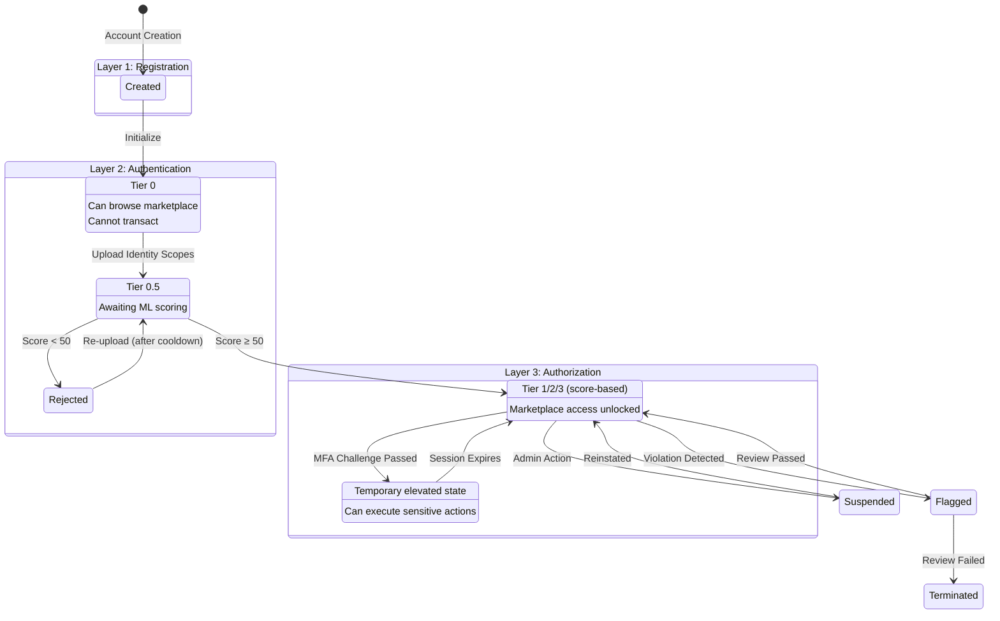

# VEID Flow Specification: Registration, Authentication, and Authorization

**Version:** 1.0.0  
**Date:** 2026-01-24  
**Status:** Authoritative Baseline  
**Task Reference:** VE-208

---

## Table of Contents

1. [Overview of VEID Three-Layer Model](#overview-of-veid-three-layer-model)
2. [Account State Machine](#account-state-machine)
3. [Account Tiers and Capabilities](#account-tiers-and-capabilities)
4. [VEID Score Thresholds](#veid-score-thresholds)
5. [Authorization-Sensitive Actions](#authorization-sensitive-actions)
6. [Capability Matrix](#capability-matrix)
7. [Integration with MFA Module](#integration-with-mfa-module)
8. [Integration with Marketplace](#integration-with-marketplace)
9. [Implementation Guidelines](#implementation-guidelines)
10. [References](#references)

---

## Overview of VEID Three-Layer Model

The VirtEngine Decentralized Identity (VEID) system implements a three-layer lifecycle model that progressively gates account capabilities based on identity verification status. This model ensures that users can begin interacting with the platform immediately while progressively unlocking capabilities as their identity trust level increases.

### The Three Layers

| Layer | Phase | Description | Transition Trigger |
|-------|-------|-------------|-------------------|
| **Layer 1** | Registration | Account creation with basic wallet setup | Account creation transaction |
| **Layer 2** | Authentication | Identity verification via VEID ML scoring | Identity scope upload + validator consensus |
| **Layer 3** | Authorization | Elevated privileges for sensitive actions | MFA challenge + policy satisfaction |

### Design Principles

1. **Progressive Trust**: Users unlock capabilities incrementally as trust increases
2. **Least Privilege**: Each tier only grants permissions necessary for that level
3. **Reversibility**: Authentication status can be re-evaluated; authorization is session-based
4. **Transparency**: Users can see exactly what actions their current state permits
5. **Fraud Prevention**: High-risk actions require multiple verification factors

### Role Applicability

This lifecycle applies across all VirtEngine roles, though specific thresholds and capabilities vary:

| Role | Registration | Authentication | Authorization |
|------|--------------|----------------|---------------|
| **GenesisAccount** | N/A (pre-genesis) | Pre-verified | All sensitive actions gated |
| **Administrator** | Standard | VEID ≥85 required | All admin actions gated |
| **Moderator** | Standard | VEID ≥70 required | Moderation actions gated |
| **Staker/Validator** | Standard | VEID ≥85 required | Validator ops gated |
| **ServiceProvider** | Standard | VEID ≥70 required | Provider ops gated |
| **Customer** | Standard | VEID ≥50 for marketplace | High-value orders gated |
| **SupportAgent** | Standard | VEID ≥70 required | Sensitive data access gated |

---

## Account State Machine

### Primary State Diagram

```
┌─────────────────────────────────────────────────────────────────────────────────────┐
│                           VEID ACCOUNT STATE MACHINE                                 │
└─────────────────────────────────────────────────────────────────────────────────────┘

                                 ┌──────────────────┐
                                 │     GENESIS      │
                                 │  (Pre-existing)  │
                                 └────────┬─────────┘
                                          │
                    ┌─────────────────────┴──────────────────────┐
                    │                                            │
                    ▼                                            ▼
            ┌───────────────┐                           ┌───────────────┐
            │    CREATED    │                           │ PRE-VERIFIED  │
            │  (Tier: None) │                           │ (GenesisAcct) │
            └───────┬───────┘                           └───────┬───────┘
                    │                                           │
                    │ Account init                              │
                    ▼                                           │
┌ ─ ─ ─ ─ ─ ─ ─ ─ ─ ─ ─ ─ ─ ─ ─ ─ ─ ─ ─ ─ ─ ─ ─ ─ ─ ─ ─ ─ ─ ┐ │
│           LAYER 1: REGISTRATION (Unverified)               │ │
│                                                             │ │
│   ┌───────────────────────────────────────────────────┐    │ │
│   │               UNVERIFIED (Tier 0)                  │    │ │
│   │  • Browse marketplace                              │    │ │
│   │  • View public offerings                           │    │ │
│   │  • Cannot place orders                             │    │ │
│   │  • Cannot access provider features                 │    │ │
│   └───────────────────────┬───────────────────────────┘    │ │
│                           │                                 │ │
└ ─ ─ ─ ─ ─ ─ ─ ─ ─ ─ ─ ─ ─│─ ─ ─ ─ ─ ─ ─ ─ ─ ─ ─ ─ ─ ─ ─ ─ ┘ │
                            │                                   │
                            │ Identity scope upload             │
                            ▼                                   │
┌ ─ ─ ─ ─ ─ ─ ─ ─ ─ ─ ─ ─ ─ ─ ─ ─ ─ ─ ─ ─ ─ ─ ─ ─ ─ ─ ─ ─ ─ ┐ │
│           LAYER 2: AUTHENTICATION (Verification)           │ │
│                                                             │ │
│   ┌───────────────────────────────────────────────────┐    │ │
│   │                 PENDING (Tier 0.5)                 │    │ │
│   │  • Identity scopes submitted                       │    │ │
│   │  • Awaiting validator ML scoring                   │    │ │
│   │  • Same permissions as UNVERIFIED                  │    │ │
│   └───────────────────────┬───────────────────────────┘    │ │
│                           │                                 │ │
│              ┌────────────┴────────────┐                   │ │
│              │ Validator Consensus     │                   │ │
│              ▼                         ▼                   │ │
│   ┌─────────────────┐       ┌─────────────────┐           │ │
│   │    REJECTED     │       │    VERIFIED     │◄──────────┼─┘
│   │   (Tier 0)      │       │  (Tier 1/2/3)   │           │
│   │                 │       │                 │           │
│   │ Score < 50      │       │ Score ≥ 50      │           │
│   │ • Can retry     │       │ • Score-gated   │           │
│   │ • Cooldown      │       │   capabilities  │           │
│   │   applies       │       │                 │           │
│   └────────┬────────┘       └────────┬────────┘           │
│            │                         │                     │
│            │ Re-upload               │                     │
│            │ (after cooldown)        │                     │
│            └────────►────────────────┘                     │
│                                                             │
└ ─ ─ ─ ─ ─ ─ ─ ─ ─ ─ ─ ─ ─ ─ ─ ─ ─ ─ ─ ─ ─ ─ ─ ─ ─ ─ ─ ─ ─ ┘
                                       │
                                       │ Initiate sensitive action
                                       ▼
┌ ─ ─ ─ ─ ─ ─ ─ ─ ─ ─ ─ ─ ─ ─ ─ ─ ─ ─ ─ ─ ─ ─ ─ ─ ─ ─ ─ ─ ─ ┐
│           LAYER 3: AUTHORIZATION (Elevated Access)         │
│                                                             │
│   ┌───────────────────────────────────────────────────┐    │
│   │              AUTHORIZED (Temporary)                │    │
│   │  • Session-based elevation (default: 15 min)      │    │
│   │  • MFA verified for current session               │    │
│   │  • Can execute sensitive transactions             │    │
│   │  • Auto-expires to VERIFIED state                 │    │
│   └───────────────────────┬───────────────────────────┘    │
│                           │                                 │
│                           │ Session timeout or logout       │
│                           ▼                                 │
│                    [Returns to VERIFIED]                    │
│                                                             │
└ ─ ─ ─ ─ ─ ─ ─ ─ ─ ─ ─ ─ ─ ─ ─ ─ ─ ─ ─ ─ ─ ─ ─ ─ ─ ─ ─ ─ ─ ┘
```

### Mermaid State Diagram



### State Definitions

| State | Layer | Tier | Description | Transitions Out |
|-------|-------|------|-------------|-----------------|
| **CREATED** | 0 | None | Wallet exists but not initialized | → UNVERIFIED |
| **UNVERIFIED** | 1 | 0 | Active account, no identity verification | → PENDING |
| **PENDING** | 2 | 0.5 | Identity scopes submitted, awaiting scoring | → VERIFIED, → REJECTED |
| **REJECTED** | 2 | 0 | Score below threshold, can retry | → PENDING |
| **VERIFIED** | 2 | 1-3 | Authenticated, score-gated capabilities | → AUTHORIZED, → SUSPENDED, → FLAGGED |
| **AUTHORIZED** | 3 | 1-3+ | Elevated session for sensitive actions | → VERIFIED (timeout) |
| **SUSPENDED** | N/A | N/A | Admin-suspended, no capabilities | → VERIFIED (reinstate) |
| **FLAGGED** | N/A | N/A | Under review for violations | → VERIFIED, → TERMINATED |
| **TERMINATED** | N/A | N/A | Permanently banned | None (terminal) |

---

## Account Tiers and Capabilities

### Tier Definitions

The VEID score (0-100) maps to discrete tiers that determine marketplace and platform capabilities:

| Tier | Name | Score Range | Description | Color Code |
|------|------|-------------|-------------|------------|
| **0** | Unverified | N/A (no score) | Not yet authenticated | Gray |
| **0.5** | Pending | N/A (scoring) | Verification in progress | Yellow |
| **1** | Basic | 50-69 | Minimal verified identity | Blue |
| **2** | Standard | 70-84 | Moderate identity confidence | Green |
| **3** | Premium | 85-100 | High identity confidence | Gold |

### Tier Elevation Requirements

| From Tier | To Tier | Requirements |
|-----------|---------|--------------|
| 0 → 1 | Basic | Upload identity scopes, score ≥50 |
| 1 → 2 | Standard | Additional scopes (e.g., address verification), score ≥70 |
| 2 → 3 | Premium | Video verification + additional proofs, score ≥85 |
| Any → Authorized | Elevated | MFA challenge success (session-based) |

### Identity Scope Types for Tier Advancement

| Scope Type | Weight | Required for Tier | Verification Method |
|------------|--------|-------------------|---------------------|
| **Government ID** | High | Tier 1+ | Document ML analysis |
| **Selfie (Live)** | High | Tier 1+ | Face match + liveness |
| **Email** | Low | Tier 0 (optional) | OTP verification |
| **Phone (SMS)** | Low | Tier 0 (optional) | OTP verification |
| **Address Proof** | Medium | Tier 2+ | Document analysis |
| **Video Interview** | High | Tier 3 | Liveness + human review |
| **Domain Ownership** | Medium | Provider requirement | DNS/TXT record |
| **Social Verification** | Low | Optional enhancement | OAuth + activity check |

---

## VEID Score Thresholds

### Score Calculation Factors

The VEID ML model computes a score from 0-100 based on:

| Factor | Weight | Description |
|--------|--------|-------------|
| **Document Authenticity** | 25% | Tamper detection, format validity |
| **Face Match Confidence** | 25% | ID photo ↔ selfie match score |
| **Liveness Detection** | 20% | Anti-spoof measures (blink, motion) |
| **Data Consistency** | 15% | Cross-field validation, age checks |
| **Historical Signals** | 10% | Prior verifications, account age |
| **Risk Indicators** | 5% | Known fraud patterns, device fingerprint |

### Score Threshold Table

| Threshold | Score | Meaning | Action |
|-----------|-------|---------|--------|
| **REJECT** | 0-49 | Insufficient identity confidence | Deny verification, allow retry |
| **BASIC_ACCESS** | 50 | Minimum for marketplace participation | Unlock Tier 1 capabilities |
| **STANDARD_ACCESS** | 70 | Provider eligibility threshold | Unlock Tier 2 capabilities |
| **PREMIUM_ACCESS** | 85 | Full platform access | Unlock Tier 3 capabilities |
| **BORDERLINE_LOW** | 45-54 | Near-threshold, uncertain | Secondary verification offered |
| **BORDERLINE_HIGH** | 65-74 | Near tier boundary | Additional scopes suggested |

### Score-to-Action Mapping

```
┌──────────────────────────────────────────────────────────────────────────────┐
│                        VEID SCORE ACTION THRESHOLDS                           │
├──────────────────────────────────────────────────────────────────────────────┤
│                                                                              │
│   0        25        50        70        85        100                       │
│   │─────────│─────────│─────────│─────────│─────────│                        │
│   │         │         │         │         │         │                        │
│   │ REJECT  │ REJECT  │  BASIC  │STANDARD │ PREMIUM │                        │
│   │         │         │ (Tier1) │ (Tier2) │ (Tier3) │                        │
│   │         │         │         │         │         │                        │
│   │◄────────┴─────────►◄────────►◄────────►◄────────►                        │
│   │  Cannot transact  │Browse + │ + Provider│+ High  │                        │
│   │  Browse only      │ Order   │ + Standard│ Value  │                        │
│   │                   │ (limited)│ Offerings │ + All  │                        │
│                                                                              │
│   Action Categories:                                                         │
│   ──────────────────                                                         │
│   [Browse Marketplace]  ────────────────────────────────────► (All tiers)   │
│   [View Public Data]    ────────────────────────────────────► (All tiers)   │
│   [Place Basic Orders]  ─────────────► Score ≥ 50                           │
│   [Place Standard Orders] ───────────────────► Score ≥ 70                   │
│   [Place Premium Orders]  ───────────────────────────► Score ≥ 85           │
│   [Provider Registration] ───────────────────► Score ≥ 70 + MFA             │
│   [Validator Registration] ──────────────────────────► Score ≥ 85 + MFA     │
│   [High-Value Withdrawal] ───────────────────────────► Score ≥ 70 + MFA     │
│   [Account Recovery]      ───────────────────────────► Any verified + MFA   │
│                                                                              │
└──────────────────────────────────────────────────────────────────────────────┘
```

### Minimum Score by Action Category

| Action Category | Minimum Score | Additional Requirements | Rationale |
|-----------------|---------------|------------------------|-----------|
| **Browse/View** | 0 (any) | None | Public data, no risk |
| **Basic Marketplace** | 50 | None | Low-value, limited exposure |
| **Standard Marketplace** | 70 | None | Moderate value offerings |
| **Premium Marketplace** | 85 | None | High-value, full access |
| **Provider Registration** | 70 | MFA (FIDO2) | Infrastructure trust |
| **Validator Registration** | 85 | MFA + Governance approval | Consensus integrity |
| **High-Value Transactions** | 70 | MFA | Financial protection |
| **Account Recovery** | 50+ (existing) | MFA (multiple factors) | Account security |
| **Administrative Actions** | 85 | MFA + Role assignment | Platform security |

---

## Authorization-Sensitive Actions

### Definition

**Authorization-sensitive actions** are operations that require temporary elevation beyond the standard authenticated (VERIFIED) state. These actions carry elevated risk and require explicit MFA verification within a time-limited session.

### Complete Sensitive Actions List

#### Critical Tier (Always Require Full MFA)

| Action | Minimum Score | Required MFA Factors | Session Validity |
|--------|---------------|---------------------|------------------|
| `AccountRecovery` | 50 (existing) | VEID + FIDO2 + SMS/Email | Single use |
| `KeyRotation` | 50 (existing) | VEID + FIDO2 + Current Key | Single use |
| `PrimaryEmailChange` | 50 | VEID + OTP (old email) + OTP (new email) | Single use |
| `PhoneNumberChange` | 50 | VEID + OTP (old phone) + OTP (new phone) | Single use |
| `TwoFactorDisable` | 50 | VEID + FIDO2 + TOTP | Single use |
| `AccountDeletion` | 50 | VEID + FIDO2 + SMS/Email | 48hr cooling-off |

#### High Tier (Require Strong MFA)

| Action | Minimum Score | Required MFA Factors | Session Validity |
|--------|---------------|---------------------|------------------|
| `ProviderRegistration` | 70 | VEID + FIDO2 | 15 minutes |
| `ValidatorRegistration` | 85 | VEID + FIDO2 + Gov approval | Single use |
| `LargeWithdrawal` (>10,000 VE) | 70 | VEID + FIDO2 | 15 minutes |
| `GovernanceProposalCreate` | 70 | VEID + FIDO2 | 15 minutes |
| `GovernanceVote` (high stake) | 70 | FIDO2 | 30 minutes |
| `OfferingCreate` (first) | 70 | VEID + FIDO2 | 15 minutes |
| `AdminRoleAssignment` | 85 | VEID + FIDO2 | Single use |

#### Medium Tier (Require Standard MFA)

| Action | Minimum Score | Required MFA Factors | Session Validity |
|--------|---------------|---------------------|------------------|
| `HighValueOrder` (>1,000 VE) | 70 | VEID + FIDO2 | 30 minutes |
| `FirstOrderPlacement` | 50 | VEID | 30 minutes |
| `TransferToNewAddress` | 50 | FIDO2 | 15 minutes |
| `MediumWithdrawal` (1,000-10,000 VE) | 50 | FIDO2 | 15 minutes |
| `APIKeyGeneration` | 50 | TOTP or FIDO2 | 15 minutes |
| `WebhookConfiguration` | 70 | FIDO2 | 15 minutes |

#### Low Tier (Single Factor or Context-Based)

| Action | Minimum Score | Required MFA Factors | Session Validity |
|--------|---------------|---------------------|------------------|
| `OrderCreate` (standard) | 50 | None (or TOTP if user-configured) | N/A |
| `TransferToKnownAddress` | 50 | None (or as configured) | N/A |
| `OfferingUpdate` | 70 | None (or as configured) | N/A |
| `SupportTicketCreate` | 0 | None | N/A |
| `ProfileUpdate` (non-sensitive) | 0 | None | N/A |

### Sensitive Action Decision Flow

```
┌─────────────────────────────────────────────────────────────────────────────┐
│                    AUTHORIZATION DECISION FLOW                               │
└─────────────────────────────────────────────────────────────────────────────┘

                         ┌─────────────────┐
                         │ Action Request  │
                         └────────┬────────┘
                                  │
                                  ▼
                    ┌─────────────────────────┐
                    │ Is action sensitive?    │
                    └───────────┬─────────────┘
                                │
                   ┌────────────┴────────────┐
                   │                         │
                   ▼ No                      ▼ Yes
          ┌───────────────┐        ┌───────────────────┐
          │ Check score   │        │ Check score       │
          │ threshold     │        │ threshold         │
          └───────┬───────┘        └─────────┬─────────┘
                  │                          │
        ┌─────────┴─────────┐      ┌─────────┴─────────┐
        │                   │      │                   │
        ▼ Pass              ▼ Fail ▼ Pass              ▼ Fail
   ┌─────────┐        ┌─────────┐ │              ┌─────────┐
   │ EXECUTE │        │  DENY   │ │              │  DENY   │
   └─────────┘        │ (upgrade│ │              │ (upgrade│
                      │ identity)│ │              │ identity)│
                      └─────────┘ │              └─────────┘
                                  │
                                  ▼
                    ┌─────────────────────────┐
                    │ Valid authorized        │
                    │ session exists?         │
                    └───────────┬─────────────┘
                                │
                   ┌────────────┴────────────┐
                   │                         │
                   ▼ Yes                     ▼ No
          ┌───────────────┐        ┌───────────────────┐
          │ Session       │        │ Initiate MFA      │
          │ valid for     │        │ challenge         │
          │ this action?  │        └─────────┬─────────┘
          └───────┬───────┘                  │
                  │                          ▼
        ┌─────────┴─────────┐      ┌───────────────────┐
        │                   │      │ User completes    │
        ▼ Yes               ▼ No   │ MFA factors       │
   ┌─────────┐       ┌───────────┐ └─────────┬─────────┘
   │ EXECUTE │       │ Escalate  │           │
   └─────────┘       │ MFA level │  ┌────────┴────────┐
                     └─────┬─────┘  │                 │
                           │        ▼ Success         ▼ Failure
                           │   ┌─────────────┐  ┌─────────┐
                           └──►│ Create auth │  │  DENY   │
                               │ session     │  │ (retry) │
                               └──────┬──────┘  └─────────┘
                                      │
                                      ▼
                                 ┌─────────┐
                                 │ EXECUTE │
                                 └─────────┘
```

---

## Capability Matrix

### Full Capability Matrix by Tier

| Capability | Tier 0 (Unverified) | Tier 0.5 (Pending) | Tier 1 (Basic) | Tier 2 (Standard) | Tier 3 (Premium) | Authorized State |
|------------|---------------------|-------------------|----------------|-------------------|------------------|------------------|
| **Marketplace - Browse** | ✅ | ✅ | ✅ | ✅ | ✅ | ✅ |
| **Marketplace - View Offerings** | ✅ Public only | ✅ Public only | ✅ Basic | ✅ Standard | ✅ All | ✅ All |
| **Marketplace - Place Order** | ❌ | ❌ | ✅ ≤$500 | ✅ ≤$10K | ✅ Unlimited | ✅ High-value |
| **Marketplace - Bid on Orders** | ❌ | ❌ | ❌ | ✅ | ✅ | ✅ |
| **Provider - Register** | ❌ | ❌ | ❌ | ⚡ MFA | ⚡ MFA | ✅ |
| **Provider - Create Offering** | ❌ | ❌ | ❌ | ⚡ First requires MFA | ✅ | ✅ |
| **Provider - Receive Payments** | ❌ | ❌ | ❌ | ✅ | ✅ | ✅ |
| **Staking - Stake Tokens** | ❌ | ❌ | ✅ Limited | ✅ | ✅ | ✅ |
| **Staking - Become Validator** | ❌ | ❌ | ❌ | ❌ | ⚡ MFA + Gov | ✅ |
| **Governance - View Proposals** | ✅ | ✅ | ✅ | ✅ | ✅ | ✅ |
| **Governance - Vote** | ❌ | ❌ | ✅ | ✅ | ✅ | ✅ |
| **Governance - Create Proposal** | ❌ | ❌ | ❌ | ⚡ MFA | ⚡ MFA | ✅ |
| **Wallet - View Balance** | ✅ | ✅ | ✅ | ✅ | ✅ | ✅ |
| **Wallet - Receive** | ✅ | ✅ | ✅ | ✅ | ✅ | ✅ |
| **Wallet - Transfer** | ❌ | ❌ | ✅ ≤$100 | ✅ ≤$5K | ✅ Unlimited | ✅ High-value |
| **Wallet - Withdraw** | ❌ | ❌ | ✅ ≤$100 | ⚡ MFA >$1K | ⚡ MFA >$10K | ✅ |
| **Account - Update Profile** | ✅ Non-sensitive | ✅ Non-sensitive | ✅ | ✅ | ✅ | ✅ |
| **Account - Change Email** | ❌ | ❌ | ⚡ MFA | ⚡ MFA | ⚡ MFA | ✅ |
| **Account - Key Rotation** | ❌ | ❌ | ⚡ Full MFA | ⚡ Full MFA | ⚡ Full MFA | ✅ |
| **Account - Recovery** | ❌ | ❌ | ⚡ Full MFA | ⚡ Full MFA | ⚡ Full MFA | ✅ |
| **Support - Create Ticket** | ✅ | ✅ | ✅ | ✅ | ✅ | ✅ |
| **Support - View Own Tickets** | ✅ | ✅ | ✅ | ✅ | ✅ | ✅ |

**Legend:**
- ✅ = Allowed
- ❌ = Not allowed
- ⚡ = Requires MFA (Authorization)
- ≤$X = Value limit applies

### Provider-Specific Capabilities

| Capability | Tier 2 (Minimum) | Tier 3 (Premium) | With Authorization |
|------------|------------------|------------------|-------------------|
| Register as Provider | ⚡ Required | ⚡ Required | ✅ After MFA |
| Create Offerings | ⚡ First offering | ✅ | ✅ |
| Update Offerings | ✅ | ✅ | ✅ |
| Delete Offerings | ⚡ | ⚡ | ✅ |
| View Incoming Orders | ✅ | ✅ | ✅ |
| Submit Bids | ✅ | ✅ | ✅ |
| Manage Leases | ✅ | ✅ | ✅ |
| Report Usage | ✅ | ✅ | ✅ |
| Withdraw Earnings | ⚡ >$1K | ⚡ >$10K | ✅ |
| Update Provider Profile | ✅ | ✅ | ✅ |
| Configure Webhooks | ⚡ | ⚡ | ✅ |

### Customer-Specific Capabilities

| Capability | Tier 1 (Basic) | Tier 2 (Standard) | Tier 3 (Premium) |
|------------|----------------|-------------------|------------------|
| Browse All Offerings | ❌ Basic only | ✅ Standard tier | ✅ All offerings |
| Order Value Limit | $500/order | $10,000/order | Unlimited |
| Order Volume | 5/day | 25/day | Unlimited |
| Access Private Offerings | ❌ | ⚡ If invited | ✅ If invited |
| Request Custom Quotes | ❌ | ✅ | ✅ |
| Priority Support | ❌ | ✅ | ✅ |
| Dispute Resolution | Standard | Priority | Dedicated |

---

## Integration with MFA Module

### MFA Challenge Flow for Authorization

```
┌─────────────────────────────────────────────────────────────────────────────┐
│                    MFA AUTHORIZATION INTEGRATION                             │
└─────────────────────────────────────────────────────────────────────────────┘

  ┌─────────────┐     ┌─────────────┐     ┌─────────────┐     ┌─────────────┐
  │   Client    │     │   VEID      │     │    MFA      │     │   Target    │
  │   Request   │     │   Module    │     │   Module    │     │   Module    │
  └──────┬──────┘     └──────┬──────┘     └──────┬──────┘     └──────┬──────┘
         │                   │                   │                   │
         │ 1. Sensitive      │                   │                   │
         │    action request │                   │                   │
         │──────────────────►│                   │                   │
         │                   │                   │                   │
         │                   │ 2. Check current  │                   │
         │                   │    score + tier   │                   │
         │                   │───────────────────│                   │
         │                   │                   │                   │
         │                   │ 3. Determine MFA  │                   │
         │                   │    requirements   │                   │
         │                   │──────────────────►│                   │
         │                   │                   │                   │
         │                   │                   │ 4. Return required│
         │                   │◄──────────────────│    factors list  │
         │                   │                   │                   │
         │ 5. Challenge      │                   │                   │
         │    response       │                   │                   │
         │◄──────────────────│                   │                   │
         │                   │                   │                   │
         │ 6. User provides  │                   │                   │
         │    MFA factors    │                   │                   │
         │──────────────────────────────────────►│                   │
         │                   │                   │                   │
         │                   │                   │ 7. Verify factors │
         │                   │                   │    + create session│
         │                   │                   │───────────────────│
         │                   │                   │                   │
         │                   │                   │ 8. Authorization  │
         │                   │                   │    token granted  │
         │◄──────────────────────────────────────│                   │
         │                   │                   │                   │
         │ 9. Execute with   │                   │                   │
         │    auth token     │                   │                   │
         │─────────────────────────────────────────────────────────►│
         │                   │                   │                   │
         │                   │                   │ 10. Validate      │
         │                   │                   │◄────────────────── │
         │                   │                   │                   │
         │                   │                   │ 11. Confirm valid │
         │                   │                   │────────────────────►
         │                   │                   │                   │
         │ 12. Action result │                   │                   │
         │◄─────────────────────────────────────────────────────────│
         │                   │                   │                   │
```

### MFA Factor Requirements by Scenario

| Scenario | VEID Score Check | FIDO2 | TOTP | SMS/Email | Additional |
|----------|------------------|-------|------|-----------|------------|
| Account Recovery | ≥50 (existing) | ✅ | - | ✅ | Existing key sig |
| Key Rotation | ≥50 (existing) | ✅ | - | - | Existing key sig |
| Provider Registration | ≥70 | ✅ | - | - | - |
| Validator Registration | ≥85 | ✅ | - | - | Gov approval |
| Large Withdrawal | ≥70 | ✅ | - | - | - |
| High-Value Order | ≥70 | ✅ | - | - | - |
| First Order | ≥50 | - | ✅ | - | Optional VEID |
| Email Change | ≥50 | - | ✅ | ✅ (both) | - |

### Session Management

```go
// AuthorizationSession represents a temporary elevated permission state
type AuthorizationSession struct {
    SessionID     string        // Unique session identifier
    AccountAddr   string        // Account address
    GrantedAt     time.Time     // When authorization was granted
    ExpiresAt     time.Time     // When session expires
    Scope         []string      // Permitted action types
    FactorsUsed   []FactorType  // MFA factors verified
    BindingHash   []byte        // Device/context binding
    SingleUse     bool          // If true, consumed after first use
    UsedAt        *time.Time    // When used (if single-use)
}

// Session durations by authorization level
const (
    SessionDurationCritical  = 0               // Single use
    SessionDurationHigh      = 15 * time.Minute
    SessionDurationMedium    = 30 * time.Minute
    SessionDurationLow       = 60 * time.Minute
)
```

---

## Integration with Marketplace

### Order Placement Flow with VEID Gating

```
┌─────────────────────────────────────────────────────────────────────────────┐
│                 MARKETPLACE ORDER WITH VEID GATING                           │
└─────────────────────────────────────────────────────────────────────────────┘

Customer                 Market Module              VEID Module              MFA Module
    │                         │                         │                        │
    │ 1. CreateOrder          │                         │                        │
    │    (offering_id,        │                         │                        │
    │     encrypted_config)   │                         │                        │
    │────────────────────────►│                         │                        │
    │                         │                         │                        │
    │                         │ 2. GetAccountTier       │                        │
    │                         │────────────────────────►│                        │
    │                         │                         │                        │
    │                         │ 3. Returns:             │                        │
    │                         │    tier=2, score=75     │                        │
    │                         │◄────────────────────────│                        │
    │                         │                         │                        │
    │                         │ 4. GetOfferingTierReq   │                        │
    │                         │    (offering requires   │                        │
    │                         │     tier >= 2)          │                        │
    │                         │                         │                        │
    │                         │ 5. Value check:         │                        │
    │                         │    order = $5000        │                        │
    │                         │    tier2 limit = $10K   │                        │
    │                         │    ✓ PASS               │                        │
    │                         │                         │                        │
    │                         │ 6. MFA check:           │                        │
    │                         │    $5000 > $1000        │                        │
    │                         │    → MFA required       │                        │
    │                         │─────────────────────────────────────────────────►│
    │                         │                         │                        │
    │ 7. MFA Challenge        │                         │                        │
    │◄────────────────────────────────────────────────────────────────────────────│
    │                         │                         │                        │
    │ 8. Complete MFA         │                         │                        │
    │────────────────────────────────────────────────────────────────────────────►│
    │                         │                         │                        │
    │                         │ 9. MFA verified         │                        │
    │                         │◄─────────────────────────────────────────────────│
    │                         │                         │                        │
    │                         │ 10. Create order        │                        │
    │                         │     in state OPEN       │                        │
    │                         │                         │                        │
    │ 11. Order confirmed     │                         │                        │
    │◄────────────────────────│                         │                        │
    │                         │                         │                        │
```

### Offering Tier Requirements

Providers can specify minimum tier requirements for their offerings:

```protobuf
message Offering {
  string offering_id = 1;
  string provider = 2;
  
  // VEID gating
  uint32 min_customer_tier = 3;     // 0-3
  uint32 min_customer_score = 4;    // 0-100 (more granular)
  bool require_mfa_for_order = 5;   // Provider can require MFA
  
  // Value thresholds
  uint64 value = 6;                 // Offering value in tokens
  
  EncryptedEnvelope config = 7;
}
```

### Marketplace Access Rules

| Offering Type | Min Customer Tier | Min Score | MFA Required | Additional Checks |
|---------------|-------------------|-----------|--------------|-------------------|
| **Public Basic** | 1 | 50 | No | None |
| **Public Standard** | 2 | 70 | Optional | None |
| **Public Premium** | 3 | 85 | Optional | None |
| **Private/Invite** | 2+ | 70+ | Yes | Invite verification |
| **High-Value** (>$10K) | 3 | 85 | Yes | Escrow verification |
| **Regulatory-Gated** | 3 | 85 | Yes | Jurisdiction check |

---

## Implementation Guidelines

### State Storage

```go
// AccountVEIDState stored on-chain per account
type AccountVEIDState struct {
    Address          sdk.AccAddress `json:"address"`
    RegistrationTime time.Time      `json:"registration_time"`
    
    // Layer 2: Authentication
    VerificationStatus  VerificationStatus `json:"verification_status"`
    CurrentScore        uint32             `json:"current_score"`        // 0-100
    CurrentTier         AccountTier        `json:"current_tier"`         // 0-3
    LastScoreUpdate     time.Time          `json:"last_score_update"`
    ScopeRefs           []ScopeRef         `json:"scope_refs"`
    
    // Layer 3: Authorization (session info stored separately)
    LastAuthorizationTime *time.Time `json:"last_authorization_time,omitempty"`
    
    // Metadata
    RejectionCount   uint32    `json:"rejection_count"`
    LastRejection    time.Time `json:"last_rejection,omitempty"`
    CooldownUntil    time.Time `json:"cooldown_until,omitempty"`
}

type VerificationStatus int
const (
    StatusUnverified VerificationStatus = iota
    StatusPending
    StatusVerified
    StatusRejected
    StatusSuspended
    StatusFlagged
    StatusTerminated
)

type AccountTier int
const (
    TierUnverified AccountTier = 0
    TierBasic      AccountTier = 1
    TierStandard   AccountTier = 2
    TierPremium    AccountTier = 3
)
```

### Keeper Interface

```go
// VEIDKeeper interface for cross-module queries
type VEIDKeeper interface {
    // Layer 1: Registration
    IsAccountRegistered(ctx sdk.Context, addr sdk.AccAddress) bool
    
    // Layer 2: Authentication
    GetVerificationStatus(ctx sdk.Context, addr sdk.AccAddress) VerificationStatus
    GetAccountTier(ctx sdk.Context, addr sdk.AccAddress) AccountTier
    GetAccountScore(ctx sdk.Context, addr sdk.AccAddress) (uint32, error)
    MeetsScoreThreshold(ctx sdk.Context, addr sdk.AccAddress, threshold uint32) bool
    
    // Layer 3: Authorization
    HasValidAuthSession(ctx sdk.Context, addr sdk.AccAddress, action string) bool
    CreateAuthSession(ctx sdk.Context, addr sdk.AccAddress, scope []string, duration time.Duration) error
    ConsumeAuthSession(ctx sdk.Context, addr sdk.AccAddress, action string) error
}

// MFAKeeper interface for authorization
type MFAKeeper interface {
    GetRequiredFactors(ctx sdk.Context, addr sdk.AccAddress, action string) []FactorType
    InitiateChallenge(ctx sdk.Context, addr sdk.AccAddress, factors []FactorType) (ChallengeID, error)
    VerifyChallenge(ctx sdk.Context, challengeID ChallengeID, responses []FactorResponse) error
}
```

### Ante Handler Integration

```go
// VEIDDecorator checks VEID requirements before tx execution
type VEIDDecorator struct {
    veidKeeper VEIDKeeper
    mfaKeeper  MFAKeeper
}

func (d VEIDDecorator) AnteHandle(ctx sdk.Context, tx sdk.Tx, simulate bool, next sdk.AnteHandler) (sdk.Context, error) {
    for _, msg := range tx.GetMsgs() {
        // Get required tier/score for this message type
        requirement := GetMessageRequirement(msg)
        
        signers := msg.GetSigners()
        for _, signer := range signers {
            // Check tier
            tier := d.veidKeeper.GetAccountTier(ctx, signer)
            if tier < requirement.MinTier {
                return ctx, ErrInsufficientTier
            }
            
            // Check score (more granular)
            if requirement.MinScore > 0 {
                if !d.veidKeeper.MeetsScoreThreshold(ctx, signer, requirement.MinScore) {
                    return ctx, ErrInsufficientScore
                }
            }
            
            // Check authorization if action is sensitive
            if requirement.RequireAuthorization {
                if !d.veidKeeper.HasValidAuthSession(ctx, signer, requirement.ActionType) {
                    return ctx, ErrAuthorizationRequired
                }
                // Consume if single-use
                if requirement.SingleUse {
                    d.veidKeeper.ConsumeAuthSession(ctx, signer, requirement.ActionType)
                }
            }
        }
    }
    
    return next(ctx, tx, simulate)
}
```

### Events

```go
// Events emitted by VEID module
const (
    EventTypeVerificationSubmitted = "veid_verification_submitted"
    EventTypeVerificationCompleted = "veid_verification_completed"
    EventTypeTierChanged           = "veid_tier_changed"
    EventTypeAuthorizationGranted  = "veid_authorization_granted"
    EventTypeAuthorizationConsumed = "veid_authorization_consumed"
    EventTypeAuthorizationExpired  = "veid_authorization_expired"
)

// Attributes
const (
    AttributeKeyAccount     = "account"
    AttributeKeyOldTier     = "old_tier"
    AttributeKeyNewTier     = "new_tier"
    AttributeKeyScore       = "score"
    AttributeKeySessionID   = "session_id"
    AttributeKeyAction      = "action"
    AttributeKeyFactorsUsed = "factors_used"
)
```

---

## References

- [VirtEngine Architecture](./architecture.md)
- [Threat Model](./threat-model.md)
- [Data Classification](./data-classification.md)
- [MFA Module Design](./architecture.md#sensitive-transactions-mfa-gated)
- [Role Model](./architecture.md#role-model-and-access-control)

---

*Document maintained by VirtEngine Architecture Team*  
*Last updated: 2026-01-24*
