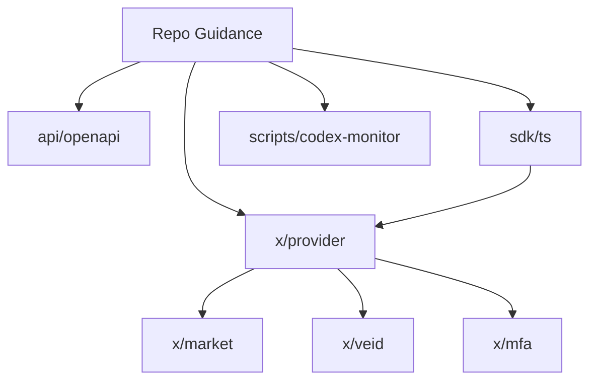

# AGENTS Index

This index lists every AGENTS.md file in the repo and highlights how modules relate.

## AGENTS.md Files

| Area | Path | Description |
| --- | --- | --- |
| Repo overview | [AGENTS.md](../AGENTS.md) | Root guidance, AGENTS system overview, and repo-wide expectations. |
| API specs | [api/AGENTS.md](../api/AGENTS.md) | OpenAPI specifications for chain and portal APIs. |
| Provider module | [x/provider/AGENTS.md](../x/provider/AGENTS.md) | On-chain provider lifecycle, domain verification, and keys. |
| Chain SDK (TS) | [sdk/ts/AGENTS.md](../sdk/ts/AGENTS.md) | TypeScript SDK for chain and provider clients. |
| Codex monitor | [scripts/codex-monitor/AGENTS.md](../scripts/codex-monitor/AGENTS.md) | Multi-agent orchestration supervisor and tooling. |

## Dependency Graph

## Quick Links for Common Tasks
- Update template: [docs/templates/AGENTS.template.md](templates/AGENTS.template.md)
- Review standards: [docs/AGENTS_STANDARDS.md](AGENTS_STANDARDS.md)
- Validate docs: `node scripts/validate-agents-docs.mjs`
