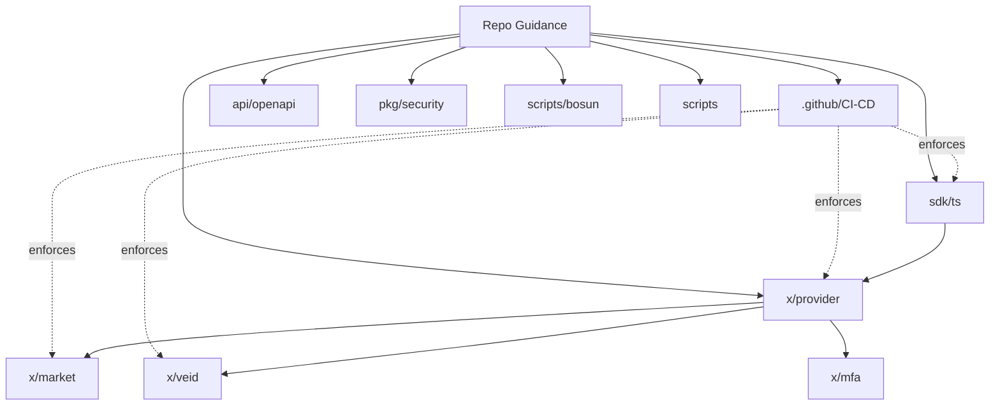

# AGENTS Index

This index lists every AGENTS.md file in the repo and highlights how modules relate.

## AGENTS.md Files

| Area | Path | Description |
| --- | --- | --- |
| Repo overview | [AGENTS.md](../AGENTS.md) (line 1) | Root guidance, AGENTS system overview, and repo-wide expectations. |
| Internal docs | [_docs/AGENTS.md](../_docs/AGENTS.md) (line 1) | Internal-only documentation rules, naming, and index location. |
| CI/CD Pipeline | [.github/AGENTS.md](../.github/AGENTS.md) (line 1) | GitHub Actions workflows, testing pipelines, release automation, and troubleshooting. |
| API specs | [api/AGENTS.md](../api/AGENTS.md) (line 1) | OpenAPI specifications for chain and portal APIs. |
| Security utilities | [pkg/security/AGENTS.md](../pkg/security/AGENTS.md) (line 1) | Shared security helpers for command validation, path safety, TLS defaults, and crypto-safe randomness. |
| Provider module | [x/provider/AGENTS.md](../x/provider/AGENTS.md) (line 1) | On-chain provider lifecycle, domain verification, and keys. |
| Chain SDK (TS) | [sdk/ts/AGENTS.md](../sdk/ts/AGENTS.md) (line 1) | TypeScript SDK for chain and provider clients. |
| Bosun | [scripts/bosun/AGENTS.md](../scripts/bosun/AGENTS.md) (line 1) | Multi-agent orchestration supervisor and tooling. |
| Bosun desktop | [scripts/bosun/desktop/AGENTS.md](../scripts/bosun/desktop/AGENTS.md) (line 1) | Desktop portal shell and packaging pipeline. |
| Bosun shim | [scripts/bosun/AGENTS.md](../scripts/bosun/AGENTS.md) (line 1) | Legacy npm shim that forwards `bosun` commands to bosun. |
| Codex monitor | [scripts/codex-monitor/AGENTS.md](../scripts/codex-monitor/AGENTS.md) (line 1) | Codex monitoring CLI and reporting utilities. |
| Scripts | [scripts/AGENTS.md](../scripts/AGENTS.md) (line 1) | Operational scripts, automation, and developer utilities. |

## Dependency Graph

```mermaid
flowchart TD
  Root[Repo Guidance]
  CI[.github/CI-CD]
  API[api/openapi]
  Security[pkg/security]
  Provider[x/provider]
  SDK[sdk/ts]
  Monitor[scripts/bosun]
  Scripts[scripts]
  Market[x/market]
  VEID[x/veid]
  MFA[x/mfa]

  Root --> CI
  Root --> API
  Root --> Security
  Root --> Provider
  Root --> SDK
  Root --> Monitor
  Root --> Scripts

  CI -.enforces.-> Provider
  CI -.enforces.-> SDK
  CI -.enforces.-> Market
  CI -.enforces.-> VEID

  Provider --> Market
  Provider --> VEID
  Provider --> MFA
  SDK --> Provider
```

## Quick Links for Common Tasks
- Update template: [docs/templates/AGENTS.template.md](templates/AGENTS.template.md) (line 1)
- Review standards: [docs/AGENTS_STANDARDS.md](AGENTS_STANDARDS.md) (line 1)
- Validate docs: `node scripts/validate-agents-docs.mjs` (`scripts/validate-agents-docs.mjs:1`)

### CI/CD Quick Links
- **CI/CD Guide**: [.github/AGENTS.md](../.github/AGENTS.md) (line 1)
- **Release Process**: [RELEASE.md](../RELEASE.md) (line 1) - Branching strategy, versioning, automation
- **Network Launch Schedule**: [docs/NETWORK_LAUNCH_SCHEDULE.md](NETWORK_LAUNCH_SCHEDULE.md) (line 1) - TestNet/MainNet windows, environment boundary, and promotion criteria
- **Troubleshooting**: [ci-troubleshooting.md](../_docs/operations/ci-troubleshooting.md) (line 1) - Common workflow issues
- **Workflow Files**: [.github/workflows/](../.github/workflows/) - 32+ GitHub Actions workflows
