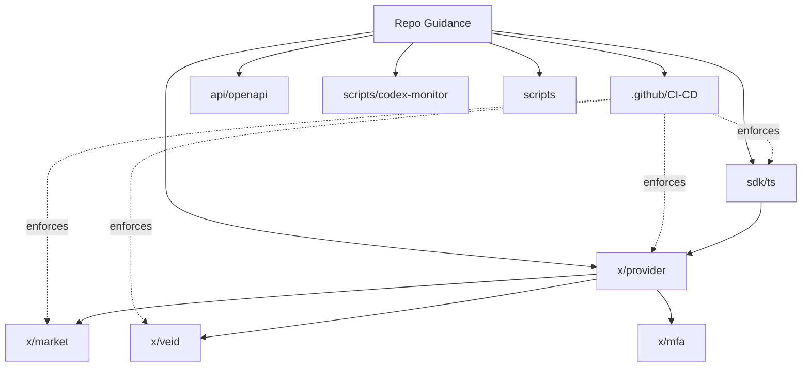

# AGENTS Index

This index lists every AGENTS.md file in the repo and highlights how modules relate.

## AGENTS.md Files

| Area | Path | Description |
| --- | --- | --- |
| Repo overview | [AGENTS.md](../AGENTS.md) (line 1) | Root guidance, AGENTS system overview, and repo-wide expectations. |
| CI/CD Pipeline | [.github/AGENTS.md](../.github/AGENTS.md) (line 1) | GitHub Actions workflows, testing pipelines, release automation, and troubleshooting. |
| API specs | [api/AGENTS.md](../api/AGENTS.md) (line 1) | OpenAPI specifications for chain and portal APIs. |
| Provider module | [x/provider/AGENTS.md](../x/provider/AGENTS.md) (line 1) | On-chain provider lifecycle, domain verification, and keys. |
| Chain SDK (TS) | [sdk/ts/AGENTS.md](../sdk/ts/AGENTS.md) (line 1) | TypeScript SDK for chain and provider clients. |
| Codex monitor | [scripts/codex-monitor/AGENTS.md](../scripts/codex-monitor/AGENTS.md) (line 1) | Multi-agent orchestration supervisor and tooling. |
| Scripts | [scripts/AGENTS.md](../scripts/AGENTS.md) (line 1) | Operational scripts, automation, and developer utilities. |

## Dependency Graph

## Quick Links for Common Tasks
- Update template: [docs/templates/AGENTS.template.md](templates/AGENTS.template.md) (line 1)
- Review standards: [docs/AGENTS_STANDARDS.md](AGENTS_STANDARDS.md) (line 1)
- Validate docs: `node scripts/validate-agents-docs.mjs` (`scripts/validate-agents-docs.mjs:1`)

### CI/CD Quick Links
- **CI/CD Guide**: [.github/AGENTS.md](../.github/AGENTS.md) (line 1)
- **Release Process**: [RELEASE.md](../RELEASE.md) (line 1) - Branching strategy, versioning, automation
- **Troubleshooting**: [ci-troubleshooting.md](../_docs/operations/ci-troubleshooting.md) (line 1) - Common workflow issues
- **Workflow Files**: [.github/workflows/](../.github/workflows/) - 32+ GitHub Actions workflows
