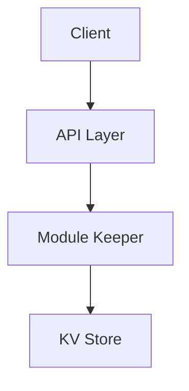

# AGENTS.md Template

Use this template for all module-level AGENTS.md files. Replace placeholder text in brackets.

## Required Sections
- Module Overview
- Architecture
- Core Concepts
- Usage Examples
- Implementation Patterns
- Configuration
- Testing
- Troubleshooting

## Optional Sections
- API Reference
- Dependencies & Environment
- Security Considerations
- Glossary

## Formatting Guidelines
- Headings use `##` for top-level sections.
- Use bullet lists for key points.
- Use short paragraphs (2-4 sentences).
- Include code references as `path/to/file.ext:line`.
- Keep examples runnable or clearly marked as pseudo-code.

## Code Reference Format
- Use repo-relative paths with line numbers.
- Example: `x/provider/keeper/keeper.go:48`
- If a file moves, update the reference in the same PR.

## Template

# [Module Name] — AGENTS Guide

## Module Overview
- Purpose: [What the module does and why it exists.]
- Use when: [When engineers should touch this module.]
- Key entry points: [List important files, e.g., `path/file.go:123`].

## Architecture
- Entry points and data flow overview.
- Directory layout: [List key folders].



## Core Concepts
- [Domain models or invariants.]
- [State machine rules, key types, or security constraints.]

## Usage Examples

### [Scenario title]
```bash
# Example command or pseudo-steps
```

### [Scenario title]
```go
// Example snippet
```

## Implementation Patterns
- [How to extend the module.]
- [Where to add new handlers, keepers, or services.]
- Anti-patterns:
  - [What to avoid and why.]

## Configuration
- [Module parameters, env vars, or runtime flags.]
- [Default values and where they live.]

## Testing
- Unit tests: [Paths to tests.]
- Suggested commands:
  - [e.g., `go test ./x/module/... -count=1`]

## Troubleshooting
- [Common error or failure]
  - Cause: [Likely root cause]
  - Fix: [Resolution steps]

## Optional: API Reference
- [Public APIs, interfaces, or exported symbols.]

## Optional: Dependencies & Environment
- [External services or version requirements.]

## Optional: Security Considerations
- [Sensitive data handling and auth requirements.]

## Optional: Glossary
- [Define acronyms or domain terms.]
