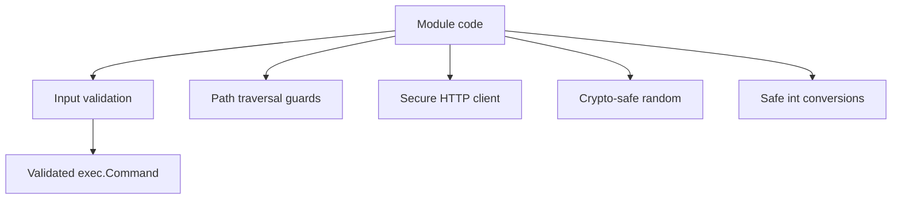

# Security Utilities — AGENTS Guide

## Module Overview
- Purpose: Provide shared security utilities for command execution validation, path traversal prevention, integer overflow checks, secure randomness, and hardened HTTP clients.
- Use when: Adding any new file access, external command execution, or cryptography-adjacent utility that needs standardized safeguards.
- Key entry points: `pkg/security/validation.go:60`, `pkg/security/command_validator.go:22`, `pkg/security/filepath_validator.go:20`, `pkg/security/httpclient.go:11`, `pkg/security/random.go:17`, `pkg/security/intconv.go:15`, `pkg/security/permissions.go:10`.

## Architecture
- Entry points expose focused helpers (validators, builders, and secure defaults) that can be imported by on-chain/off-chain modules.
- Directory layout: core helpers in `pkg/security/*.go` with package-level tests in `pkg/security/*_test.go`.



## Core Concepts
- Command execution is allowlist-driven; executable paths must match trusted lists before invocation.
- Path access is validated against traversal patterns and allowed directories/extensions.
- All randomness for security-sensitive use is derived from `crypto/rand`.
- Integer conversions must be overflow-safe when crossing architecture boundaries.

## Usage Examples

### Validate an executable and run a command
```go
validator := security.NewCommandValidator([]string{"ansible-playbook"}, 30*time.Second)
cmd, err := validator.SafeCommand(ctx, "ansible-playbook", "--version")
```

### Create a secure HTTP client
```go
client := security.NewSecureHTTPClient()
resp, err := client.Get("https://api.example.com/data")
```

## Implementation Patterns
- Prefer allowlist-based validation via `ValidateExecutable` and `CommandValidator` for any `exec.Command` usage (`pkg/security/validation.go:204`).
- Use `PathValidator` or `SafeReadFile` helpers when paths originate from user input (`pkg/security/filepath_validator.go:64`).
- For integer conversion between SDK math types and native types, use `SafeInt64`/`SafeUint64` (`pkg/security/intconv.go:15`).
- Anti-patterns:
  - Direct `exec.Command` without validation or allowlists.
  - `math/rand` for tokens, secrets, or IDs.

## Configuration
- Trusted executable allowlists live in `TrustedExecutables` (`pkg/security/validation.go:60`).
- Path validator options can enable absolute path requirements or extension allowlists (`pkg/security/filepath_validator.go:28`).
- HTTP client settings are controlled via `HTTPClientConfig` and options (`pkg/security/httpclient.go:11`).

## Testing
- Unit tests: `pkg/security/command_test.go`, `pkg/security/random_test.go`, `pkg/security/validation_test.go`.
- Suggested commands:
  - `go test ./pkg/security -count=1`

## Troubleshooting
- Validation rejects a path:
  - Cause: path includes traversal sequence or not under allowed directory.
  - Fix: clean the input and extend `allowedDirs` as needed (`pkg/security/filepath_validator.go:64`).

## Optional: Security Considerations
- Keep allowlists explicit; avoid wildcarding executable paths.
- Use `NewSecureHTTPClient` instead of `http.DefaultClient` for outbound calls.
