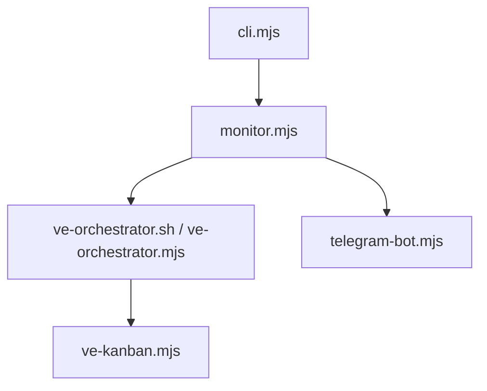

# Codex-Monitor — AGENTS Guide

## Module Overview

- Purpose: codex-monitor supervises VirtEngine's autonomous coding fleet. It schedules task attempts, runs PR automation, self-heals failures, and reports status via Telegram.
- Use when: updating task orchestration, executor routing, VK API usage, or notification pipelines.
- Key entry points:
  - CLI launcher: `scripts/codex-monitor/cli.mjs:1`
  - Supervisor loop: `scripts/codex-monitor/monitor.mjs:14`
  - Task runner: `scripts/codex-monitor/ve-orchestrator.mjs:1`
  - VK API wrapper: `scripts/codex-monitor/ve-kanban.mjs:1`
  - Telegram bot: `scripts/codex-monitor/telegram-bot.mjs:1`
  - Telegram UI server: `scripts/codex-monitor/ui-server.mjs:1`
  - Telegram Mini App UI: `scripts/codex-monitor/ui/app.js:1`

## Architecture

- Entry points and data flow overview:
  - `cli.mjs` loads config and starts `monitor.mjs`.
  - `monitor.mjs` drives orchestration and delegates to `ve-orchestrator.sh`.
  - `ve-orchestrator.sh` runs `ve-orchestrator.mjs`, which submits/monitors attempts via `ve-kanban.mjs`.
  - `shared-state-manager.mjs` coordinates task claims across agents/workstations with heartbeat-based liveness.
- Component map (selected):
  | Component | Role | Key references |
  |---|---|---|
  | monitor.mjs | Supervisor loop, smart PR flow, maintenance scheduling, fleet sync | `scripts/codex-monitor/monitor.mjs:4047` |
  | telegram-bot.mjs | Telegram polling, batching/live digest, command queueing | `scripts/codex-monitor/telegram-bot.mjs:95` |
  | ve-orchestrator.mjs | Native task orchestration loop (parallel slots, retries, merge/archive checks, shared state integration) | `scripts/codex-monitor/ve-orchestrator.mjs:1` |
  | ve-kanban.mjs | Native VK CLI wrapper (list/submit/rebase/archive attempts) | `scripts/codex-monitor/ve-kanban.mjs:1` |
  | shared-state-manager.mjs | Distributed task claim coordination, heartbeat leasing, conflict resolution | `scripts/codex-monitor/shared-state-manager.mjs:1` |
  | task-claims.mjs | Task claim persistence, conflict resolution, shared state delegation | `scripts/codex-monitor/task-claims.mjs:1` |
  | sync-engine.mjs | Two-way kanban sync with shared state awareness | `scripts/codex-monitor/sync-engine.mjs:1` |
  | fleet-coordinator.mjs | Multi-workstation coordination, fleet state persistence | `scripts/codex-monitor/fleet-coordinator.mjs:181` |
  | autofix.mjs | Error loop detection + guarded auto-fix execution | `scripts/codex-monitor/autofix.mjs:66` |
  | codex-shell.mjs | Persistent Codex SDK agent sessions | `scripts/codex-monitor/codex-shell.mjs:1` |
  | copilot-shell.mjs | Persistent Copilot SDK agent sessions | `scripts/codex-monitor/copilot-shell.mjs:1` |
  | config.mjs | Unified config loader (CLI/env/.env/json/defaults) | `scripts/codex-monitor/config.mjs:4` |
  | hook-profiles.mjs | Setup-time multi-agent hook scaffolding (Codex/Claude/Copilot) | `scripts/codex-monitor/hook-profiles.mjs:1` |
  | agent-hook-bridge.mjs | Bridges Claude/Copilot hook callbacks to codex-monitor hook events | `scripts/codex-monitor/agent-hook-bridge.mjs:1` |



## Core Concepts

- Task lifecycle: create attempt, run agent, track PR status, complete task. References: `scripts/codex-monitor/ve-orchestrator.mjs:1`, `scripts/codex-monitor/ve-kanban.mjs:1`
- Smart PR flow: `smartPRFlow` handles rebases, PR creation, and merge decisions. References: `scripts/codex-monitor/monitor.mjs:4047`
- Workspace management: worktrees are created and cleaned up via orchestration. References: `scripts/codex-monitor/ve-orchestrator.ps1:3223`
- Error recovery: autofix patterns and circuit breakers prevent infinite loops. References: `scripts/codex-monitor/autofix.mjs:66`, `scripts/codex-monitor/monitor.mjs:400`
- State persistence: orchestrator and fleet state stored in `.cache`. References: `scripts/codex-monitor/ve-orchestrator.ps1:144`, `scripts/codex-monitor/fleet-coordinator.mjs:745`
- **Shared state model**: Distributed task coordination across agents/workstations. References: `scripts/codex-monitor/shared-state-manager.mjs:1`
  - **Owner heartbeat**: Each claim has `ownerId` (workstation+agent) and `ownerHeartbeat` timestamp. Renewed periodically to prove liveness. References: `scripts/codex-monitor/shared-state-manager.mjs:237`, `scripts/codex-monitor/shared-state-manager.mjs:360`
  - **Attempt tokens**: Unique UUID per attempt for idempotent operations. References: `scripts/codex-monitor/shared-state-manager.mjs:29`
  - **Retry/ignore flags**: `retryCount` tracks attempts, `ignoreReason` marks tasks agents should skip. References: `scripts/codex-monitor/shared-state-manager.mjs:274`, `scripts/codex-monitor/shared-state-manager.mjs:638`
  - **Conflict resolution**: Active heartbeat wins over stale claims (first-come-first-served if both active). References: `scripts/codex-monitor/shared-state-manager.mjs:208`
  - **GitHub metadata persistence**: Uses `codex:` labels and structured comments for state tracking. References: `scripts/codex-monitor/task-claims.mjs:540`
  - **Multi-agent coordination**: Prevents duplicate work via atomic claim operations, abandoned task recovery via stale sweeps. References: `scripts/codex-monitor/shared-state-manager.mjs:524`, `scripts/codex-monitor/ve-orchestrator.mjs:244`

## Usage Examples

### Start codex-monitor with defaults

```bash
node scripts/codex-monitor/cli.mjs
```

### Run the orchestrator loop

```bash
./scripts/codex-monitor/ve-orchestrator.sh -MaxParallel 2 -PollIntervalSec 60
```

### List todo tasks

```bash
./scripts/codex-monitor/ve-kanban.sh list --status todo
```

### Run codex-monitor tests

```bash
cd scripts/codex-monitor
npm run test
```

### Enable/disable shared state

```bash
# Disable shared state coordination (default: enabled)
SHARED_STATE_ENABLED=false node scripts/codex-monitor/cli.mjs

# Check if shared state is enabled
node -e "console.log(process.env.SHARED_STATE_ENABLED !== 'false')"
```

### Mark task as ignored for agents

```bash
node -e "
const { setIgnoreFlag } = require('./scripts/codex-monitor/shared-state-manager.mjs');
await setIgnoreFlag('task-id-123', 'human_created');
"
```

### Check shared state for a task

```bash
node -e "
const { getSharedState } = require('./scripts/codex-monitor/shared-state-manager.mjs');
const state = await getSharedState('task-id-123');
console.log(JSON.stringify(state, null, 2));
"
```

### Sweep stale states manually

```bash
node -e "
const { sweepStaleSharedStates } = require('./scripts/codex-monitor/shared-state-manager.mjs');
const result = await sweepStaleSharedStates(300000); // 5 minutes
console.log('Swept', result.sweptCount, 'stale tasks');
"
```

## Implementation Patterns

- Adding a new executor:
  - Update executor parsing: `scripts/codex-monitor/config.mjs:203`
  - Wire executor profiles in setup: `scripts/codex-monitor/setup.mjs:1284`
  - Update cycling in `scripts/codex-monitor/ve-kanban.ps1:41`
- Extending notification logic:
  - Adjust batching rules: `scripts/codex-monitor/telegram-bot.mjs:95`
  - Ensure monitor emits notifications: `scripts/codex-monitor/monitor.mjs:4047`
- Updating Telegram UI menus:
  - Add or adjust menu screens in `scripts/codex-monitor/telegram-bot.mjs` (UI menu system).
- Updating the Telegram Mini App:
  - API endpoints: `scripts/codex-monitor/ui-server.mjs:120`
  - UI views: `scripts/codex-monitor/ui/app.js:1`, `scripts/codex-monitor/ui/styles.css:1`
- Modifying PR flow behavior:
  - Update `smartPRFlow`: `scripts/codex-monitor/monitor.mjs:4047`
- Adding new autofix patterns:
  - Extend signatures: `scripts/codex-monitor/autofix.mjs:66`
- **Adding shared state to custom adapters**:
  - Claim task before work: `await claimTaskInSharedState(taskId, ownerId, attemptToken)`
  - Renew heartbeat during work: `await renewSharedStateHeartbeat(taskId, ownerId, attemptToken)` (every `SHARED_STATE_HEARTBEAT_INTERVAL_MS`)
  - Release on completion: `await releaseSharedState(taskId, attemptToken, 'complete'|'failed'|'abandoned')`
  - Check retry eligibility: `await shouldRetryTask(taskId, SHARED_STATE_MAX_RETRIES)`
  - References: `scripts/codex-monitor/task-claims.mjs:540`, `scripts/codex-monitor/ve-orchestrator.mjs:134`
- **Handling shared state failures gracefully**:
  - All shared state functions return `{success: boolean, reason?: string}` for claim/renew/release
  - On claim failure: check `reason` field (e.g., `"conflict: existing_owner_active"`)
  - On heartbeat renewal failure: agent should stop work and release claim
  - Fallback: If shared state is disabled/unavailable, local claims in `task-claims.mjs` still prevent same-workstation conflicts
  - References: `scripts/codex-monitor/shared-state-manager.mjs:237`, `scripts/codex-monitor/task-claims.mjs:540`
- **Debugging shared state conflicts**:
  - Enable verbose logging: `DEBUG=codex-monitor:* node scripts/codex-monitor/cli.mjs`
  - Check registry file: `.cache/codex-monitor/shared-task-states.json`
  - View event log: `await getSharedState(taskId)` shows full event history (`eventLog` field)
  - Check staleness: Compare `ownerHeartbeat` against `SHARED_STATE_STALE_THRESHOLD_MS`
  - Manual intervention: `await setIgnoreFlag(taskId, reason)` to block future claims
  - References: `scripts/codex-monitor/shared-state-manager.mjs:485`, `scripts/codex-monitor/shared-state-manager.mjs:638`

## Configuration

- Config loading order: CLI -> env vars -> `.env` -> `codex-monitor.config.json` -> defaults. Reference: `scripts/codex-monitor/config.mjs:4`
- Required env vars:
  - Telegram: `TELEGRAM_BOT_TOKEN`, `TELEGRAM_CHAT_ID` (`scripts/codex-monitor/.env.example:11`)
  - Vibe-Kanban: `VK_BASE_URL`, `VK_TARGET_BRANCH` (`scripts/codex-monitor/.env.example:87`)
  - Executor routing: `EXECUTORS`, `EXECUTOR_DISTRIBUTION` (`scripts/codex-monitor/.env.example:66`)
- VK workspace PATH propagation: `scripts/codex-monitor/setup.mjs:487`
- **Shared state configuration**:
  - `SHARED_STATE_ENABLED` (default: `true`) — Enable/disable distributed coordination (`scripts/codex-monitor/.env.example:15`)
  - `SHARED_STATE_HEARTBEAT_INTERVAL_MS` (default: `60000` = 1 min) — How often to renew heartbeat (`scripts/codex-monitor/.env.example:17`)
  - `SHARED_STATE_STALE_THRESHOLD_MS` (default: `300000` = 5 min) — When to consider heartbeat stale (`scripts/codex-monitor/.env.example:20`)
  - `SHARED_STATE_MAX_RETRIES` (default: `3`) — Max attempts before ignoring task (`scripts/codex-monitor/.env.example:22`)
  - `TASK_CLAIM_OWNER_STALE_TTL_MS` (default: `600000` = 10 min) — Local claim staleness threshold (`scripts/codex-monitor/.env.example:24`)
  - References: `scripts/codex-monitor/task-claims.mjs:58`, `scripts/codex-monitor/sync-engine.mjs:42`, `scripts/codex-monitor/ve-orchestrator.mjs:13`

## Testing

- Test runner: Vitest (`scripts/codex-monitor/vitest.config.mjs:1`)
- Run tests:
  - `cd scripts/codex-monitor && npm run test`
- Coverage examples: `scripts/codex-monitor/tests/autofix.test.mjs`, `scripts/codex-monitor/tests/fleet-coordinator.test.mjs`

## Troubleshooting

- NO_CHANGES loop resolved by categorizing empty task responses. References: `scripts/codex-monitor/ve-orchestrator.ps1:3563`
- Merged-task retry loop avoided with branch merge checks. References: `scripts/codex-monitor/ve-orchestrator.ps1:3383`
- Worktree cleanup errors handled by prune flow. References: `scripts/codex-monitor/ve-orchestrator.ps1:3223`
- Stale worktree path corruption fixed by pruning `.git/worktrees`. References: `scripts/codex-monitor/setup.mjs:530`
- Credential helper corruption resolved by removing local overrides. References: `scripts/codex-monitor/ve-orchestrator.ps1:461`
- **Tasks stuck in "claimed" state**:
  - **Cause**: Agent crashed/terminated without releasing claim, heartbeat became stale
  - **Solution**: Run stale sweep manually: `await sweepStaleSharedStates(SHARED_STATE_STALE_THRESHOLD_MS)`
  - **Prevention**: Increase `SHARED_STATE_STALE_THRESHOLD_MS` if agents need more time
  - References: `scripts/codex-monitor/shared-state-manager.mjs:524`, `scripts/codex-monitor/ve-orchestrator.mjs:244`
- **Duplicate work on same task**:
  - **Cause**: Shared state disabled, network partition, or stale heartbeat threshold too low
  - **Solution**: Verify `SHARED_STATE_ENABLED=true`, check network connectivity, ensure heartbeat renewal working
  - **Check**: Compare `ownerHeartbeat` in `.cache/codex-monitor/shared-task-states.json` with current time
  - References: `scripts/codex-monitor/shared-state-manager.mjs:237`, `scripts/codex-monitor/task-claims.mjs:583`
- **Tasks marked stale prematurely**:
  - **Cause**: `SHARED_STATE_STALE_THRESHOLD_MS` too low for task duration, or heartbeat renewal failing
  - **Solution**: Increase `SHARED_STATE_STALE_THRESHOLD_MS` (default 300000 = 5 min), check heartbeat renewal logs
  - **Diagnostic**: Check `eventLog` in task state for missing `renewed` events
  - References: `scripts/codex-monitor/shared-state-manager.mjs:360`, `scripts/codex-monitor/task-claims.mjs:725`
