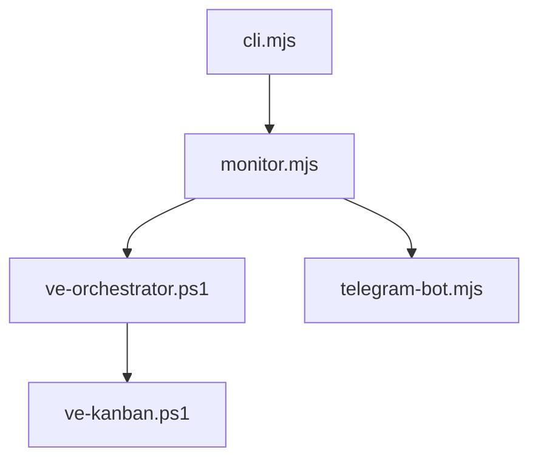

# Codex-Monitor — AGENTS Guide

## Module Overview
- Purpose: codex-monitor supervises VirtEngine's autonomous coding fleet. It schedules task attempts, runs PR automation, self-heals failures, and reports status via Telegram.
- Use when: updating task orchestration, executor routing, VK API usage, or notification pipelines.
- Key entry points:
  - CLI launcher: `scripts/codex-monitor/cli.mjs:1`
  - Supervisor loop: `scripts/codex-monitor/monitor.mjs:14`
  - Task runner: `scripts/codex-monitor/ve-orchestrator.ps1:1`
  - VK API wrapper: `scripts/codex-monitor/ve-kanban.ps1:1`
  - Telegram bot: `scripts/codex-monitor/telegram-bot.mjs:1`

## Architecture
- Entry points and data flow overview:
  - `cli.mjs` loads config and starts `monitor.mjs`.
  - `monitor.mjs` drives orchestration and delegates to `ve-orchestrator.ps1`.
  - `ve-orchestrator.ps1` submits/monitors attempts via `ve-kanban.ps1`.
- Component map (selected):
  | Component | Role | Key references |
  |---|---|---|
  | monitor.mjs | Supervisor loop, smart PR flow, maintenance scheduling, fleet sync | `scripts/codex-monitor/monitor.mjs:4047` |
  | telegram-bot.mjs | Telegram polling, batching/live digest, command queueing | `scripts/codex-monitor/telegram-bot.mjs:95` |
  | ve-orchestrator.ps1 | PowerShell task orchestration loop (parallel slots, retries, merge gate) | `scripts/codex-monitor/ve-orchestrator.ps1:4841` |
  | ve-kanban.ps1 | VK CLI wrapper (list/submit/rebase/archive attempts) | `scripts/codex-monitor/ve-kanban.ps1:310` |
  | fleet-coordinator.mjs | Multi-workstation coordination, fleet state persistence | `scripts/codex-monitor/fleet-coordinator.mjs:181` |
  | autofix.mjs | Error loop detection + guarded auto-fix execution | `scripts/codex-monitor/autofix.mjs:66` |
  | codex-shell.mjs | Persistent Codex SDK agent sessions | `scripts/codex-monitor/codex-shell.mjs:1` |
  | copilot-shell.mjs | Persistent Copilot SDK agent sessions | `scripts/codex-monitor/copilot-shell.mjs:1` |
  | config.mjs | Unified config loader (CLI/env/.env/json/defaults) | `scripts/codex-monitor/config.mjs:4` |
  | hook-profiles.mjs | Setup-time multi-agent hook scaffolding (Codex/Claude/Copilot) | `scripts/codex-monitor/hook-profiles.mjs:1` |
  | agent-hook-bridge.mjs | Bridges Claude/Copilot hook callbacks to codex-monitor hook events | `scripts/codex-monitor/agent-hook-bridge.mjs:1` |



## Core Concepts
- Task lifecycle: create attempt, run agent, track PR status, complete task. References: `scripts/codex-monitor/ve-orchestrator.ps1:3306`, `scripts/codex-monitor/ve-kanban.ps1:310`
- Smart PR flow: `smartPRFlow` handles rebases, PR creation, and merge decisions. References: `scripts/codex-monitor/monitor.mjs:4047`
- Workspace management: worktrees are created and cleaned up via orchestration. References: `scripts/codex-monitor/ve-orchestrator.ps1:3223`
- Error recovery: autofix patterns and circuit breakers prevent infinite loops. References: `scripts/codex-monitor/autofix.mjs:66`, `scripts/codex-monitor/monitor.mjs:400`
- State persistence: orchestrator and fleet state stored in `.cache`. References: `scripts/codex-monitor/ve-orchestrator.ps1:144`, `scripts/codex-monitor/fleet-coordinator.mjs:745`

## Usage Examples

### Start codex-monitor with defaults
```bash
node scripts/codex-monitor/cli.mjs
```

### Run the orchestrator loop
```powershell
pwsh scripts/codex-monitor/ve-orchestrator.ps1 -MaxParallel 2 -PollIntervalSec 60
```

### List todo tasks
```powershell
pwsh scripts/codex-monitor/ve-kanban.ps1 list --status todo
```

### Run codex-monitor tests
```bash
cd scripts/codex-monitor
npm run test
```

## Implementation Patterns
- Adding a new executor:
  - Update executor parsing: `scripts/codex-monitor/config.mjs:203`
  - Wire executor profiles in setup: `scripts/codex-monitor/setup.mjs:1284`
  - Update cycling in `scripts/codex-monitor/ve-kanban.ps1:41`
- Extending notification logic:
  - Adjust batching rules: `scripts/codex-monitor/telegram-bot.mjs:95`
  - Ensure monitor emits notifications: `scripts/codex-monitor/monitor.mjs:4047`
- Modifying PR flow behavior:
  - Update `smartPRFlow`: `scripts/codex-monitor/monitor.mjs:4047`
- Adding new autofix patterns:
  - Extend signatures: `scripts/codex-monitor/autofix.mjs:66`

## Configuration
- Config loading order: CLI -> env vars -> `.env` -> `codex-monitor.config.json` -> defaults. Reference: `scripts/codex-monitor/config.mjs:4`
- Required env vars:
  - Telegram: `TELEGRAM_BOT_TOKEN`, `TELEGRAM_CHAT_ID` (`scripts/codex-monitor/.env.example:11`)
  - Vibe-Kanban: `VK_BASE_URL`, `VK_TARGET_BRANCH` (`scripts/codex-monitor/.env.example:87`)
  - Executor routing: `EXECUTORS`, `EXECUTOR_DISTRIBUTION` (`scripts/codex-monitor/.env.example:66`)
- VK workspace PATH propagation: `scripts/codex-monitor/setup.mjs:487`

## Testing
- Test runner: Vitest (`scripts/codex-monitor/vitest.config.mjs:1`)
- Run tests:
  - `cd scripts/codex-monitor && npm run test`
- Coverage examples: `scripts/codex-monitor/tests/autofix.test.mjs`, `scripts/codex-monitor/tests/fleet-coordinator.test.mjs`

## Troubleshooting
- NO_CHANGES loop resolved by categorizing empty task responses. References: `scripts/codex-monitor/ve-orchestrator.ps1:3563`
- Merged-task retry loop avoided with branch merge checks. References: `scripts/codex-monitor/ve-orchestrator.ps1:3383`
- Worktree cleanup errors handled by prune flow. References: `scripts/codex-monitor/ve-orchestrator.ps1:3223`
- Stale worktree path corruption fixed by pruning `.git/worktrees`. References: `scripts/codex-monitor/setup.mjs:530`
- Credential helper corruption resolved by removing local overrides. References: `scripts/codex-monitor/ve-orchestrator.ps1:461`
