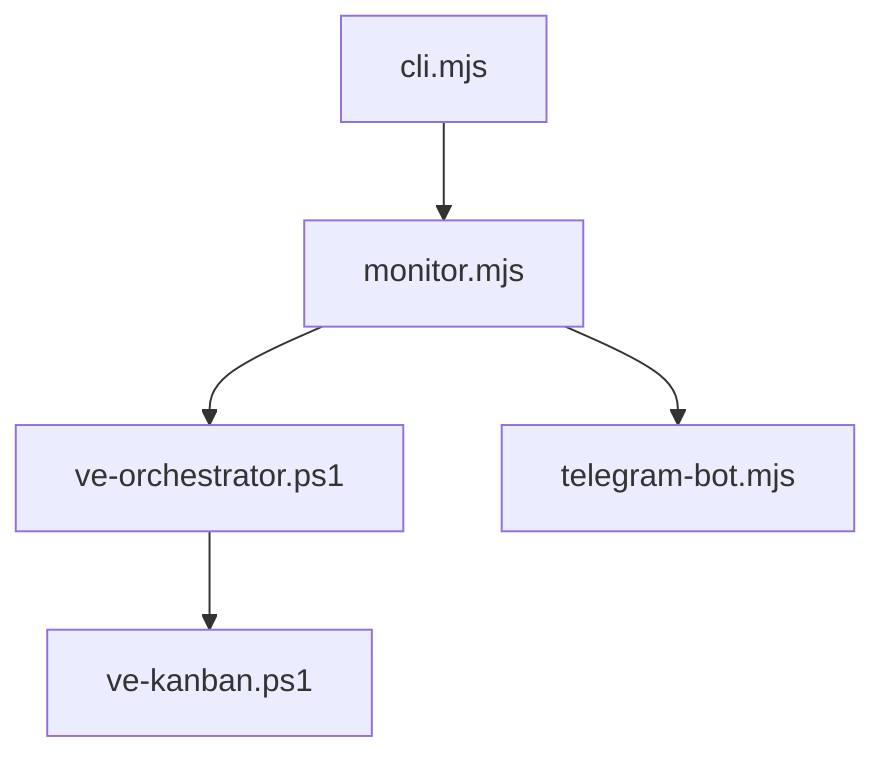

# Codex-Monitor — AGENTS Guide

## Module Overview
- Purpose: codex-monitor supervises VirtEngine's autonomous coding fleet. It schedules task attempts, runs PR automation, self-heals failures, and reports status via Telegram.
- Use when: updating task orchestration, executor routing, VK API usage, or notification pipelines.
- Key entry points:
  - CLI launcher: `scripts/codex-monitor/cli.mjs:1`
  - Supervisor loop: `scripts/codex-monitor/monitor.mjs:14`
  - Task runner: `scripts/codex-monitor/ve-orchestrator.ps1:1`
  - VK API wrapper: `scripts/codex-monitor/ve-kanban.ps1:1`
  - Telegram bot: `scripts/codex-monitor/telegram-bot.mjs:1`

## Architecture
- Entry points and data flow overview:
  - `cli.mjs` loads config and starts `monitor.mjs`.
  - `monitor.mjs` drives orchestration and delegates to `ve-orchestrator.ps1`.
  - `ve-orchestrator.ps1` submits/monitors attempts via `ve-kanban.ps1`.
- Component map (selected):
  - Supervisor loop: `monitor.mjs:4047`
  - Fleet coordination: `fleet-coordinator.mjs:181`
  - Orchestrator loop: `ve-orchestrator.ps1:4841`
  - VK task submission: `ve-kanban.ps1:310`



## Core Concepts
- Task lifecycle: create attempt, run agent, track PR status, complete task. References: `ve-orchestrator.ps1:3306`, `ve-kanban.ps1:310`
- PR flow: smartPRFlow handles rebases, PR creation, and merge gate decisions. References: `monitor.mjs:4047`
- Workspace management: worktrees are created and cleaned up via orchestration. References: `ve-orchestrator.ps1:3223`
- Error recovery: autofix patterns and circuit breakers prevent infinite loops. References: `autofix.mjs:66`, `monitor.mjs:400`
- State persistence: orchestrator and fleet state stored in `.cache`. References: `ve-orchestrator.ps1:144`, `fleet-coordinator.mjs:745`

## Usage Examples

### Start codex-monitor with defaults
```bash
node scripts/codex-monitor/cli.mjs
```

### Run the orchestrator loop
```powershell
pwsh scripts/codex-monitor/ve-orchestrator.ps1 -MaxParallel 2 -PollIntervalSec 60
```

### List todo tasks
```powershell
pwsh scripts/codex-monitor/ve-kanban.ps1 list --status todo
```

## Implementation Patterns
- Adding a new executor:
  - Update executor parsing in `config.mjs:203`.
  - Wire executor profiles in setup: `setup.mjs:1284`.
  - Update cycling in `ve-kanban.ps1:41`.
- Extending notification logic:
  - Adjust batching rules in `telegram-bot.mjs:95`.
  - Ensure monitor emits notifications in `monitor.mjs:4047`.
- Modifying PR flow behavior:
  - Update `smartPRFlow` in `monitor.mjs:4047`.
- Adding new autofix patterns:
  - Extend signatures in `autofix.mjs:66`, then add tests in `tests/`.

## Configuration
- Config loading order: CLI -> env vars -> `.env` -> `codex-monitor.config.json` -> defaults. Reference: `config.mjs:4`
- Required env vars:
  - Telegram: `TELEGRAM_BOT_TOKEN`, `TELEGRAM_CHAT_ID` (`.env.example:11`)
  - Vibe-Kanban: `VK_BASE_URL`, `VK_TARGET_BRANCH` (`.env.example:87`)
  - Executor routing: `EXECUTORS`, `EXECUTOR_DISTRIBUTION` (`.env.example:66`)
- VK workspace PATH propagation: `setup.mjs:487`

## Testing
- Test runner: Vitest (`vitest.config.mjs:1`)
- Run tests:
  - `npm run test` (from `scripts/codex-monitor/`)
- Coverage examples: `tests/autofix.test.mjs`, `tests/fleet-coordinator.test.mjs`

## Troubleshooting
- NO_CHANGES loop resolved by categorizing empty task responses. References: `ve-orchestrator.ps1:3563`
- Merged-task retry loop avoided with branch merge checks. References: `ve-orchestrator.ps1:3383`
- Worktree cleanup errors handled by prune flow. References: `ve-orchestrator.ps1:3223`
- Stale worktree path corruption fixed by pruning `.git/worktrees`. References: `setup.mjs:530`
- Credential helper corruption resolved by removing local overrides. References: `ve-orchestrator.ps1:461`
