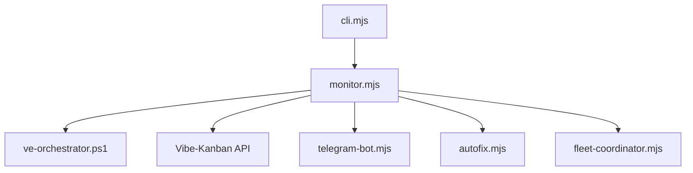

# Codex Monitor Orchestrator (scripts/codex-monitor) — AGENTS Guide

## Module Overview
- Purpose: Node.js orchestrator supervisor that manages agent executors with failover, auto-restarts the orchestrator script, and integrates with Vibe-Kanban + Telegram for automation (`scripts/codex-monitor/package.json:2`).
- Use when: Running multi-agent task orchestration locally or in CI; use chain modules (e.g., `x/provider`) for on-chain logic.
- Key entry points:
  - CLI entry: `codex-monitor` binary (`scripts/codex-monitor/package.json:55`, `scripts/codex-monitor/cli.mjs:1`).
  - Core monitor runtime: `scripts/codex-monitor/monitor.mjs:1`.
  - Config loader: `loadConfig` in `scripts/codex-monitor/config.mjs:716`.
  - Public ESM exports listed in `scripts/codex-monitor/package.json:33`.

## Architecture
- Entry points:
  - `scripts/codex-monitor/cli.mjs:1` — CLI routing, setup, update checks.
  - `scripts/codex-monitor/monitor.mjs:1` — main supervisor loop, restarts, Telegram, Vibe-Kanban integration.
  - `scripts/codex-monitor/config.mjs:3` — layered configuration resolution.
- Supporting subsystems (imported into `monitor.mjs`):
  - Fleet coordination: `scripts/codex-monitor/monitor.mjs:56`.
  - Task complexity and scheduling: `scripts/codex-monitor/monitor.mjs:70`.
  - Conflict resolution for dirty workspaces: `scripts/codex-monitor/monitor.mjs:79`.
  - Telegram integrations: `scripts/codex-monitor/monitor.mjs:23`.



## Core Concepts
- Config layering: CLI args, env vars, `.env`, config JSON, and defaults are merged in that order (`scripts/codex-monitor/config.mjs:3`, `scripts/codex-monitor/config.mjs:716`).
- Orchestrator supervision: the CLI forks `monitor.mjs` so it can auto-restart on file changes and recover from exit code 75 (`scripts/codex-monitor/cli.mjs:190`).
- Executor scheduling + failover: executor distribution and failover strategies are defined in config JSON or environment (`scripts/codex-monitor/cli.mjs:101`).
- Observability: Telegram notifications, presence tracking, and batch summaries are configured via `.env` (`scripts/codex-monitor/.env.example:11`).

## Usage Examples

### Start with defaults
```bash
node scripts/codex-monitor/cli.mjs
```

### Run setup wizard
```bash
node scripts/codex-monitor/cli.mjs --setup
```

### Configure via environment
```bash
export TELEGRAM_BOT_TOKEN=...
export TELEGRAM_CHAT_ID=...
export VK_BASE_URL=http://127.0.0.1:54089
node scripts/codex-monitor/cli.mjs --args "-MaxParallel 6"
```

### config.json executor override
```json
{
  "executors": [
    { "name": "copilot-claude", "executor": "COPILOT", "variant": "CLAUDE_OPUS_4_6", "weight": 50, "role": "primary" },
    { "name": "codex-default", "executor": "CODEX", "variant": "DEFAULT", "weight": 50, "role": "backup" }
  ],
  "distribution": "weighted"
}
```

## Implementation Patterns
- Add new config fields by updating `scripts/codex-monitor/config.mjs:716`, the schema (`scripts/codex-monitor/codex-monitor.schema.json`), and `.env.example` if exposed.
- Add new CLI flags in `scripts/codex-monitor/cli.mjs:35` and plumb them through `loadConfig`.
- For new runtime behaviors, prefer non-blocking async operations in `monitor.mjs` and keep error handling centralized.
- Tests live in `scripts/codex-monitor/tests/` and should mirror new behaviors or edge cases.
- Anti-patterns:
  - Do not block the main supervisor loop with long synchronous work.
  - Do not mutate config after it is frozen by `loadConfig` (`scripts/codex-monitor/config.mjs:716`).

## API Reference
- CLI binary: `codex-monitor` (`scripts/codex-monitor/package.json:55`, `scripts/codex-monitor/cli.mjs:1`).
- Main runtime entry: `monitor.mjs` (package export `"."`, `scripts/codex-monitor/package.json:33`).
- Config loader: `loadConfig(argv?, options?)` (`scripts/codex-monitor/config.mjs:716`).
- Exported modules: `./config`, `./autofix`, `./primary-agent`, `./fleet-coordinator`, `./task-complexity` (`scripts/codex-monitor/package.json:33`).

## Dependencies & Environment
- Runtime deps: `@openai/codex-sdk`, `@github/copilot-sdk`, `@anthropic-ai/claude-agent-sdk`, `vibe-kanban` (`scripts/codex-monitor/package.json:116`).
- Node.js engine: `>=18` (`scripts/codex-monitor/package.json:125`).
- Primary env vars are documented in `.env.example` (`scripts/codex-monitor/.env.example:11`).

## Configuration
- Configuration layers: CLI args, env vars, `.env`, config JSON, defaults (`scripts/codex-monitor/config.mjs:3`).
- Add config options by updating schema, defaults, and `.env.example` (`scripts/codex-monitor/codex-monitor.schema.json:1`, `scripts/codex-monitor/config.mjs:716`).

## Testing
- Tests: `scripts/codex-monitor/tests/*.test.mjs`.
- Commands:
  - `npm test` (runs `vitest`, `scripts/codex-monitor/package.json:69`).
  - `npm run syntax:check` (fast syntax validation, `scripts/codex-monitor/package.json:67`).

## Troubleshooting
- CLI exits immediately after start
  - Cause: Missing required env vars or invalid config schema.
  - Fix: Run `node scripts/codex-monitor/cli.mjs --setup` and re-check `.env.example`.
