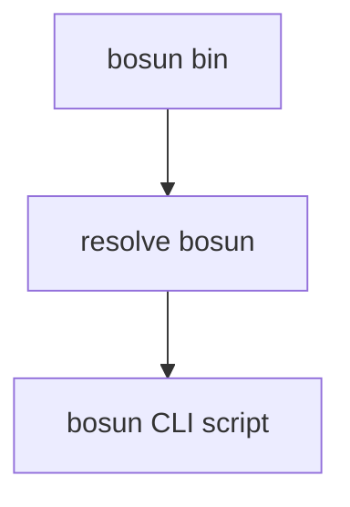

# Codex Monitor — AGENTS Guide

## Module Overview
- Purpose: Package and document the `codex-monitor` CLI wrapper for monitoring Codex sessions and hooks.
- Use when: Updating the monitor launcher, package metadata, or usage documentation.
- Key entry points: `scripts/codex-monitor/bin/codex-monitor.mjs:1`, `scripts/codex-monitor/package.json:1`.

## Architecture
- Single entrypoint script resolves the installed `bosun` package
  and launches the appropriate bosun CLI script based on the invoked command.
- Directory layout:
  - `bin/` shim launcher(s)
  - `package.json` npm metadata and bin mappings
  - `README.md` deprecation notice and install guidance


```mermaid
flowchart TD
  Shim[bosun bin] --> Resolve[resolve bosun]
  Resolve --> Bosun[bosun CLI script]
```

## Core Concepts
- Legacy compatibility: keep the old command names working while funneling users
  to the new `bosun` binaries.
- Forwarding: the wrapper preserves CLI args and exits with the monitor process result.

## Usage Examples

### Install the monitor
```bash
npm install && npm link
```

### Run the monitor
```bash
codex-monitor --help
```

## Implementation Patterns
- Add new legacy aliases by updating `bin` entries in
  `scripts/bosun/package.json:1` and mapping in
  `scripts/bosun/cli.mjs:1`.
- Keep the wrapper minimal and avoid duplicating monitor internals here.
- Anti-patterns:
  - Duplicating bosun implementation in the shim.
  - Removing legacy aliases without a documented migration path.

## Configuration
- No runtime configuration beyond standard Node.js environment.

## Testing
- No automated tests for the wrapper.
- Manual smoke check (requires published or local bosun install):
  - `node scripts/bosun/cli.mjs --help`

## Troubleshooting
- Shim cannot find bosun:
  - Cause: `bosun` dependency not installed.
  - Fix: `npm install && npm link` or reinstall `bosun`.

