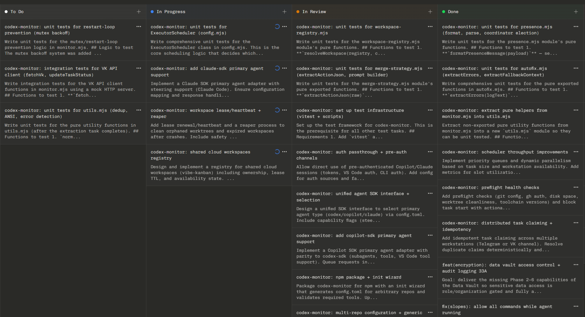

# @virtengine/codex-monitor

> **Ship code while you sleep.** An autonomous AI orchestrator that manages multiple coding agents, handles PRs, detects and fixes errors, and reports everything to Telegram — all from a single `npm install`.

<p align="center">
  
  &nbsp;&nbsp;&nbsp;
  
</p>

## Why codex-monitor?

You have AI coding agents. They can write code, fix bugs, create PRs. But left unsupervised, they crash, loop on the same error forever, create conflicting PRs, and go silent. You check back hours later to find nothing shipped.

**codex-monitor is the supervisor layer.** It watches your agents, detects when they're stuck, auto-fixes error loops, manages the full PR lifecycle, and keeps you informed through Telegram — so your agents actually deliver while you focus on other work.

**What changes when you add it:**

| Without codex-monitor                     | With codex-monitor                                                  |
| ----------------------------------------- | ------------------------------------------------------------------- |
| Agent crashes → you notice hours later    | Agent crashes → auto-restart + root cause analysis + Telegram alert |
| Agent loops on same error → burns tokens  | Error loop detected in <10 min → AI autofix triggered               |
| PR needs rebase → agent doesn't know how  | Auto-rebase, conflict resolution, PR creation — zero human touch    |
| "Is anything happening?" → check terminal | Live Telegram digest updates every few seconds                      |
| One agent at a time                       | N agents with weighted distribution and automatic failover          |
| Manually create tasks                     | Empty backlog detected → AI task planner auto-generates work        |

## Install

```bash
npm install -g @virtengine/codex-monitor
```

## Quick Start

```bash
cd your-project
codex-monitor          # auto-detects first run → launches setup wizard
```

That's it. On first run, the setup wizard walks you through everything: executors, AI provider, Telegram, Vibe-Kanban, and agent templates.

## How It Works

```
┌──────────────────────────────────────────────────────────────────┐
│                      @virtengine/codex-monitor                   │
│                                                                  │
│  cli.mjs ────── entry point, first-run detection                 │
│       │                                                          │
│  config.mjs ── unified config (env + JSON + CLI)                 │
│       │                                                          │
│  monitor.mjs ── orchestrator supervisor                          │
│       │    └── log analysis, error detection                     │
│       │    └── smart PR flow (VK API)                            │
│       │    └── executor scheduling & failover                    │
│       │    └── task planner auto-trigger                         │
│       │                                                          │
│       ├── telegram-bot.mjs ── interactive chatbot                │
│       │       └── /status /tasks /restart /stop /agents          │
│       │       └── free-text AI chat                              │
│       │                                                          │
│       ├── codex-shell.mjs ── persistent Codex session            │
│       │       └── MCP tool access (GitHub, VK, files)            │
│       │                                                          │
│       ├── autofix.mjs ── error loop detection + auto-fix         │
│       │                                                          │
│       └── maintenance.mjs ── singleton lock, cleanup             │
│                                                                  │
│  Integrations:                                                   │
│    • Vibe-Kanban API (task management, PR creation)              │
│    • Copilot SDK (primary agent shell)                           │
│    • Codex SDK (AI analysis, autofix)                            │
│    • Telegram Bot API (notifications, commands)                  │
│    • GitHub CLI (PR operations fallback)                         │
└──────────────────────────────────────────────────────────────────┘
```

### Key Features

- **Multi-executor scheduling** — Configure N AI agents (Copilot, Codex, custom) with weighted distribution and automatic failover
- **Smart PR flow** — Auto-rebase, resolve merge conflicts, create PRs via Vibe-Kanban API
- **Crash analysis** — Codex SDK reads logs and diagnoses root causes automatically
- **Error loop detection** — 4+ repeating errors in 10 minutes triggers AI autofix
- **Live Telegram digest** — One continuously-edited message per time window shows events as they happen, like a real-time log
- **Stale attempt cleanup** — Detects dead attempts (0 commits, far behind main) and archives them
- **Preflight checks** — Validates git/gh auth, disk space, clean worktree, and toolchain versions before starting
- **Task planner** — Detects empty backlog and auto-generates new tasks via AI
- **Auto-setup** — First-run wizard configures everything; generates agent templates, wires Vibe-Kanban
- **Multi-repo support** — Manage separate backend/frontend repos from one monitor instance
- **Multi-workstation presence** — Discover and coordinate multiple codex-monitor instances via Telegram
- **Works with any orchestrator** — Wraps PowerShell, Bash, or any long-running CLI script
- **Hot .env reload** — Changes to `.env` files are detected and applied without restart
- **Self-restart on code changes** — Monitor detects changes to its own source files and reloads with fresh ESM modules

### Screenshots

**Live Telegram Digest** — Events stream into a single continuously-edited message per digest window (default 10 min). Critical items get ❌, warnings get ⚠️, and info gets ℹ️. When the window expires, the message is sealed and the next event starts a fresh one. Digest state persists across restarts — no duplicate messages.


**Kanban Board** — Vibe-Kanban task board showing the full pipeline: To Do → In Progress → In Review → Done. Agents auto-claim tasks, create PRs, and merged PRs auto-move tasks to Done — fully autonomous.


See [docs/operations/slopdev-workshop.md](../../docs/operations/slopdev-workshop.md) for detailed setup walkthrough and workshop guide.

## Configuration

Configuration loads from (highest priority first):

1. **CLI flags** (`--script ./myorch.ps1`)
2. **Environment variables** (`ORCHESTRATOR_SCRIPT=...`)
3. **`.env` file** (in codex-monitor directory)
4. **`codex-monitor.config.json`** (project config)
5. **Built-in defaults**

### Setup Wizard

```bash
codex-monitor --setup
```

The wizard configures:

- Project identity (name, repo slug)
- Multi-repo setup (backend + frontend repos)
- Executor profiles (AI models, weights, roles)
- Failover strategy and distribution mode
- AI provider (OpenAI, Azure, Ollama, custom)
- Telegram bot
- Vibe-Kanban connection
- **Orchestrator scripts** — Auto-detects bundled `ve-orchestrator.ps1` and `ve-kanban.ps1` and offers to use them
- Agent template files (AGENTS.md, orchestrator.agent.md, task-planner.agent.md)
- VK workspace scripts (setup, cleanup)

### Executor Configuration

Executors are the AI agents that work on tasks. Configure as many as you want with weights and roles:

```json
// codex-monitor.config.json
{
  "projectName": "my-app",
  "executors": [
    {
      "name": "copilot-claude",
      "executor": "COPILOT",
      "variant": "CLAUDE_OPUS_4_6",
      "weight": 40,
      "role": "primary",
      "enabled": true
    },
    {
      "name": "codex-default",
      "executor": "CODEX",
      "variant": "DEFAULT",
      "weight": 35,
      "role": "backup",
      "enabled": true
    },
    {
      "name": "claude-code",
      "executor": "CLAUDE",
      "variant": "SONNET_4_5",
      "weight": 25,
      "role": "tertiary",
      "enabled": true
    }
  ],
  "failover": {
    "strategy": "next-in-line",
    "maxRetries": 3,
    "cooldownMinutes": 5,
    "disableOnConsecutiveFailures": 3
  },
  "distribution": "weighted"
}
```

Or via environment variable shorthand:

```env
EXECUTORS=COPILOT:CLAUDE_OPUS_4_6:40,CODEX:DEFAULT:35,CLAUDE:SONNET_4_5:25
```

#### Distribution Modes

| Mode           | Behavior                                          |
| -------------- | ------------------------------------------------- |
| `weighted`     | Distribute tasks by configured weight percentages |
| `round-robin`  | Alternate between executors equally               |
| `primary-only` | Always use primary; others only for failover      |

#### Failover Strategies

| Strategy          | Behavior                                             |
| ----------------- | ---------------------------------------------------- |
| `next-in-line`    | Use the next executor by role (primary → backup → …) |
| `weighted-random` | Randomly select from remaining by weight             |
| `round-robin`     | Cycle through remaining executors                    |

When an executor fails `disableOnConsecutiveFailures` times in a row, it enters cooldown for `cooldownMinutes` minutes. Tasks automatically route to the next available executor.

### Multi-Repo Support

For projects with separate repositories (e.g., backend + frontend):

```json
{
  "$schema": "./codex-monitor.schema.json",
  "defaultRepository": "backend",
  "repositoryDefaults": {
    "orchestratorScript": "./orchestrator.ps1",
    "orchestratorArgs": "-MaxParallel 6",
    "profile": "local"
  },
  "repositories": [
    {
      "name": "backend",
      "path": "/path/to/backend",
      "slug": "org/backend",
      "primary": true
    },
    {
      "name": "frontend",
      "path": "/path/to/frontend",
      "slug": "org/frontend",
      "profile": "frontend"
    }
  ]
}
```

The JSON schema lives at `scripts/codex-monitor/codex-monitor.schema.json`.

Repository selection (runtime):

- CLI: `--repo-name backend`
- Env: `CODEX_MONITOR_REPO=backend` (or `CODEX_MONITOR_REPO_NAME`)

If no selection is provided, the `primary` repo (or first entry) is used.

### Generic Mode (Non-VirtEngine)

When running outside VirtEngine, set `mode` to `generic` (or use `--mode generic`).
This changes defaults to avoid VirtEngine-specific behavior (e.g., Vibe-Kanban spawn
is disabled by default, and the default orchestrator args are empty).

### Environment Profiles

Use profiles to switch settings + env without editing `.env` files:

```json
{
  "profiles": {
    "local": {
      "env": {
        "TELEGRAM_BOT_TOKEN": "token",
        "VK_BASE_URL": "http://127.0.0.1:54089"
      },
      "overrides": {
        "plannerMode": "kanban"
      }
    },
    "generic": {
      "envFile": ".env.generic",
      "envOverride": true,
      "overrides": {
        "mode": "generic",
        "vkSpawnEnabled": false
      }
    }
  }
}
```

Select a profile via `--profile` or `CODEX_MONITOR_PROFILE`.

### Environment Variables

See [.env.example](.env.example) for the full reference. Key variables:

| Variable                              | Default                        | Description                                                                                                            |
| ------------------------------------- | ------------------------------ | ---------------------------------------------------------------------------------------------------------------------- |
| `PROJECT_NAME`                        | auto-detected                  | Project name for display                                                                                               |
| `GITHUB_REPO`                         | auto-detected                  | GitHub repo slug (`org/repo`)                                                                                          |
| `ORCHESTRATOR_SCRIPT`                 | auto-detected                  | Path to orchestrator script (use `../ve-orchestrator.ps1` for relative paths from codex-monitor dir, or absolute path) |
| `ORCHESTRATOR_ARGS`                   | `-MaxParallel 6 -WaitForMutex` | Arguments passed to orchestrator                                                                                       |
| `OPENAI_API_KEY`                      | —                              | API key for Codex analysis                                                                                             |
| `COPILOT_MODEL`                       | Copilot CLI default            | Model override for Copilot SDK                                                                                         |
| `COPILOT_SDK_DISABLED`                | `0`                            | Disable Copilot SDK primary agent                                                                                      |
| `COPILOT_CLOUD_DISABLE_ON_RATE_LIMIT` | `true`                         | Disable Copilot cloud triggers when a rate-limit comment is detected                                                   |
| `COPILOT_CLOUD_COOLDOWN_MIN`          | `60`                           | Default Copilot cloud cooldown duration (minutes)                                                                      |
| `COPILOT_RATE_LIMIT_COOLDOWN_MIN`     | `120`                          | Cooldown duration (minutes) applied specifically after a Copilot rate-limit notice                                     |
| `TELEGRAM_BOT_TOKEN`                  | —                              | Telegram bot token from @BotFather                                                                                     |
| `TELEGRAM_CHAT_ID`                    | —                              | Telegram chat ID                                                                                                       |
| `VK_BASE_URL`                         | `http://127.0.0.1:54089`       | Vibe-Kanban API endpoint                                                                                               |
| `EXECUTORS`                           | Codex only                     | Executor shorthand (see above)                                                                                         |
| `EXECUTOR_DISTRIBUTION`               | `weighted`                     | Distribution mode                                                                                                      |
| `FAILOVER_STRATEGY`                   | `next-in-line`                 | Failover behavior                                                                                                      |
| `MAX_PARALLEL`                        | `6`                            | Max concurrent agent slots                                                                                             |
| `CODEX_MONITOR_REPO`                  | —                              | Selected repo name (multi-repo)                                                                                        |
| `CODEX_MONITOR_PROFILE`               | —                              | Environment profile name                                                                                               |
| `CODEX_MONITOR_MODE`                  | `virtengine`/`generic`         | Mode override                                                                                                          |
| `CODEX_MONITOR_PREFLIGHT_DISABLED`    | `0`                            | Disable preflight checks                                                                                               |
| `CODEX_MONITOR_PREFLIGHT_RETRY_MS`    | `300000`                       | Preflight retry interval (ms)                                                                                          |
| `LOG_MAX_SIZE_MB`                     | `500`                          | Max total log folder size in MB (0 = unlimited)                                                                        |
| `LOG_CLEANUP_INTERVAL_MIN`            | `30`                           | How often to check log folder size (0 = startup only)                                                                  |
| `TELEGRAM_VERBOSITY`                  | `summary`                      | Notification verbosity: `minimal`, `summary`, or `detailed`                                                            |

### Shared Cloud Workspaces

Codex-monitor can track pooled cloud workspaces with lease-based ownership and
availability state. The registry lives in JSON and is updated by claim/release
operations with audit logging.

Defaults:

- Registry: `.cache/codex-monitor/shared-workspaces.json`
- Audit log: `.cache/codex-monitor/shared-workspace-audit.jsonl`
- Seed template: `scripts/codex-monitor/shared-workspaces.json`

Overrides:

- `VE_SHARED_WORKSPACE_REGISTRY` — registry file path
- `VE_SHARED_WORKSPACE_AUDIT_LOG` — audit log file path

CLI examples:

```
pnpm -C scripts/codex-monitor shared-workspaces list
pnpm -C scripts/codex-monitor shared-workspaces claim cloud-01 --owner jon --ttl 120
pnpm -C scripts/codex-monitor shared-workspaces release cloud-01 --owner jon
```

Telegram commands:

- `/shared-workspaces` — list shared workspace availability
- `/claim <id> [--owner <id>] [--ttl <minutes>] [--note <text>]`
- `/release <id> [--owner <id>] [--reason <text>] [--force]`

### Agent SDK Selection (config.toml)

codex-monitor reads `~/.codex/config.toml` for the primary agent SDK and
capability flags. Example:

```toml
[agent_sdk]
primary = "codex" # codex | copilot | claude

[agent_sdk.capabilities]
steering = true
subagents = true
vscode_tools = false
```

When `primary` is not `codex`, Codex SDK automation features are disabled.

### Shared Cloud Workspaces

Codex-monitor can track pooled cloud workspaces with lease-based ownership and
availability state. The registry lives in JSON and is updated by claim/release
operations with audit logging.

Defaults:

- Registry: `.cache/codex-monitor/shared-workspaces.json`
- Audit log: `.cache/codex-monitor/shared-workspace-audit.jsonl`
- Seed template: `scripts/codex-monitor/shared-workspaces.json`

Overrides:

- `VE_SHARED_WORKSPACE_REGISTRY` — registry file path
- `VE_SHARED_WORKSPACE_AUDIT_LOG` — audit log file path

CLI examples:

```
pnpm -C scripts/codex-monitor shared-workspaces list
pnpm -C scripts/codex-monitor shared-workspaces claim cloud-01 --owner jon --ttl 120
pnpm -C scripts/codex-monitor shared-workspaces release cloud-01 --owner jon
```

Telegram commands:

- `/shared-workspaces` — list shared workspace availability
- `/claim <id> [--owner <id>] [--ttl <minutes>] [--note <text>]`
- `/release <id> [--owner <id>] [--reason <text>] [--force]`

## CLI Reference

```
codex-monitor [options]
```

| Option                   | Description                               |
| ------------------------ | ----------------------------------------- |
| `--setup`                | Run the interactive setup wizard          |
| `--help`                 | Show help                                 |
| `--version`              | Show version                              |
| `--script <path>`        | Path to the orchestrator script           |
| `--args "<args>"`        | Arguments passed to the script            |
| `--restart-delay <ms>`   | Delay before restart (default: `10000`)   |
| `--max-restarts <n>`     | Max restarts, 0 = unlimited               |
| `--log-dir <path>`       | Log directory (default: `./logs`)         |
| `--no-codex`             | Disable Codex SDK analysis                |
| `--no-autofix`           | Disable automatic error fixing            |
| `--no-preflight`         | Disable preflight checks                  |
| `--no-telegram-bot`      | Disable the interactive Telegram bot      |
| `--no-vk-spawn`          | Don't auto-spawn Vibe-Kanban              |
| `--no-watch`             | Disable file watching for auto-restart    |
| `--no-echo-logs`         | Don't echo orchestrator output to console |
| `--preflight-retry <ms>` | Retry interval after preflight failure    |
| `--config-dir <path>`    | Directory containing config files         |
| `--repo-root <path>`     | Repository root (auto-detected)           |
| `--project-name <name>`  | Project name for display                  |
| `--repo <org/repo>`      | GitHub repo slug                          |
| `--repo-name <name>`     | Repository selection (multi-repo)         |
| `--profile <name>`       | Environment profile selection             |
| `--mode <name>`          | Mode override (`virtengine`/`generic`)    |

## Telegram Bot

The Telegram bot provides real-time notifications and interactive control of your orchestrator. It sends alerts for errors, completed tasks, merged PRs, and lets you manage tasks directly from Telegram.

### Setup Guide

#### Step 1: Create Your Bot

1. Open **Telegram** (mobile app or [web.telegram.org](https://web.telegram.org))
2. Search for **@BotFather** (official Telegram bot for creating bots)
3. Start a chat and send: `/newbot`
4. Follow the prompts:
   - Choose a **display name** (e.g., "MyProject Monitor")
   - Choose a **username** (must end in 'bot', e.g., "myproject_monitor_bot")
5. BotFather will reply with your **bot token** - it looks like:
   ```
   1234567890:ABCdefGHIjklMNOpqrsTUVwxyz-1234567890
   ```
6. **Copy this token** - you'll need it in the next step

#### Step 2: Get Your Chat ID

You need your chat ID so the bot knows where to send messages.

**Option A: Using the setup wizard** (Recommended)

Run the setup wizard and it will guide you:

```bash
codex-monitor --setup
```

When prompted for Telegram setup, the wizard will:

1. Ask for your bot token
2. Provide a link to message your bot
3. Automatically detect your chat ID when you send a message

**Option B: Manual setup**

1. Start a conversation with your bot:
   - Search for your bot's username in Telegram (e.g., @myproject_monitor_bot)
   - Click **START** or send any message (e.g., "Hello")

2. Get your chat ID using the helper utility:

   ```bash
   codex-monitor-chat-id
   ```

   Or manually via curl:

   ```bash
   curl -s "https://api.telegram.org/bot<YOUR_BOT_TOKEN>/getUpdates" | jq '.result[0].message.chat.id'
   ```

3. Copy the chat ID (it's a number, e.g., `123456789`)

#### Step 3: Configure Environment Variables

Add to your `.env` file (in the codex-monitor directory):

```bash
# Telegram Bot Configuration
TELEGRAM_BOT_TOKEN=1234567890:ABCdefGHIjklMNOpqrsTUVwxyz-1234567890
TELEGRAM_CHAT_ID=123456789

# Optional: Customize notification interval (default: 5 minutes)
TELEGRAM_INTERVAL_MIN=5
```

Or run the setup wizard to configure automatically:

```bash
codex-monitor --setup
```

#### Verification

To verify your setup works:

1. Start codex-monitor:

   ```bash
   codex-monitor
   ```

2. You should receive a welcome message in Telegram within a few seconds

3. Try sending `/status` to your bot - it should respond with the current orchestrator status

### Troubleshooting

#### "409 Conflict: terminated by other getUpdates request"

Only one process can poll a Telegram bot at a time. This happens if:

- Multiple codex-monitor instances are running
- You have another tool/script polling the same bot

**Fix:**

1. Ensure only one codex-monitor is running (the singleton lock should prevent this)
2. Check for other scripts using the same bot token
3. Wait 30 seconds for the previous connection to timeout

#### Bot not responding to commands

1. Verify your bot token is correct:

   ```bash
   curl -s "https://api.telegram.org/bot<YOUR_TOKEN>/getMe"
   ```

   Should return bot info, not `{"ok":false,"error_code":401}`

2. Verify your chat ID is correct:

   ```bash
   curl -s "https://api.telegram.org/bot<YOUR_TOKEN>/sendMessage?chat_id=<YOUR_CHAT_ID>&text=Test"
   ```

   Should send "Test" message to your Telegram

3. Check codex-monitor logs for errors:
   ```bash
   tail -f logs/monitor-*.log | grep -i telegram
   ```

#### Not receiving notifications

1. Check that `TELEGRAM_INTERVAL_MIN` is not too high (default is 5 minutes)
2. Ensure the orchestrator is actually running (check with `/status`)
3. Verify the monitor process is alive: `ps aux | grep codex-monitor`

### Notification System

codex-monitor uses a **live digest** system by default — instead of batching events and sending a summary every N minutes, it creates a single Telegram message per time window and continuously edits it as new events arrive. This gives you a real-time view of what's happening without flooding your chat.

**How the live digest works:**

1. First event in a window → creates a new message ("📊 Live Digest (since HH:MM:SS) — updating...")
2. Each subsequent event → appends a line and edits the message in-place (debounced at 3s)
3. Window expires (default 10 min) → message is sealed ("📊 Digest (HH:MM → HH:MM) — sealed")
4. Next event starts a fresh message
5. Critical messages (priority 1) always send immediately as separate messages

Digest state persists to disk, so restarts resume editing the same message instead of creating duplicates.

**Configuration:**

```env
# Live digest (default: enabled)
TELEGRAM_LIVE_DIGEST=true
TELEGRAM_LIVE_DIGEST_WINDOW_SEC=600       # 10-minute windows
TELEGRAM_LIVE_DIGEST_DEBOUNCE_MS=3000     # 3s edit debounce

# Legacy batch mode (set TELEGRAM_LIVE_DIGEST=false to use)
TELEGRAM_BATCH_NOTIFICATIONS=true
TELEGRAM_BATCH_INTERVAL_SEC=300
TELEGRAM_BATCH_MAX_SIZE=50

# Priority threshold for immediate delivery (default: 1)
# 1 = only critical messages bypass the digest
# 2 = critical + errors bypass the digest
TELEGRAM_IMMEDIATE_PRIORITY=1

# Verbosity level (default: summary)
# minimal  = critical + errors only (priority 1-2)
# summary  = everything except debug (priority 1-4) — DEFAULT
# detailed = everything including debug (priority 1-5)
TELEGRAM_VERBOSITY=summary
```

**Priority levels:**

| Priority | Emoji | Category                                     | Delivery           |
| -------- | ----- | -------------------------------------------- | ------------------ |
| 1        | 🔴    | Critical — fatal errors, system crashes      | Immediate (always) |
| 2        | ❌    | Error — failed operations, auto-fix failures | Live digest        |
| 3        | ⚠️    | Warning — rebase conflicts, missing branches | Live digest        |
| 4        | ℹ️    | Info — PR created, task completed (default)  | Live digest        |
| 5        | 🔹    | Debug — verbose logging                      | Live digest        |

**Verbosity modes:**

| Mode       | Priorities sent | Use case                                              |
| ---------- | --------------- | ----------------------------------------------------- |
| `minimal`  | 1-2             | Only critical errors — for low-noise monitoring       |
| `summary`  | 1-4             | All actionable events (default) — recommended         |
| `detailed` | 1-5             | Full debug output — useful during initial setup/debug |

**Example live digest message:**

```
📊 Live Digest (since 22:29:33) — updating...
❌ 1 • ℹ️ 2

22:29:33 ℹ️ virtengine Orchestrator Notifier started.
22:30:07 ℹ️ ✅ Task completed: "preflight health checks" (PR merged)
22:30:15 ℹ️ ✅ Task completed: "unit tests for config.mjs" (branch merged)
```

### Commands

| Command               | Description                                   |
| --------------------- | --------------------------------------------- |
| `/status`             | Current orchestrator status + attempt summary |
| `/tasks`              | List active tasks with progress               |
| `/agents`             | Show executor utilization & health            |
| `/health`             | System health check                           |
| `/restart`            | Restart the orchestrator                      |
| `/stop`               | Gracefully stop the orchestrator              |
| `/reattempt <id>`     | Re-queue a failed task                        |
| `/plan <description>` | Trigger the AI task planner                   |
| `/presence`           | List active codex-monitor instances           |
| `/coordinator`        | Show current coordinator selection            |
| Free text             | Chat with Codex AI about the project          |

### Presence & Coordinator (multi-workstation)

codex-monitor can broadcast lightweight presence heartbeats so you can
discover multiple instances running on different machines.

Environment overrides:

- `TELEGRAM_PRESENCE_INTERVAL_SEC` — presence heartbeat cadence in seconds (default: 60).
- `TELEGRAM_PRESENCE_TTL_SEC` — consider instances offline after this many seconds (default: 3x interval).
- `TELEGRAM_PRESENCE_DISABLED` — set to `1`/`true` to disable presence heartbeats.
- `TELEGRAM_PRESENCE_SILENT` — set to `1`/`true` to send presence messages without notification sound (reduces noise).
- `TELEGRAM_PRESENCE_ONLY_ON_CHANGE` — set to `1`/`true` to only send when state changes (default: `true`). Significantly reduces traffic.
- `TELEGRAM_PRESENCE_CHAT_ID` — optional chat/channel to post presence updates (defaults to `TELEGRAM_CHAT_ID`). Use a separate channel to isolate presence traffic.
- `VE_INSTANCE_ID` — override the auto-generated instance id (stable across restarts).
- `VE_INSTANCE_LABEL` — human-friendly instance label shown in `/presence`.
- `VE_COORDINATOR_PRIORITY` — lower numbers win coordinator election (default: 10 for role=coordinator, otherwise 100).
- `VE_COORDINATOR_ELIGIBLE` — set to `0`/`false` to opt-out of coordinator election.

**Reducing presence traffic:**

To minimize Telegram noise from presence heartbeats:

1. **Best:** Use a separate channel for presence messages:
   ```env
   TELEGRAM_PRESENCE_CHAT_ID=<separate-channel-id>
   ```

2. **Alternative:** Enable silent notifications (messages arrive without sound):
   ```env
   TELEGRAM_PRESENCE_SILENT=true
   ```

3. **Default behavior:** Only send when state changes (`TELEGRAM_PRESENCE_ONLY_ON_CHANGE=true` is the default).
   This prevents repeated identical heartbeats from flooding the channel.

4. **Complete disable:** Turn off presence if not using multi-instance coordination:
   ```env
   TELEGRAM_PRESENCE_DISABLED=true
   ```

## Smart PR Flow

```
Agent finishes task
        │
   Check branch status (VK API)
        │
   ┌─── 0 commits + far behind? → Archive stale attempt
   │
   ├─── Uncommitted changes? → Prompt agent to commit
   │
   └─── Commits exist:
         │
      Rebase onto main (VK API)
         │
      ┌── Conflicts? → Auto-resolve (VK API)
      │       │
      │   Still conflicts? → Prompt agent to resolve
      │
      └── Clean rebase:
            │
         Create PR (VK API → triggers pre-push hooks)
            │
         ┌── Success → Notify via Telegram
         ├── Fast fail (<2s) → Worktree issue → prompt agent
         └── Slow fail (>30s) → Pre-push failure → prompt agent to fix
```

## Agent Templates

The setup wizard generates agent template files for your project:

| File                                   | Purpose                                                            |
| -------------------------------------- | ------------------------------------------------------------------ |
| `AGENTS.md`                            | Root-level guide for AI agents (commit conventions, quality gates) |
| `.github/agents/orchestrator.agent.md` | Task orchestrator agent prompt (for Copilot/Codex)                 |
| `.github/agents/task-planner.agent.md` | Auto-creates tasks when backlog is low                             |

These are generic starting points. Customize them for your project's specific needs (build commands, test framework, architecture patterns).

## AI Provider Examples

**OpenAI (default):**

```env
OPENAI_API_KEY=sk-...
```

**Azure OpenAI:**

```env
OPENAI_API_KEY=your-azure-key
OPENAI_BASE_URL=https://your-resource.openai.azure.com/openai/deployments/your-deployment
CODEX_MODEL=your-deployment-name
```

**Local model (Ollama):**

```env
OPENAI_API_KEY=ollama
OPENAI_BASE_URL=http://localhost:11434/v1
CODEX_MODEL=codex
```

## File Structure

```
codex-monitor/
├── cli.mjs                      # CLI entry point + first-run detection
├── config.mjs                   # Unified config loader (env + JSON + CLI)
├── monitor.mjs                  # Main supervisor (log analysis, PR flow)
├── telegram-bot.mjs             # Interactive Telegram chatbot
├── codex-shell.mjs              # Persistent Codex SDK session
├── claude-shell.mjs             # Persistent Claude Agent SDK session
├── copilot-shell.mjs            # Persistent Copilot SDK session
├── primary-agent.mjs            # Primary agent adapter (Codex/Copilot/Claude)
├── autofix.mjs                  # Error loop detection + auto-fix
├── maintenance.mjs              # Singleton lock, process cleanup
├── setup.mjs                    # Interactive setup wizard
├── get-telegram-chat-id.mjs     # Telegram chat ID helper
├── ve-orchestrator.ps1          # Default task orchestrator (bundled)
├── ve-kanban.ps1                # Vibe-Kanban CLI wrapper (bundled)
├── codex-monitor.config.json    # Project config (generated by setup)
├── .env                         # Environment variables (generated by setup)
├── .env.example                 # Environment variable reference
├── package.json                 # NPM package definition
└── logs/                        # Auto-created log directory
```

## Default Orchestrator Scripts

The setup wizard automatically detects and offers to use default orchestrator scripts bundled with codex-monitor:

- **ve-orchestrator.ps1** — Main task orchestrator with parallel execution, auto-merge, and CI monitoring
- **ve-kanban.ps1** — Vibe-Kanban CLI wrapper for task management operations

These scripts live directly in the `codex-monitor/` directory, making it self-contained and portable. During setup, if detected, you'll be prompted to use them. If you decline or they're not found, codex-monitor runs in direct Vibe-Kanban mode (manages tasks directly without an external orchestrator script).

### Using Default Scripts

The default scripts expect to be run from the repository root and require:

- Vibe-Kanban API running (`vibe-kanban` CLI installed)
- GitHub CLI (`gh`) for PR operations
- PowerShell 7+ for cross-platform support

Example invocation:

```bash
# Via codex-monitor (recommended)
codex-monitor --script ./ve-orchestrator.ps1 --args "-MaxParallel 6"

# Or directly from the codex-monitor directory
cd scripts/codex-monitor
pwsh ve-orchestrator.ps1 -MaxParallel 6 -PollIntervalSec 90
```

## Troubleshooting

### First-run setup doesn't launch

The auto-detection checks for `.env` or `codex-monitor.config.json`. If either exists, setup won't auto-launch. Run `codex-monitor --setup` manually.

### Telegram 409 errors

> `Conflict: terminated by other getUpdates request`

Only one process can poll a Telegram bot. The monitor auto-disables its polling when `telegram-bot.mjs` is active. Ensure only one monitor instance runs (singleton lock prevents duplicates).

### Executor keeps failing over

Check the executor summary via `/agents` in Telegram. An executor enters cooldown after consecutive failures. Increase `FAILOVER_COOLDOWN_MIN` or `FAILOVER_DISABLE_AFTER` if failovers are too aggressive.

### "Agent must push before PR"

The Smart PR flow handles this automatically. The monitor detects this log line and triggers VK API flow (rebase → resolve conflicts → create PR).

### Vibe-Kanban not reachable

The monitor auto-spawns VK if not running. Set `VK_NO_SPAWN=1` to manage VK separately. Verify `VK_BASE_URL` matches your setup.

## Best Practices for Autonomous Agents

When AI agents work autonomously — committing, pushing, and creating PRs without human review — you need guardrails that prevent broken code from shipping. codex-monitor is designed to work with these safety layers:

### 1. Required Status Checks in GitHub

Configure **base branch in codex-monitor or github** to a testing/development branch, don't have codex-monitor just work directly on your main branch (unless it's still a test project) - and apply protections to it if necessary for CI quality.
Configure **branch protection rules** on your `main` branch so PRs cannot merge unless CI passes:

```
Repository Settings → Branches → Branch protection rules → main
  ✅ Require status checks to pass before merging
  ✅ Require branches to be up to date before merging
  Status checks:
    • lint
    • typecheck
    • unit-tests
    • build
```

This is your last line of defense. Even if an agent pushes garbage, it cannot merge without green CI. codex-monitor's Smart PR flow creates PRs through VK API — GitHub enforces the merge gate.

### 2. Pre-push and Pre-commit Hooks

Git hooks catch problems _before_ code leaves the machine:

```bash
# .githooks/pre-commit — auto-format + lint staged files
gofmt, prettier, eslint --fix

# .githooks/pre-push — full quality gate per category
Go:    go vet → gofmt → golangci-lint → build → unit tests
Portal: prettier → eslint → typecheck → tests → build
codex-monitor: node --check (syntax) → vitest
```

codex-monitor's pre-push hook runs `node --check` on all `.mjs` files before any push. This caught a SyntaxError crash that would have shipped otherwise. The hook is smart — it only runs checks for file categories that actually changed.

**Key principle:** Agents don't get `--no-verify`. The hooks are mandatory.

### 3. Strong Test Suite

Tests are the fastest feedback loop for agents. codex-monitor itself runs:

- **Syntax validation** (`node --check`) — catches parse errors in <3 seconds
- **Unit tests** (vitest) — 85+ tests covering config, autofix, presence, workspace registry
- **`pretest` hook** — syntax check runs automatically before every `npm test`

For your project, ensure agents can run tests quickly:

```json
// package.json — make `npm test` comprehensive
{
  "scripts": {
    "syntax:check": "node --check *.mjs",
    "pretest": "npm run syntax:check",
    "test": "vitest run"
  }
}
```

### 4. Error Loop Detection

codex-monitor watches agent output for repeating errors. When it sees the same error 4+ times in 10 minutes, it triggers AI autofix — preventing agents from burning tokens on infinite loops.

### 5. Stale Attempt Cleanup

Agents sometimes crash mid-task, leaving behind worktrees and branches with zero commits. The maintenance sweep detects these (0 commits, far behind main) and archives them automatically.

### 6. Log Rotation

Agent sessions generate substantial log output. codex-monitor supports automatic log folder size limits — when the log directory exceeds `LOG_MAX_SIZE_MB` (default: 500 MB), the oldest log files are deleted until the folder is under the limit. This prevents disk exhaustion during long autonomous runs.

```env
LOG_MAX_SIZE_MB=500          # Max total log folder size (0 = unlimited)
LOG_CLEANUP_INTERVAL_MIN=30  # How often to check (default: 30 min)
```

### 7. Singleton Lock

Only one codex-monitor instance runs per project. The maintenance module acquires a lock file — if another instance is already running, the new one exits immediately. This prevents duplicate agents, PR conflicts, and Telegram polling errors.

### Recommended Stack

| Layer           | Tool                          | Purpose                            |
| --------------- | ----------------------------- | ---------------------------------- |
| Merge gate      | GitHub branch protection      | PRs can't merge without green CI   |
| Push gate       | Pre-push hooks (`.githooks/`) | Lint, typecheck, test before push  |
| Commit gate     | Pre-commit hooks              | Auto-format, lint staged files     |
| Runtime guard   | codex-monitor autofix         | Detect + fix error loops           |
| Syntax guard    | `node --check` in pre-push    | Catch parse errors in <3s          |
| Disk guard      | Log rotation                  | Auto-prune oldest logs by size cap |
| Process guard   | Singleton lock                | One monitor per project            |
| Staleness guard | Maintenance sweep             | Archive dead worktrees/branches    |

## License

Apache 2.0
